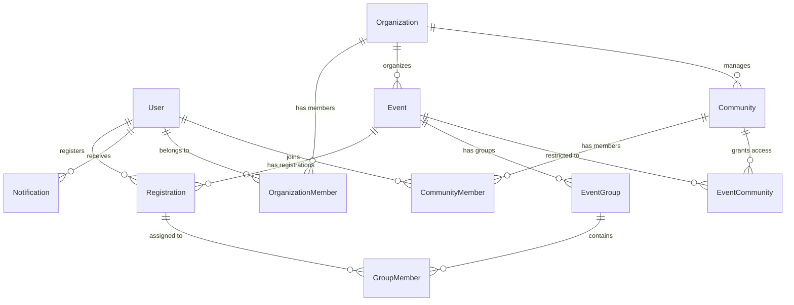

# Data Model - AqStream

## Обзор
Концептуальная модель данных для платформы AqStream. Описывает основные сущности, их атрибуты и связи.

## Основные сущности

### 1. User (Пользователь)
Базовая сущность для всех пользователей системы.

```sql
User {
  id: UUID [PK]
  email: String [UNIQUE, NOT NULL]
  phone: String [UNIQUE, NULL]
  password_hash: String [NOT NULL]
  first_name: String [NULL]
  last_name: String [NULL]
  telegram_username: String [NULL]
  telegram_chat_id: Long [NULL]
  avatar_url: String [NULL]
  role: Enum [GUEST, USER, ORGANIZER, ADMIN]
  is_active: Boolean [DEFAULT true]
  is_verified: Boolean [DEFAULT false]
  created_at: Timestamp [NOT NULL]
  updated_at: Timestamp [NOT NULL]
  last_login_at: Timestamp [NULL]
}
```

### 2. Organization (Организация)
Объединяет организаторов под одним брендом.

```sql
Organization {
  id: UUID [PK]
  name: String [NOT NULL]
  slug: String [UNIQUE, NOT NULL]
  description: Text [NULL]
  logo_url: String [NULL]
  website: String [NULL]
  phone: String [NULL]
  email: String [NULL]
  is_verified: Boolean [DEFAULT false]
  auto_approve_events: Boolean [DEFAULT false]
  created_at: Timestamp [NOT NULL]
  updated_at: Timestamp [NOT NULL]
  created_by: UUID [FK -> User.id]
}
```

### 3. OrganizationMember (Участник организации)
Связь организаторов с организацией.

```sql
OrganizationMember {
  id: UUID [PK]
  organization_id: UUID [FK -> Organization.id]
  user_id: UUID [FK -> User.id]
  joined_at: Timestamp [NOT NULL]
  
  UNIQUE(organization_id, user_id)
}
```

### 4. Event (Событие)
Основная сущность - мероприятие.

```sql
Event {
  id: UUID [PK]
  organization_id: UUID [FK -> Organization.id]
  title: String [NOT NULL]
  slug: String [UNIQUE, NOT NULL]
  description: Text [NOT NULL]
  short_description: String [NULL]
  event_type: String [NOT NULL]
  cover_image_url: String [NULL]
  
  // Локация
  location_type: Enum [ONLINE, OFFLINE, HYBRID]
  location_address: String [NULL]
  location_lat: Decimal [NULL]
  location_lng: Decimal [NULL]
  online_link: String [NULL]
  
  // Время
  start_date: Timestamp [NOT NULL]
  end_date: Timestamp [NOT NULL]
  registration_start: Timestamp [NULL]
  registration_end: Timestamp [NULL]
  
  // Лимиты и цена
  max_participants: Integer [NULL]
  min_participants: Integer [NULL]
  price: Decimal [DEFAULT 0]
  currency: String [DEFAULT 'RUB']
  
  // Настройки
  requires_approval: Boolean [DEFAULT false]
  requires_payment: Boolean [DEFAULT false]
  payment_qr_code: String [NULL]
  payment_instructions: Text [NULL]
  is_private: Boolean [DEFAULT false]
  allow_waiting_list: Boolean [DEFAULT true]
  
  // Статусы
  status: Enum [DRAFT, PENDING_MODERATION, PUBLISHED, CANCELLED, COMPLETED]
  moderation_status: Enum [PENDING, APPROVED, REJECTED]
  moderation_comment: Text [NULL]
  moderated_by: UUID [FK -> User.id, NULL]
  moderated_at: Timestamp [NULL]
  
  // Метаданные
  created_at: Timestamp [NOT NULL]
  updated_at: Timestamp [NOT NULL]
  published_at: Timestamp [NULL]
  created_by: UUID [FK -> User.id]
}
```

### 5. Registration (Регистрация)
Запись пользователя на событие.

```sql
Registration {
  id: UUID [PK]
  event_id: UUID [FK -> Event.id]
  user_id: UUID [FK -> User.id]
  
  // Статусы
  status: Enum [PENDING, APPROVED, REJECTED, CANCELLED, WAITING_LIST]
  payment_status: Enum [NOT_REQUIRED, PENDING, PAID, REFUNDED]
  
  // Данные оплаты
  payment_proof_url: String [NULL]
  payment_confirmed_at: Timestamp [NULL]
  payment_confirmed_by: UUID [FK -> User.id, NULL]
  payment_amount: Decimal [NULL]
  
  // Позиция в листе ожидания
  waiting_list_position: Integer [NULL]
  
  // Метаданные
  registered_at: Timestamp [NOT NULL]
  approved_at: Timestamp [NULL]
  approved_by: UUID [FK -> User.id, NULL]
  cancelled_at: Timestamp [NULL]
  cancellation_reason: Text [NULL]
  
  UNIQUE(event_id, user_id)
}
```

### 6. EventGroup (Группа в событии)
Группы для распределения участников.

```sql
EventGroup {
  id: UUID [PK]
  event_id: UUID [FK -> Event.id]
  name: String [NOT NULL]
  description: Text [NULL]
  group_type: String [NOT NULL] // transport, accommodation, team
  max_members: Integer [NULL]
  min_members: Integer [NULL]
  
  // Метаданные
  created_at: Timestamp [NOT NULL]
  created_by: UUID [FK -> User.id]
}
```

### 7. GroupMember (Участник группы)
Распределение участников по группам.

```sql
GroupMember {
  id: UUID [PK]
  group_id: UUID [FK -> EventGroup.id]
  registration_id: UUID [FK -> Registration.id]
  user_preferences: Text [NULL]
  assigned_at: Timestamp [NOT NULL]
  assigned_by: UUID [FK -> User.id]
  
  UNIQUE(group_id, registration_id)
}
```

### 8. Community (Сообщество)
Закрытые группы для специальных событий.

```sql
Community {
  id: UUID [PK]
  organization_id: UUID [FK -> Organization.id]
  name: String [NOT NULL]
  slug: String [UNIQUE, NOT NULL]
  description: Text [NULL]
  cover_image_url: String [NULL]
  is_public: Boolean [DEFAULT false]
  requires_approval: Boolean [DEFAULT true]
  
  created_at: Timestamp [NOT NULL]
  created_by: UUID [FK -> User.id]
}
```

### 9. CommunityMember (Участник сообщества)
Членство в сообществе.

```sql
CommunityMember {
  id: UUID [PK]
  community_id: UUID [FK -> Community.id]
  user_id: UUID [FK -> User.id]
  status: Enum [PENDING, APPROVED, REJECTED, BLOCKED]
  joined_at: Timestamp [NULL]
  approved_at: Timestamp [NULL]
  approved_by: UUID [FK -> User.id, NULL]
  
  UNIQUE(community_id, user_id)
}
```

### 10. EventCommunity (Связь события с сообществом)
Определяет, каким сообществам доступно событие.

```sql
EventCommunity {
  id: UUID [PK]
  event_id: UUID [FK -> Event.id]
  community_id: UUID [FK -> Community.id]
  
  UNIQUE(event_id, community_id)
}
```

### 11. Notification (Уведомление)
Внутренние уведомления в системе.

```sql
Notification {
  id: UUID [PK]
  user_id: UUID [FK -> User.id]
  type: Enum [EVENT_REMINDER, REGISTRATION_APPROVED, PAYMENT_CONFIRMED, EVENT_CANCELLED, etc.]
  title: String [NOT NULL]
  message: Text [NOT NULL]
  data: JSONB [NULL] // Дополнительные данные
  is_read: Boolean [DEFAULT false]
  sent_to_telegram: Boolean [DEFAULT false]
  created_at: Timestamp [NOT NULL]
  read_at: Timestamp [NULL]
}
```

### 12. EventTemplate (Шаблон события)
Сохраненные шаблоны для быстрого создания событий.

```sql
EventTemplate {
  id: UUID [PK]
  organization_id: UUID [FK -> Organization.id]
  name: String [NOT NULL]
  template_data: JSONB [NOT NULL] // Все поля события
  is_public: Boolean [DEFAULT false]
  created_at: Timestamp [NOT NULL]
  created_by: UUID [FK -> User.id]
}
```

### 13. GroupTemplate (Шаблон групп)
Предустановленные шаблоны для формирования групп.

```sql
GroupTemplate {
  id: UUID [PK]
  name: String [NOT NULL]
  description: Text [NULL]
  template_type: String [NOT NULL] // transport, accommodation, teams
  configuration: JSONB [NOT NULL] // Настройки шаблона
  is_system: Boolean [DEFAULT false]
  organization_id: UUID [FK -> Organization.id, NULL]
  created_at: Timestamp [NOT NULL]
  created_by: UUID [FK -> User.id]
}
```

### 14. ActivityLog (Журнал действий)
Аудит важных действий в системе.

```sql
ActivityLog {
  id: UUID [PK]
  user_id: UUID [FK -> User.id]
  entity_type: String [NOT NULL] // Event, Registration, etc.
  entity_id: UUID [NOT NULL]
  action: String [NOT NULL] // created, updated, deleted, approved, etc.
  old_values: JSONB [NULL]
  new_values: JSONB [NULL]
  ip_address: String [NULL]
  user_agent: String [NULL]
  created_at: Timestamp [NOT NULL]
}
```

## Индексы

```sql
-- Поиск и фильтрация событий
CREATE INDEX idx_event_status ON Event(status);
CREATE INDEX idx_event_start_date ON Event(start_date);
CREATE INDEX idx_event_organization ON Event(organization_id);
CREATE INDEX idx_event_type ON Event(event_type);
CREATE INDEX idx_event_location ON Event(location_lat, location_lng);
CREATE INDEX idx_event_search ON Event USING gin(to_tsvector('russian', title || ' ' || description));

-- Регистрации
CREATE INDEX idx_registration_event ON Registration(event_id);
CREATE INDEX idx_registration_user ON Registration(user_id);
CREATE INDEX idx_registration_status ON Registration(status);

-- Уведомления
CREATE INDEX idx_notification_user ON Notification(user_id);
CREATE INDEX idx_notification_unread ON Notification(user_id, is_read) WHERE is_read = false;

-- Сообщества
CREATE INDEX idx_community_member_user ON CommunityMember(user_id);
CREATE INDEX idx_community_member_status ON CommunityMember(community_id, status);
```

## Связи между сущностями



## Миграции базы данных

Миграции управляются через Liquibase. Каждое изменение схемы должно быть описано в отдельном changeset.

### Порядок создания таблиц
1. User
2. Organization
3. Community
4. OrganizationMember
5. Event
6. EventCommunity
7. Registration
8. EventGroup
9. GroupMember
10. CommunityMember
11. Notification
12. EventTemplate
13. GroupTemplate
14. ActivityLog

## Оптимизация производительности

### Кэширование (Redis)
- Список активных событий
- Счетчики регистраций
- Данные пользователя
- Популярные фильтры

### Партиционирование
- Event по start_date (месячные партиции)
- Notification по created_at (месячные партиции)
- ActivityLog по created_at (месячные партиции)

### Архивирование
- События старше 1 года переносятся в архивные таблицы
- Уведомления старше 3 месяцев удаляются
- Логи старше 6 месяцев архивируются

## Безопасность

### Шифрование
- Пароли: bcrypt
- Чувствительные данные: AES-256
- Токены: JWT с RS256

### Права доступа
- Row Level Security для мультитенантности
- Проверка прав на уровне API
- Аудит всех критических операций

## Валидация данных

### На уровне БД
- CHECK constraints для дат
- Уникальные индексы
- Foreign key constraints

### На уровне приложения
- Валидация форматов (email, phone)
- Бизнес-правила
- Санитизация входных данных
