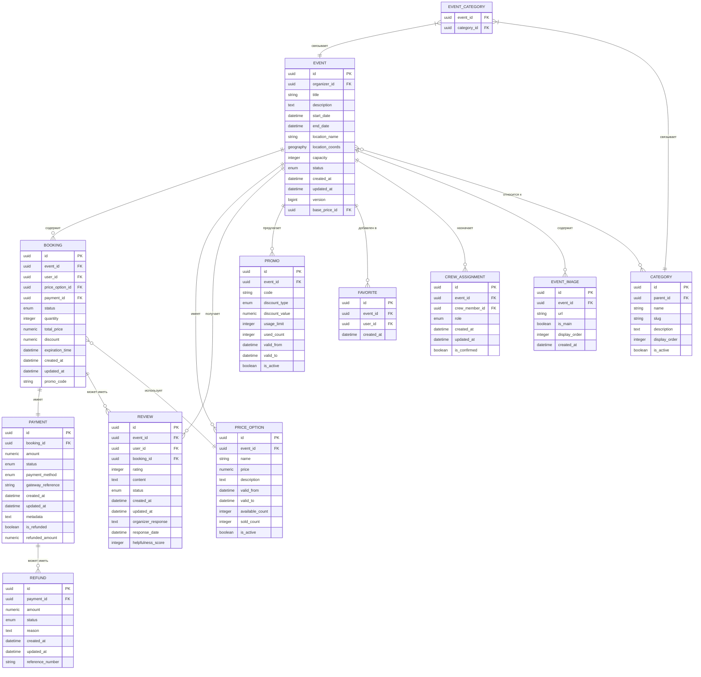

# Модель данных сервиса Backend-Event

Данный документ описывает модель данных сервиса `backend-event`, включая основные сущности, атрибуты, связи между ними, а также бизнес-правила и ограничения.

## 📑 Оглавление

1. [🗃️ ERD-диаграмма](#-erd-диаграмма)
2. [📋 Основные сущности и атрибуты](#-основные-сущности-и-атрибуты)
   - [Событие (Event)](#событие-event)
   - [Бронирование (Booking)](#бронирование-booking)
   - [Платеж (Payment)](#платеж-payment)
   - [Отзыв (Review)](#отзыв-review)
   - [Избранное (Favorite)](#избранное-favorite)
   - [Категория события (Category)](#категория-события-category)
   - [Ценовая опция (PriceOption)](#ценовая-опция-priceoption)
   - [Промокод (Promo)](#промокод-promo)
   - [Экипаж (Crew)](#экипаж-crew)
3. [🔗 Связи между сущностями](#-связи-между-сущностями)
   - [Основные связи](#основные-связи)
   - [Дополнительные связи](#дополнительные-связи)
4. [📏 Бизнес-правила и ограничения](#-бизнес-правила-и-ограничения)
   - [Ограничения целостности](#ограничения-целостности)
   - [Бизнес-ограничения](#бизнес-ограничения)
   - [Индексы и оптимизация](#индексы-и-оптимизация)

## 🗃️ ERD-диаграмма

Диаграмма отношений сущностей для сервиса `backend-event`:

## 📋 Основные сущности и атрибуты

### Событие (Event)

**Описание**: Центральная сущность системы, представляющая организованное мероприятие.

| Поле | Тип | Обязательно | Описание |
|------|-----|-------------|----------|
| id | UUID | Да | Первичный ключ |
| organizer_id | UUID | Да | Внешний ключ на пользователя-организатора |
| title | VARCHAR(255) | Да | Название события |
| description | TEXT | Да | Описание события |
| start_date | TIMESTAMP | Да | Дата и время начала |
| end_date | TIMESTAMP | Да | Дата и время окончания |
| location_name | VARCHAR(255) | Да | Название места проведения |
| location_coords | GEOGRAPHY | Нет | Географические координаты (для карты) |
| capacity | INTEGER | Да | Максимальное количество участников |
| status | ENUM | Да | Статус события (`DRAFT`, `PUBLISHED`, `CANCELED`, `COMPLETED`, `REVIEWED`, `RESCHEDULED`) |
| created_at | TIMESTAMP | Да | Дата создания записи |
| updated_at | TIMESTAMP | Да | Дата последнего обновления |
| version | BIGINT | Да | Версия записи (для оптимистичных блокировок) |
| base_price_id | UUID | Нет | Ссылка на базовую ценовую опцию |

### Бронирование (Booking)

**Описание**: Представляет бронь пользователя на событие.

| Поле | Тип | Обязательно | Описание |
|------|-----|-------------|----------|
| id | UUID | Да | Первичный ключ |
| event_id | UUID | Да | Внешний ключ на событие |
| user_id | UUID | Да | Внешний ключ на пользователя |
| price_option_id | UUID | Да | Внешний ключ на выбранную ценовую опцию |
| payment_id | UUID | Нет | Внешний ключ на платеж (если оплачено) |
| status | ENUM | Да | Статус бронирования (`PENDING_PAYMENT`, `CONFIRMED`, `CANCELED`, `EXPIRED`) |
| quantity | INTEGER | Да | Количество забронированных мест |
| total_price | NUMERIC | Да | Общая стоимость бронирования |
| discount | NUMERIC | Нет | Размер предоставленной скидки |
| expiration_time | TIMESTAMP | Да | Время истечения брони (для статуса `PENDING_PAYMENT`) |
| created_at | TIMESTAMP | Да | Дата создания записи |
| updated_at | TIMESTAMP | Да | Дата последнего обновления |
| promo_code | VARCHAR(50) | Нет | Использованный промокод (если применялся) |

### Платеж (Payment)

**Описание**: Информация о платеже за бронирование.

| Поле | Тип | Обязательно | Описание |
|------|-----|-------------|----------|
| id | UUID | Да | Первичный ключ |
| booking_id | UUID | Да | Внешний ключ на бронирование |
| amount | NUMERIC | Да | Сумма платежа |
| status | ENUM | Да | Статус платежа (`INITIATED`, `COMPLETED`, `FAILED`, `REFUNDED`, `PARTIAL_REFUND`) |
| payment_method | ENUM | Да | Метод оплаты (`CREDIT_CARD`, `PAYPAL`, `APPLE_PAY` и т.д.) |
| gateway_reference | VARCHAR(255) | Нет | Референс во внешней платежной системе |
| created_at | TIMESTAMP | Да | Дата создания записи |
| updated_at | TIMESTAMP | Да | Дата последнего обновления |
| metadata | JSONB | Нет | Дополнительные метаданные платежа |
| is_refunded | BOOLEAN | Да | Был ли произведен возврат |
| refunded_amount | NUMERIC | Нет | Сумма возврата (если был произведен) |

### Отзыв (Review)

**Описание**: Отзыв пользователя о событии, в котором он участвовал.

| Поле | Тип | Обязательно | Описание |
|------|-----|-------------|----------|
| id | UUID | Да | Первичный ключ |
| event_id | UUID | Да | Внешний ключ на событие |
| user_id | UUID | Да | Внешний ключ на пользователя |
| booking_id | UUID | Да | Внешний ключ на бронирование (для проверки участия) |
| rating | INTEGER | Да | Рейтинг от 1 до 5 |
| content | TEXT | Нет | Текст отзыва |
| status | ENUM | Да | Статус отзыва (`PENDING`, `ACTIVE`, `REJECTED`) |
| created_at | TIMESTAMP | Да | Дата создания записи |
| updated_at | TIMESTAMP | Да | Дата последнего обновления |
| organizer_response | TEXT | Нет | Ответ организатора на отзыв |
| response_date | TIMESTAMP | Нет | Дата ответа организатора |
| helpfulness_score | INTEGER | Нет | Оценка полезности отзыва другими пользователями |

### Избранное (Favorite)

**Описание**: Связь между пользователем и событием, добавленным в избранное.

| Поле | Тип | Обязательно | Описание |
|------|-----|-------------|----------|
| id | UUID | Да | Первичный ключ |
| event_id | UUID | Да | Внешний ключ на событие |
| user_id | UUID | Да | Внешний ключ на пользователя |
| created_at | TIMESTAMP | Да | Дата добавления в избранное |

### Категория события (Category)

**Описание**: Категории для классификации событий.

| Поле | Тип | Обязательно | Описание |
|------|-----|-------------|----------|
| id | UUID | Да | Первичный ключ |
| parent_id | UUID | Нет | Внешний ключ на родительскую категорию (для иерархии) |
| name | VARCHAR(100) | Да | Название категории |
| slug | VARCHAR(100) | Да | URL-дружественный идентификатор категории |
| description | TEXT | Нет | Описание категории |
| display_order | INTEGER | Да | Порядок отображения (для сортировки) |
| is_active | BOOLEAN | Да | Активна ли категория |

### Ценовая опция (PriceOption)

**Описание**: Различные ценовые опции для события (VIP, обычный, ранняя регистрация и т.д.).

| Поле | Тип | Обязательно | Описание |
|------|-----|-------------|----------|
| id | UUID | Да | Первичный ключ |
| event_id | UUID | Да | Внешний ключ на событие |
| name | VARCHAR(100) | Да | Название опции (например, "VIP", "Стандарт") |
| price | NUMERIC | Да | Стоимость опции |
| description | TEXT | Нет | Описание опции |
| valid_from | TIMESTAMP | Да | Дата начала действия |
| valid_to | TIMESTAMP | Да | Дата окончания действия |
| available_count | INTEGER | Да | Количество доступных билетов этой категории |
| sold_count | INTEGER | Да | Количество проданных билетов |
| is_active | BOOLEAN | Да | Активна ли опция в настоящее время |

### Промокод (Promo)

**Описание**: Промокоды для предоставления скидок.

| Поле | Тип | Обязательно | Описание |
|------|-----|-------------|----------|
| id | UUID | Да | Первичный ключ |
| event_id | UUID | Да | Внешний ключ на событие |
| code | VARCHAR(50) | Да | Код промокода |
| discount_type | ENUM | Да | Тип скидки (`PERCENTAGE`, `FIXED_AMOUNT`) |
| discount_value | NUMERIC | Да | Значение скидки (процент или фиксированная сумма) |
| usage_limit | INTEGER | Нет | Максимальное количество использований |
| used_count | INTEGER | Да | Текущее количество использований |
| valid_from | TIMESTAMP | Да | Дата начала действия |
| valid_to | TIMESTAMP | Да | Дата окончания действия |
| is_active | BOOLEAN | Да | Активен ли промокод |

### Экипаж (Crew)

**Описание**: Назначения членов экипажа на события.

| Поле | Тип | Обязательно | Описание |
|------|-----|-------------|----------|
| id | UUID | Да | Первичный ключ |
| event_id | UUID | Да | Внешний ключ на событие |
| crew_member_id | UUID | Да | Внешний ключ на члена экипажа |
| role | ENUM | Да | Роль в событии (`INSTRUCTOR`, `ASSISTANT`, `SAFETY_OFFICER`, `PHOTOGRAPHER` и т.д.) |
| created_at | TIMESTAMP | Да | Дата создания записи |
| updated_at | TIMESTAMP | Да | Дата последнего обновления |
| is_confirmed | BOOLEAN | Да | Подтверждено ли назначение членом экипажа |

## 🔗 Связи между сущностями

### Основные связи

1. **Событие (Event) и Бронирование (Booking)**
   - Связь: один-ко-многим
   - Описание: Одно событие может иметь множество бронирований
   - Ограничения: При отмене события все активные бронирования автоматически отменяются

2. **Событие (Event) и Ценовая опция (PriceOption)**
   - Связь: один-ко-многим
   - Описание: Для одного события может быть настроено несколько ценовых опций
   - Ограничения: Общее количество доступных мест по всем ценовым опциям не должно превышать `capacity` события

3. **Бронирование (Booking) и Платеж (Payment)**
   - Связь: один-к-одному
   - Описание: Каждое бронирование может иметь только один платеж
   - Ограничения: Платеж создается только после инициации оплаты пользователем

4. **Событие (Event) и Отзыв (Review)**
   - Связь: один-ко-многим
   - Описание: Для одного события может быть оставлено множество отзывов
   - Ограничения: Отзыв может быть оставлен только после проведения события и только участником

5. **Событие (Event) и Категория (Category)**
   - Связь: многие-ко-многим (через EVENT_CATEGORY)
   - Описание: Событие может относиться к нескольким категориям
   - Ограничения: Событие должно принадлежать хотя бы к одной категории

6. **Событие (Event) и Промокод (Promo)**
   - Связь: один-ко-многим
   - Описание: Для одного события может быть создано несколько промокодов
   - Ограничения: Промокоды должны иметь уникальные коды в рамках одного события

7. **Событие (Event) и Избранное (Favorite)**
   - Связь: один-ко-многим
   - Описание: Событие может быть добавлено в избранное многими пользователями
   - Ограничения: Пользователь может добавить событие в избранное только один раз

### Дополнительные связи

1. **Категория (Category) и Категория (Category)**
   - Связь: один-ко-многим (self-reference)
   - Описание: Иерархическая структура категорий (родитель-потомок)
   - Ограничения: Глубина вложенности категорий не должна превышать 3 уровня

2. **Платеж (Payment) и Возврат (Refund)**
   - Связь: один-ко-многим
   - Описание: Один платеж может иметь несколько частичных возвратов
   - Ограничения: Общая сумма возвратов не должна превышать сумму исходного платежа

3. **Событие (Event) и Изображение события (EventImage)**
   - Связь: один-ко-многим
   - Описание: Событие может иметь множество изображений
   - Ограничения: Должно быть только одно основное изображение (`is_main = true`)

## 📏 Бизнес-правила и ограничения

### Ограничения целостности

1. **Уникальные ключи**:
   - Уникальный индекс на `(event_id, user_id)` в таблице `FAVORITE` (пользователь может добавить событие в избранное только один раз)
   - Уникальный индекс на `(event_id, user_id)` в таблице `REVIEW` (пользователь может оставить только один отзыв на событие)
   - Уникальный индекс на `code` в таблице `PROMO` для конкретного `event_id` (уникальные промокоды в рамках события)

2. **Ограничения по внешним ключам**:
   - Каскадное удаление для `EVENT_IMAGE` при удалении `EVENT`
   - Каскадное удаление для `PRICE_OPTION` при удалении `EVENT`
   - Каскадное удаление для `PROMO` при удалении `EVENT`
   - Запрет на удаление `EVENT`, если существуют `BOOKING` в статусе `CONFIRMED`
   - Каскадное обновление `status` на `CANCELED` для всех `BOOKING`, если `EVENT.status` изменен на `CANCELED`

3. **Ограничения проверки**:
   - `EVENT.capacity > 0` (положительная вместимость)
   - `BOOKING.quantity > 0` (положительное количество билетов)
   - `PRICE_OPTION.price >= 0` (неотрицательная цена)
   - `PAYMENT.amount >= 0` (неотрицательная сумма платежа)
   - `REVIEW.rating BETWEEN 1 AND 5` (рейтинг от 1 до 5)
   - `PROMO.discount_value > 0` (положительное значение скидки)
   - Для `PROMO` с `discount_type = PERCENTAGE`: `discount_value <= 100` (процент не более 100%)

### Бизнес-ограничения

1. **Бронирование**:
   - Бронирование возможно только для событий со статусом `PUBLISHED` или `RESCHEDULED`
   - Общее количество бронирований не должно превышать вместимость события
   - Срок действия брони в статусе `PENDING_PAYMENT` составляет 2 часа
   - После успешной оплаты статус брони автоматически меняется на `CONFIRMED`
   - Отмена бронирования пользователем возможна с учетом политики возврата
   - Один пользователь может иметь только одно активное бронирование на событие

2. **Отзывы**:
   - Отзыв может быть оставлен только пользователем, посетившим событие (наличие бронирования со статусом `CONFIRMED`)
   - Отзыв можно оставить только после того, как событие перейдет в статус `COMPLETED`
   - Отзыв должен пройти модерацию перед публикацией (статус `PENDING` → `ACTIVE`)
   - Организатор может ответить на отзыв только один раз
   - Отзыв в статусе `REJECTED` не отображается публично

3. **События**:
   - Изменение основных деталей (дата, время, место) опубликованного события переводит его в статус `RESCHEDULED`
   - Для перехода из `DRAFT` в `PUBLISHED` событие должно иметь:
     - Название и описание
     - Дату и время проведения
     - Место проведения
     - Хотя бы одну ценовую опцию
     - Принадлежность хотя бы к одной категории
   - Автоматический переход в статус `COMPLETED` происходит после даты окончания события
   - Переход в статус `REVIEWED` происходит после сбора отзывов или по истечении 30 дней после даты окончания

4. **Платежи и возвраты**:
   - Политика возврата зависит от времени до начала события:
     - До 7 дней: 100% возврат
     - 2-7 дней: ~80% возврат
     - 24-48 часов: ~50% возврат
     - <24 часов: Возврат не осуществляется (за исключением форс-мажора)
   - При отмене события организатором производится 100% возврат средств вне зависимости от времени до начала
   - Возврат всегда осуществляется на тот же платежный метод, который использовался для оплаты

### Индексы и оптимизация

1. **Первичные индексы**:
   - Все таблицы имеют первичный ключ по полю `id` типа UUID

2. **Индексы для ускорения выборки**:
   - Индекс на `event_id` в таблице `BOOKING` для быстрого поиска бронирований по событию
   - Индекс на `user_id` в таблице `BOOKING` для быстрого поиска бронирований пользователя
   - Составной индекс на `(user_id, event_id)` в таблице `FAVORITE` для быстрой проверки
   - Индекс на `status` в таблице `EVENT` для фильтрации по статусу
   - Индекс на `start_date` в таблице `EVENT` для поиска предстоящих событий
   - Пространственный индекс на `location_coords` в таблице `EVENT` для геопоиска
   - Составной индекс на `(event_id, status)` в таблице `REVIEW` для быстрого подсчета активных отзывов

3. **Оптимизация запросов**:
   - Использование частичных индексов для активных записей (например, `WHERE status = 'ACTIVE'`)
   - Денормализация некоторых данных для ускорения чтения (например, `sold_count` в `PRICE_OPTION`)
   - Хранение агрегированных данных (например, средний рейтинг события) для уменьшения вычислений

4. **Оптимизация транзакций**:
   - Использование версии (`version`) для оптимистичной блокировки в критичных таблицах
   - Использование короткоживущих транзакций для операций бронирования
   - Использование транзакционной очереди для операций с платежами 