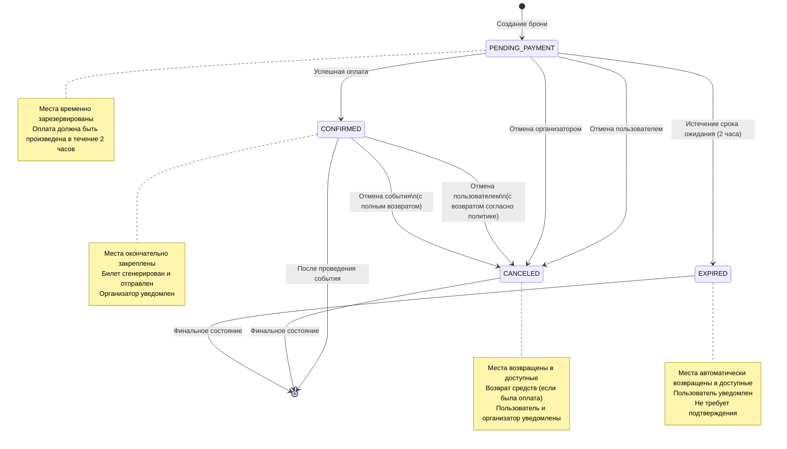
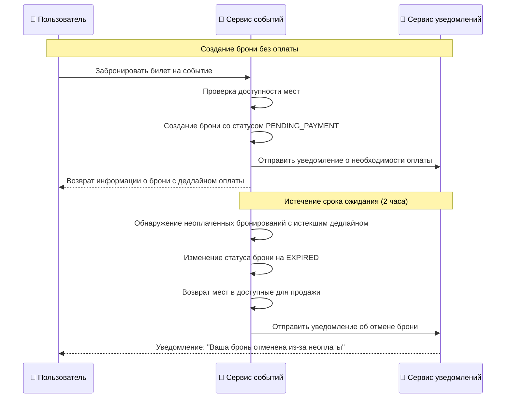
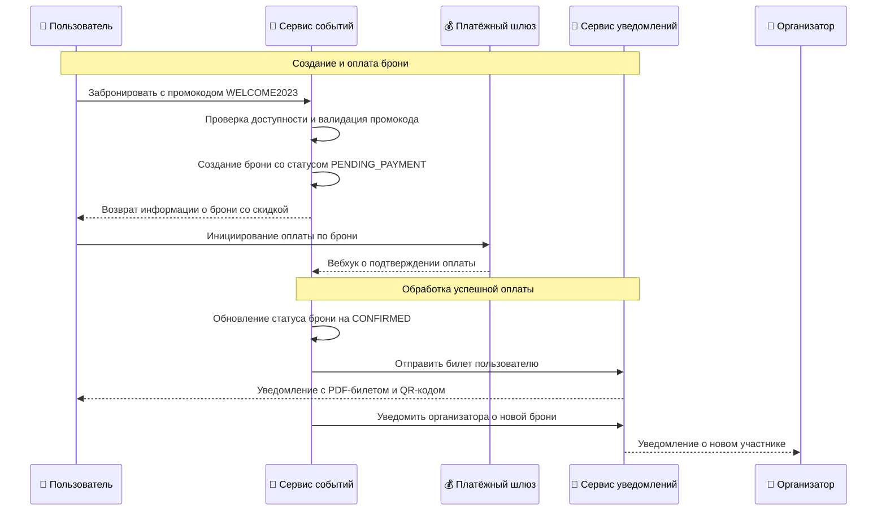
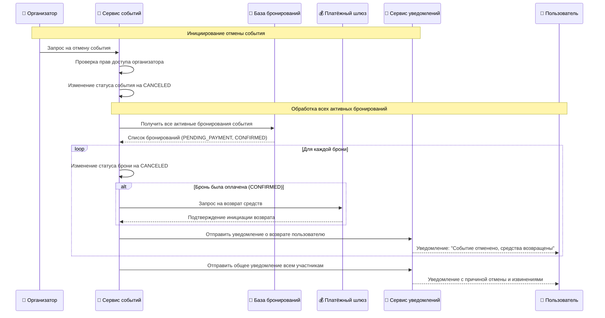
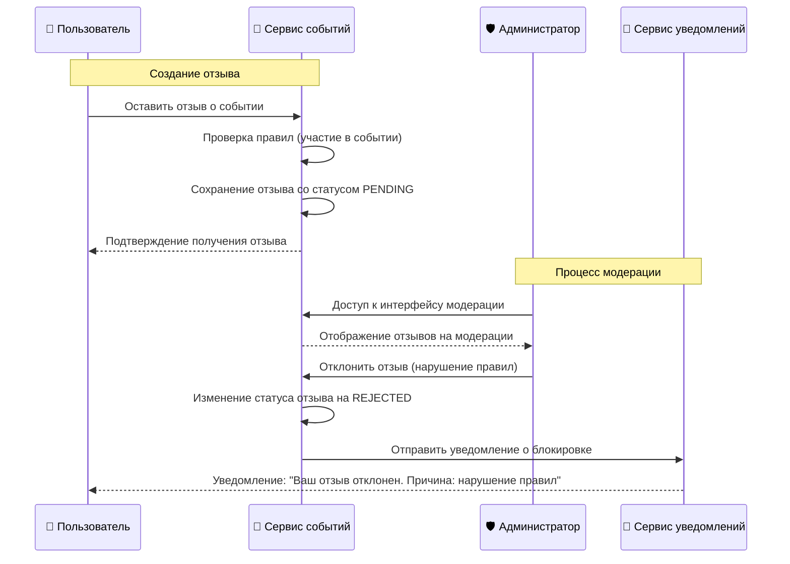
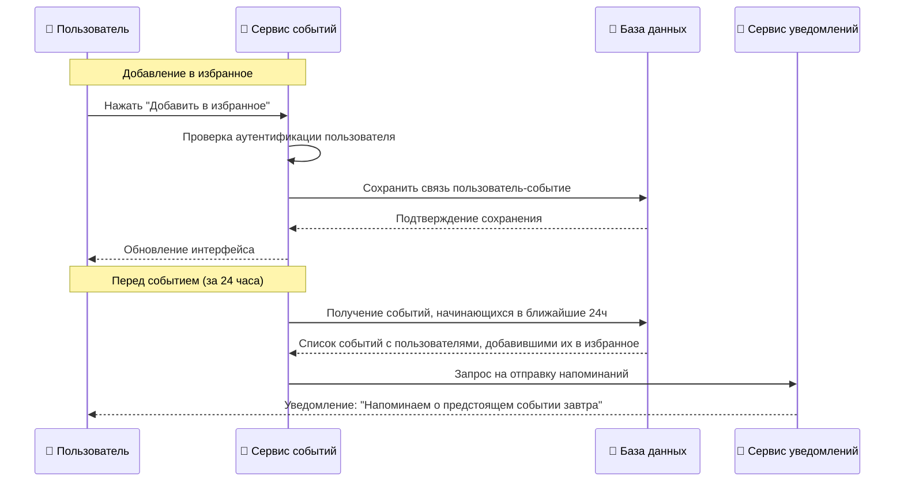

# Жизненный цикл и процессы событий Aquastream

Данный документ описывает жизненный цикл событий в системе Aquastream, статусы различных сущностей и их взаимосвязи, а также ключевые сценарии использования сервиса `backend-event`.

## 📑 Оглавление

1. [🔄 Жизненный цикл события](#-жизненный-цикл-события)
2. [📋 Статусы в системе и их взаимосвязи](#-статусы-в-системе-и-их-взаимосвязи)
   - [Статусы событий](#статусы-событий)
   - [Статусы бронирований](#статусы-бронирований)
   - [Статусы платежей](#статусы-платежей)
   - [Статусы отзывов](#статусы-отзывов)
   - [Связь статусов между сущностями](#связь-статусов-между-сущностями)
   - [Управление переходами статусов](#управление-переходами-статусов)
   - [Технические аспекты обработки статусов](#технические-аспекты-обработки-статусов)
3. [📦 Функциональные модули](#-функциональные-модули)
4. [🎬 Сценарии использования](#-сценарии-использования)
   - [Бронирование без оплаты](#-сценарий-1-бронирование-без-оплаты)
   - [Бронирование и успешная оплата](#-сценарий-2-бронирование-и-успешная-оплата)
   - [Отмена события организатором](#-сценарий-3-отмена-события-организатором)
   - [Модерация отзыва](#-сценарий-4-модерация-отзыва)
   - [Добавление события в избранное](#-сценарий-5-добавление-события-в-избранное)
   - [Общая диаграмма вариантов использования](#-общая-диаграмма-вариантов-использования)

## 🔄 Жизненный цикл события

Жизненный цикл события в системе Aquastream представляет собой последовательность статусов, через которые проходит событие от момента создания до завершения и сбора отзывов.

```mermaid
graph LR
    DRAFT("📝 DRAFT") -->|Опубликовать| PUBLISHED("📢 PUBLISHED")
    PUBLISHED -->|Отмена организатором| CANCELED("❌ CANCELED")
    DRAFT -->|Отмена организатором| CANCELED
    PUBLISHED -->|Завершение события<br>по расписанию| COMPLETED("✅ COMPLETED")
    COMPLETED -->|После сбора<br>отзывов| REVIEWED("⭐ REVIEWED")
    PUBLISHED -->|Небольшие<br>изменения| PUBLISHED
    PUBLISHED -->|Изменение даты/места| RESCHEDULED("🔄 RESCHEDULED")
    RESCHEDULED -->|Отмена при<br>необходимости| CANCELED
    RESCHEDULED -->|Проведение<br>в новую дату| COMPLETED
    RESCHEDULED -->|Дополнительные<br>изменения| RESCHEDULED
    RESCHEDULED -->|Восстановление<br>исходной даты| PUBLISHED
    
    classDef autoTransition fill:#d9f7be,stroke:#389e0d;
    classDef manualTransition fill:#f5f5f5,stroke:#595959;
    
    class "Завершение события<br>по расписанию" autoTransition;
    class "После сбора<br>отзывов" autoTransition;
    class "Опубликовать" manualTransition;
    class "Отмена организатором" manualTransition;
    class "Небольшие<br>изменения" manualTransition;
    class "Изменение даты/места" manualTransition;
    class "Отмена при<br>необходимости" manualTransition;
    class "Проведение<br>в новую дату" autoTransition;
    class "Дополнительные<br>изменения" manualTransition;
    class "Восстановление<br>исходной даты" manualTransition;
```

## 📋 Статусы в системе и их взаимосвязи

### Статусы событий

- **`DRAFT`** — черновик события
  - Создаётся организатором при инициализации события
  - Доступен только организатору и администраторам
  - Позволяет настроить все детали события перед публикацией
  - Не отображается в каталоге и недоступен для бронирования

- **`PUBLISHED`** — опубликовано и доступно для бронирования
  - Отображается в каталоге событий
  - Доступно для бронирования пользователями
  - Позволяет пользователям добавлять событие в избранное
  - Может иметь различные ценовые опции и промокоды
  - Поддерживает динамическое ценообразование
  - Поддерживает отложенную публикацию по расписанию

- **`RESCHEDULED`** — перенесено на другую дату/время
  - Все текущие бронирования сохраняются
  - Пользователи уведомляются о переносе события
  - Предусмотрена возможность отмены брони с полным возвратом средств
  - Требует подтверждения участия после изменения деталей

- **`CANCELED`** — отменено
  - Пользователи уведомлены через `backend-notification` (Kafka)
  - Автоматически инициируются возвраты средств согласно политике возврата
  - Событие помечается как отменённое в каталоге
  - Освобождаются назначенные ресурсы экипажа через `backend-crew`

- **`COMPLETED`** — событие успешно проведено
  - Доступен для просмотра в истории событий
  - Открывает возможность оставить отзыв пользователям
  - Позволяет организатору ответить на отзывы

- **`REVIEWED`** — событие завершено и оценено участниками
  - Содержит отзывы и рейтинг от участников
  - Отзывы могут быть модерированы администраторами
  - Влияет на рейтинг организатора
  - Используется для аналитики и улучшения будущих событий

### Статусы бронирований

- **`PENDING_PAYMENT`** — ожидает оплаты
  - Места временно зарезервированы на ограниченное время (обычно 2 часа)
  - Автоматически переходит в `EXPIRED` если оплата не произведена вовремя
  - Может быть отменен пользователем без штрафов

- **`CONFIRMED`** — подтверждено после оплаты
  - Места окончательно закреплены за пользователем
  - Генерируется и отправляется билет пользователю
  - Организатор получает уведомление о новом участнике
  - Обновляется статистика события

- **`CANCELED`** — отменено
  - Может быть инициировано пользователем (с возвратом согласно политике)
  - Может быть результатом отмены события (с полным возвратом)
  - Места возвращаются в доступные
  - Пользователь и организатор получают уведомления

- **`EXPIRED`** — срок ожидания оплаты истек
  - Автоматически генерируется после истечения срока резервирования
  - Места автоматически возвращаются в доступные
  - Пользователь уведомляется о потере брони
  - Не требует дополнительных действий

### Жизненный цикл бронирования



### Статусы платежей
- **`INITIATED`** — платеж инициирован, но не завершен
- **`COMPLETED`** — платеж успешно завершен
- **`FAILED`** — платеж не выполнен (ошибка при обработке)
- **`REFUNDED`** — произведен полный возврат средств
- **`PARTIAL_REFUND`** — произведен частичный возврат средств

### Статусы отзывов
- **`PENDING`** — на модерации
- **`ACTIVE`** — одобрен и опубликован
- **`REJECTED`** — отклонен модератором

### Связь статусов между сущностями
Статусы бронирований тесно связаны со статусами событий:
- Для событий в статусе **`PUBLISHED`** и **`RESCHEDULED`** разрешено создание новых бронирований
- При переходе события в статус **`CANCELED`** все активные бронирования автоматически отменяются
- После перехода события в статус **`COMPLETED`** бронирования фиксируются как завершённые

### Управление переходами статусов
- Организатор может переводить событие из **`DRAFT`** в **`PUBLISHED`**
- Организатор и администратор могут отменить событие (**`CANCELED`**)
- Система автоматически переводит событие в **`COMPLETED`** после даты проведения
- Система переводит событие в **`REVIEWED`** после получения отзывов от участников
- Переход в **`RESCHEDULED`** доступен только для событий в статусе **`PUBLISHED`**

### Технические аспекты обработки статусов
- Для управления статусами используются транзакции в PostgreSQL
- Изменения статуса событий публикуются в Kafka для оповещения других сервисов
- Используется Redis для блокировок при изменении статуса
- Оптимистичные блокировки для предотвращения конфликтов при одновременном изменении

## 📦 Функциональные модули

### 🔍 Каталог и детали событий
- **Фильтрация**: По дате, категории, местоположению
- **Поддержка**: Карты, экспорт iCal/ICS
- **Функции**: Избранное, напоминания
- **Кэширование**: Популярные события
- **Отображение**: Цена, рейтинг, организатор, отзывы, экипаж
- **Экспорт**: Генерация PDF-билетов и экспорт информации в календари (iCal)

### 🎫 Бронирование
- **Ограничение**: Один пользователь — одна бронь
- **Статусы**: `PENDING_PAYMENT`, `CONFIRMED`, `CANCELED`, `EXPIRED`
- **Защита**: От overselling, оптимистичные блокировки
- **Резервирование**: Место до оплаты

### 💳 Оплата и возвраты
- **Успешная оплата**: Генерация билета, статус **`CONFIRMED`**
- **Неуспешная оплата**: Повторная попытка
- **Просрочка**: Автоматическая отмена
- **Ручная отмена**: До оплаты пользователем
- **Отмена организатором**: Массовая отмена, возвраты

### 💰 Платежи
- **Статусы платежей**: `INITIATED`, `COMPLETED`, `FAILED`, `REFUNDED`, `PARTIAL_REFUND`
- **Обработка возвратов**: Автоматическая и ручная обработка через интеграцию с платежными шлюзами
- **Отслеживание**: Мониторинг статусов через gateway_reference
- **Интеграция платёжных шлюзов**: Поддержка различных систем через абстрактный интерфейс
- **Обработка callbacks**: Асинхронное получение и обработка уведомлений от платёжных систем
- **Безопасность**: Шифрование платёжных данных и соответствие стандартам PCI DSS

### 🔄 Политика возврата
- **До 7 дней**: 100% возврат
- **2–7 дней**: ~80% возврат
- **24–48 часов**: ~50% возврат
- **<24 часов**: Возврат не осуществляется (исключения возможны)
- **Отмена организатором**: Полный возврат вне зависимости от срока
- **Форс-мажор**: Индивидуальное рассмотрение с возможностью полного возврата
- **Гибкая настройка**: Возможность определения собственной политики для каждого события

### 📣 Уведомления
- **Отправка**: Через `backend-notification` (Kafka)
- **Типы**: Напоминания, изменения статуса, бронирования, оплаты, экипаж

### 👥 Экипаж
- **Назначение**: Через `backend-crew`
- **Управление**: Автоматическое и ручное
- **Обновление**: При изменении или отмене события
- **Уведомления**: Организатору при отмене/переносе

### ❤️ Избранное
- **Функции**: Добавление/удаление событий
- **Доступ**: Только для авторизованных пользователей
- **Хранение**: Персонально, не публично

### ⭐ Отзывы
- **Количество**: Один отзыв после события
- **Рейтинг**: 1–5, статус `PENDING` → `ACTIVE` → `REJECTED`
- **Модерация**: Ответы организатора
- **Сортировка**: По полезности

### 📂 Категории событий
- **Иерархия**: Родительско-дочерние связи
- **Выбор категории**: Из предопределённого списка
- **Интерфейс**: Удобный выбор при создании события
- **Фильтрация**: Используются в каталоге

### 🔧 Администрирование
- **Управление событиями**: Просмотр и редактирование всех событий для поддержания актуальности информации
- **Контроль бронирований и отзывов**: Мониторинг и управление для обеспечения качества сервиса
- **Отчётность**: Ведение журналов, создание отчётов и экспорт данных в формате CSV
- **Массовые операции**: Возможность массового переноса, отмены и рассылки

### 💲 Ценообразование
- **Категории**: VIP, ранняя цена, групповые и стандартные тарифы
- **Промокоды**: Поддержка фиксированных и процентных скидок с ограничениями
- **Динамическое ценообразование**: Корректировка цен в зависимости от спроса
- **Система лояльности**: Программы поощрения для постоянных клиентов

### 🚀 Кэширование и оптимизация
- **Кэширование каталога**: Хранение часто запрашиваемых событий в Redis с TTL
- **Кэширование статических данных**: Кэширование категорий, шаблонов уведомлений
- **Многоуровневое кэширование**: L1 (in-memory), L2 (Redis), L3 (PostgreSQL)
- **Стратегии инвалидации кэша**: Проактивная инвалидация при изменениях

### 🔒 Защита от конкурентных запросов
- **Оптимистичные блокировки**: Использование версионирования для предотвращения перезаписи данных
- **Пессимистичные блокировки**: Использование Redis для блокировки критичных ресурсов
- **Распределенные блокировки**: Защита от race condition при резервировании билетов
- **Механизм идемпотентности**: Предотвращение дублирования операций при повторной отправке

## 🎬 Сценарии использования

### 📋 Сценарий 1: Бронирование без оплаты
Пользователь бронирует билет, но не оплачивает его до истечения дедлайна. Бронь автоматически истекает, билеты возвращаются в продажу, пользователю отправляется уведомление.


### 💳 Сценарий 2: Бронирование и успешная оплата
Пользователь бронирует билет с промокодом и успешно оплачивает его. Получает подтверждение и билет, организатор уведомляется.


### ❌ Сценарий 3: Отмена события организатором
Организатор отменяет событие. Все бронирования отменяются, инициируются возвраты, участники уведомляются.


### ⭐ Сценарий 4: Модерация отзыва
Пользователь оставляет отзыв. Администратор модерирует и может отклонить отзыв при нарушении правил, пользователь получает уведомление.


### ❤️ Сценарий 5: Добавление события в избранное
Пользователь добавляет событие в избранное и получает напоминания о приближении мероприятия.


### 📊 Общая диаграмма вариантов использования

```mermaid
graph TB
    %% Акторы
    Guest["👤 Гость"]
    User["👤 Пользователь"]
    Organizer["👔 Организатор"]
    Admin["🛡️ Администратор"]
    
    %% Use Cases для Гостя
    UC1["Просмотр каталога событий"]
    UC2["Поиск и фильтрация событий"]
    UC3["Просмотр информации о событии"]
    UC4["Чтение отзывов"]
    
    %% Use Cases для Пользователя
    UC5["Бронирование билетов"]
    UC6["Оплата билетов"]
    UC7["Отмена бронирования"]
    UC8["Добавление в избранное"]
    UC9["Оставление отзывов"]
    
    %% Use Cases для Организатора
    UC10["Создание событий"]
    UC11["Редактирование событий"]
    UC12["Публикация событий"]
    UC13["Отмена событий"]
    UC14["Управление ценами"]
    UC15["Ответы на отзывы"]
    UC16["Назначение экипажа"]
    
    %% Use Cases для Администратора
    UC17["Модерация отзывов"]
    UC18["Массовые операции"]
    UC19["Управление категориями"]
    UC20["Просмотр аналитики"]
    
    %% Связи Гостя
    Guest --> UC1
    Guest --> UC2
    Guest --> UC3
    Guest --> UC4
    
    %% Связи Пользователя (включая все возможности Гостя)
    User --> UC1
    User --> UC2
    User --> UC3
    User --> UC4
    User --> UC5
    User --> UC6
    User --> UC7
    User --> UC8
    User --> UC9
    
    %% Связи Организатора
    Organizer --> UC10
    Organizer --> UC11
    Organizer --> UC12
    Organizer --> UC13
    Organizer --> UC14
    Organizer --> UC15
    Organizer --> UC16
    Organizer --> UC20
    
    %% Связи Администратора
    Admin --> UC1
    Admin --> UC2
    Admin --> UC3
    Admin --> UC5
    Admin --> UC7
    Admin --> UC10
    Admin --> UC11
    Admin --> UC12
    Admin --> UC13
    Admin --> UC17
    Admin --> UC18
    Admin --> UC19
    Admin --> UC20
    
    %% Стили для элементов
    classDef actor fill:#f9f9f9,stroke:#333,stroke-width:2px;
    classDef usecase fill:#e6f7ff,stroke:#1890ff,stroke-width:1px;
    
    class Guest,User,Organizer,Admin actor;
    class UC1,UC2,UC3,UC4,UC5,UC6,UC7,UC8,UC9,UC10,UC11,UC12,UC13,UC14,UC15,UC16,UC17,UC18,UC19,UC20 usecase;
``` 

