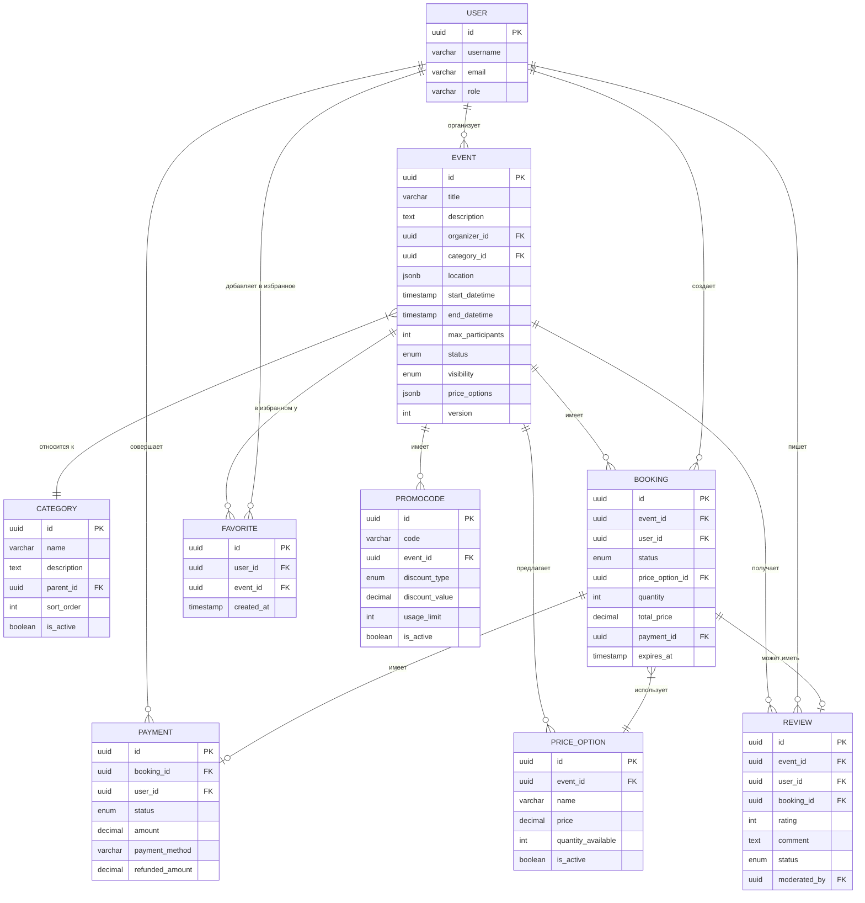

# Модель данных микросервиса Backend-Event

> **Назначение документа:** описать модель данных, структуру сущностей, их атрибуты и взаимосвязи в микросервисе `backend-event`.

## 📊 Обзор модели данных

Микросервис `backend-event` использует реляционную базу данных PostgreSQL для хранения структурированной информации о событиях, бронированиях, отзывах и других связанных сущностях. Модель данных разработана с учетом требований:

- Нормализации для минимизации избыточности данных
- Оптимизации производительности частых запросов
- Обеспечения целостности данных
- Поддержки транзакционных операций
- Масштабируемости при росте объема данных

## 📋 Основные сущности и атрибуты

### 🎭 Event (Событие)
Центральная сущность системы, содержащая информацию о мероприятии.

| Атрибут | Тип | Описание | Обязательный | Ограничения |
|---------|-----|----------|--------------|-------------|
| id | UUID | Уникальный идентификатор события | Да | PK, уникальный |
| title | VARCHAR(200) | Название события | Да | min 3 символа |
| description | TEXT | Подробное описание события | Да | max 5000 символов |
| short_description | VARCHAR(500) | Краткое описание для каталога | Да | max 500 символов |
| organizer_id | UUID | ID организатора (ref: User) | Да | FK на users.id |
| category_id | UUID | ID категории (ref: Category) | Да | FK на categories.id |
| location | JSONB | Информация о месте проведения | Да | С информацией о геолокации |
| start_datetime | TIMESTAMP | Дата и время начала | Да | >= текущей даты |
| end_datetime | TIMESTAMP | Дата и время окончания | Да | > start_datetime |
| max_participants | INT | Максимальное число участников | Да | > 0 |
| min_participants | INT | Минимальное число участников | Нет | >= 0 |
| status | ENUM | Статус события (DRAFT, PUBLISHED, и т.д.) | Да | Из списка допустимых |
| visibility | ENUM | Видимость (PUBLIC, PRIVATE, UNLISTED) | Да | По умолчанию PUBLIC |
| cover_image_url | VARCHAR(1024) | URL обложки | Нет | Валидный URL |
| gallery_images | JSONB | Массив ссылок на дополнительные изображения | Нет | До 20 изображений |
| tags | JSONB | Массив тегов | Нет | До 10 тегов |
| created_at | TIMESTAMP | Дата создания | Да | Автозаполнение |
| updated_at | TIMESTAMP | Дата последнего изменения | Да | Автообновление |
| price_options | JSONB | Информация о ценах и билетах | Да | Структурированный JSON |
| refund_policy | JSONB | Политика возврата | Да | Структурированный JSON |
| recurrence_rule | JSONB | Правило повторяемости (для серийных событий) | Нет | iCal RFC 5545 формат |
| is_featured | BOOLEAN | Событие рекомендуемое | Нет | По умолчанию false |
| version | INT | Версия для оптимистичной блокировки | Да | Автоинкремент |

### 👤 Booking (Бронирование)
Запись о бронировании места на событии пользователем.

| Атрибут | Тип | Описание | Обязательный | Ограничения |
|---------|-----|----------|--------------|-------------|
| id | UUID | Уникальный идентификатор брони | Да | PK, уникальный |
| event_id | UUID | ID события (ref: Event) | Да | FK на events.id |
| user_id | UUID | ID пользователя (ref: User) | Да | FK на users.id |
| status | ENUM | Статус бронирования | Да | PENDING_PAYMENT, CONFIRMED, CANCELED, EXPIRED |
| price_option_id | UUID | ID выбранного тарифа (ref: PriceOption) | Да | FK на price_options.id |
| quantity | INT | Количество билетов | Да | > 0 |
| total_price | DECIMAL(10,2) | Итоговая стоимость | Да | >= 0 |
| discount | DECIMAL(10,2) | Размер скидки | Нет | >= 0 |
| promocode | VARCHAR(50) | Примененный промокод | Нет | Если использовался |
| payment_id | UUID | ID платежа (ref: Payment) | Нет | FK на payments.id |
| created_at | TIMESTAMP | Дата создания | Да | Автозаполнение |
| updated_at | TIMESTAMP | Дата последнего изменения | Да | Автообновление |
| expires_at | TIMESTAMP | Время истечения неоплаченной брони | Нет | Для PENDING_PAYMENT |
| ticket_data | JSONB | Данные для билета | Нет | Информация для генерации билета |
| attendee_info | JSONB | Информация об участнике | Нет | Контактные данные |
| notes | TEXT | Примечания к бронированию | Нет | Для внутреннего использования |

### 💰 Payment (Платеж)
Информация о платеже за бронирование.

| Атрибут | Тип | Описание | Обязательный | Ограничения |
|---------|-----|----------|--------------|-------------|
| id | UUID | Уникальный идентификатор платежа | Да | PK, уникальный |
| booking_id | UUID | ID бронирования (ref: Booking) | Да | FK на bookings.id |
| user_id | UUID | ID пользователя (ref: User) | Да | FK на users.id |
| status | ENUM | Статус платежа | Да | INITIATED, COMPLETED, FAILED, REFUNDED |
| amount | DECIMAL(10,2) | Сумма платежа | Да | > 0 |
| payment_method | VARCHAR(50) | Метод оплаты | Да | card, applepay, googlepay, и т.д. |
| payment_provider | VARCHAR(50) | Провайдер платежей | Да | Например, Stripe, PayPal |
| payment_provider_id | VARCHAR(100) | ID транзакции у провайдера | Нет | Уникальный, предоставляется провайдером |
| refunded_amount | DECIMAL(10,2) | Возвращенная сумма | Нет | <= amount |
| created_at | TIMESTAMP | Дата создания | Да | Автозаполнение |
| updated_at | TIMESTAMP | Дата последнего изменения | Да | Автообновление |
| metadata | JSONB | Дополнительные данные о транзакции | Нет | Для сверки и аудита |

### ⭐ Review (Отзыв)
Отзыв пользователя о посещенном событии.

| Атрибут | Тип | Описание | Обязательный | Ограничения |
|---------|-----|----------|--------------|-------------|
| id | UUID | Уникальный идентификатор отзыва | Да | PK, уникальный |
| event_id | UUID | ID события (ref: Event) | Да | FK на events.id |
| user_id | UUID | ID пользователя (ref: User) | Да | FK на users.id |
| booking_id | UUID | ID бронирования (ref: Booking) | Да | FK на bookings.id |
| rating | INT | Оценка от 1 до 5 | Да | 1-5 |
| comment | TEXT | Текст отзыва | Нет | max 2000 символов |
| status | ENUM | Статус модерации | Да | PENDING, ACTIVE, REJECTED |
| created_at | TIMESTAMP | Дата создания | Да | Автозаполнение |
| updated_at | TIMESTAMP | Дата последнего изменения | Да | Автообновление |
| moderated_by | UUID | ID модератора (ref: User) | Нет | FK на users.id |
| moderation_comment | TEXT | Комментарий модератора | Нет | Внутренний |
| organizer_response | TEXT | Ответ организатора | Нет | max 1000 символов |
| media_urls | JSONB | Массив ссылок на медиа (фото, видео) | Нет | До 5 элементов |

### 🔖 Category (Категория)
Категория события для классификации.

| Атрибут | Тип | Описание | Обязательный | Ограничения |
|---------|-----|----------|--------------|-------------|
| id | UUID | Уникальный идентификатор категории | Да | PK, уникальный |
| name | VARCHAR(100) | Название категории | Да | Уникальное |
| description | TEXT | Описание категории | Нет | |
| icon_url | VARCHAR(1024) | URL иконки | Нет | Валидный URL |
| parent_id | UUID | ID родительской категории | Нет | FK на categories.id, null для корневых |
| sort_order | INT | Порядок сортировки | Да | По умолчанию 0 |
| is_active | BOOLEAN | Активность категории | Да | По умолчанию true |
| created_at | TIMESTAMP | Дата создания | Да | Автозаполнение |
| updated_at | TIMESTAMP | Дата последнего изменения | Да | Автообновление |

### ❤️ Favorite (Избранное)
Связь между пользователем и событием, помеченным как избранное.

| Атрибут | Тип | Описание | Обязательный | Ограничения |
|---------|-----|----------|--------------|-------------|
| id | UUID | Уникальный идентификатор записи | Да | PK, уникальный |
| user_id | UUID | ID пользователя (ref: User) | Да | FK на users.id |
| event_id | UUID | ID события (ref: Event) | Да | FK на events.id |
| created_at | TIMESTAMP | Дата добавления в избранное | Да | Автозаполнение |
| notification_enabled | BOOLEAN | Получать уведомления об изменениях | Да | По умолчанию true |

### 🎫 PriceOption (Ценовой вариант)
Вариант цен и условий для билетов.

| Атрибут | Тип | Описание | Обязательный | Ограничения |
|---------|-----|----------|--------------|-------------|
| id | UUID | Уникальный идентификатор | Да | PK, уникальный |
| event_id | UUID | ID события (ref: Event) | Да | FK на events.id |
| name | VARCHAR(100) | Название опции (VIP, Стандарт) | Да | |
| description | TEXT | Описание ценовой опции | Нет | |
| price | DECIMAL(10,2) | Стоимость | Да | >= 0 |
| quantity_available | INT | Количество доступных билетов | Да | >= 0 |
| is_active | BOOLEAN | Активность опции | Да | По умолчанию true |
| start_sale_date | TIMESTAMP | Начало продаж | Нет | |
| end_sale_date | TIMESTAMP | Окончание продаж | Нет | |
| benefits | JSONB | Список преимуществ | Нет | Массив строк |
| created_at | TIMESTAMP | Дата создания | Да | Автозаполнение |
| updated_at | TIMESTAMP | Дата последнего изменения | Да | Автообновление |

### 🎁 Promocode (Промокод)
Промокоды для предоставления скидок.

| Атрибут | Тип | Описание | Обязательный | Ограничения |
|---------|-----|----------|--------------|-------------|
| id | UUID | Уникальный идентификатор | Да | PK, уникальный |
| code | VARCHAR(50) | Код для применения | Да | Уникальный, регистронезависимый |
| event_id | UUID | ID события (ref: Event) | Нет | FK на events.id, null для глобальных |
| discount_type | ENUM | Тип скидки | Да | PERCENTAGE, FIXED_AMOUNT |
| discount_value | DECIMAL(10,2) | Размер скидки | Да | > 0 |
| usage_limit | INT | Лимит использований | Нет | null для неограниченного |
| used_count | INT | Количество использований | Да | По умолчанию 0 |
| is_active | BOOLEAN | Активность промокода | Да | По умолчанию true |
| valid_from | TIMESTAMP | Начало действия | Да | |
| valid_to | TIMESTAMP | Окончание действия | Нет | null для бессрочных |
| min_order_amount | DECIMAL(10,2) | Минимальная сумма заказа | Нет | >= 0 |
| created_at | TIMESTAMP | Дата создания | Да | Автозаполнение |
| updated_at | TIMESTAMP | Дата последнего изменения | Да | Автообновление |

## 🔗 Связи между сущностями



## 🔒 Бизнес-правила и ограничения целостности

1. **Уникальные бронирования:**
   - Один пользователь может иметь только одно активное бронирование на событие (не CANCELED/EXPIRED)
   - Для создания повторной брони требуется отменить предыдущую

2. **Контроль количества мест:**
   - Общее число подтвержденных бронирований не может превышать max_participants события
   - Для управления конкурентными бронированиями используются транзакции и оптимистичные блокировки

3. **Правила изменения статусов:**
   - Событие можно отменить только в статусах DRAFT, PUBLISHED или RESCHEDULED
   - При отмене события все активные бронирования автоматически отменяются
   - Событие переходит в COMPLETED только после даты окончания

4. **Ограничения на отзывы:**
   - Оставить отзыв может только пользователь с подтвержденным бронированием (CONFIRMED)
   - Отзыв можно оставить только после проведения события (событие в статусе COMPLETED)
   - На одно бронирование можно оставить только один отзыв

5. **Правила использования промокодов:**
   - Нельзя использовать истекший или неактивный промокод
   - Промокод действует только для указанного события (или для всех, если event_id = null)
   - Нельзя превысить лимит использований промокода

## 📊 Индексы и оптимизация запросов

Для обеспечения производительности при высоких нагрузках используются следующие индексы:

| Таблица | Индекс | Тип | Назначение |
|---------|--------|-----|------------|
| events | events_organizer_id_idx | BTREE | Поиск событий организатора |
| events | events_category_id_idx | BTREE | Фильтрация по категориям |
| events | events_status_idx | BTREE | Фильтрация по статусам |
| events | events_start_datetime_idx | BTREE | Временная сортировка |
| events | events_location_idx | GIN | Географический поиск |
| events | events_tags_idx | GIN | Поиск по тегам |
| bookings | bookings_event_id_idx | BTREE | Получение бронирований по событию |
| bookings | bookings_user_id_idx | BTREE | История бронирований пользователя |
| bookings | bookings_status_idx | BTREE | Фильтрация по статусам |
| reviews | reviews_event_id_idx | BTREE | Отзывы для события |
| reviews | reviews_user_id_idx | BTREE | Отзывы пользователя |
| reviews | reviews_status_idx | BTREE | Фильтрация по статусу модерации |
| favorites | favorites_unique_idx | UNIQUE | Уникальность user_id + event_id |
| promocodes | promocodes_code_idx | UNIQUE | Поиск по коду |

## 💾 Тестовые данные и моки

Для тестирования и разработки используются следующие шаблоны данных:

### Пример события
```json
{
  "id": "f47ac10b-58cc-4372-a567-0e02b2c3d479",
  "title": "Яхтинг в Карибском море: недельный круиз",
  "description": "Приглашаем вас на незабываемое путешествие по Карибским островам на комфортабельной яхте. Вы увидите красивейшие бухты, искупаетесь в кристально чистой воде и научитесь основам управления яхтой под руководством опытных шкиперов.",
  "short_description": "Недельный круиз по Карибскому морю с обучением основам яхтинга",
  "organizer_id": "a1b2c3d4-e5f6-4a5b-8c7d-9e0f1a2b3c4d",
  "category_id": "5a6b7c8d-9e0f-1a2b-3c4d-5e6f7a8b9c0d",
  "location": {
    "address": "Марина Родни-Бей, Сент-Люсия, Карибские острова",
    "coordinates": {
      "latitude": 14.0741,
      "longitude": -60.9498
    },
    "venue_name": "Rodney Bay Marina"
  },
  "start_datetime": "2024-06-15T09:00:00Z",
  "end_datetime": "2024-06-22T17:00:00Z",
  "max_participants": 8,
  "min_participants": 4,
  "status": "PUBLISHED",
  "visibility": "PUBLIC",
  "cover_image_url": "https://aquastream-media.s3.amazonaws.com/events/f47ac10b/cover.jpg",
  "gallery_images": [
    "https://aquastream-media.s3.amazonaws.com/events/f47ac10b/gallery1.jpg",
    "https://aquastream-media.s3.amazonaws.com/events/f47ac10b/gallery2.jpg"
  ],
  "tags": ["яхтинг", "круиз", "карибы", "обучение", "море"],
  "created_at": "2024-01-10T14:22:13Z",
  "updated_at": "2024-02-15T11:17:45Z",
  "price_options": {
    "options": [
      {
        "id": "b4c5d6e7-f8a9-0b1c-2d3e-4f5a6b7c8d9e",
        "name": "Стандарт",
        "description": "Место в двухместной каюте",
        "price": 1500.00,
        "quantity_available": 6
      },
      {
        "id": "c5d6e7f8-a9b0-1c2d-3e4f-5a6b7c8d9e0f",
        "name": "VIP",
        "description": "Отдельная каюта с собственной ванной комнатой",
        "price": 2200.00,
        "quantity_available": 2
      }
    ]
  },
  "refund_policy": {
    "full_refund_before_days": 30,
    "partial_refund_percentage": 50,
    "partial_refund_before_days": 14,
    "no_refund_before_days": 7
  },
  "version": 3
}
```

### Пример бронирования
```json
{
  "id": "d1e2f3a4-b5c6-7d8e-9f0a-1b2c3d4e5f6a",
  "event_id": "f47ac10b-58cc-4372-a567-0e02b2c3d479",
  "user_id": "g7h8i9j0-k1l2-m3n4-o5p6-q7r8s9t0u1v2",
  "status": "CONFIRMED",
  "price_option_id": "b4c5d6e7-f8a9-0b1c-2d3e-4f5a6b7c8d9e",
  "quantity": 2,
  "total_price": 3000.00,
  "discount": 300.00,
  "promocode": "SUMMER2024",
  "payment_id": "e2f3a4b5-c6d7-e8f9-0a1b-2c3d4e5f6a7b",
  "created_at": "2024-02-20T18:45:22Z",
  "updated_at": "2024-02-20T19:10:45Z",
  "ticket_data": {
    "ticket_number": "AS-24061501",
    "qr_code_url": "https://aquastream-tickets.s3.amazonaws.com/qr/AS-24061501.png",
    "barcode": "AS000000123456789"
  },
  "attendee_info": {
    "names": ["Иван Петров", "Мария Петрова"],
    "email": "ivan.petrov@example.com",
    "phone": "+7 (999) 123-45-67",
    "special_requests": "Вегетарианское питание"
  }
}
```

### Пример отзыва
```json
{
  "id": "h9i0j1k2-l3m4-n5o6-p7q8-r9s0t1u2v3w4",
  "event_id": "f47ac10b-58cc-4372-a567-0e02b2c3d479",
  "user_id": "g7h8i9j0-k1l2-m3n4-o5p6-q7r8s9t0u1v2",
  "booking_id": "d1e2f3a4-b5c6-7d8e-9f0a-1b2c3d4e5f6a",
  "rating": 5,
  "comment": "Великолепный круиз! Шкиперы были очень профессиональны и терпеливы. Увидели невероятные места, научились основам управления яхтой. Очень рекомендую эту поездку всем любителям моря и приключений!",
  "status": "ACTIVE",
  "created_at": "2024-06-25T14:37:10Z",
  "updated_at": "2024-06-25T18:22:45Z",
  "moderated_by": "z0a1b2c3-d4e5-f6g7-h8i9-j0k1l2m3n4o5",
  "organizer_response": "Спасибо за ваш отзыв, Иван! Мы очень рады, что вам понравилось путешествие. Ждем вас на наших следующих маршрутах!",
  "media_urls": [
    "https://aquastream-media.s3.amazonaws.com/reviews/h9i0j1k2/photo1.jpg",
    "https://aquastream-media.s3.amazonaws.com/reviews/h9i0j1k2/photo2.jpg"
  ]
}
```

## 🔄 Миграции и управление схемой

Для управления схемой используется Liquibase, обеспечивающий:
- Контроль версий схемы данных
- Возможность отката изменений
- Генерацию отчетов о различиях
- Интеграцию с CI/CD

Миграции хранятся в формате XML и SQL в каталоге `backend-event-db/src/main/resources/db/changelog/`.

## 🧠 Лучшие практики работы с моделью данных

1. **Транзакционность**
   - Все связанные операции должны быть в одной транзакции
   - Использовать уровень изоляции REPEATABLE READ для критических операций

2. **Оптимистичная блокировка**
   - Использовать поле `version` для предотвращения конфликтов при конкурентном доступе
   - Обновлять версию при любом изменении записи

3. **Денормализация для производительности**
   - Хранить агрегированные значения для часто запрашиваемых метрик
   - Использовать материализованные представления для сложных отчетов

4. **Работа с большими объемами данных**
   - Организовать партиционирование таблиц по времени для исторических данных
   - Применять пагинацию для всех запросов с потенциально большим результатом
``` 
</rewritten_file>