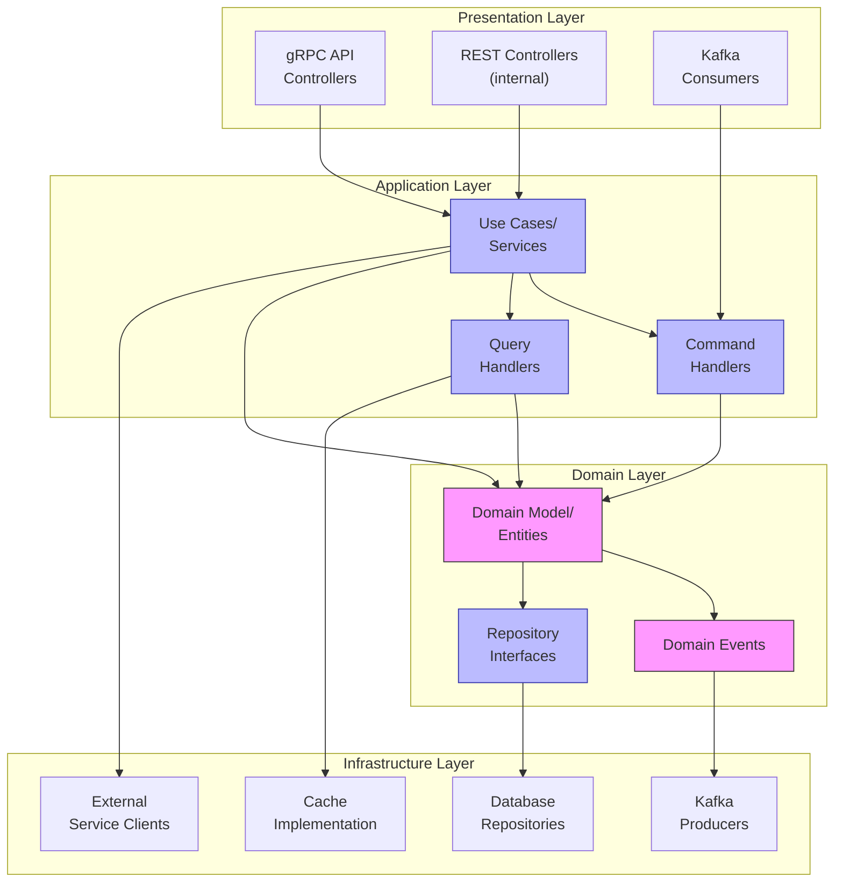

# Руководство разработчика микросервиса Backend-Event

> **Назначение документа:** предоставить разработчикам необходимую информацию для работы с кодовой базой микросервиса `backend-event`, включая архитектуру, настройку окружения, соглашения по коду и лучшие практики.

## 🔍 Архитектурные принципы

### Общая архитектура микросервиса

Микросервис `backend-event` построен на принципах:
- **Гексагональной архитектуры** (Ports & Adapters)
- **Доменно-ориентированного проектирования** (DDD)
- **CQRS** (Command Query Responsibility Segregation)
- **Event Sourcing** для критичных бизнес-операций



### Модульная структура

Микросервис разделен на несколько логических модулей:

1. **Core** — ядро бизнес-логики
   - Доменная модель
   - Use cases
   - Интерфейсы репозиториев

2. **API** — контракты внешних API
   - gRPC сервисы
   - DTO и маппинги
   - Валидация запросов

3. **Infrastructure** — техническая реализация
   - Репозитории БД
   - Kafka продюсеры/консьюмеры
   - Кэширование
   - Внешние клиенты

4. **DB** — управление базой данных
   - Миграции (Liquibase)
   - SQL скрипты
   - Модели данных

## 🛠️ Настройка окружения разработки

### Требования к окружению

1. **Обязательные инструменты**
   - JDK 17+
   - Docker и Docker-compose
   - Gradle 8.0+
   - Git

2. **Рекомендуемые IDE и плагины**
   - IntelliJ IDEA Ultimate (предпочтительно)
   - Плагины:
     - Lombok
     - Mapstruct Support
     - Gradle
     - SonarLint
     - Protobuf
     - PlantUML integration

### Настройка локального окружения

1. **Клонирование репозитория**
   ```bash
   git clone https://github.com/aquastream/backend-event.git
   cd backend-event
   ```

2. **Запуск зависимостей через Docker**
   ```bash
   docker-compose -f docker-compose.dev.yml up -d
   ```

3. **Запуск приложения локально**
   ```bash
   ./gradlew bootRun --args='--spring.profiles.active=local'
   ```

4. **Запуск всего через Docker**
   ```bash
   docker-compose up -d
   ```

### Доступ к локальным ресурсам

| Ресурс | URL | Учетные данные |
|--------|-----|----------------|
| Приложение API | http://localhost:8080 | - |
| gRPC Server | localhost:9090 | - |
| Swagger UI | http://localhost:8080/swagger-ui.html | - |
| PostgreSQL | localhost:5432 | user/password |
| Adminer (DB UI) | http://localhost:8081 | - |
| Kafka UI | http://localhost:8082 | - |
| Redis Commander | http://localhost:8083 | - |

## 📝 Соглашения по коду

### Стиль кодирования

1. **Java Code Style**
   - Соблюдение [Google Java Style Guide](https://google.github.io/styleguide/javaguide.html)
   - Code Formatter в соответствии с `.editorconfig`
   - Максимальная длина строки: 120 символов

2. **Именование**
   - Классы: `PascalCase`
   - Методы и переменные: `camelCase`
   - Константы: `UPPER_SNAKE_CASE`
   - Пакеты: `lowerсase`

3. **Структура классов**
   - Порядок: поля, конструкторы, методы
   - Группировка по видимости: public, protected, package-private, private
   - Статические члены перед нестатическими

### Организация исходного кода

```
backend-event/
├── gradle/                  # Gradle wrapper и скрипты
├── src/
│   ├── main/
│   │   ├── java/
│   │   │   └── ru/aquastream/event/
│   │   │       ├── api/             # API контракты
│   │   │       ├── config/          # Конфигурация
│   │   │       ├── core/            # Бизнес-логика
│   │   │       │   ├── domain/      # Доменные модели
│   │   │       │   ├── service/     # Сервисы
│   │   │       │   └── port/        # Интерфейсы портов
│   │   │       └── infrastructure/  # Техническая реализация
│   │   │           ├── persistence/ # Репозитории
│   │   │           ├── messaging/   # Kafka и т.д.
│   │   │           └── client/      # Внешние клиенты
│   │   ├── resources/
│   │   │   ├── application.yml      # Основная конфигурация
│   │   │   └── application-*.yml    # Профили
│   │   └── proto/                   # Protobuf/gRPC файлы
│   └── test/
│       ├── java/...                 # Unit/Integration тесты
│       └── resources/...            # Тестовые ресурсы
├── docker/                          # Docker конфигурация
├── docs/                            # Документация
└── build.gradle                     # Сборка и зависимости
```

### Работа с кодовой базой

1. **Ветвление (Git Flow)**
   - `main` — основная ветка релизов
   - `develop` — ветка разработки
   - `feature/*` — ветки для новых функций
   - `bugfix/*` — ветки для исправлений
   - `release/*` — подготовка релиза

2. **Pull Requests**
   - Создание PR из feature в develop
   - Обязательный code review от одного разработчика
   - Прохождение всех Continuous Integration проверок
   - Соответствие шаблону PR

3. **Commit сообщения**
   - Формат: `[JIRA-123] Краткое описание изменений`
   - Подробное описание в теле сообщения при необходимости
   - Ссылки на задачи и документацию

## 💼 Рабочие процессы и лучшие практики

### Разработка новых функций

1. **Планирование**
   - Анализ требований и согласование технического решения
   - Декомпозиция на задачи в Jira
   - Обсуждение с командой на дизайн-сессии

2. **Реализация**
   - Создание feature ветки из develop
   - Реализация сначала доменного слоя, затем инфраструктурного
   - Написание тестов (TDD там, где возможно)
   - Добавление миграций при изменении схемы БД

3. **Проверка**
   - Self-review кода
   - Запуск всех тестов локально
   - Создание PR и прохождение code review
   - Исправление замечаний

4. **Интеграция**
   - Слияние PR в develop после одобрения
   - Проверка на dev окружении
   - Обновление документации при необходимости

### Рекомендации по кодированию

1. **DDD патерны**
   - Использование Aggregate Roots для обеспечения инвариантов
   - Value Objects для неизменяемых концепций
   - Domain Events для уведомления о важных изменениях
   - Repositories для доступа к данным

2. **Работа с исключениями**
   - `DomainException` — нарушение бизнес-правил
   - `ApplicationException` — ошибки приложения
   - `InfrastructureException` — технические ошибки
   - Подробное логирование в catch блоках

3. **Оптимизация производительности**
   - Кэширование часто запрашиваемых данных (Redis)
   - Пагинация для больших наборов данных
   - Асинхронная обработка для некритичных операций
   - Оптимистические блокировки для конкурентных сценариев

## 🧪 Тестирование

### Типы тестов

1. **Unit тесты**
   - Покрытие бизнес-логики > 85%
   - Фреймворки: JUnit 5, Mockito
   - Изоляция от внешних зависимостей через mocks

2. **Интеграционные тесты**
   - Тестирование взаимодействия компонентов
   - Использование Testcontainers для БД и Kafka
   - Spring Boot Test для конфигурации контекста

3. **Контрактные тесты**
   - Тестирование API контрактов (gRPC, REST)
   - Spring Cloud Contract для потребителей
   - Pact для проверки совместимости

4. **Нагрузочные тесты**
   - JMeter или Gatling для симуляции нагрузки
   - Запуск в CI/CD для критичных изменений
   - Бенчмарки производительности на уровне кода (JMH)

### Рекомендации по тестированию

1. **Разделение тестов**
   - Unit: быстрые, запускаются всегда
   - Integration: медленнее, требуют окружения
   - E2E: самые медленные, только в CI

2. **Test doubles**
   - Mockito для создания моков
   - @MockBean для контекста Spring
   - WireMock для внешних HTTP API
   - TestContainers для реальных компонентов (БД, Kafka)

3. **Данные для тестов**
   - TestFixtures для общих данных
   - Фабрики для создания тестовых объектов
   - Liquibase для подготовки схемы БД

## 🚀 Частые сценарии разработки

### Добавление новой сущности

1. **Доменная модель**
   - Создание Entity/Aggregate в `core/domain`
   - Определение интерфейса Repository
   - Добавление доменных событий при необходимости

2. **Инфраструктура**
   - Создание JPA Entity в `infrastructure/persistence`
   - Реализация Repository
   - Добавление миграции Liquibase

3. **Сервисный слой**
   - Создание UseCase/Service в `core/service`
   - Определение DTO для API

4. **API**
   - Добавление gRPC service в `.proto` файл
   - Генерация клиентов
   - Реализация gRPC Service

### Работа с асинхронными событиями

1. **Отправка событий**
   - Определение структуры события в Avro Schema Registry
   - Реализация Publisher в `infrastructure/messaging`
   - Вызов из соответствующего Use Case

2. **Получение событий**
   - Создание Consumer в `infrastructure/messaging`
   - Связывание с Use Case для обработки
   - Настройка идемпотентности и error handling

## 📚 Генерация gRPC клиентов

### Java клиенты

```bash
# Запуск через Gradle
./gradlew generateProto

# Результаты генерации
build/generated/source/proto/main/java/ru/aquastream/event/grpc/
```

### TypeScript клиенты

```bash
# Установить инструменты
npm install -g protoc-gen-ts grpc-web

# Генерация
protoc --ts_out=./ts-client --grpc-web_out=./ts-client \
  --proto_path=./src/main/proto ./src/main/proto/*.proto

# Использование в проекте
npm install --save ../backend-event/ts-client
```

## ❓ FAQ для разработчиков

### Типичные проблемы и их решения

1. **Проблема:** Ошибка подключения к PostgreSQL  
   **Решение:** Проверьте, запущен ли контейнер и правильность настроек в `application.yml`

2. **Проблема:** Конфликты при миграции БД  
   **Решение:** Проверьте порядок миграций и запустите `./gradlew flywayRepair`

3. **Проблема:** Ошибки при генерации gRPC  
   **Решение:** Убедитесь в правильности синтаксиса proto файлов и наличия всех import

4. **Проблема:** Тесты падают случайным образом  
   **Решение:** Проверьте на race condition и правильную изоляцию тестов

### Сборка и запуск приложения

1. **Сборка JAR**
   ```bash
   ./gradlew clean build
   ```

2. **Сборка Docker образа**
   ```bash
   ./gradlew jibDockerBuild
   # или
   docker build -t aquastream/backend-event:latest .
   ```

3. **Запуск с профилем**
   ```bash
   java -jar backend-event.jar --spring.profiles.active=dev
   ```

## 🔗 Полезные ресурсы

### Документация

- [Swagger UI](http://localhost:8080/swagger-ui.html) — интерактивная документация REST API
- [JavaDoc](./build/docs/javadoc/index.html) — документация кода
- [Architecture Decision Records](./docs/adr/) — архитектурные решения

### Внешние ресурсы

- [Spring Boot Documentation](https://docs.spring.io/spring-boot/docs/current/reference/html/)
- [gRPC Documentation](https://grpc.io/docs/languages/java/)
- [Kafka Documentation](https://kafka.apache.org/documentation/) 