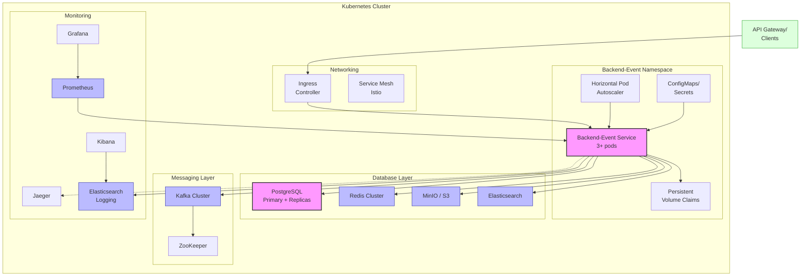

# Операции и инфраструктура микросервиса Backend-Event

> **Назначение документа:** описать инфраструктуру, развертывание, масштабирование и операционные процедуры микросервиса `backend-event`.

## 🏗️ Инфраструктура

### Компоненты инфраструктуры

Микросервис `backend-event` размещается в Kubernetes кластере и включает следующие инфраструктурные компоненты:

1. **Вычислительные ресурсы**
   - Контейнеры с приложением на основе Spring Boot
   - Оптимизированные JVM настройки для контейнеров
   - Минимум 3 реплики для высокой доступности

2. **Хранилища данных**
   - PostgreSQL — основная БД для транзакционных данных
   - Redis — для кэширования и распределенных блокировок
   - MinIO (S3-совместимое) — хранилище для медиафайлов
   - Elasticsearch — для полнотекстового поиска и аналитики

3. **Очереди сообщений**
   - Kafka — для асинхронной обработки и уведомлений
   - Основные топики: events, bookings, payments, notifications

4. **Сетевая инфраструктура**
   - Istio Service Mesh — управление трафиком и mTLS
   - Ingress Controller — маршрутизация внешнего трафика
   - Network Policies — сегментация и контроль доступа

5. **Мониторинг и логирование**
   - Prometheus — сбор метрик
   - Grafana — визуализация и дашборды
   - ELK Stack — централизованное логирование
   - Jaeger — распределенная трассировка

### Схема инфраструктуры



## 🚀 Деплой и обновления

### Стратегия развертывания

1. **CI/CD пайплайн**
   - Сборка Docker-образа при изменениях в `main` или релизном бранче
   - Автоматическое тестирование (unit, integration, e2e)
   - Автоматический деплой в dev, ручной запуск для prod

2. **Стратегия обновления**
   - Rolling update с постепенной заменой инстансов
   - Readiness probe для проверки готовности нового инстанса
   - Blue/Green deployment для критических обновлений
   - Canary deployment для тестирования на части трафика (5-10%)

3. **Откат изменений**
   - Автоматический откат при неуспешных health checks
   - Ручной откат через CI/CD панель
   - Backup-решение для восстановления данных

### Управление конфигурацией

1. **Конфигурационные параметры**
   - ConfigMaps для некритичных параметров
   - Secrets для чувствительных данных
   - Внешние хранилища секретов (Vault) для API ключей

2. **Переменные окружения по средам**
   - development — для разработки и тестирования
   - staging — среда, приближенная к production
   - production — промышленная эксплуатация

3. **Feature flags**
   - Управление функциональностью без деплоя
   - A/B тестирование новых возможностей
   - Постепенный rollout для минимизации рисков

## 📊 Масштабирование

### Горизонтальное масштабирование

1. **Kubernetes HPA (Horizontal Pod Autoscaler)**
   - Автоматическое масштабирование по CPU (порог 70%)
   - Масштабирование по пользовательским метрикам
   - Диапазон: min=3, max=20 подов

2. **Масштабирование БД**
   - Master-Replica архитектура PostgreSQL
   - Read-replicas для запросов на чтение
   - Шардирование для горизонтального масштабирования

3. **Масштабирование Kafka**
   - Увеличение числа брокеров и партиций
   - Автобалансировка при добавлении новых брокеров
   - Топики с высокой нагрузкой: events, bookings, payments

### Параметры производительности

1. **Ресурсные запросы и лимиты**

   | Ресурс | Requests | Limits | Примечание |
   |--------|----------|--------|------------|
   | CPU | 1 vCPU | 2 vCPU | Per pod |
   | Memory | 2 GB | 4 GB | Per pod |
   | Ephemeral Storage | 1 GB | 2 GB | Per pod |

2. **Настройки JVM**
   - Рекомендуемые параметры:
   ```
   -Xms2g -Xmx2g -XX:+UseG1GC -XX:MaxGCPauseMillis=200
   -XX:+HeapDumpOnOutOfMemoryError -XX:HeapDumpPath=/dumps
   ```

3. **Настройки БД**
   - Пул соединений: min=10, max=50
   - Параметры PostgreSQL:
   ```
   max_connections = 200
   shared_buffers = 4GB
   effective_cache_size = 12GB
   ```

## 🛡️ Отказоустойчивость

### Стратегии обеспечения высокой доступности

1. **Мультизональное размещение**
   - Распределение подов по разным зонам доступности
   - Anti-affinity правила для предотвращения сосредоточения
   - Multi-AZ для всех критичных компонентов

2. **Обработка сбоев**
   - Circuit Breaker для защиты от каскадных отказов
   - Retry механизмы с exponential backoff
   - Fallback стратегии для критичных операций

3. **Механизмы самовосстановления**
   - Health Checks для контроля состояния сервисов
   - Liveness/Readiness probes в Kubernetes
   - Автоматический перезапуск нездоровых подов

### Резервное копирование и восстановление

1. **Стратегия бэкапов**
   - Ежедневные полные бэкапы PostgreSQL
   - Непрерывное архивирование WAL (Write-Ahead Log)
   - Хранение бэкапов в течение 30 дней
   - Тестовое восстановление раз в неделю

2. **Репликация данных**
   - Синхронная репликация для критичных данных
   - Асинхронная репликация для остальных
   - Геораспределенная репликация между регионами

3. **RTO и RPO**
   - Recovery Time Objective (RTO): < 30 минут
   - Recovery Point Objective (RPO): < 5 минут

## 🔄 Операционные процедуры

### Мониторинг и алертинг

1. **Ключевые метрики**

   | Метрика | Пороговое значение | Действие |
   |---------|---------------------|----------|
   | CPU Usage | > 80% за 5 минут | WARNING |
   | CPU Usage | > 90% за 5 минут | CRITICAL |
   | Memory Usage | > 85% за 5 минут | WARNING |
   | Memory Usage | > 95% за 5 минут | CRITICAL |
   | 5xx Errors | > 1% запросов за 5 минут | WARNING |
   | 5xx Errors | > 5% запросов за 5 минут | CRITICAL |
   | Response Time | p99 > 500ms за 5 минут | WARNING |
   | Response Time | p99 > 1s за 5 минут | CRITICAL |
   | DB Connections | > 80% пула | WARNING |
   | Failed Jobs | > 0 за 15 минут | WARNING |

2. **Дашборды в Grafana**
   - Application Performance
   - System Resources
   - Business Metrics
   - Error Rates
   - SLA/SLO Tracking

3. **Алерты и эскалация**
   - Интеграция с PagerDuty/OpsGenie
   - Уровни критичности: INFO, WARNING, CRITICAL
   - Эскалация по матрице ответственности

### Логирование

1. **Структура логов**
   - JSON-формат для машинной обработки
   - Обязательные поля: timestamp, service, level, trace_id, message
   - Чувствительные данные маскируются или шифруются

2. **Уровни логирования**
   - ERROR — ошибки, требующие внимания
   - WARN — потенциальные проблемы
   - INFO — важные бизнес-события
   - DEBUG — детали для отладки (только в dev)
   - TRACE — максимальная детализация (только по запросу)

3. **Хранение и ротация**
   - Хранение в Elasticsearch: 30 дней
   - Архивирование важных логов: 1 год
   - Автоматическое удаление устаревших записей

### Управление инцидентами

1. **Классификация инцидентов**

   | Уровень | Описание | SLA на реакцию | SLA на решение |
   |---------|----------|----------------|----------------|
   | P1 | Полная недоступность сервиса | 15 минут | 2 часа |
   | P2 | Частичная деградация | 30 минут | 4 часа |
   | P3 | Некритичные ошибки | 2 часа | 1 день |
   | P4 | Косметические проблемы | 1 день | 7 дней |

2. **Процесс обработки инцидентов**
   - Обнаружение (автоматическое или ручное)
   - Назначение ответственного (on-call engineer)
   - Первичное реагирование и митигация
   - Расследование и устранение корневой причины
   - Postmortem-анализ для P1/P2 инцидентов

3. **Шаблоны для стандартных ситуаций**
   - Повышенная нагрузка: горизонтальное масштабирование
   - Недоступность БД: переключение на реплику
   - Проблемы с внешними API: fallback на кэш или упрощенную логику

## 🔒 Безопасность и соответствие требованиям

### Защита инфраструктуры

1. **Сетевая безопасность**
   - Изолированные сетевые сегменты (VPC/subnets)
   - Межсервисная коммуникация только через mTLS
   - Защита от DDoS на уровне Ingress и CDN

2. **Управление доступом**
   - RBAC для доступа к Kubernetes ресурсам
   - Принцип минимальных привилегий
   - MFA для критичных операций

3. **Сканирование уязвимостей**
   - Сканирование образов контейнеров при сборке
   - Регулярное сканирование инфраструктуры
   - Соответствие CIS Benchmarks

### Соответствие требованиям

1. **Защита данных**
   - Шифрование данных в покое (at-rest)
   - Шифрование данных при передаче (in-transit)
   - Управление ключами шифрования (KMS)

2. **Аудит и контроль**
   - Логирование всех действий администраторов
   - Неизменяемые (immutable) журналы аудита
   - Регулярные проверки доступа

3. **Соответствие регуляторным требованиям**
   - PCI DSS для платежных данных
   - GDPR для персональных данных
   - Локальные требования по хранению данных

## 📝 Документация и процедуры

### Руководства и чек-листы

1. **Руководство по деплою**
   - Шаги для запуска нового релиза
   - Проверки после деплоя
   - Процедура отката

2. **Чек-лист для подготовки к повышенной нагрузке**
   - Проверка настроек масштабирования
   - Пре-скейлинг ресурсов
   - Тестирование под нагрузкой

3. **Процедуры аварийного восстановления**
   - Восстановление из бэкапа
   - Переключение на резервную инфраструктуру
   - Коммуникация во время инцидента

### Runbooks для распространенных проблем

1. **Высокая нагрузка на БД**
   - Идентификация тяжелых запросов
   - Оптимизация индексов
   - Временные ограничения для нагруженных операций

2. **Повышенное время отклика API**
   - Анализ узких мест с помощью трассировки
   - Проверка внешних зависимостей
   - Оптимизация кэширования

3. **Проблемы с Kafka**
   - Проверка задержек потребителей
   - Балансировка партиций
   - Очистка старых сообщений 