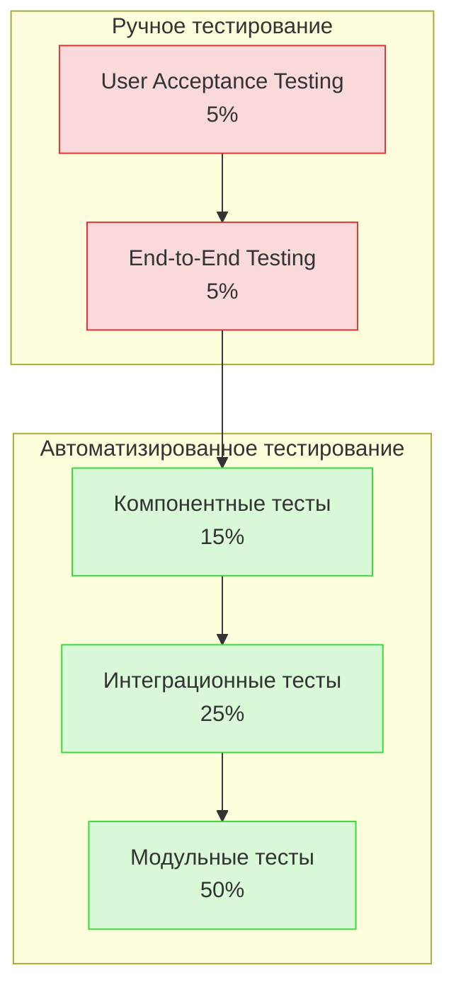

# Тестирование микросервиса Backend-Event

> **Назначение документа:** описать стратегию, подходы и практики тестирования микросервиса `backend-event`, включая автоматизированные тесты, тестовые окружения и процедуры приемки.

## 🎯 Стратегия тестирования

### Пирамида тестирования

Микросервис `backend-event` следует классической пирамиде тестирования с акцентом на нижние уровни для обеспечения качества и скорости обратной связи:



### Покрытие тестами

| Тип кода | Минимальное покрытие | Целевое покрытие | Инструмент |
|----------|----------------------|------------------|------------|
| Доменная модель | 90% | 95% | JaCoCo |
| Сервисный слой | 85% | 90% | JaCoCo |
| Репозитории | 80% | 90% | JaCoCo |
| Контроллеры/API | 80% | 90% | JaCoCo |
| Интеграционные компоненты | 75% | 85% | JaCoCo |
| Общее покрытие | 80% | 85% | SonarQube |

## 🧪 Типы тестов

### Модульные (Unit) тесты

**Назначение:** Тестирование отдельных компонентов в изоляции.

**Характеристики:**
- Быстрые (выполнение <100мс)
- Независимые от внешних сервисов
- Выполняются при каждой сборке
- Изолированность (без side-effects)

**Технологии:**
- JUnit 5
- Mockito 4.x
- AssertJ
- MockK (для Kotlin)

**Примеры:**

```java
@ExtendWith(MockitoExtension.class)
class EventServiceTest {
    @Mock
    private EventRepository eventRepository;
    
    @Mock
    private EventPublisher eventPublisher;
    
    @InjectMocks
    private EventServiceImpl eventService;
    
    @Test
    void shouldCreateEventInDraftStatus() {
        // Arrange
        EventCreateDto createDto = TestDataFactory.createEventDto();
        Event event = TestDataFactory.createEvent();
        when(eventRepository.save(any())).thenReturn(event);
        
        // Act
        EventDto result = eventService.createEvent(createDto);
        
        // Assert
        assertEquals(EventStatus.DRAFT, result.getStatus());
        verify(eventRepository).save(any());
        verify(eventPublisher).publishEventCreated(any());
    }
}
```

### Интеграционные тесты

**Назначение:** Тестирование взаимодействия компонентов и интеграции с внешними системами.

**Характеристики:**
- Средняя скорость (выполнение <1с)
- Тестирование реальных зависимостей
- Проверка корректности взаимодействия
- Изоляция тестовых данных

**Технологии:**
- Spring Boot Test
- Testcontainers
- WireMock
- Flyway для миграций тестовой БД

**Примеры:**

```java
@SpringBootTest
@Testcontainers
class EventRepositoryIntegrationTest {
    @Container
    static PostgreSQLContainer<?> postgres = new PostgreSQLContainer<>("postgres:14")
            .withDatabaseName("event_test")
            .withUsername("test")
            .withPassword("test");
    
    @DynamicPropertySource
    static void registerPgProperties(DynamicPropertyRegistry registry) {
        registry.add("spring.datasource.url", postgres::getJdbcUrl);
        registry.add("spring.datasource.username", postgres::getUsername);
        registry.add("spring.datasource.password", postgres::getPassword);
    }
    
    @Autowired
    private EventJpaRepository eventRepository;
    
    @Test
    void shouldFindEventsByCategory() {
        // Arrange
        EventEntity event1 = TestDataFactory.createEventEntity("category1");
        EventEntity event2 = TestDataFactory.createEventEntity("category1");
        EventEntity event3 = TestDataFactory.createEventEntity("category2");
        eventRepository.saveAll(Arrays.asList(event1, event2, event3));
        
        // Act
        List<EventEntity> result = eventRepository.findByCategoryId("category1");
        
        // Assert
        assertEquals(2, result.size());
    }
}
```

### Компонентные тесты

**Назначение:** Тестирование микросервиса как отдельного компонента через его API.

**Характеристики:**
- Медленные (выполнение <10с)
- Тестирование полного стека микросервиса
- Изоляция от других микросервисов (через моки)
- Проверка функциональных требований

**Технологии:**
- Spring Boot Test с WebTestClient
- gRPC Test Libraries
- Testcontainers для всех зависимостей
- WireMock для внешних API

**Примеры:**

```java
@SpringBootTest(webEnvironment = SpringBootTest.WebEnvironment.RANDOM_PORT)
@Testcontainers
class EventApiComponentTest {
    @Container
    static PostgreSQLContainer<?> postgres = new PostgreSQLContainer<>("postgres:14");
    
    @Container
    static KafkaContainer kafka = new KafkaContainer(DockerImageName.parse("confluentinc/cp-kafka:7.0.0"));
    
    @Container
    static RedisContainer redis = new RedisContainer(DockerImageName.parse("redis:6.2"));
    
    @LocalServerPort
    private int port;
    
    @Autowired
    private WebTestClient webTestClient;
    
    @Test
    void shouldCreateAndRetrieveEvent() {
        // Arrange
        EventCreateRequest request = TestDataFactory.createEventRequest();
        
        // Act - Create event
        EventResponse createdEvent = webTestClient.post()
                .uri("/api/v1/events")
                .bodyValue(request)
                .exchange()
                .expectStatus().isCreated()
                .expectBody(EventResponse.class)
                .returnResult()
                .getResponseBody();
        
        // Act - Get event
        EventResponse retrievedEvent = webTestClient.get()
                .uri("/api/v1/events/{id}", createdEvent.getId())
                .exchange()
                .expectStatus().isOk()
                .expectBody(EventResponse.class)
                .returnResult()
                .getResponseBody();
        
        // Assert
        assertEquals(createdEvent.getId(), retrievedEvent.getId());
        assertEquals(request.getTitle(), retrievedEvent.getTitle());
    }
}
```

### End-to-End тесты

**Назначение:** Тестирование всего приложения в контексте, максимально приближенном к производственному.

**Характеристики:**
- Очень медленные (выполнение >10с)
- Проверка бизнес-сценариев через реальные API
- Тестирование взаимодействия нескольких микросервисов
- Полное окружение, близкое к production

**Технологии:**
- Cucumber JVM
- RestAssured
- Selenide для UI тестов
- Docker Compose для всего окружения

**Примеры:**

```gherkin
Feature: Event Creation and Booking

  Scenario: User should be able to book a published event
    Given there is an organizer with account
    And the organizer creates an event with title "Yacht Trip"
    And the organizer publishes the event
    When a user searches for events with keyword "Yacht"
    Then the user should see the event "Yacht Trip" in search results
    When the user books a ticket for "Yacht Trip"
    And the user completes payment
    Then the booking status should be "CONFIRMED"
    And the event available seats should decrease by 1
```

### Нагрузочные и производительностные тесты

**Назначение:** Проверка производительности и способности системы выдерживать нагрузку.

**Характеристики:**
- Запускаются регулярно и перед релизом
- Имитация реальных пользовательских сценариев
- Измерение латентности, пропускной способности и стабильности
- Тестирование в изолированной среде

**Технологии:**
- JMeter / Gatling
- k6
- Prometheus для метрик
- Grafana для визуализации

**Тестовые сценарии:**

1. **Базовая нагрузка:**
   - 100 concurrent users
   - Смешанная нагрузка на чтение/запись (80/20%)
   - Проверка стабильности p99 < 500ms

2. **Пиковая нагрузка:**
   - Постепенное увеличение до 500 concurrent users
   - Проверка масштабирования и деградации
   - Метрики CPU, memory, connection pools

3. **Длительная нагрузка:**
   - 200 concurrent users в течение 4 часов
   - Проверка memory leaks и стабильности
   - Мониторинг ошибок и пропускной способности

### Безопасность и тесты на проникновение

**Назначение:** Проверка безопасности приложения и защиты от типичных уязвимостей.

**Характеристики:**
- Запускаются перед major релизами
- Фокус на OWASP Top 10
- Проверка уязвимостей API и аутентификации
- Выполняются специалистами по безопасности

**Технологии:**
- OWASP ZAP
- SonarQube Security Scanner
- Burp Suite
- Dependency check для уязвимостей библиотек

**Типичные проверки:**
- SQL Injection
- XSS уязвимости
- CSRF
- Broken authentication
- Sensitive data exposure
- Dependency vulnerabilities

## 🛠️ Тестовые окружения

### Локальное окружение разработчика

**Назначение:** Быстрая обратная связь для разработчиков.

**Характеристики:**
- Docker Compose для всех зависимостей
- Облегченные наборы данных
- Быстрый запуск и перезагрузка
- Интеграция с IDE

**Запуск:**
```bash
# Запуск зависимостей
docker-compose -f docker-compose.dev.yml up -d

# Запуск тестов
./gradlew test

# Запуск интеграционных тестов
./gradlew integrationTest
```

### CI/CD Pipeline

**Назначение:** Автоматическая проверка качества при разработке.

**Стадии:**
1. **Build & Unit Tests**
   - Компиляция кода
   - Запуск Unit тестов
   - Статический анализ кода

2. **Integration Tests**
   - Запуск интеграционных тестов
   - Testcontainers для зависимостей
   - Проверка контрактов API

3. **Component Tests**
   - Разворачивание полного микросервиса
   - Тестирование API
   - Проверка интеграций

4. **Нагрузочные тесты (по расписанию)**
   - JMeter/Gatling тесты
   - Анализ метрик производительности
   - Сравнение с бейзлайном

**Инструменты:**
- GitHub Actions / Jenkins
- SonarQube
- JaCoCo для покрытия кода
- Artifactory для хранения артефактов

### QA окружение

**Назначение:** Среда для тестировщиков и ручных проверок.

**Характеристики:**
- Полное окружение на Kubernetes
- Тестовые данные, близкие к production
- Доступ для тестировщиков и аналитиков
- Регулярное обновление из develop

**Компоненты:**
- Полный набор микросервисов
- Мониторинг и логирование
- Тестовые учетные записи
- Инструменты для инспекции API

### Staging окружение

**Назначение:** Среда для финальной валидации перед production.

**Характеристики:**
- Идентичная production архитектура
- Реальные внешние интеграции (в sandbox режиме)
- Обновление через release branches
- Автоматические и ручные регрессионные тесты

**Процедуры:**
- Smoke тесты после деплоя
- E2E тесты полных бизнес-сценариев
- UAT (User Acceptance Testing)
- Миграции данных и обратная совместимость

## 📝 Тестовые данные

### Стратегии управления тестовыми данными

1. **Изоляция тестов**
   - Отдельные схемы БД для тестов
   - Очистка после каждого теста
   - Независимые наборы данных

2. **Генерация данных**
   - Библиотеки: java-faker, DataFactory
   - Генерация больших объемов для нагрузочных тестов
   - Реалистичные паттерны данных

3. **Фикстуры и датасеты**
   - Предопределенные наборы для повторяемых сценариев
   - Версионирование тестовых данных
   - Совместное использование между тестами

### Тестовые пользователи

| Роль | Имя | Email | Пароль | Описание |
|------|-----|-------|--------|----------|
| Администратор | Андрей Админов | admin@aquastream.ru | test_admin | Полный доступ ко всем функциям |
| Организатор Премиум | Ольга Премиум | premium@aquastream.ru | test_org | Организатор с расширенными возможностями |
| Организатор Стандарт | Иван Стандартный | standard@aquastream.ru | test_org | Организатор с базовым доступом |
| Пользователь VIP | Мария VIP | vip@aquastream.ru | test_user | Пользователь с золотым статусом |
| Пользователь | Петр Обычный | user@aquastream.ru | test_user | Пользователь с базовыми привилегиями |
| Новый пользователь | Новичок | new@aquastream.ru | test_new | Только что зарегистрировавшийся |

## 🔄 Процессы тестирования

### Приемочное тестирование (UAT)

**Участники:**
- Команда разработки
- Продуктовая команда
- Представители бизнеса
- QA инженеры

**Процесс:**
1. Подготовка тестовых сценариев на основе требований
2. Настройка тестового окружения и данных
3. Проведение тестирования с документированием результатов
4. Классификация и приоритизация дефектов
5. Исправление критичных проблем
6. Подтверждение готовности к релизу

**Критерии приемки:**
- Все критичные функции работают корректно
- Производительность в пределах SLA
- Отсутствие блокирующих дефектов
- Успешное выполнение всех приемочных тестов

### Регрессионное тестирование

**Подход:**
- Автоматизированный набор регрессионных тестов
- Запуск перед каждым релизом
- Покрытие основных пользовательских сценариев
- Фокус на стабильности и обратной совместимости

**Ключевые области:**
- Создание и управление событиями
- Процесс бронирования и оплаты
- Отмена и перенос событий
- Работа с отзывами
- Избранное и уведомления

**Автоматизация:**
- CI/CD pipeline с регрессионными тестами
- Отчеты о покрытии и результатах
- Запуск в Staging окружении

### Исследовательское тестирование

**Цели:**
- Выявление неочевидных проблем и edge cases
- Проверка пользовательского опыта
- Улучшение качества и юзабилити

**Техники:**
- Сессионное тестирование (time-boxed sessions)
- Туры на основе таксономии тестирования
- Эвристики и чек-листы
- Мониторинг журналов и метрик

**Документирование:**
- Структурированные отчеты о сессиях
- Запись найденных проблем
- Предложения по улучшению

## 📊 Управление дефектами

### Процесс обработки дефектов

1. **Обнаружение и регистрация**
   - Описание проблемы
   - Шаги воспроизведения
   - Ожидаемый/фактический результат
   - Окружение и контекст

2. **Сортировка и приоритизация**
   - Серьезность (Severity): Blocker, Critical, Major, Minor, Trivial
   - Приоритет (Priority): High, Medium, Low
   - Компонент и влияние на бизнес

3. **Анализ и исправление**
   - Определение корневой причины
   - Создание ветки для исправления
   - Тесты для подтверждения исправления
   - Code review и соответствие стандартам

4. **Верификация**
   - Подтверждение QA
   - Проверка регрессии
   - Документирование решения

### Метрики качества

| Метрика | Целевой показатель | Частота измерения | Инструмент |
|---------|---------------------|-------------------|------------|
| Defect Density | < 0.5 дефектов на 1000 LOC | После релиза | Jira + SonarQube |
| Defect Leakage | < 10% | После релиза | Jira |
| Test Coverage | > 85% | Ежедневно | JaCoCo |
| Cyclomatic Complexity | < 15 | При сборке | SonarQube |
| Code Duplication | < 5% | При сборке | SonarQube |
| API Response Time | p95 < 300ms | Непрерывно | Prometheus |
| Bugs per Story Points | < 0.2 | После спринта | Jira |

## 🔍 Чек-листы тестирования

### Чек-лист для API

- [ ] Все эндпоинты возвращают ожидаемые HTTP коды
- [ ] Валидация входных данных работает корректно
- [ ] Ошибки возвращают информативные сообщения
- [ ] API соответствует OpenAPI/Protobuf спецификации
- [ ] Авторизация и аутентификация работают корректно
- [ ] Rate limiting и квоты настроены правильно
- [ ] Пагинация работает для больших наборов данных
- [ ] Специальные символы и Unicode обрабатываются корректно
- [ ] CORS настроен правильно для веб-клиентов
- [ ] API версионирование обеспечивает обратную совместимость

### Чек-лист для модуля бронирования

- [ ] Пользователь может создать бронирование на доступное событие
- [ ] Просроченные неоплаченные бронирования автоматически отменяются
- [ ] Оплаченные бронирования корректно подтверждаются
- [ ] Пользователь может отменить бронирование согласно политике
- [ ] Возврат средств обрабатывается по правилам возврата
- [ ] Блокировка мест предотвращает overselling
- [ ] Бронирования корректно обновляются при изменении события
- [ ] Уведомления отправляются на каждом этапе жизненного цикла
- [ ] История бронирований доступна пользователю
- [ ] Организатор видит список всех бронирований своего события

### Чек-лист для инфраструктуры

- [ ] Развертывание сервиса проходит успешно
- [ ] Health checks корректно отражают состояние сервиса
- [ ] Метрики собираются и отображаются в Prometheus/Grafana
- [ ] Логи централизованно собираются и индексируются
- [ ] Tracing работает для всех компонентов
- [ ] Сервис корректно восстанавливается после перезапуска
- [ ] Автомасштабирование работает при высокой нагрузке
- [ ] Резервное копирование и восстановление работают
- [ ] Миграции БД применяются корректно
- [ ] Circuit breaker срабатывает при недоступности зависимостей

## 🔐 Лучшие практики тестирования

1. **Shift Left Testing**
   - Начинать тестирование на ранних этапах разработки
   - Включать QA в планирование функций
   - Автоматизировать тесты параллельно с разработкой

2. **Автоматизация тестирования**
   - Автоматизировать повторяющиеся сценарии
   - Поддерживать тестовый код в таком же качестве, как и продуктовый
   - Включать тесты в CI/CD pipeline

3. **Тестирование безопасности**
   - Регулярное сканирование зависимостей
   - Применение OWASP рекомендаций
   - Мониторинг подозрительной активности

4. **Организация тестового процесса**
   - Четкие критерии готовности/завершения
   - Приоритизация тестирования на основе рисков
   - Непрерывное улучшение процесса тестирования

5. **Культура качества**
   - Командная ответственность за качество
   - Sharing knowledge и обучение
   - Празднование достижений в качестве 