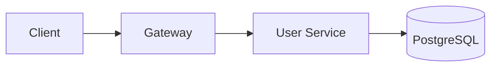

# AquaStream Documentation Guidelines

Этот документ описывает принципы, подходы и стандарты ведения документации в проекте AquaStream. Используй его как контрольный список для проверки соответствия документации установленным принципам.

## Философия Doc as Code

### Основные принципы

**1. Документация — это код**
- Документация хранится в Git вместе с кодом
- Применяются те же процессы: PR, code review, CI/CD
- Версионирование синхронизировано с кодом
- Используются те же инструменты разработки (IDE, grep, diff)

**2. Single Source of Truth**
- Одна версия истины для каждого факта
- Нет дублирования информации между файлами
- Cross-references вместо копирования
- Автогенерация из кода где возможно (OpenAPI, JavaDoc)

**3. Документация живет рядом с кодом**
- Модульная структура: `backend-*/docs/` для service-specific документации
- Общая документация: `docs/` для cross-cutting concerns
- Близость к коду повышает вероятность обновления

**4. Automation First**
- Автоматическая сборка через `make docs-build`
- Автогенерация API документации из OpenAPI спецификаций
- CI/CD проверки: broken links, markdown lint, spell check
- Deploy в GitHub Pages автоматически

**5. Доступность и поиск**
- Статический сайт через MkDocs + Material
- Full-text search
- Responsive design для мобильных устройств
- Permalink'и для стабильных ссылок

## Структура документации

### Корневая структура

```
docs/
├── index.md                    # Главная страница - "что это и зачем"
├── quickstart.md               # Быстрый старт (< 5 минут до первого запуска)
├── architecture.md             # High-level архитектура системы
├── backend/                    # Backend документация (по сервисам)
├── frontend/                   # Frontend документация
├── qa/                         # QA стратегия и тест-планы
├── api/                        # API документация (автогенерация из OpenAPI)
├── operations/                 # DevOps: infrastructure, deployment, CI/CD
├── business/                   # Бизнес-документация (требования, roadmap)
├── development/                # Developer guides (setup, workflows, style guides)
├── decisions/                  # Architecture Decision Records (ADR)
└── _internal/                  # Внутренние файлы (не публикуются)
    ├── docs-tools/             # Инструменты и скрипты
    ├── templates/              # Шаблоны для новой документации
    └── documentation-guidelines.md  # Этот файл
```

### Детальная структура директорий

#### backend/

Документация для каждого backend сервиса:

```
backend/
├── gateway/
│   ├── README.md              # Обзор Gateway (routing, CORS, rate limiting)
│   ├── api.md                 # API endpoints Gateway
│   └── operations.md          # Эксплуатация Gateway
├── user/
│   ├── README.md              # User Service overview
│   ├── api.md                 # REST API endpoints
│   ├── business-logic.md      # Domain логика (регистрация, JWT)
│   └── operations.md          # Service-specific operations
├── event/
│   ├── README.md              # Event Service overview
│   ├── api.md                 # Events API
│   ├── business-logic.md      # Бронирования, waitlist, capacity
│   └── operations.md          # Operations
├── crew/                      # Аналогично для Crew Service
├── payment/                   # Аналогично для Payment Service
├── notification/              # Аналогично для Notification Service
├── media/                     # Аналогично для Media Service
└── common/                    # backend-common библиотека
    ├── README.md              # Обзор backend-common
    ├── error-handling.md      # GlobalExceptionHandler, RFC 7807
    ├── rate-limiting.md       # Bucket4j, RateLimitFilter
    ├── metrics.md             # MetricsCollector, RedisMetricsWriter
    ├── web-utilities.md       # CorrelationId, фильтры, interceptors
    └── security.md            # Security utilities
```

**Правила для backend/**:

**Для сервисов (user/, event/, crew/, etc.):**
- Каждый сервис = отдельная папка с названием сервиса (lowercase)
- `README.md` обязателен для каждого сервиса (используй шаблон `backend-service-readme.md`)
- `api.md` для детального описания REST API (если не генерируется из OpenAPI)
- `business-logic.md` для сложной domain логики
- `operations.md` для service-specific операций (liquibase, troubleshooting)

**Для common/:**
- Документирует `backend-common/` - переиспользуемую библиотеку
- `README.md` - обзор структуры, автоконфигураций, зависимостей
- Отдельные файлы для каждой подсистемы (error-handling, metrics, rate-limiting)
- Примеры использования в application.yml
- Cross-references на общую backend документацию (authentication, database)

#### frontend/

```
frontend/
├── README.md                  # Frontend architecture overview
├── setup.md                   # Настройка frontend окружения
├── components/                # Документация React компонентов
│   ├── ui/                    # UI компоненты (Button, Input, Card)
│   │   ├── button.md
│   │   └── card.md
│   ├── forms/                 # Формы
│   └── layouts/               # Layout компоненты
├── pages/                     # Документация страниц
│   ├── dashboard.md
│   └── events.md
├── state-management.md        # Redux/Zustand
├── routing.md                 # Next.js routing
├── styling.md                 # Tailwind CSS, theme
└── testing.md                 # Frontend testing strategy
```

**Правила для frontend/**:
- Компоненты группируются по категориям (ui/, forms/, layouts/)
- Используй шаблон `frontend-component.md` для документации компонентов
- Страницы документируются отдельно в `pages/`

#### qa/

```
qa/
├── README.md                      # QA strategy overview (главная точка входа)
├── test-strategy.md               # Общая стратегия тестирования
├── bug-management.md              # Процесс управления дефектами
├── test-plans/                    # Тест-планы для компонентов
│   ├── backend-testing.md         # Backend testing plan
│   ├── frontend-testing.md        # Frontend testing plan
│   ├── integration-testing.md     # Integration testing plan
│   └── e2e-testing.md             # E2E testing plan
├── automation/                    # Автоматизация
│   ├── unit-tests.md              # Unit tests (JUnit, Vitest)
│   ├── api-tests.md               # API tests (Spring Boot Test, Testcontainers)
│   └── ui-tests.md                # UI tests (Playwright)
├── manual-testing/                # Ручное тестирование
│   ├── test-cases.md              # Тест-кейсы для критичной функциональности
│   ├── regression-suite.md        # Regression suite (чек-листы)
│   └── exploratory-testing.md     # Exploratory testing (session-based)
└── performance/                   # Performance testing
    ├── load-testing.md            # Нагрузочное тестирование (K6)
    └── performance-benchmarks.md  # Базовые показатели производительности
```

**Правила для qa/**:
- `README.md` - обязательный файл с overview всей QA документации и quick start
- `test-strategy.md` - единственный source of truth для стратегии тестирования
- `bug-management.md` - полный процесс управления дефектами (lifecycle, severity, priority)
- Тест-планы (`test-plans/`) организованы **по компонентам** (backend, frontend, integration, e2e), **НЕ по features**
- Используй шаблон `qa-test-plan.md` только для feature-specific тест-планов (если нужны)
- Automation docs описывают **типы тестов и инструменты**, а не конкретные тесты
- Manual testing docs содержат **чек-листы и процессы**, не результаты тестирования
- Performance docs включают **планы нагрузочного тестирования и baseline метрики**
- Результаты тестов храни в CI/CD artifacts и test reports, **НЕ в docs**
- Все файлы должны иметь YAML frontmatter (title, summary, tags)

#### api/

```
api/
├── index.md                   # Индекс всех API (таблица со ссылками)
├── specs/                     # OpenAPI спецификации (source)
│   └── root/                  # Все спецификации в одной директории
│       ├── backend-user-api.yaml
│       ├── backend-event-api.yaml
│       ├── backend-crew-api.yaml
│       ├── backend-payment-api.yaml
│       ├── backend-notification-api.yaml
│       ├── backend-media-api.yaml
│       ├── backend-gateway-admin-api.yaml
│       ├── backend-gateway-metrics-api.yaml
│       ├── frontend-api.yaml
│       ├── payment-webhook-api.yaml
│       ├── service-health-api.yaml
│       ├── telegram-bot-api.yaml
│       └── user-admin-api.yaml
├── redoc/                     # ReDoc HTML (для чтения)
│   └── root/
│       ├── backend-user-api.html
│       ├── backend-event-api.html
│       └── ... (остальные .html)
└── swagger/                   # Swagger UI HTML (для тестирования)
    └── root/
        ├── backend-user-api.html
        ├── backend-event-api.html
        └── ... (остальные .html)
```

**Правила для api/**:
- `index.md` - главная страница с таблицей всех API (модуль | спецификация | ReDoc | Swagger)
- OpenAPI specs в `specs/root/` (YAML формат) - **единственный source of truth**
- Автоматическая генерация **обоих** форматов через `make docs-api`:
  - **ReDoc** - для чтения и изучения API (компактный, трехколоночный layout)
  - **Swagger UI** - для интерактивного тестирования (Try it out, отправка запросов)
- **НЕ** пиши API документацию вручную, используй OpenAPI спецификации
- Каждый backend сервис должен иметь свою `.yaml` спецификацию
- HTML файлы генерируются автоматически, не редактируй их вручную
- См. [ADR-0003: API Documentation Strategy](../decisions/adr-002-api-documentation.md) для деталей

#### operations/

```
operations/
├── README.md                  # Operations overview
├── infrastructure.md          # Docker Compose, сервисы, volumes
├── deployment.md              # Процесс deployment, version management
├── ci-cd.md                   # GitHub Actions workflows
├── monitoring.md              # Prometheus, Grafana (если есть)
├── backup-recovery.md         # Backup стратегия
└── troubleshooting.md         # Общий troubleshooting
```

**Правила для operations/**:
- Инфраструктурные команды должны быть copy-paste ready
- Документируй Makefile команды
- Troubleshooting с примерами логов

#### business/

```
business/
├── README.md                  # Бизнес-документация overview
├── requirements/              # Функциональные требования
│   ├── user-management.md
│   └── event-booking.md
├── roadmap.md                 # Product roadmap
├── glossary.md                # Бизнес-глоссарий терминов
└── analytics.md               # Аналитика и метрики
```

**Правила для business/**:
- Документируй бизнес-требования, не технические решения
- Используй глоссарий для единообразия терминов

#### development/

```
development/
├── README.md                  # Development overview
├── setup.md                   # Детальная настройка окружения
├── workflows/                 # Git workflows, branching strategy
│   ├── git-workflow.md
│   └── code-review.md
├── style-guides/              # Code style guides
│   ├── java-style.md
│   ├── typescript-style.md
│   └── sql-style.md
├── debugging.md               # Debugging tips
└── tooling.md                 # IDE setup, plugins
```

**Правила для development/**:
- Практические руководства для разработчиков
- Setup инструкции должны работать на clean machine

#### decisions/

```
decisions/
├── README.md                  # ADR index
├── adr-001-microservices.md
├── adr-002-postgresql.md
├── adr-003-jwt-auth.md
└── adr-004-redis-cache.md
```

**Правила для decisions/**:
- Используй шаблон `adr-template.md`
- Нумерация: `adr-NNN-short-title.md` (3 цифры, zero-padded)
- README.md содержит список всех ADR с кратким описанием

#### _internal/

```
_internal/
├── documentation-guidelines.md  # Этот файл
├── templates/                   # Шаблоны документации
│   ├── README.md
│   ├── backend-service-readme.md
│   ├── adr-template.md
│   ├── frontend-component.md
│   └── qa-test-plan.md
└── docs-tools/                  # Скрипты и инструменты
    ├── link-checker.sh
    └── markdown-linter.sh
```

**Правила для _internal/**:
- Не публикуется в MkDocs (префикс `_`)
- Шаблоны всегда актуальны и соответствуют guidelines
- Инструменты должны быть executable

### Принципы организации

**По аудитории:**
- `development/` → разработчики (how to work)
- `operations/` → DevOps/SRE (how to deploy)
- `qa/` → QA engineers (how to test)
- `business/` → product managers, stakeholders

**По типу содержимого:**
- `backend/[service]/README.md` → overview сервиса
- `backend/[service]/api.md` → API endpoints
- `backend/[service]/business-logic.md` → domain logic
- `backend/[service]/operations.md` → service-specific operations

**По lifecycle:**
- `quickstart.md` → первые шаги (5 минут)
- `development/setup.md` → детальная настройка (30 минут)
- `operations/deployment.md` → production deployment

## Правила написания

### Структура документа

**YAML frontmatter** (опционально, для MkDocs):
```yaml
---
title: User Service
summary: Authentication and user management service
tags: [backend, microservice, authentication]
---
```

**Обязательные секции для service README:**
1. **Обзор** — что делает сервис, зачем нужен
2. **Технические характеристики** — порт, база данных, зависимости
3. **Быстрый старт** — команды для локального запуска
4. **API** — ссылка на api.md или OpenAPI spec
5. **Конфигурация** — environment variables, application.yml
6. **Troubleshooting** — частые проблемы и решения
7. **См. также** — ссылки на связанную документацию

### Язык и стиль

**Язык:**
- Основной язык: **русский**
- Технические термины: **английский** (API, endpoint, service, deployment)
- Названия технологий: **английский** (Spring Boot, PostgreSQL, Docker)
- Комментарии в коде: **английский**

**Стиль:**
- Активный залог: "Запустите сервис" вместо "Сервис запускается"
- Императив для инструкций: "Создайте файл", "Запустите команду"
- Краткость: убирай "лишние слова", оставляй факты
- Списки вместо текстовых блоков где возможно

**Примеры команд:**
```bash
# ✅ Хорошо: реальная команда через Makefile
make up-dev

# ❌ Плохо: абстрактная инструкция
# "Запустите development окружение"
```

### Форматирование

**Заголовки:**
- H1 (`#`) — только один, заголовок документа
- H2 (`##`) — основные секции
- H3 (`###`) — подсекции
- H4 (`####`) — детализация (избегай глубже)

**Код:**
- Используй fenced code blocks с языком: ` ```bash`, ` ```java`, ` ```yaml`
- Команды должны быть copy-paste ready
- Добавляй комментарии для сложных команд

**Ссылки:**
- Относительные ссылки для внутренних файлов: `[API](api.md)`
- Absolute links для внешних ресурсов: `[Spring Boot Docs](https://spring.io)`
- Якоря для секций: `[См. Deployment](#deployment)`

**Таблицы:**
- Используй для сравнений, спецификаций, матриц решений
- Выравнивай для читаемости в исходнике

**Диаграммы:**
- **Mermaid** для simple diagrams (architecture, sequence, flowcharts)
- **PlantUML** для сложных диаграмм (опционально)
- ASCII-art для простой визуализации

### Контент-паттерны

**Для команд и примеров:**
```bash
# Комментарий что делает команда
make up-dev

# Проверить результат
curl http://localhost:8080/actuator/health
```

**Для конфигурации:**
```yaml
# application.yml
spring:
  datasource:
    url: jdbc:postgresql://localhost:5432/aquastream  # Database URL
    username: ${DB_USER}                               # From environment
```

**Для troubleshooting:**
```markdown
### Проблема: Порт 8080 уже занят

**Симптомы:**
- `Address already in use: bind`
- Сервис не стартует

**Решение:**
1. Найти процесс: `lsof -i :8080`
2. Убить процесс: `kill -9 <PID>`
3. Или изменить порт в application.yml
```

## Шаблоны документации

### Доступные шаблоны

Все шаблоны находятся в `docs/_internal/templates/`:

1. **backend-service-readme.md** — для README backend сервисов
2. **frontend-component.md** — для React компонентов
3. **qa-test-plan.md** — для тест-планов
4. **adr-template.md** — для Architecture Decision Records

### Использование шаблонов

```bash
# Создать документацию нового сервиса
cp docs/_internal/templates/backend-service-readme.md docs/backend/new-service/README.md

# Заменить placeholders
sed -i 's/{Service Name}/New Service/g' docs/backend/new-service/README.md
sed -i 's/{service-name}/new-service/g' docs/backend/new-service/README.md
sed -i 's/{port}/8107/g' docs/backend/new-service/README.md
```

### Placeholders для замены

- `{Service Name}` → User Service
- `{service-name}` → user-service
- `{ComponentName}` → UserProfile
- `{port}` → 8101
- `{описание}` → конкретное описание

## Architecture Decision Records (ADR)

### Когда создавать ADR

**Создавай ADR для:**
- Решений, которые сложно изменить позже (БД, framework)
- Решений, влияющих на всю систему (authentication, messaging)
- Решений с неочевидными trade-offs (sync vs async)
- Решений, вызвавших споры в команде

**НЕ создавай ADR для:**
- Тривиальных решений (code style)
- Локальных изменений в одном модуле
- Решений, которые легко откатить

### Структура ADR

```markdown
# ADR-NNN: Короткий заголовок решения

- **Статус**: Proposed | Accepted | Deprecated | Superseded
- **Дата**: 2025-10-01
- **Автор**: @username

## Контекст
Опиши проблему и constraints

## Решение
Что решили делать

## Последствия
Позитивные и негативные

## Альтернативы
Что еще рассматривали и почему не выбрали
```

### Жизненный цикл ADR

- **Proposed** → обсуждается в PR
- **Accepted** → принято, используется
- **Deprecated** → устарело, но код еще работает
- **Superseded by ADR-XXX** → заменено новым ADR

**Важно**: ADR никогда не удаляются и не редактируются после Accepted. Создается новый ADR, который supersede старый.

## Технологический стек

### Инструменты

- **MkDocs** — генератор статического сайта из Markdown
- **Material for MkDocs** — тема с отличным UX
- **Python** — автоматизация, скрипты синхронизации
- **OpenAPI** — автогенерация API документации
- **Mermaid** — диаграммы в Markdown

### Команды

```bash
# Setup (первый раз)
make docs-setup         # Установить зависимости (Python venv)

# Development
make docs-serve         # Запустить dev сервер (http://localhost:8000)
make docs-build         # Собрать статический сайт в site/

# Quality checks (TODO)
make docs-lint          # Markdown lint
make docs-check         # Проверка broken links
```

## Процесс обновления документации

### Когда обновлять

**Обязательно:**
- При изменении API (endpoints, contracts)
- При добавлении нового сервиса/компонента
- При изменении deployment процесса
- При принятии архитектурного решения (ADR)

**Желательно:**
- При рефакторинге (если меняется структура)
- При добавлении новой фичи
- При исправлении багов (если это типичная проблема)

### Процесс через PR

1. **Создай ветку**: `git checkout -b docs/update-user-service`
2. **Обнови документацию** параллельно с кодом
3. **Проверь локально**: `make docs-serve`
4. **Создай PR** с пометкой `[docs]` в заголовке
5. **Code review** от команды (проверка на актуальность)
6. **Merge** → автодеплой в GitHub Pages

### Чеклист для PR

- [ ] Обновлены все связанные файлы (не только README)
- [ ] Добавлены примеры команд (copy-paste ready)
- [ ] Проверены cross-references (ссылки не битые)
- [ ] Запущен `make docs-serve` и все рендерится корректно
- [ ] Нет дублирования информации (используй cross-references)
- [ ] ADR создан если решение архитектурное

## Качество документации

### Критерии качества

**Хорошая документация:**
- ✅ **Актуальная** — соответствует текущему коду
- ✅ **Полная** — отвечает на все типичные вопросы
- ✅ **Краткая** — нет лишних слов, только факты
- ✅ **Структурированная** — легко найти нужное
- ✅ **Практичная** — примеры copy-paste ready
- ✅ **Связанная** — cross-references вместо дублирования

**Плохая документация:**
- ❌ Устаревшая (код изменился, документация нет)
- ❌ Дублирующая (одно и то же в разных местах)
- ❌ Абстрактная (без конкретных примеров)
- ❌ Монолитная (один огромный файл обо всем)
- ❌ Битые ссылки

### Метрики (TODO)

- Coverage: % API endpoints с документацией
- Freshness: дата последнего обновления файла
- Broken links: количество битых ссылок
- Orphan files: файлы без ссылок извне

## Антипаттерны и лучшие практики

### ❌ Антипаттерны

**1. Дублирование информации**
```markdown
<!-- ❌ Плохо: одна и та же информация в разных файлах -->
<!-- backend/user/README.md -->
JWT токены хранятся в Redis с TTL 1 час

<!-- backend/common/authentication.md -->
JWT токены хранятся в Redis с TTL 1 час
```

**2. Устаревшая документация хуже чем отсутствие**
```markdown
<!-- ❌ Плохо: документация не обновлена -->
# User Service runs on port 8100  <-- WRONG! Moved to 8101
```

**3. Абстрактные инструкции без примеров**
```markdown
<!-- ❌ Плохо -->
Настройте базу данных согласно требованиям проекта

<!-- ✅ Хорошо -->
```bash
# Создать базу данных
docker exec -it postgres createdb aquastream

# Применить миграции
make liq-user-update
```
```

**4. Монолитные файлы**
```markdown
<!-- ❌ Плохо: один README.md на 2000 строк -->
<!-- Вместо этого: README.md (overview) + api.md + business-logic.md + operations.md -->
```

### ✅ Лучшие практики

**1. Single Source of Truth + Cross-references**
```markdown
<!-- backend/common/authentication.md - SSOT для JWT -->
## JWT Configuration
- Token TTL: 1 hour
- Storage: Redis
- Algorithm: HS256

<!-- backend/user/README.md - ссылка на SSOT -->
Authentication использует JWT токены.
См. [Authentication Guide](../common/authentication.md) для деталей.
```

**2. Примеры реальных команд**
```bash
# ✅ Хорошо: команды через Makefile (версионированы с кодом)
make up-dev           # Запустить dev окружение
make logs             # Посмотреть логи
make smoke            # Health check
```

**3. Структурированность через заголовки**
```markdown
## Быстрый старт  ← для новичков (5 минут)

## Детальная настройка  ← для опытных (30 минут)

## Troubleshooting  ← когда что-то сломалось
```

**4. Диаграммы для сложных концепций**
```markdown
<!-- ✅ Хорошо: Mermaid для architecture -->

```

## Maintenance и рефакторинг

### Признаки что документация устарела

- [ ] Последний commit > 6 месяцев назад
- [ ] Команды не работают (changed API)
- [ ] Ссылки битые (файлы переименованы/удалены)
- [ ] Противоречия между файлами
- [ ] Нет информации о новых фичах

### Процесс рефакторинга

1. **Audit** — инвентаризация всех файлов
2. **Identify** — найти устаревшее, дублирующееся
3. **Plan** — определить целевую структуру
4. **Execute** — рефакторинг итерациями
5. **Validate** — проверить что все работает

### Временное хранилище

`docs/_internal/to_refactoring/` — для старой документации, которую нужно переработать:
- Не удаляй сразу, может быть полезная информация
- Добавь комментарий в начало файла: причина почему здесь
- Убери из MkDocs navigation
- Удали после переноса полезной информации

## Контрольный чеклист

Используй этот чеклист для проверки соответствия документации принципам:

### Для нового документа

- [ ] Создан из шаблона (если применимо)
- [ ] Placeholders заменены на реальные значения
- [ ] Есть YAML frontmatter (title, summary, tags)
- [ ] Структура соответствует типу документа
- [ ] Примеры команд copy-paste ready
- [ ] Диаграммы для сложных концепций (если нужно)
- [ ] Cross-references вместо дублирования
- [ ] Добавлен в MkDocs navigation (mkdocs.yml)

### Для обновления существующего

- [ ] Информация актуальна (соответствует коду)
- [ ] Нет противоречий с другими файлами
- [ ] Cross-references корректны (не битые ссылки)
- [ ] Примеры команд работают
- [ ] Дата последнего обновления обновлена (frontmatter)

### Для ADR

- [ ] Создан для значимого архитектурного решения
- [ ] Номер ADR следующий по порядку (adr-NNNN)
- [ ] Структура соответствует шаблону
- [ ] Статус указан (Proposed → Accepted)
- [ ] Добавлен в decisions/index.md

## См. также

- [ADR-001: Doc as Code Stack](../decisions/adr-001-docs-stack.md) — решение о выборе инструментов
- [ADR-002: API Documentation Strategy](../decisions/adr-002-api-documentation.md) — автогенерация API docs
- [Templates README](templates/README.md) — доступные шаблоны
- [MkDocs Documentation](https://www.mkdocs.org/) — официальная документация MkDocs
- [Material for MkDocs](https://squidfunk.github.io/mkdocs-material/) — тема и возможности