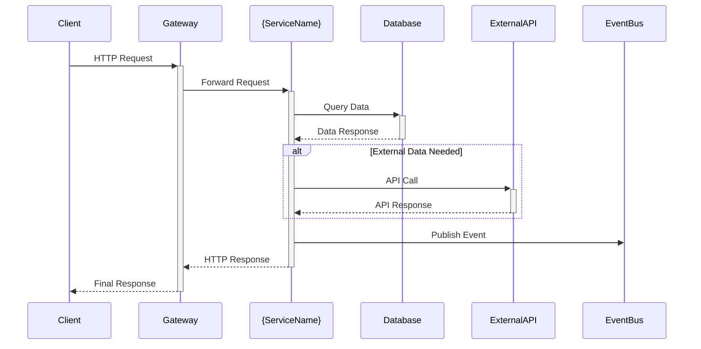

# Архитектура: {Название модуля/системы}

---
title: Architecture - {Название модуля/системы}
summary: Обзор архитектуры {краткое описание}: компоненты, интеграции, ключевые решения
tags: [architecture, {module-name}]
---

## Обзор

{Подробное описание роли модуля/системы в общей архитектуре AquaStream}

**Назначение:**
- {Основная бизнес-функция 1}
- {Основная бизнес-функция 2}
- {Основная бизнес-функция 3}

**Границы ответственности:**
- ✅ {Что входит в зону ответственности модуля}
- ✅ {Еще одна зона ответственности}
- ❌ {Что НЕ входит в зону ответственности}
- ❌ {Что делают другие модули}

## Компоненты

### Основные компоненты

| Компонент | Назначение | Технологии | Port/URL |
|-----------|------------|------------|----------|
| {ComponentName} | {Описание назначения} | Java 21, Spring Boot | 8XXX |
| {DatabaseName} | {Назначение БД} | PostgreSQL | 5432 |
| {ExternalService} | {Интеграция} | REST API | - |

### Архитектурная схема

```mermaid
graph TB
    subgraph "AquaStream {Module}"
        A[API Gateway] --> B[{Service Name}]
        B --> C[Business Logic]
        C --> D[Data Repository]
        D --> E[(PostgreSQL)]

        B --> F[External Clients]
        B --> G[Event Publisher]
        G --> H[Message Queue]
    end

    subgraph "External Dependencies"
        I[{External Service 1}]
        J[{External Service 2}]
        K[Monitoring]
    end

    F --> I
    F --> J
    B --> K
```

### Слоистая архитектура

```
┌─────────────────────────────────────┐
│         Presentation Layer          │  ← REST Controllers, Validation
├─────────────────────────────────────┤
│          Service Layer              │  ← Business Logic, Transactions
├─────────────────────────────────────┤
│         Repository Layer            │  ← Data Access, JPA Repositories
├─────────────────────────────────────┤
│          Domain Layer               │  ← Entities, Value Objects
└─────────────────────────────────────┘
```

## Интеграции

### Внутренние зависимости

**Synchronous (REST API):**
- **Gateway Service** → маршрутизация и аутентификация
- **User Service** → получение информации о пользователях
- **{Other Service}** → {описание взаимодействия}

**Asynchronous (Events):**
- **Event Bus** → публикация доменных событий
- **{Event Name}** → обработка событий от других сервисов

### Внешние зависимости

**Базы данных:**
- **PostgreSQL** (primary) → основное хранилище данных
- **Redis** (cache) → кэширование и сессии

**Внешние API:**
- **{External Service}** → {назначение интеграции}
- **{Payment Provider}** → обработка платежей
- **{Email Service}** → отправка уведомлений

### Схема взаимодействий



## Ключевые решения и компромиссы

### Архитектурные решения
- [ADR-XXX](../decisions/adr-xxx-microservices.md) - Переход на микросервисную архитектуру
- [ADR-YYY](../decisions/adr-yyy-database-choice.md) - Выбор PostgreSQL как основной БД
- [ADR-ZZZ](../decisions/adr-zzz-async-communication.md) - Event-driven архитектура

### Технологический стек

**Backend:**
```yaml
Language: Java 21
Framework: Spring Boot 3.x
Build Tool: Gradle
Database: PostgreSQL 15+
Caching: Redis (optional)
Messaging: {Kafka/RabbitMQ} (optional)
Testing: JUnit 5, TestContainers
```

**Обоснование выбора:**
- **Java 21** → производительность, экосистема, команда знает
- **Spring Boot** → быстрая разработка, автоконфигурация, интеграции
- **PostgreSQL** → ACID, производительность, JSON поддержка
- **Gradle** → гибкость сборки, performance

### Design Patterns

**Применяемые паттерны:**
- **Repository Pattern** → абстракция доступа к данным
- **Service Layer** → инкапсуляция бизнес-логики
- **Domain Events** → слабая связанность компонентов
- **DTO/Mapper** → изоляция слоев
- **Circuit Breaker** → устойчивость к сбоям внешних сервисов

## Data Model

### Основные сущности

```mermaid
erDiagram
    {ENTITY1} {
        uuid id PK
        string name
        timestamp created_at
        timestamp updated_at
    }

    {ENTITY2} {
        uuid id PK
        uuid entity1_id FK
        string description
        enum status
    }

    {ENTITY1} ||--o{ {ENTITY2} : "has many"
```

### Схема базы данных

**Основные таблицы:**
- `{table_name}` → {описание назначения}
- `{related_table}` → {описание связи}
- `{lookup_table}` → справочные данные

**Миграции:** `src/main/resources/db/migration/`

## Безопасность

### Механизмы защиты

**Authentication & Authorization:**
- JWT токены для аутентификации
- Role-based access control (RBAC)
- Method-level security с `@PreAuthorize`

**Data Protection:**
- Input validation на всех endpoints
- SQL injection protection через JPA/Hibernate
- XSS protection в web layer
- HTTPS обязателен в production

**Схема безопасности:**

```mermaid
graph LR
    Client --> TLS[HTTPS/TLS]
    TLS --> Gateway[API Gateway]
    Gateway --> JWT[JWT Validation]
    JWT --> RBAC[Role Check]
    RBAC --> Service[{Service Name}]
    Service --> Validation[Input Validation]
    Validation --> DB[(Secure DB)]
```

## Производительность и масштабирование

### Performance характеристики

**Целевые SLA:**
- Response time: <500ms (p95)
- Throughput: {X} requests/second
- Availability: 99.9% uptime
- Concurrent users: {X} пользователей

**Оптимизации:**
- **Database indexing** → ключевые запросы оптимизированы
- **Connection pooling** → HikariCP для эффективного использования соединений
- **Lazy loading** → JPA lazy relations для минимизации N+1 проблем
- **Caching strategy** → Redis/in-memory cache для часто запрашиваемых данных

### Горизонтальное масштабирование

```bash
# Масштабирование через Docker Compose
make scale-{service-name} REPLICAS=3

# Load balancing через nginx/HAProxy
upstream {service-name} {
    server {service-name}-1:8080;
    server {service-name}-2:8080;
    server {service-name}-3:8080;
}
```

## Мониторинг и наблюдаемость

### Метрики (Prometheus format)

**Business Metrics:**
- `{business_metric_name}_total` → бизнес-события
- `{user_actions}_duration_seconds` → время выполнения операций

**Technical Metrics:**
- `http_requests_total{method, status}` → HTTP метрики
- `jvm_memory_used_bytes` → использование памяти
- `database_connections_active` → активные соединения с БД

### Логирование

**Structured logging (JSON):**
```json
{
  "timestamp": "2024-01-01T12:00:00Z",
  "level": "INFO",
  "service": "{service-name}",
  "correlationId": "abc-123",
  "userId": "user-456",
  "event": "USER_ACTION_COMPLETED",
  "message": "User successfully performed action",
  "duration": 150
}
```

**Key events для мониторинга:**
- `SERVICE_STARTED` → сервис запущен
- `{BUSINESS_EVENT}` → важные бизнес-события
- `EXTERNAL_API_CALL` → вызовы внешних API
- `ERROR_OCCURRED` → ошибки требующие внимания

### Дашборды

- [Service Health](http://grafana.aquastream.org/d/{service-name})
- [Business Metrics](http://grafana.aquastream.org/d/{service-name}-business)
- [Performance](http://grafana.aquastream.org/d/{service-name}-performance)

## Развертывание

### Infrastructure as Code

```yaml
# docker-compose.yml
version: '3.8'
services:
  {service-name}:
    build: .
    ports:
      - "8080:8080"
    environment:
      - SPRING_PROFILES_ACTIVE=production
      - DATABASE_URL=jdbc:postgresql://db:5432/{db_name}
    depends_on:
      - db

  db:
    image: postgres:15
    environment:
      POSTGRES_DB: {db_name}
      POSTGRES_USER: ${DB_USER}
      POSTGRES_PASSWORD: ${DB_PASSWORD}
```

### Среды развертывания

| Environment | Purpose | Resources | URL |
|-------------|---------|-----------|-----|
| Local | Development | Docker Compose | localhost:8080 |
| Staging | Testing | 2 CPU, 4GB RAM | staging.aquastream.org |
| Production | Live | 4 CPU, 8GB RAM | api.aquastream.org |

### Deployment процесс

```bash
# CI/CD через GitHub Actions
make deploy-{service-name} ENV=production VERSION=1.2.3

# Health check после деплоя
make health-check SERVICE={service-name} ENV=production

# Rollback при проблемах
make rollback-{service-name} ENV=production VERSION=1.2.2
```

## Тестирование

### Стратегия тестирования

**Test Pyramid:**
```
    /\     E2E Tests (5%)
   /  \    ← Critical user journeys
  /____\   Integration Tests (15%)
 /      \  ← API contracts, DB interactions
/__________\ Unit Tests (80%)
             ← Business logic, edge cases
```

**Команды для запуска:**
```bash
# Unit тесты
make test-unit SERVICE={service-name}

# Integration тесты с TestContainers
make test-integration SERVICE={service-name}

# Contract тесты (API)
make test-contract SERVICE={service-name}
```

## Риски и ограничения

### Технические риски

| Риск | Вероятность | Влияние | Митигация |
|------|-------------|---------|-----------|
| Database bottleneck | Medium | High | Connection pooling, read replicas |
| External API unavailable | High | Medium | Circuit breaker, fallback logic |
| Memory leaks | Low | High | Monitoring, heap dumps, testing |

### Текущие ограничения

**Технические:**
- Single database instance (нет HA)
- Synchronous processing (может быть медленным)
- {Специфическое ограничение модуля}

**Бизнесовые:**
- {Бизнес-ограничение 1}
- {Бизнес-ограничение 2}

## Диаграммы

### Исходники диаграмм
Исходные файлы диаграмм находятся в `docs/_diagrams/{module-name}/`

### Экспортированные схемы
Готовые изображения в `docs/_media/diagrams/{module-name}/`

## См. также

- [Техническая документация](../backend/{module-name}/) → детали реализации
- [API Documentation](../api/) → документация REST API
- [Operations Runbook](../operations/{module-name}-runbook.md) → эксплуатация
- [Архитектурные решения](../decisions/) → ADR записи
- [Общая архитектура](../architecture.md) → high-level обзор системы
