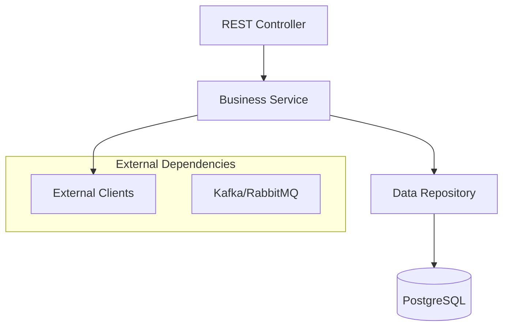

# {Service Name} Service

---
title: {Service Name} Service
summary: {Краткое описание сервиса в 1-2 предложения - что делает, за что отвечает}
tags: [backend, microservice, {domain}]
---

## Назначение

{Подробное описание назначения сервиса}

**Основные функции:**
- {Функция 1}
- {Функция 2}
- {Функция 3}

**Границы ответственности:**
- ✅ {Что входит в зону ответственности}
- ❌ {Что НЕ входит в зону ответственности}

## Техническая информация

**Конфигурация:**
- **Порт:** {8XXX}
- **База данных:** `{service_name}` schema в PostgreSQL
- **JVM:** OpenJDK 21
- **Spring Boot:** 3.x
- **Build tool:** Gradle

**Внешние зависимости:**
- {Dependency 1} - {назначение}
- {Dependency 2} - {назначение}

**Предоставляемые API:**
- REST API: `http://localhost:{port}/api/v1/{resource}`
- Health: `http://localhost:{port}/actuator/health`
- Metrics: `http://localhost:{port}/actuator/metrics`

## API

**Основные endpoints:**

| Method | Endpoint | Описание | Авторизация |
|--------|----------|----------|-------------|
| GET | `/api/v1/{resource}` | {Описание} | {Роль} |
| POST | `/api/v1/{resource}` | {Описание} | {Роль} |
| PUT | `/api/v1/{resource}/{id}` | {Описание} | {Роль} |
| DELETE | `/api/v1/{resource}/{id}` | {Описание} | {Роль} |

**Подробная документация:**
- [API Reference](api.md) - детальное описание всех endpoints
- [OpenAPI Spec](../../api/specs/root/{service-name}-api.yaml) - машиночитаемая спецификация
- [ReDoc Documentation](../../api/redoc/root/{service-name}-api.html) - интерактивная документация

## Архитектура

### Компоненты


### Ключевые решения
- [ADR-XXX](../../decisions/adr-xxx-decision-name.md) - {Описание решения}
- [ADR-YYY](../../decisions/adr-yyy-another-decision.md) - {Описание решения}

## Разработка

### Локальный запуск

**Требования:**
- Java 21+
- PostgreSQL (через Docker Compose)
- Make

**Команды Makefile:**
```bash
# Сборка всех модулей
make build

# Запуск инфраструктуры
make infrastructure-up

# Запуск конкретного сервиса
make {service-name}-run

# Запуск с профилем
make {service-name}-run PROFILE=dev

# Проверка работоспособности
make {service-name}-health
```

**Переменные окружения:**
```bash
DATABASE_URL=jdbc:postgresql://localhost:5432/{db_name}
DATABASE_USERNAME={username}
DATABASE_PASSWORD={password}
KAFKA_BOOTSTRAP_SERVERS=localhost:9092
LOG_LEVEL=DEBUG
```

### Тестирование

```bash
# Unit тесты
make {service-name}-test

# Integration тесты
make {service-name}-integration-test

# Все тесты модуля
make {service-name}-test-all

# API тесты через Postman/Newman
make {service-name}-api-test
```

### Схема базы данных

**Основные таблицы:**
- `{table_name}` - {описание}
- `{table_name_2}` - {описание}

**Миграции:** `src/main/resources/db/migration/`

## Эксплуатация

### Мониторинг

**Ключевые метрики:**
- `http_requests_total` - количество HTTP запросов
- `http_request_duration_seconds` - время ответа
- `jvm_memory_used_bytes` - использование памяти
- `database_connections_active` - активные соединения с БД

**Дашборды:**
- [Service Dashboard](http://grafana.aquastream.org/d/{service-name}) - основные метрики сервиса
- [Business Metrics](http://grafana.aquastream.org/d/{service-name}-business) - бизнес метрики

### Алерты

| Alert | Threshold | Severity | Action |
|-------|-----------|----------|--------|
| High Error Rate | >5% errors | Critical | Проверить логи, откатить если нужно |
| High Response Time | >2s p95 | Warning | Анализ производительности |
| DB Connection Pool | >80% usage | Warning | Проверить long-running queries |

### Логи

**Ключевые события:**
- `SERVICE_STARTED` - сервис запущен
- `API_REQUEST` - входящий HTTP запрос
- `BUSINESS_EVENT` - важное бизнес-событие
- `ERROR_OCCURRED` - ошибка в обработке

```bash
# Просмотр логов
make logs-{service-name} ENV=production

# Фильтрация по уровню
make logs-{service-name} ENV=production | jq 'select(.level=="ERROR")'
```

## Операции

### Деплой и управление
```bash
# Деплой
make deploy-{service-name} ENV=staging
make deploy-{service-name} ENV=production

# Откат
make rollback-{service-name} ENV=production VERSION=previous

# Масштабирование
make scale-{service-name} ENV=production REPLICAS=3
```

## Troubleshooting

### Частые проблемы

**Сервис не стартует:**
```bash
# Проверить логи запуска
make logs-{service-name} ENV=production

# Проверить health endpoint
make {service-name}-health
```

**Медленные запросы:**
```bash
# Анализ медленных SQL запросов
make db-slow-queries SERVICE={service-name}
```

**Проблемы с памятью:**
```bash
# JVM heap dump
make {service-name}-heap-dump ENV=production
```

## См. также

- [Business Logic](business-logic.md) - детальное описание бизнес-логики
- [Operations Guide](operations.md) - расширенное руководство по эксплуатации
- [Changelog](changelog.md) - история изменений сервиса
- [API Documentation](../../api/) - сводная документация по всем API
- [Architecture Overview](../../architecture.md) - общая архитектура системы