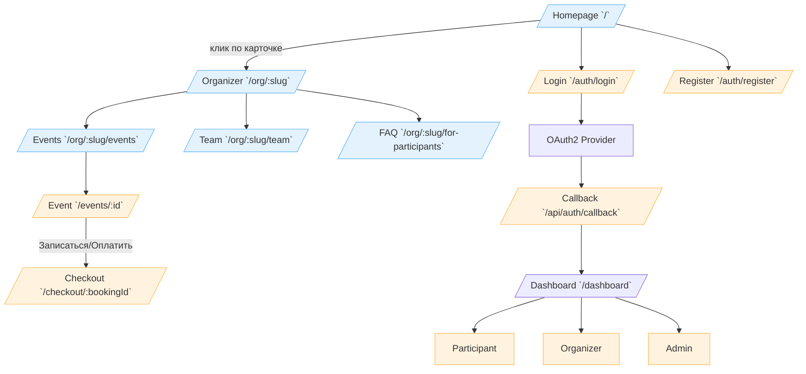

# AquaStream — бизнес‑постановка v1.1 (MVP)

---

## 1. Назначение и контекст
AquaStream — агрегатор коммерческих мероприятий. Платформа позволяет:
- Пользователям искать организаторов и их события, записываться и оплачивать участие.
- Организаторам вести бренд‑страницу, публиковать события, управлять экипажами/размещением и подтверждать оплаты.
- Администраторам управлять ролями и модерацией.

Архитектура — микросервисная; бэкенд в стадии архитектуры и будет дорабатываться «от потребностей фронта». Инфраструктура — в модуле `/infra` (Docker/Compose, профили dev/prod), CI/CD — в `.github/workflows`.

## 2. Цели продукта
- Единый каталог организаторов и их событий.
- Удобная запись и оплата участия (виджет эквайринга + QR с ручным подтверждением).
- Командообразование (экипажи/лодки/палатки) на уровне события.
- Telegram‑уведомления (обязательные/опциональные).
- Быстрый, современный, адаптивный интерфейс с тёмной и светлой темами.

## 3. Роли и права (RBAC)
- **Гость** — просмотр публичных страниц, регистрация.
- **Участник** — профиль, избранное, запись/оплата, настройки уведомлений.
- **Организатор** — бренд‑страница, CRUD событий, подтверждение оплат, экипажи/палатки.
- **Админ** — роли и модерация.

## 4. Область MVP
Включено:
- Публичный каталог и страницы организатора/события (поиск/фильтры).
- Регистрация (username+password), вход, восстановление доступа.
- Профиль участника (телефон, Telegram, доп. поля) — обязателен для записи/прав организатора.
- Бронирование, **оплата через виджет эквайринга** (YooKassa/CloudPayments/Stripe) и **QR** (ручная модерация).
- ЛК организатора: бренд, команда, FAQ, события (черновик → предпросмотр → публикация), подтверждение оплат.
- Экипажи/лодки/палатки — простые списки без dnd.
- Telegram‑уведомления: обязательные (оплата/напоминания), опциональные (слоты/новости).
- Тёмная/светлая тема, адаптив web+mobile.

Вне MVP (Roadmap): автораскладка команд, расширенная аналитика, email‑канал, сложные биллинговые сценарии.

## 5. Пользовательские сценарии (кратко)
- **Гость:** главная → организатор → событие → регистрация.
- **Участник:** регистрация → заполнение профиля → бронь → оплата (виджет/QR) → уведомления.
- **Организатор:** права от админа → бренд‑страница → событие → подтверждение оплат → экипажи/палатки.
- **Админ:** RBAC, модерация.

## 6. Страницы и маршруты
- `/` — главная (каталог организаторов, поиск).
- `/org/[orgSlug]` — главная организатора (инфо + ближайшие события).
- `/org/[orgSlug]/events` — список (прошедшие/ближайшие/планируемые) + фильтры.
- `/org/[orgSlug]/team` — команда.
- `/org/[orgSlug]/for-participants` — FAQ.
- `/events/[eventId]` — карточка события (запись, оплата).
- `/auth/login`, `/auth/register`, `/auth/recovery` — аутентификация/восстановление.
- `/dashboard` — роль‑зависимый кабинет (участник/организатор/админ).
- `/checkout/[bookingId]` — подтверждение оплаты (виджет/QR).

## 7. Поиск и фильтрация
- Главная: поиск по названию организатора.
- События организатора: статус, период дат, поиск по тексту, цена, вместимость.

## 8. Оплата (MVP)
Методы:
- **Виджет эквайринга**: стартово YooKassa Widget (альтернативы — CloudPayments/Stripe Checkout). Вебхук → обновление статуса брони.
- **QR на счёт организатора**: загрузка пруфа, ручная модерация организатором.

Поток: Event → Booking (`pending`) → страница оплаты (виджет/QR) → подтверждение (вебхук/модерация) → статус `paid/rejected` → уведомление.

### Платежи и вебхуки (dev)

- Компоненты: виджет — `components/checkout/PaymentWidget.tsx`, QR — `components/checkout/QrSection.tsx`, страница — `app/(routes)/checkout/[bookingId]/page.tsx`.
- Dev эндпоинты (моки):
  - `POST /api/bookings` — создание брони → `{ id }`
  - `GET /api/bookings/:id` — детали брони
  - `POST /api/payments/qr` — приём пруфа по QR → статус `submitted`
  - `POST /api/webhooks/payment/:provider` — вебхуки провайдеров (`yookassa|cloudpayments|stripe`) → статусы `succeeded|canceled`
  - `POST /api/payments/webhook` — универсальный мок вебхука (dev)

### Модерация оплат (организатор)

- Очередь: `GET /api/organizer/moderation/queue` — возвращает заявки в статусе `submitted` (при отсутствии — автосид фиктивных заявок).
- Действия: `PATCH /api/organizer/moderation/queue` body `{ id, action: "accept"|"reject", comment? }`.

### Примечания (dev)

- Состояние хранится in‑memory: `shared/bookings-store.ts`.
- Для SSR используйте абсолютный origin: `NEXT_PUBLIC_API_BASE_URL` или порт dev‑сервера.

## 9. Уведомления (Telegram)
Категории: обязательные (payment status, reminders), опциональные (слоты/новости). В профиле — управление опциональными подписками.

## 10. Командообразование
Сущности: `Crew`, `Boat`, `TentGroup`, `CrewAssignment`, `TeamPreference`, `Waitlist`.  
Функции MVP: CRUD простых списков, ручное назначение участников, waitlist и уведомление при освобождении мест.

## 11. Модели данных (логические)
- **Organizer**: id, slug, name, logoUrl, description, contacts, brandColor?
- **Event**: id, organizerId, type, title, dateStart, dateEnd?, location, price, capacity, available, coverUrl?, shortDescription, tags[]
- **TeamMember**: id, organizerId, name, role, photoUrl?, bio?
- **FaqItem**: id, organizerId, question, answer
- **UserProfile**: id, username, role, phone?, telegram?, isTelegramVerified?, extra?
- **Booking**: id, eventId, userId, status(draft|pending|paid|rejected|canceled), amount, createdAt
- **PaymentReceipt**: id, bookingId, method('widget'|'qr_manual'), proofUrl?, providerPayload?, status(submitted|accepted|rejected|succeeded|canceled), reviewedBy?, reviewedAt?
- **Crew**: id, eventId, name, capacity, members: CrewAssignment[]
- **CrewAssignment**: userId, crewId, seat?, notes?
- **Boat**: id, eventId, type, capacity, name
- **TentGroup**: id, eventId, name, capacity, members: string[]
- **TeamPreference**: userId, eventId, prefersWithUserIds?, avoidsUserIds?, sleepPreference?
- **Waitlist**: id, eventId, userId, priority, createdAt
- **Favorite**: userId, eventId
- **NotificationPreference**: userId, category(payment|slots|reminders|news), required, subscribed
- **TelegramVerification**: userId, telegram, verifiedAt
- **AuditLog**: id, actorUserId, action, targetType, targetId, payload, createdAt

## 12. Требования к UI/UX
Стек: **Next.js 15**, **React 19**, **TypeScript strict**, **Tailwind v4**, **shadcn/ui** (Radix).  
Темизация: **Tangerine**, светлая/тёмная через `next-themes`.  
Адаптив: web + mobile. Без кастомных CSS — только Tailwind и компоненты shadcn/ui.  
Состояния: Skeleton/Empty/Alert/Toast; `data-test-id` на ключевых элементах.

## 13. Карта UI‑компонентов (shadcn/ui)
- **Навигация:** `NavigationMenu`, `DropdownMenu`, `Breadcrumb`, `Pagination`, `Menubar`, `Tabs`, `Sidebar` (шаблон), `Command` (Cmd‑K/поиск).
- **Формы:** `Form`, `Input`, `Textarea`, `Select`, `Checkbox`, `RadioGroup`, `Switch`, `Label`, `Calendar` + `Popover` (DatePicker), `Tooltip`.
- **Данные:** `Card`, `Table`, `Badge`, `Avatar`, `Separator`, `ScrollArea`, `Skeleton`, `Progress`, `Carousel` (Embla), `Resizable` (панели).
- **Оверлеи:** `Dialog`, `Sheet` (моб. меню), `AlertDialog`, `HoverCard`.
- **Уведомления:** `Sonner` (toasts).

> Примечание: `DatePicker` — рецепт на базе `Calendar` + `Popover`; `DataTable` — рецепт на `Table` + TanStack Table. `Toast` (legacy) не используем — вместо него `Sonner`.

## 14. Технический стек и стандарты
- **Node.js 22 LTS**, **pnpm**, Docker base `node:22-alpine`.
- **Next.js 15 (App Router, RSC/ISR, Route Handlers)**, **React 19**.
- **TypeScript** strict, **ESLint 9 (flat)**, **Prettier 3**.
- **Tailwind v4**, shadcn/ui (Radix), **next-themes**.
- **RHF + Zod** (единая платформа форм), **lucide-react**.
- **MSW** (dev: SSR/RSC через instrumentation + браузер), dev API route handlers.
- **Sentry** (prod only), **Playwright** (e2e smoke).
- **OAuth2** как основной механизм аутентификации (см. Безопасность и ENV).

## 15. Рендеринг и кеширование
- Публичные страницы — **SSG + ISR** (60 сек), revalidate‑теги на мутациях.
- Карточка события — **SSR** (актуальные места/цена) + клиентский refetch.
- Кабинеты/админ — **SSR** с роль‑гардами.

## 16. Безопасность и сессии
- Аутентификация: **OAuth2** (Authorization Code) через провайдера. Callback в фронт → установка **HttpOnly Secure** cookie (`sid`, роль), **SameSite=Lax**.
- Авторизация: **RBAC** (middleware), страница 403 при отсутствии прав, скрытие недоступных действий.
- CSRF: для небезопасных методов — `X-CSRF-Token` (для форм/мутаций вне OAuth2‑редиректов).
- Заголовки безопасности (CSP/HSTS/Referrer‑Policy/X‑Frame‑Options) через `next.config.ts` (prod).
- Валидация входящих/исходящих данных — `zod`.

## 17. Docker/Infra
- **dev:** порт **3100**, `NEXT_PUBLIC_USE_MOCKS=true`, MSW включён; volume с кодом.
- **prod:** порт **3000**, `NEXT_PUBLIC_USE_MOCKS=false`, сборка `output: 'standalone'`.
- `/backend-infra/docker/compose/docker-compose.yml`: сервисы `frontend-dev` (profile=dev) и `frontend` (profile=prod).

Запуск c моками локально (без Docker):

```bash
NEXT_PUBLIC_USE_MOCKS=true NEXT_PUBLIC_API_BASE_URL=http://localhost:3101 PORT=3101 pnpm dev
```

## 18. CI/CD (GitHub Actions)
PR: install → lint → typecheck → build → (опц.) e2e smoke (Playwright).  
main: docker buildx → push → deploy (инфра‑скрипты).

## 19. Окружения и ENV (frontend)
- `NEXT_PUBLIC_APP_ENV=dev|prod`
- `NEXT_PUBLIC_API_BASE_URL`
- `NEXT_PUBLIC_USE_MOCKS=true|false`
- `PAYMENTS_PROVIDER=yookassa|cloudpayments|stripe`
- `PAYMENTS_PUBLIC_KEY` (если нужен для виджета)
- `PAYMENTS_SUCCESS_URL`, `PAYMENTS_CANCEL_URL`
- `NEXT_PUBLIC_TELEGRAM_BOT_NAME`
- `NEXT_PUBLIC_SENTRY_DSN` (prod)
  
  OAuth2:
  - `OAUTH2_AUTH_URL`, `OAUTH2_TOKEN_URL`
  - `OAUTH2_CLIENT_ID`, `OAUTH2_CLIENT_SECRET`
  - `OAUTH2_REDIRECT_URI` (e.g. `http://localhost:3000/api/auth/callback`)

> SSR/RSC мок‑сервис инициализируется в `frontend/instrumentation.ts` (MSW Node `server.listen()`), браузерные моки — через `src/mocks/browser.ts` и `components/msw-provider.tsx`. Основные хэндлеры — `src/mocks/handlers.ts` (универсальные any‑origin паттерны).


## 21. Диаграмма маршрутов (Mermaid)


## 22. Матрица RBAC
| Операция | Гость | Участник | Организатор | Админ |
|---|:---:|:---:|:---:|:---:|
| Просмотр публичных страниц | ✔️ | ✔️ | ✔️ | ✔️ |
| Регистрация / Вход | ✔️ | ✔️ | ✔️ | ✔️ |
| Заполнение профиля |  | ✔️ | ✔️ | ✔️ |
| Избранное |  | ✔️ | ✔️ | ✔️ |
| Создание брони |  | ✔️ | ✔️ | ✔️ |
| Оплата (виджет/QR) |  | ✔️ | ✔️ | ✔️ |
| Загрузка пруфа оплаты |  | ✔️ | ✔️ | ✔️ |
| Подтвердить/отклонить оплату |  |  | ✔️ | ✔️ |
| CRUD бренда/команды/FAQ |  |  | ✔️ | ✔️ |
| CRUD событий (черновик/публикация) |  |  | ✔️ | ✔️ |
| Экипажи/палатки |  |  | ✔️ | ✔️ |
| Управление ролями |  |  |  | ✔️ |
| Модерация контента/оплат |  |  |  | ✔️ |

## 23. Бэкенд‑бэклог (по сервисам)
- **API Gateway:** прокси, CORS, cookies, rate‑limit, secure routes для фронта.
- **User:** register/login/logout, `/me`, профиль (phone/telegram/extra), роли; recovery через Telegram/резервные коды; аудит.
- **Event:** организаторы (поиск/детали/CRUD), события (поиск/детали/CRUD, черновик→публикация), избранное.
- **Crew:** экипажи/лодки/палатки, назначения участников, waitlist; gRPC для bulk‑операций (позже).
- **Booking/Payment:** `POST /bookings`, `GET /bookings/:id`; провайдер‑виджет (intent → webhook); QR‑файлы (proof) + модерация.
- **Notification:** настройки подписок, рассылка в Telegram (Kafka топики `payment.status`, `event.reminder`, `event.spots`).
- **Media/File:** presigned‑URLs для лого/фото/пруфов (S3‑совместимое).
- **Common:** OpenAPI/Proto, enum’ы, миграции PostgreSQL, AuditLog.

## 24. Дополнительные бэкенд‑сервисы (минимально)
- **Payment Adapter** (обёртка над YooKassa/CloudPayments/Stripe, вебхуки, нормализация статусов).
- **Media/File Service** (S3, presigned‑URLs).
- **Webhook Processor** (валидация, ретраи, идемпотентность).  
*(Search/Analytics — позже, вне MVP.)*

## 25. Критерии приемки MVP
- Публичные страницы доступны, поиск/фильтры работают (SSR/SSG/ISR по плану).
- Регистрация/вход; без заполненного профиля запись запрещена (UI‑гейт + 403).
- Бронь создаётся; оплата через виджет завершает бронь в `paid`; QR‑пруф модерацией переводит в `paid/rejected`.
- Телеграм‑уведомления приходят по событиям оплаты/напоминаний.
- Организатор создаёт/публикует событие, редактирует бренд/команду/FAQ, управляет составом.
- Тёмная/светлая тема, адаптив, базовый A11y; `data-test-id` присутствуют.
- CI собирает проект; Docker‑сервисы запускаются из `/infra` профилями.

## 26. Ограничения MVP
- Без drag‑and‑drop в конструкторе экипажей.
- Один платёжный провайдер (по умолчанию YooKassa) и один webhook.
- Без сторибука и сложных биллингов.


## 28. Паттерны и принципы
- MVP и прагматичность: никакого оверинженеринга
- Единый слой данных (`serverFetch`/`clientRequest`) и единые состояния ошибок
- SSR/SSG/ISR по плану; revalidate‑теги при мутациях
- Формы — RHF+Zod, унифицированные поля и ошибки
- UI — Tailwind v4 + shadcn/ui; без кастомных CSS
- A11y — Radix‑паттерны; `focus-visible`, ловушки фокуса
- Тестирование — `data-test-id` на ключевых элементах; Playwright smoke
- Наблюдаемость — Sentry (prod), глобальный error boundary
- Ручная модерация оплат увеличивает нагрузку на организаторов.
- Telegram/файловое хранилище могут вносить задержки.
- Автораскладка команд отложена — нужно явно коммуницировать ожидания.

---

## Приложение B — Моки (MSW)

- SSR/RSC инициализация: `frontend/instrumentation.ts` (MSW Node `server.listen()`), включается при `NEXT_PUBLIC_USE_MOCKS=true`.
- Браузер: `src/mocks/browser.ts` + `components/msw-provider.tsx` (ленивый старт, `onUnhandledRequest: 'bypass'`).
- Хэндлеры: `src/mocks/handlers.ts` (any‑origin), а также dev API‑роуты `app/api/**`.
- Запуск с моками: `pnpm dev:mocks` (внутри проставляет `NEXT_PUBLIC_USE_MOCKS=true`; при необходимости можно дополнять `NEXT_PUBLIC_API_BASE_URL`).
- Режим без моков: `pnpm dev`. В этом случае запросы уходят на реальный API, и fallback-данные (например, список организаторов на главной) не подставляются — страница остаётся пустой, пока не ответит бэкенд.

- Основные мок‑эндпоинты:
  - Организатор: `/organizers`, `/organizers/:slug`, `/organizers/:slug/events`
  - Профиль: `/api/profile`
  - Панель организатора: `/api/organizer/*` (brand/team/faq/events)
  - Бронирования/оплаты: `/api/bookings`, `/api/payments/*`, `/api/webhooks/payment/:provider`
  - Модерация оплат: `/api/organizer/moderation/queue`
  - Группы/участники: `/api/organizer/events/:id/(groups|participants)`
  - Лист ожидания: `/api/events/:id/waitlist`
