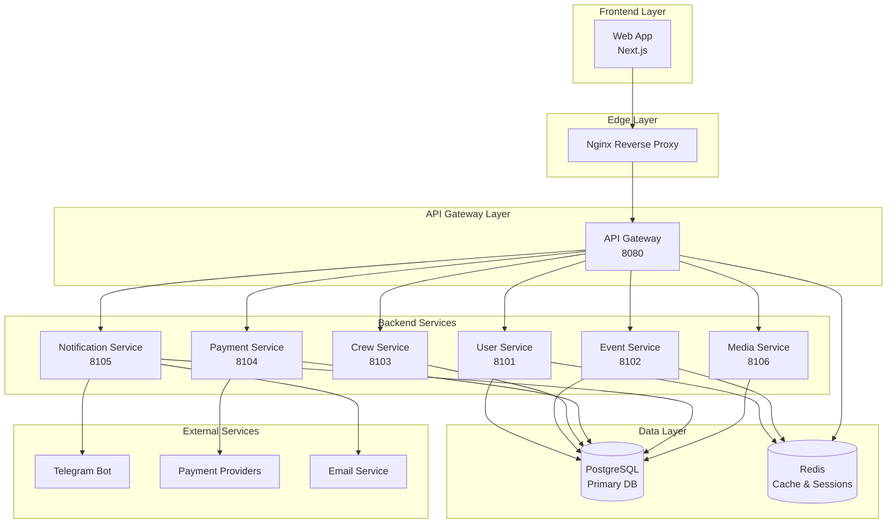

# Архитектура AquaStream

## Обзор

AquaStream - система управления водными мероприятиями, построенная на модульной архитектуре с четким разделением ответственности.

| Аспект | Описание |
|--------|----------|
| **Назначение** | Управление водными мероприятиями (сплавы, походы, туры), бронирование, экипажи, платежи, уведомления |
| **Архитектура** | Микросервисы с API Gateway, schema-per-service PostgreSQL, Redis кэш |
| **Границы ответственности** | ✅ Бизнес-логика водных мероприятий<br>✅ API для frontend/mobile<br>✅ Интеграции с платежными провайдерами<br>✅ Уведомления (Telegram, Email) |

## Архитектурная схема



## Модули системы

| Сервис | Порт | Тип | Назначение | База (схема) | Внешние интеграции |
|--------|------|-----|------------|--------------|-------------------|
| **Nginx** | 80/443 | Edge | TLS termination, CORS, базовый rate limiting, статика, health-check | - | - |
| **Gateway** | 8080 | Gateway | Валидация JWT, X-User-Id/X-User-Role, прикладной rate limiting, health aggregation | - | - |
| **User** | 8101 | Core | Аутентификация, профили, роли, RBAC | `user` | - |
| **Event** | 8102 | Core | События, организаторы, бронирования, waitlist | `event` | - |
| **Crew** | 8103 | Core | Управление группами (экипажи/палатки) | `crew` | - |
| **Payment** | 8104 | Core | Платежи, транзакции, вебхуки | `payment` | YooKassa, CloudPayments, Stripe |
| **Notification** | 8105 | Supporting | Email, Telegram бот, push notifications | `notification` | Telegram Bot API |
| **Media** | 8106 | Supporting | Файлы, presigned URLs, загрузка | `media` | MinIO/S3 |

Подробнее: [Backend Services](backend/README.md)

## Модульная структура сервисов

Каждый микросервис (кроме Gateway) разбит на три модуля:

```
backend-[service]/
├── backend-[service]-api/        # REST API endpoints, Transport DTO, Controllers
├── backend-[service]-service/    # Бизнес-логика, Service DTO
└── backend-[service]-db/         # Data Access, JPA Entities
```

### Правила взаимодействия между модулями

| Правило | Разрешено | Запрещено | Проверка |
|---------|-----------|-----------|----------|
| **API → Service** | ✅ Контроллеры вызывают сервисы | ❌ API → DB напрямую | ArchUnit |
| **Service → DB** | ✅ Сервисы используют репозитории | ❌ Service → API | ArchUnit |
| **DTO Mapping** | ✅ Контроллеры: Transport ↔ Service DTO<br>✅ Сервисы: Service DTO ↔ Entity | ❌ Entity в API responses | ArchUnit |

Подробнее: [Backend Common](backend/common/README.md)

## Слоистая архитектура

```
┌─────────────────────────────────────┐
│         Presentation Layer          │  ← REST Controllers, Validation
├─────────────────────────────────────┤
│          Service Layer              │  ← Business Logic, Transactions
├─────────────────────────────────────┤
│         Repository Layer            │  ← Data Access, JPA Repositories
├─────────────────────────────────────┤
│          Domain Layer               │  ← Entities, Value Objects
└─────────────────────────────────────┘
```

| Слой | Модуль | Ответственность | Технологии |
|------|--------|----------------|------------|
| **Presentation** | `api` | REST контроллеры, input validation, Transport DTO, OpenAPI аннотации | `@RestController`, `@Valid`, Jakarta Bean Validation |
| **Service** | `service` | Бизнес-логика, транзакционная обработка, Service DTO, маппинг между слоями | `@Service`, `@Transactional` |
| **Repository** | `db` | Spring Data JPA репозитории, custom queries, Specifications для сложных запросов | Spring Data JPA, `@Query` |
| **Domain** | `db/entity` | JPA entities, Value Objects, domain logic (методы сущностей) | `@Entity`, JPA |

## Технологический стек

### Backend

| Технология | Версия/Детали | Назначение |
|------------|---------------|------------|
| **Language** | Java 21 | Virtual threads (Project Loom), производительность |
| **Framework** | Spring Boot 3.5.x | Автоконфигурация, стартеры, Actuator |
| **Gateway** | Spring WebFlux + Spring Security | Реактивный Gateway с JWT validation |
| **Edge Proxy** | Nginx | TLS, CORS, IP rate limit |
| **Build** | Gradle 8.12+ | Kotlin DSL, convention plugins, dependency locking |
| **Database** | PostgreSQL 16 | ACID транзакции, multi-schema (schema-per-service) |
| **Cache** | Redis 7 | Sessions, rate limiting, metrics |
| **Storage** | MinIO | S3-compatible object storage |
| **Migrations** | Liquibase | Schema versioning |
| **Security** | Spring Security + JWT | HS512, access + refresh tokens |
| **API** | RESTful + OpenAPI 3.0 | REST endpoints, Swagger UI |
| **Error Handling** | RFC 7807 Problem Details | Стандартизированные ошибки |
| **Rate Limiting** | Bucket4j | Soft limits с Redis backend |
| **Monitoring** | Spring Boot Actuator | Health checks, Prometheus metrics |
| **Testing** | JUnit 5, Testcontainers, ArchUnit | Unit, integration, architecture tests |

### Frontend

| Технология | Версия/Детали | Назначение |
|------------|---------------|------------|
| **Framework** | Next.js 15 | App Router, SSR/SSG |
| **Language** | TypeScript 5.x | Type safety |
| **Runtime** | React 18 | UI library |
| **Styling** | Tailwind CSS 3.4.18 + shadcn/ui | Utility-first CSS, Radix UI components |
| **State** | React Hooks + Context | State management |
| **HTTP** | Fetch API | Backend communication |
| **Forms** | React Hook Form + Zod | Validation, form handling |
| **Testing** | Node test runner, Playwright | Unit tests, E2E tests |

Подробнее: [Frontend Architecture](frontend/README.md)

### Infrastructure

См. [Operations Guide](operations/README.md):
- [Infrastructure](operations/infrastructure.md) - Docker, PostgreSQL, Redis, MinIO
- [CI/CD](operations/ci-cd.md) - GitHub Actions, security scanning
- [Monitoring](operations/monitoring.md) - Prometheus, Grafana, Loki
- [Deployment](operations/deployment.md) - blue-green, health checks

## Ключевые архитектурные паттерны

| Паттерн | Назначение | Реализация | Статус |
|---------|-----------|------------|--------|
| **Repository Pattern** | Абстракция доступа к данным | Spring Data JPA, переиспользуемые query методы | ✅ Активен |
| **Service Layer Pattern** | Инкапсуляция бизнес-логики | `@Service` классы, `@Transactional` границы, координация между репозиториями | ✅ Активен |
| **DTO/Mapper Pattern** | Изоляция слоев | Transport DTO (API) ↔ Service DTO ↔ Entity (DB), предотвращение утечки Entity в API | ✅ Активен |
| **API Gateway Pattern** | Единая точка входа | Централизованная аутентификация, rate limiting, routing, health aggregation | ✅ Активен |
| **Saga Pattern** | Distributed transactions | Компенсирующие транзакции для межсервисных операций, eventual consistency через события | 🔶 Частично |
| **Circuit Breaker** | Устойчивость к сбоям внешних сервисов | Fallback логика для критичных операций, Resilience4j интеграция | 📋 Планируется |

## Обоснование технологического стека

| Технология | Обоснование | Альтернативы |
|------------|-------------|--------------|
| **Java 21** | Virtual threads (Project Loom) для высокой throughput, богатая экосистема, зрелые фреймворки, опыт команды | Kotlin (совместим с Spring), Go (проще, но меньше библиотек) |
| **Spring Boot 3.5.x** | Быстрая разработка (автоконфигурация, стартеры), готовые интеграции (PostgreSQL, Redis, MinIO), production-ready (Actuator, metrics, health checks) | Micronaut (lighter), Quarkus (native compilation) |
| **PostgreSQL 16** | ACID транзакции для финансовых операций, эффективные индексы и query planner, JSON поддержка (notifications, metadata), multi-schema для изоляции данных сервисов | MySQL (меньше возможностей), MongoDB (no ACID) |
| **Gradle** | Kotlin DSL, convention plugins, incremental builds, build cache, dependency locking для воспроизводимых сборок | Maven (XML verbosity), Bazel (сложнее setup) |

## Принципы архитектуры

| Принцип | Описание |
|---------|----------|
| **Domain Driven Design** | Каждый сервис представляет отдельный бизнес-домен с четкими границами |
| **API First** | Контракты определяются до реализации через OpenAPI спецификации |
| **Microservices** | Слабо связанные сервисы с собственными базами данных (schema-per-service) |
| **Event Sourcing** | Асинхронная обработка доменных событий (планируется) |
| **Security First** | Безопасность встроена на всех уровнях (JWT, validation, HTTPS) |

## Паттерны взаимодействия

| Тип | Технологии | Применение |
|-----|-----------|-----------|
| **Synchronous** | REST API, HTTP calls, JWT | Frontend ↔ Gateway, сервисы для критичных операций |
| **Asynchronous** | Event publishing, message queues (планируется) | Доменные события, фоновые задачи, email/SMS уведомления |
| **Data Consistency** | Schema-per-service, eventual consistency, compensating transactions | Каждый сервис владеет своими данными, eventual consistency через события |

## Безопасность

| Аспект | Реализация |
|--------|------------|
| **Authentication & Authorization** | JWT токены (HS512) с refresh mechanism (30 дней), RBAC (GUEST/USER/ORGANIZER/ADMIN), method-level security (`@PreAuthorize`) |
| **Data Protection** | HTTPS обязателен, input validation (`@Valid`, Jakarta Bean Validation), SQL injection protection (Spring Data JPA), secrets management (environment variables) |
| **Monitoring & Auditing** | Structured logging (JSON, Logback), security event tracking (`EXTERNAL_API_CALL`, `ERROR_OCCURRED`), Correlation IDs для трейсинга |

Подробнее: [Security Policy](operations/policies/security.md)

## Производительность и масштабирование

### Performance SLA

| Метрика | Цель (Target) | Текущее значение | Статус |
|---------|---------------|------------------|--------|
| **Response time (READ)** | <500ms (p95) | User Service: ~100ms (p95) | ✅ |
| **Response time (WRITE)** | <1s (p95) | Event Service: ~300ms, Payment: ~800ms (с провайдерами) | ✅ |
| **Throughput** | 100 req/sec на сервис | TBD | 🔶 |
| **Availability** | 99.5% (dev/staging), 99.9% (prod) | TBD | 🔶 |
| **Concurrent users** | 500-1000 одновременных | TBD | 🔶 |

### Стратегии оптимизации

| Оптимизация | Реализация | Impact |
|-------------|------------|--------|
| **Database indexing** | Composite индексы на частых JOIN, partial индексы для filtered queries, GIN индексы для JSON (notifications, metadata) | Faster queries |
| **Connection pooling** | HikariCP: max 20, min idle 5, timeout 30s, idle timeout 10min | Эффективное использование DB connections |
| **N+1 query prevention** | Entity graphs для eager loading критичных связей, `@BatchSize` для коллекций, DTO projections для read-only | Меньше DB roundtrips |
| **Caching** | Redis для sessions (TTL: 1 час), Caffeine для справочных данных, HTTP cache headers для статики | Снижение latency |

Подробнее: [Operations - Infrastructure](operations/infrastructure.md)

## Риски и ограничения

### Технические риски

| Риск | Вероятность | Влияние | Митигация |
|------|-------------|---------|-----------|
| **Database bottleneck** | Medium | High | Connection pooling, read replicas (планируется), composite индексы |
| **Single point of failure (PostgreSQL)** | Low | Critical | Backup каждые 24ч, retention policy, restore testing |
| **External API unavailable (YooKassa)** | High | Medium | Circuit breaker (планируется), fallback провайдеры, retry logic |
| **Memory leaks в JVM** | Low | High | Мониторинг heap usage, G1GC tuning, heap dumps при OOM |
| **Redis unavailability** | Medium | Medium | Session regeneration, graceful degradation без кэша |
| **Capacity exhaustion (events)** | Medium | Medium | Waitlist mechanism, capacity alerts (>80%) |

### Текущие ограничения

| Ограничение | Impact | Планируется |
|-------------|--------|-------------|
| **Single PostgreSQL instance (нет HA)** | Downtime при сбое БД | PostgreSQL read replicas, failover |
| **Synchronous inter-service communication** | Latency накапливается | Async messaging (RabbitMQ/Kafka) |
| **Manual deployment процессы** | Human error risks | CI/CD automation |
| **No distributed tracing** | Сложно отлаживать межсервисные проблемы | Jaeger/Zipkin integration |
| **Только одна платежная система (YooKassa)** | Vendor lock-in | Поддержка CloudPayments, Stripe |
| **Нет multi-tenancy** | Одна организация | Multi-tenant архитектура |
| **Ограниченная локализация** | Только русский язык | i18n (английский, другие языки) |

### Trade-offs архитектурных решений

| Решение | ✅ Плюсы | ❌ Минусы |
|---------|----------|-----------|
| **Microservices vs Monolith** | Независимый deploy, масштабирование по сервисам, изоляция сбоев | Network latency, сложность разработки, distributed transactions |
| **Multi-schema PostgreSQL vs отдельные БД** | Простота backup/restore, одна Postgres instance, схемы как namespace | Shared connection pool, no physical isolation, single point of failure |
| **JWT vs Session-based auth** | Stateless, horizontal scaling, no session storage | Сложность revoke, размер токена, хранение в browser storage |
| **Docker Compose vs Kubernetes** | Простота setup, low overhead, достаточно для текущей цели | Нет авто-масштабирования, ручное управление отказами, нет self-healing |

## Архитектурные решения (ADR)

Ключевые решения документированы в [ADR записях](decisions/index.md):

| ADR | Тема | Статус |
|-----|------|--------|
| [ADR-001](decisions/adr-001-docs-stack.md) | Doc as Code Stack | ✅ Принято |
| [ADR-002](decisions/adr-002-api-documentation.md) | API Documentation Strategy | ✅ Принято |

## См. также

- **Backend**: [Backend Services](backend/README.md) - детали по каждому сервису
- **Frontend**: [Frontend Documentation](frontend/README.md) - архитектура клиентской части
- **API**: [API Documentation](api/index.md) - полная документация API
- **Operations**: [Operations Guide](operations/README.md) - infrastructure, deployment, monitoring, CI/CD
- **QA**: [QA Strategy](qa/index.md) - стратегия тестирования
- **Decisions**: [ADR Index](decisions/index.md) - архитектурные решения