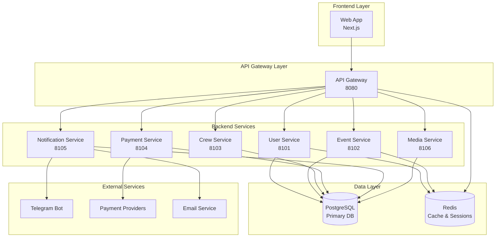

# Архитектура AquaStream

---
title: Architecture Overview
summary: High-level обзор архитектуры системы AquaStream - микросервисы, модули и взаимодействия
tags: [architecture, overview]
---

## Обзор

AquaStream - система управления водными мероприятиями, построенная на модульной архитектуре с четким разделением ответственности между компонентами.

**Назначение:**
- Управление водными мероприятиями (сплавы, походы, туры)
- Бронирование участников на события
- Управление экипажами и назначениями
- Обработка платежей и уведомлений
- Хранение медиа-контента

**Границы ответственности:**
- ✅ Бизнес-логика организации водных мероприятий
- ✅ API для frontend и мобильных приложений
- ✅ Интеграция с платежными провайдерами
- ✅ Уведомления через Telegram и Email

## Архитектурная схема



## Модули системы

### 🎯 Core Business Services

**User Service (8101)**
- Аутентификация и авторизация
- Управление профилями пользователей
- Роли и разрешения

**Event Service (8102)**
- Создание и управление событиями
- Система бронирований
- Управление расписанием

**Crew Service (8103)**
- Управление экипажами
- Назначение команд на события
- Квалификации и сертификации

**Payment Service (8104)**
- Обработка платежей
- Интеграция с платежными провайдерами
- Управление транзакциями

### 🔧 Supporting Services

**API Gateway (8080)**
- Единая точка входа
- Аутентификация и авторизация
- Rate limiting и мониторинг

**Notification Service (8105)**
- Email уведомления
- Telegram интеграция
- Push notifications

**Media Service (8106)**
- Загрузка и обработка файлов
- Управление изображениями
- CDN интеграция

## Детальная спецификация сервисов

### Таблица сервисов

| Сервис | Порт | Назначение | База (схема) | Внешние интеграции |
|--------|------|------------|--------------|-------------------|
| **Gateway** | 8080 | Маршрутизация, CORS, Rate Limiting, Health aggregation | - | - |
| **User** | 8101 | Аутентификация, профили, роли, RBAC | `user` | Telegram Bot |
| **Event** | 8102 | События, организаторы, бронирования, waitlist | `event` | - |
| **Crew** | 8103 | Управление группами (экипажи/палатки) | `crew` | - |
| **Payment** | 8104 | Платежи, транзакции, вебхуки | `payment` | YooKassa, CloudPayments, Stripe |
| **Notification** | 8105 | Telegram бот, уведомления | `notification` | Telegram Bot API |
| **Media** | 8106 | Файлы, presigned URLs, загрузка | `media` | MinIO/S3 |

### Модульная структура сервисов

Каждый микросервис (кроме Gateway) разбит на три модуля:

```
backend-[service]/
├── backend-[service]-api/        # REST API endpoints, Transport DTO, Controllers
│   └── src/main/java/
│       └── com/aquastream/[service]/api/
│           ├── controller/       # REST контроллеры
│           ├── dto/              # Transport DTO с validation
│           └── [Service]ApiApplication.java
├── backend-[service]-service/    # Бизнес-логика, Service DTO
│   └── src/main/java/
│       └── com/aquastream/[service]/service/
│           ├── service/          # Сервисный слой
│           ├── dto/              # Service DTO (доменные модели)
│           └── mapper/           # Маппинг между DTO
└── backend-[service]-db/         # Data Access, JPA Entities
    └── src/main/java/
        └── com/aquastream/[service]/db/
            ├── entity/           # JPA сущности
            └── repository/       # Spring Data репозитории
```

**Правила взаимодействия:**
- `api` → `service` (запрещено: `api` → `db`)
- `service` → `db` (запрещено: `service` → `api`)
- Контроллеры маппят Transport DTO ↔ Service DTO
- Сервисы маппят Service DTO ↔ Entity
- ArchUnit тесты проверяют соблюдение правил

### Слоистая архитектура

```
┌─────────────────────────────────────┐
│         Presentation Layer          │  ← REST Controllers, Validation
├─────────────────────────────────────┤
│          Service Layer              │  ← Business Logic, Transactions
├─────────────────────────────────────┤
│         Repository Layer            │  ← Data Access, JPA Repositories
├─────────────────────────────────────┤
│          Domain Layer               │  ← Entities, Value Objects
└─────────────────────────────────────┘
```

**Presentation Layer (api):**
- REST контроллеры (`@RestController`)
- Input validation (`@Valid`, Jakarta Bean Validation)
- Transport DTO (request/response models)
- OpenAPI аннотации

**Service Layer (service):**
- Бизнес-логика (`@Service`)
- Транзакционная обработка (`@Transactional`)
- Service DTO (доменные модели)
- Маппинг между слоями

**Repository Layer (db):**
- Spring Data JPA репозитории
- Custom queries (`@Query`)
- Specifications для сложных запросов

**Domain Layer (db/entity):**
- JPA entities (`@Entity`)
- Value Objects
- Domain logic (методы сущностей)

### Backend-Common

Общая библиотека для всех сервисов с автоконфигурацией Spring Boot:

```
backend-common/
├── config/              # Auto-конфигурации
│   ├── ServiceDiscoveryAutoConfiguration.java
│   └── ServiceUrls.java
├── domain/              # Доменные константы и enum'ы
│   ├── UserRole.java           # GUEST, USER, ORGANIZER, ADMIN
│   ├── BookingStatus.java      # PENDING, CONFIRMED, COMPLETED, EXPIRED, CANCELLED, NO_SHOW
│   ├── PaymentStatus.java      # PENDING, PROCESSING, SUCCEEDED, FAILED, REFUNDED
│   └── DomainConstants.java    # Константы (заголовки, лимиты)
├── error/               # RFC 7807 Problem Details
│   ├── GlobalExceptionHandler.java
│   ├── ApiException.java
│   ├── ProblemDetails.java
│   ├── ErrorCodes.java
│   └── CommonErrorHandlingAutoConfiguration.java
├── health/              # Health checks
│   └── ServiceHealthChecker.java
├── metrics/             # Система метрик
│   ├── collector/       # MetricsCollector
│   ├── config/          # MetricsAutoConfiguration, MetricsProperties
│   ├── controller/      # MetricsController (REST endpoint)
│   ├── filter/          # MetricsFilter (HTTP метрики)
│   ├── model/           # MetricData, MetricType
│   ├── scheduler/       # MetricsScheduler (периодическая запись)
│   └── writer/          # RedisMetricsWriter
├── mock/                # Моки для dev окружения
│   ├── config/          # MockProperties
│   └── service/         # MockDetector, MockResponseGenerator
├── ratelimit/           # Rate limiting (Bucket4j + Redis)
│   ├── config/          # RateLimitAutoConfiguration, RateLimitProperties
│   ├── filter/          # RateLimitFilter
│   └── service/         # RateLimitService
├── util/                # Утилиты
│   └── Ids.java         # Генерация UUID, JTI, idempotency keys
└── web/                 # Web конфигурация
    ├── config/          # WebAutoConfiguration
    ├── CorrelationIdFilter.java
    ├── CorrelationIdRestTemplateInterceptor.java
    └── ServiceDiscoveryController.java
```

**Экспортируемые зависимости (api)**:
- `spring-boot-starter-web` - REST, Jackson, Tomcat
- `spring-boot-starter-validation` - Bean Validation
- `bucket4j-redis` - Rate limiting

**Internal зависимости (implementation)**:
- `spring-boot-starter-security` - Security utilities
- `spring-boot-starter-data-redis` - Redis client
- `logstash-logback-encoder` - Structured logging

**Автоконфигурации** (через `META-INF/spring/org.springframework.boot.autoconfigure.AutoConfiguration.imports`):
- `CommonErrorHandlingAutoConfiguration` - глобальная обработка ошибок
- `RateLimitAutoConfiguration` - Bucket4j rate limiting
- `WebAutoConfiguration` - CORS, CorrelationId
- `MetricsAutoConfiguration` - система метрик
- `ServiceDiscoveryAutoConfiguration` - service discovery

## Ключевые решения и паттерны

### Design Patterns

**Применяемые паттерны:**

**Repository Pattern**
- Абстракция доступа к данным через Spring Data JPA
- Инкапсуляция деталей persistence слоя
- Переиспользуемые query методы

**Service Layer Pattern**
- Инкапсуляция бизнес-логики в `@Service` классах
- Транзакционные границы через `@Transactional`
- Координация между репозиториями

**DTO/Mapper Pattern**
- Изоляция слоев через Transport DTO и Service DTO
- Явный маппинг данных между слоями
- Предотвращение утечки Entity в API

**Circuit Breaker** (планируется)
- Устойчивость к сбоям внешних сервисов
- Fallback логика для критичных операций
- Resilience4j интеграция

**Saga Pattern** (частично)
- Компенсирующие транзакции для межсервисных операций
- Eventual consistency через события

**API Gateway Pattern**
- Единая точка входа для всех клиентов
- Централизованная аутентификация и rate limiting
- Routing и aggregation

### Обоснование технологического стека

**Java 21**
- Производительность: virtual threads (Project Loom) для высокой throughput
- Экосистема: богатая библиотека, зрелые фреймворки
- Команда: опыт разработки на Java

**Spring Boot 3.x**
- Быстрая разработка: автоконфигурация, стартеры
- Интеграции: готовые решения для PostgreSQL, Redis, MinIO
- Production-ready: Actuator, metrics, health checks

**PostgreSQL 16**
- ACID транзакции для финансовых операций
- Производительность: эффективные индексы, query planner
- JSON поддержка для гибких данных (notifications, metadata)
- Multi-schema: изоляция данных сервисов

**Gradle**
- Гибкость: Kotlin DSL, convention plugins
- Performance: incremental builds, build cache
- Dependency locking для воспроизводимых сборок

## Технологический стек

### Backend
```yaml
Language: Java 21
Framework: Spring Boot 3.x
Gateway: Spring WebFlux
Build: Gradle 8.5+
Database: PostgreSQL 16 (схемы на сервис)
Cache: Redis 7
Storage: MinIO (S3-compatible)
Migrations: Liquibase
Security: Spring Security + JWT
API: RESTful + OpenAPI 3.0
Error Handling: RFC 7807 Problem Details
Rate Limiting: Bucket4j (soft limits)
Monitoring: Spring Boot Actuator
Testing: JUnit 5, TestContainers, ArchUnit
```

### Frontend
```yaml
Framework: Next.js 14 (App Router)
Language: TypeScript 5.x
Runtime: React 18
Styling: Tailwind CSS 3.4 + shadcn/ui
UI Components: Radix UI
State: React Hooks + Context
HTTP: Fetch API
Forms: React Hook Form + Zod
Testing: Node test runner, Playwright
```

### Infrastructure
```yaml
Containerization: Docker + Docker Compose
Observability: Prometheus + Grafana + Loki + Promtail
Security Scanning: Trivy, OWASP Dependency Check
SBOM: Syft
Documentation: MkDocs + Material
CI/CD: GitHub Actions
Deployment: Docker Compose (local/staging/prod)
Storage: MinIO (S3-compatible object storage)
```

## Принципы архитектуры

### 1. Domain Driven Design
Каждый сервис представляет отдельный бизнес-домен с четкими границами

### 2. API First
Контракты определяются до реализации через OpenAPI спецификации

### 3. Microservices
Слабо связанные сервисы с собственными базами данных

### 4. Event Sourcing (частично)
Асинхронная обработка доменных событий

### 5. Security First
Безопасность встроена на всех уровнях

## Паттерны взаимодействия

### Synchronous Communication
- REST API между frontend и gateway
- HTTP calls между сервисами для критичных операций
- JWT для аутентификации

### Asynchronous Communication
- Event publishing для доменных событий
- Message queues для фоновых задач
- Email/SMS уведомления

### Data Consistency
- Каждый сервис владеет своими данными
- Eventual consistency через события
- Компенсирующие транзакции при необходимости

## Безопасность

### Authentication & Authorization
- JWT токены с refresh mechanism
- Role-based access control (RBAC)
- Method-level security

### Data Protection
- HTTPS обязателен
- Input validation и sanitization
- SQL injection protection
- Secrets management

### Monitoring & Auditing
- Structured logging
- Security event tracking
- Access audit trails

## Производительность и масштабирование

### Performance характеристики

**Целевые SLA:**
- Response time: <500ms (p95) для READ операций
- Response time: <1s (p95) для WRITE операций
- Throughput: 100 requests/second на сервис
- Availability: 99.5% uptime (dev/staging), 99.9% (production)
- Concurrent users: 500-1000 одновременных пользователей

**Текущие метрики:**
- Event Service: ~300ms (p95) для создания бронирования
- User Service: ~100ms (p95) для authentication
- Payment Service: ~800ms (p95) с учетом внешних провайдеров

**Оптимизации:**

**Database indexing**
- Composite индексы на частых JOIN колонках
- Partial индексы для filtered queries
- GIN индексы для JSON поля (notifications, metadata)

**Connection pooling (HikariCP)**
```yaml
spring.datasource.hikari:
  maximum-pool-size: 20        # Max connections
  minimum-idle: 5              # Min idle connections
  connection-timeout: 30000    # 30s
  idle-timeout: 600000         # 10 min
```

**Lazy loading с N+1 защитой**
- Entity graphs для eager loading критичных связей
- @BatchSize для коллекций
- DTO projections для read-only queries

**Caching strategy**
- Redis для session storage (TTL: 1 час)
- In-memory cache (Caffeine) для справочных данных
- HTTP cache headers для статики

### Горизонтальное масштабирование

**Stateless сервисы:**
- Session в Redis (не в JVM memory)
- No local file storage (MinIO для файлов)
- Idempotency keys для безопасного retry

**Load balancing:**
```bash
# Docker Compose scale
docker-compose up -d --scale backend-event=3

# Nginx upstream
upstream event-service {
    least_conn;  # Least connections algorithm
    server backend-event-1:8102;
    server backend-event-2:8102;
    server backend-event-3:8102;
}
```

**Database scaling:**
- PostgreSQL read replicas (планируется)
- Connection pooling для эффективного использования
- Schema-per-service для независимости

### Вертикальное масштабирование

**JVM tuning:**
```bash
# Heap size (50-75% от container memory)
-Xms512m -Xmx768m

# GC (G1GC для latency-sensitive apps)
-XX:+UseG1GC
-XX:MaxGCPauseMillis=200

# Metaspace
-XX:MetaspaceSize=128m -XX:MaxMetaspaceSize=256m
```

**Resource limits (Docker Compose):**
- Memory: 512MB-768MB per service
- CPU: 0.75-1.0 vCPU
- См. [Infrastructure](operations/infrastructure.md) для деталей

## Мониторинг и наблюдаемость {#мониторинг-и-наблюдаемость}

### Метрики (Prometheus format)

**Business Metrics:**
- `bookings_created_total` — количество созданных бронирований
- `payments_succeeded_total` — успешные платежи
- `booking_duration_seconds` — время создания бронирования
- `waitlist_additions_total` — добавления в waitlist

**Technical Metrics:**
- `http_requests_total{method, status, service}` — HTTP запросы
- `http_request_duration_seconds` — latency (histogram)
- `jvm_memory_used_bytes{area}` — использование памяти JVM
- `database_connections_active` — активные DB соединения
- `redis_commands_total{command}` — Redis операции

**Доступ к метрикам:**
```bash
# Actuator endpoints
curl http://localhost:8102/actuator/metrics
curl http://localhost:8102/actuator/prometheus

# Prometheus (dev окружение)
http://localhost:9090
```

### Логирование

**Structured logging (JSON через Logback):**
```json
{
  "timestamp": "2025-10-01T12:00:00.123Z",
  "level": "INFO",
  "service": "backend-event",
  "correlationId": "abc-123-def-456",
  "userId": "user-789",
  "event": "BOOKING_CREATED",
  "message": "Booking successfully created",
  "duration": 287,
  "bookingId": "booking-1001",
  "eventId": "event-42"
}
```

**Key events для мониторинга:**
- `SERVICE_STARTED` — сервис запущен
- `BOOKING_CREATED` — создано бронирование
- `PAYMENT_SUCCEEDED` / `PAYMENT_FAILED` — результат платежа
- `EXTERNAL_API_CALL` — вызовы внешних API (YooKassa, Telegram)
- `ERROR_OCCURRED` — ошибки требующие внимания
- `CAPACITY_EXCEEDED` — превышение capacity экипажа

**Centralized logging (dev окружение):**
- Loki для хранения логов
- Promtail для сбора из Docker контейнеров
- Grafana для визуализации и поиска
- Correlation IDs для трейсинга запросов

**Log levels:**
- **TRACE** (dev only): детальная отладка
- **DEBUG** (dev only): разработка
- **INFO**: нормальные операции, бизнес-события
- **WARN**: предупреждения (capacity близко к лимиту)
- **ERROR**: ошибки требующие внимания

### Дашборды

**Dev окружение (Grafana):**
- Service Health Dashboard — health checks, uptime
- Business Metrics Dashboard — bookings, payments, users
- Performance Dashboard — latency, throughput, errors

**Actuator endpoints:**
```bash
/actuator/health       # Health status
/actuator/info         # Build info, version
/actuator/metrics      # All metrics
/actuator/prometheus   # Prometheus format
```

### Алерты

**Критичные алерты:**
- Service down (health check failed > 2 min)
- Error rate > 5% (5xx responses)
- Response time p95 > 2s
- Database connections > 90% pool size

**Предупреждения:**
- Memory usage > 85%
- Disk space < 15%
- Event capacity близко к лимиту (>80%)

## Тестирование

### Стратегия тестирования

**Test Pyramid:**
```
    /\     E2E Tests (5%)
   /  \    ← Critical user journeys
  /____\   Integration Tests (15%)
 /      \  ← API contracts, DB interactions
/________\ Unit Tests (80%)
           ← Business logic, edge cases
```

**Coverage targets:**
- Unit tests: >80% line coverage
- Integration tests: все API endpoints
- E2E tests: critical paths (booking, payment)

### Unit Tests (JUnit 5)

```bash
# Запуск всех unit тестов
./gradlew test

# Конкретный модуль
./gradlew :backend-event:backend-event-service:test
```

**Что тестируем:**
- Бизнес-логика в `@Service` классах
- Маппинг между DTO
- Валидация входных данных
- Edge cases (null, empty, boundary values)

**Инструменты:**
- JUnit 5 — test framework
- Mockito — моки зависимостей
- AssertJ — fluent assertions

### Integration Tests (TestContainers)

```bash
# Запуск integration тестов
./gradlew integrationTest

# С TestContainers (Postgres, Redis)
./gradlew :backend-event:backend-event-api:integrationTest
```

**Что тестируем:**
- API endpoints (REST controllers)
- Database взаимодействие (JPA repositories)
- Redis caching
- Liquibase migrations

**Инструменты:**
- Spring Boot Test (`@SpringBootTest`)
- TestContainers (PostgreSQL, Redis)
- REST Assured для API тестов

### Architecture Tests (ArchUnit)

```bash
# Проверка архитектурных правил
./gradlew :backend-event:test --tests ArchitectureTest
```

**Правила:**
- `api` модуль не зависит от `db`
- `service` модуль не зависит от `api`
- Controllers только в `api` пакете
- Entities только в `db` пакете
- No cyclic dependencies

### Contract Tests (планируется)

Spring Cloud Contract для API contracts между сервисами

## Развертывание

### Environments
| Environment | Purpose | URL |
|-------------|---------|-----|
| Local | Development | localhost |
| Staging | Testing | staging.aquastream.org |
| Production | Live | aquastream.org |

### Deployment Strategy
- Blue-green deployments
- Health checks перед переключением трафика
- Automated rollback при failure
- См. [Deployment Guide](operations/deployment.md)

## Архитектурные решения

Ключевые решения документированы в [ADR записях](decisions/index.md):

- [ADR-001: Doc as Code Stack](decisions/adr-001-docs-stack.md)
- [ADR-002: API Documentation Strategy](decisions/adr-002-api-documentation.md)

## Риски и ограничения

### Технические риски

| Риск | Вероятность | Влияние | Митигация |
|------|-------------|---------|-----------|
| Database bottleneck | Medium | High | Connection pooling, read replicas (планируется), индексы |
| Single point of failure (PostgreSQL) | Low | Critical | Backup каждые 24ч, retention policy, restore testing |
| External API unavailable (YooKassa) | High | Medium | Circuit breaker (планируется), fallback, retry logic |
| Memory leaks в JVM | Low | High | Мониторинг heap, G1GC tuning, heap dumps при OOM |
| Redis unavailability | Medium | Medium | Session regeneration, graceful degradation |
| Capacity exhaustion (events) | Medium | Medium | Waitlist mechanism, capacity alerts (>80%) |

### Текущие ограничения

**Технические:**
- Single PostgreSQL instance (нет HA)
  - Impact: downtime при сбое БД
  - Планируется: PostgreSQL read replicas, failover
- Synchronous inter-service communication
  - Impact: latency накапливается
  - Планируется: async messaging (RabbitMQ/Kafka)
- Manual deployment процессы
  - Impact: human error risks
  - Планируется: CI/CD automation
- No distributed tracing
  - Impact: сложно отлаживать межсервисные проблемы
  - Планируется: Jaeger/Zipkin integration

**Бизнесовые:**
- Только одна платежная система (YooKassa)
- Нет multi-tenancy (одна организация)
- Ограниченная поддержка локализации (русский язык)

### Trade-offs архитектурных решений

**Microservices vs Monolith:**
- ✅ Pros: независимый deploy, масштабирование, изоляция сбоев
- ❌ Cons: network latency, сложность разработки, distributed transactions

**Multi-schema PostgreSQL vs отдельные БД:**
- ✅ Pros: простота backup/restore, одна Postgres instance, схемы как namespace
- ❌ Cons: shared connection pool, no physical isolation, single point of failure

**JWT vs Session-based auth:**
- ✅ Pros: stateless, horizontal scaling, no session storage
- ❌ Cons: сложность revoke, размер токена, хранение в browser storage

**Docker Compose:**
- ✅ Pros: простота setup, low overhead, достаточно для текущей цели
- ❌ Cons: нет авто-масштабирования, ручное управление отказами

## См. также

- [Backend Documentation](backend/README.md) - детали по каждому сервису
- [Frontend Documentation](frontend/README.md) - архитектура клиентской части
- [API Documentation](api/index.md) - полная документация API
- [Operations Guide](operations/README.md) - руководство по эксплуатации
- [QA Strategy](qa/index.md) - стратегия тестирования
