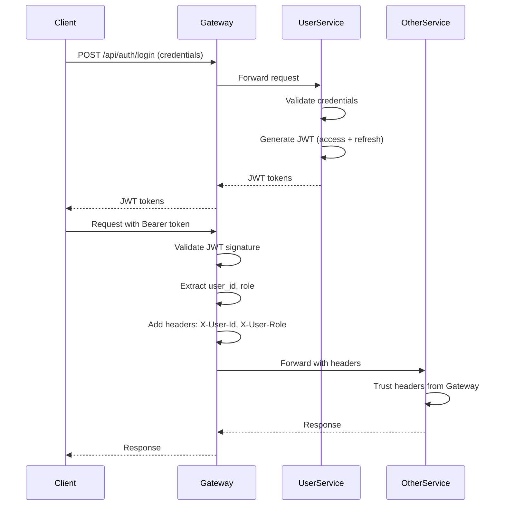

# Аутентификация и авторизация

## Обзор

Единая система аутентификации на основе JWT с RBAC (Role-Based Access Control) для всех сервисов.

## Роли (RBAC)

### Иерархия ролей

| Роль | Права | Описание |
|------|-------|----------|
| **Guest** | Просмотр публичных страниц | Неавторизованный пользователь |
| **User** | + Профиль, бронирование, оплата | Зарегистрированный участник |
| **Organizer** | + Управление событиями и бронями | Организатор мероприятий |
| **Admin** | Полный доступ ко всем данным | Системный администратор |

### Детальные права

#### Guest (неавторизован)
- ✅ Просмотр списка организаторов
- ✅ Просмотр публичных событий
- ✅ Просмотр деталей события
- ✅ Регистрация/вход
- ❌ Бронирование

#### User (зарегистрирован)
- ✅ Все права Guest
- ✅ Управление профилем
- ✅ Создание бронирований
- ✅ Оплата бронирований
- ✅ Просмотр своих бронирований
- ✅ Участие в экипажах
- ✅ Настройка уведомлений
- ❌ Создание событий

#### Organizer (организатор)
- ✅ Все права User
- ✅ Создание/редактирование событий
- ✅ Управление брендом организатора
- ✅ Подтверждение оплат (QR модерация)
- ✅ Управление командой организатора
- ✅ Управление FAQ
- ✅ Управление экипажами события
- ❌ Управление пользователями

#### Admin (администратор)
- ✅ Все права Organizer
- ✅ Управление ролями пользователей
- ✅ Доступ ко всем данным
- ✅ Модерация контента
- ✅ Системные настройки

## Схема аутентификации

### Архитектура JWT



### Поток авторизации

#### 1. Регистрация

```
POST /api/auth/register
{
  "username": "user@example.com",
  "password": "SecurePass123!",
  "phone": "+79991234567"
}

→ Creates User with role=USER
→ Returns JWT tokens
```

#### 2. Вход (Login)

```
POST /api/auth/login
{
  "username": "user@example.com",
  "password": "SecurePass123!"
}

→ Validates credentials
→ Returns JWT access + refresh tokens
```

#### 3. Обновление токена (Refresh)

```
POST /api/auth/refresh
{
  "refreshToken": "..."
}

→ Validates refresh token
→ Returns new access + refresh tokens
```

#### 4. Выход (Logout)

```
POST /api/auth/logout
Authorization: Bearer <access_token>

→ Revokes refresh token
→ Invalidates session
```

## JWT Структура

### Access Token

```json
{
  "sub": "550e8400-e29b-41d4-a716-446655440000",
  "username": "user@example.com",
  "role": "USER",
  "iat": 1704067200,
  "exp": 1704070800,
  "jti": "at-550e8400-e29b-41d4-a716-446655440001"
}
```

**Параметры**:
- `sub`: User ID (UUID)
- `username`: Email пользователя
- `role`: Роль (GUEST/USER/ORGANIZER/ADMIN)
- `iat`: Issued at (timestamp)
- `exp`: Expiration (timestamp)
- `jti`: JWT ID (для revoke)

**TTL**: 1 час (3600 секунд)

### Refresh Token

```json
{
  "sub": "550e8400-e29b-41d4-a716-446655440000",
  "type": "refresh",
  "iat": 1704067200,
  "exp": 1706659200,
  "jti": "rt-550e8400-e29b-41d4-a716-446655440002"
}
```

**TTL**: 30 дней (2592000 секунд)

## Gateway проверка

### Валидация JWT

```java
// Gateway автоматически:
1. Извлекает токен из заголовка Authorization
2. Проверяет подпись (HS512 + secret)
3. Проверяет expiration
4. Извлекает user_id и role
5. Добавляет заголовки: X-User-Id, X-User-Role
6. Пробрасывает запрос к сервису
```

### Headers propagation

```http
# Client → Gateway
Authorization: Bearer eyJhbGc...

# Gateway → Service
X-User-Id: 550e8400-e29b-41d4-a716-446655440000
X-User-Role: USER
```

### Публичные маршруты (без JWT)

```
/api/auth/register
/api/auth/login
/api/auth/refresh
/api/events (GET - список событий)
/api/events/{id} (GET - детали события)
/api/organizers (GET - список организаторов)
/api/organizers/{id} (GET - детали организатора)
/actuator/health
```

## Сервисы - авторизация

### Trust Gateway Headers

Сервисы **доверяют** заголовкам от Gateway:

```java
@RestController
public class BookingController {
    
    @PostMapping("/api/bookings")
    public BookingResponse create(
        @RequestHeader("X-User-Id") UUID userId,
        @RequestHeader("X-User-Role") String role,
        @RequestBody BookingRequest request
    ) {
        // userId и role уже валидированы Gateway
        // Проверяем только бизнес-правила
        if (!"USER".equals(role) && !"ORGANIZER".equals(role)) {
            throw new ForbiddenException();
        }
        return bookingService.create(userId, request);
    }
}
```

### Role checks

```java
// Проверка роли в сервисе
public void checkOrganizer(String role) {
    if (!"ORGANIZER".equals(role) && !"ADMIN".equals(role)) {
        throw new ForbiddenException("Only organizers can perform this action");
    }
}
```

## Session Management

### Refresh Sessions (БД)

```sql
-- Таблица в user схеме
CREATE TABLE refresh_sessions (
    jti UUID PRIMARY KEY,
    user_id UUID NOT NULL,
    issued_at TIMESTAMP NOT NULL,
    expires_at TIMESTAMP NOT NULL,
    revoked_at TIMESTAMP,
    device_info VARCHAR(255),
    ip_address VARCHAR(45)
);
```

### Revoke механизм

```java
// При logout
public void logout(String refreshTokenJti) {
    refreshSessionRepository.revokeByJti(refreshTokenJti);
}

// При смене пароля - revoke all
public void revokeAllSessions(UUID userId) {
    refreshSessionRepository.revokeAllByUserId(userId);
}
```

## Password Recovery

### Процесс восстановления

```
1. POST /api/auth/recovery (email)
   → Генерирует recovery code
   → Отправляет на email/Telegram

2. POST /api/auth/recovery/verify (code)
   → Проверяет код
   → Возвращает временный токен

3. POST /api/auth/recovery/reset (token, newPassword)
   → Обновляет пароль
   → Revoke все сессии
   → Возвращает новые JWT
```

### Recovery Codes (БД)

```sql
CREATE TABLE recovery_codes (
    id UUID PRIMARY KEY,
    user_id UUID NOT NULL,
    code_hash VARCHAR(255) NOT NULL,
    used_at TIMESTAMP,
    expires_at TIMESTAMP NOT NULL,
    created_at TIMESTAMP DEFAULT NOW()
);

-- TTL: 15 минут
-- One-time use: used_at IS NULL
```

## См. также

- [Security](security.md) - детали безопасности
- [User Service](../user/README.md) - реализация auth
- [Gateway](../gateway/README.md) - JWT validation

