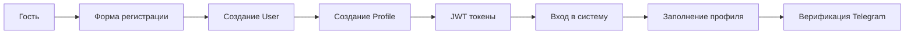
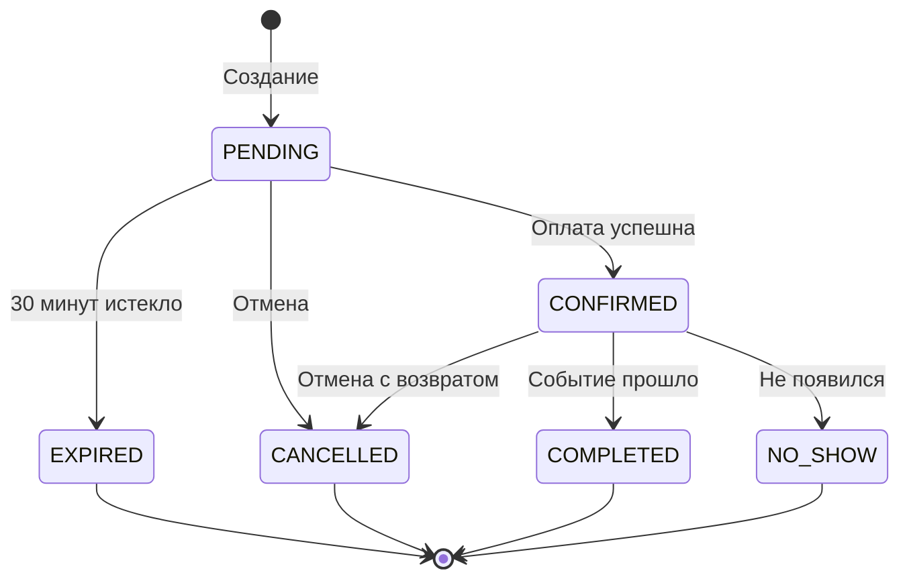
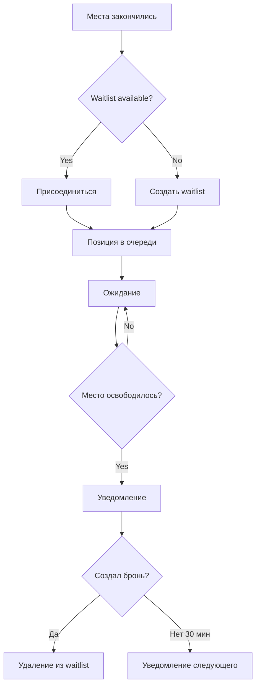

# Бизнес-процессы

## Обзор

Детальное описание ключевых бизнес-процессов платформы AquaStream.

## Процесс 1: Регистрация и онбординг

### Этапы



### Детали

**1. Регистрация**:
- Input: email, password, phone (опционально)
- Validation: уникальность email, сложность пароля
- Output: User с ролью USER, JWT токены
- Audit: запись в audit_log

**2. Создание профиля**:
- Автоматически создается пустой Profile
- user_id связь с User

**3. Заполнение профиля**:
- Обязательно для бронирования: phone ИЛИ telegram
- Опционально: firstName, lastName, birthDate, extra (JSON)

**4. Верификация Telegram** (опционально):
- Генерация кода верификации
- Deep link: t.me/aquastream_bot?start=<code>
- Пользователь: /start в боте
- Бот: привязка chat_id к user_id
- is_telegram_verified = true

## Процесс 2: Бронирование

### Машина состояний



### Этапы

**1. Создание брони** (Event Service):
```
Input:
  - user_id (из JWT)
  - event_id
  
Validations:
  - Profile complete (phone OR telegram)
  - Event is PUBLISHED
  - Available seats > 0
  - No active booking for this user + event
  
Process:
  - Create Booking (status=PENDING)
  - Set expires_at = now() + 30 minutes
  - Decrement event.available (atomic)
  - Publish event: booking.created
  
Output:
  - Booking ID
  - Redirect to /checkout/[bookingId]
```

**2. Оплата** (Payment Service):

Вариант A - Виджет эквайринга:
```
1. Init payment (POST /api/payments/init)
   → Provider: yookassa | cloudpayments | stripe
   → Return widget config

2. Render payment widget
   → User enters card details
   → Provider processes payment

3. Webhook received (POST /api/webhooks/payment/:provider)
   → Validate signature
   → Check idempotency
   → Update payment status: SUCCEEDED
   → Publish event: payment.succeeded

4. Event Service handles payment.succeeded
   → Update booking: CONFIRMED
   → Remove expires_at
   → Notify user
```

Вариант B - QR оплата:
```
1. Display QR code
   → Организатор's bank account
   → Amount, purpose

2. User uploads proof (POST /api/payments/qr)
   → Upload screenshot to Media Service
   → Create payment_receipt (status=submitted)

3. Organizer moderation
   → /dashboard/organizer/moderation
   → Review proof
   → PATCH: accept | reject

4. Accept:
   → Payment status: SUCCEEDED
   → Booking: CONFIRMED
   → Notify user

   Reject:
   → Payment: REJECTED
   → Booking remains PENDING (will expire)
   → Notify user with reason
```

**3. Истечение** (Scheduled Job):
```
Every 1 minute:
  - Find PENDING bookings with expires_at < now()
  - Update status: EXPIRED
  - Increment event.available
  - Process waitlist
  - Notify user
```

**4. Подтверждение**:
```
- Booking status: CONFIRMED
- Payment status: SUCCEEDED
- Email/Telegram notification
- Seat reserved
```

## Процесс 3: Waitlist

### FIFO Очередь



### Детали

**1. Добавление в очередь**:
- Event.available = 0
- POST /api/waitlist
- priority = next_sequence_number (FIFO)
- notified_at = null

**2. Освобождение места**:
- Booking EXPIRED или CANCELLED
- Event.available++
- Trigger: processWaitlist()

**3. Обработка очереди**:
```
While (event.available > 0):
  - Find next: priority ASC, notified_at IS NULL
  - Send Telegram notification
  - Set notified_at = now()
  - Set notification_expires_at = now() + 30 minutes
  - Break (notify one at a time)
```

**4. Создание брони из waitlist**:
- User creates booking within 30 minutes
- Delete from waitlist
- Standard booking flow

**5. Истечение уведомления**:
- If no booking created in 30 minutes
- Notify next person in queue

## Процесс 4: Оплата и модерация

### Виджет эквайринга (автоматический)

```
1. User: выбор метода "Карта"
2. Frontend: init payment → widget config
3. Frontend: render widget (YooKassa/CloudPayments/Stripe)
4. User: ввод данных карты → подтверждение
5. Provider: обработка → webhook
6. Backend: validate webhook → update payment
7. Backend: confirm booking
8. Telegram: уведомление пользователю
```

### QR оплата (ручная модерация)

```
1. User: выбор метода "QR код"
2. Frontend: отображение QR + реквизиты
3. User: оплата через банк → скриншот
4. User: upload proof → POST /api/payments/qr
5. Backend: save payment_receipt (status=submitted)
6. Organizer: /dashboard/organizer/moderation
7. Organizer: review proof → accept/reject
8. Backend: update payment + booking
9. Telegram: уведомление пользователю
```

**SLA модерации**: рекомендуется < 24 часа

## Процесс 5: Уведомления

### Категории

**Обязательные** (opt-out невозможен):
- `BOOKING_CONFIRMED` - бронь подтверждена
- `PAYMENT_STATUS` - статус оплаты изменен
- `EVENT_REMINDER` - напоминание за 24/48 часов до события

**Опциональные** (можно отключить):
- `WAITLIST_AVAILABLE` - место освободилось
- `EVENT_NEWS` - новости от организатора
- `CREW_ASSIGNMENT` - назначение в экипаж

### Процесс отправки

```
1. Event происходит в системе
   → booking.confirmed
   → payment.succeeded
   → waitlist.available

2. Notification Service слушает события
   → Redis Pub/Sub или события БД

3. Проверка preferences
   → Канал: telegram (приоритет) или email
   → Enabled: true для категории

4. Формирование сообщения
   → Template + данные события

5. Отправка
   → Telegram Bot API
   → Retry с backoff (3 попытки)

6. Сохранение в outbox
   → status: sent | failed
   → attempts counter
```

## Процесс 6: Командообразование (Экипажи)

### Типы групп

- **CREW**: экипаж байдарки (2-4 человека)
- **TENT**: палатка (2-6 человек)
- **TABLE**: стол на банкете (6-10 человек)
- **BUS**: места в автобусе

### Процесс

**1. Создание групп** (Organizer):
```
- POST /api/crews
- Input: event_id, name, type, capacity
- Пример: "Экипаж #1", type=CREW, capacity=4
```

**2. Назначение участников**:
```
- Только CONFIRMED bookings
- POST /api/crews/[id]/assign
- Input: user_id, booking_id, seat_number
- Validation: capacity not exceeded
- Notification: user notified
```

**3. Учет предпочтений** (опционально):
```
- User может указать:
  - prefers_with_user_ids[] - хочу вместе с...
  - avoids_user_ids[] - избегать...
- Organizer видит при назначении
- Auto-assign algorithm (вне MVP)
```

## Бизнес-правила

### BR-1: Обязательный профиль
**Для бронирования требуется**: `phone` ИЛИ `telegram` (verified)

### BR-2: TTL брони = 30 минут
- Конфигурируемо через env: `BOOKING_TTL_MINUTES`
- Default: 30

### BR-3: Одна активная бронь
**Не более одной** PENDING/CONFIRMED брони на одно событие

### BR-4: Атомарность декремента мест
```sql
UPDATE event.events 
SET available = available - 1 
WHERE id = ? AND available > 0
RETURNING available;
```

### BR-5: Идемпотентность вебхуков
- Проверка по `idempotency_key`
- Дубликаты игнорируются

### BR-6: Waitlist FIFO
- Сортировка по `priority` (auto-increment)
- Уведомление по одному

## См. также

- [Requirements](requirements.md) - бизнес-требования
- [User Journeys](user-journeys.md) - пользовательские сценарии
- [Event Service](../backend/event/business-logic.md) - техническая реализация
- [Payment Service](../backend/payment/business-logic.md) - процесс оплаты
