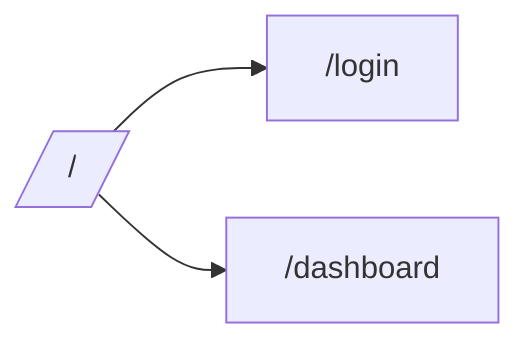

---
title: "Frontend — DevEx"
summary: "Практичный гид по запуску и разработке фронтенда AquaStream: скрипты, ENV, тесты, отладка."
---## AquaStream Frontend — DevEx README

Этот документ — быстрый и практичный гид по запуску, разработке и отладке фронтенда AquaStream.

### Быстрый старт
1) Установить зависимости: `pnpm install`
2) Dev сервер: `pnpm dev` (http://localhost:3000)
3) Dev с моками: `NEXT_PUBLIC_USE_MOCKS=true PORT=3101 pnpm dev`

### Скрипты и задачи
```bash
pnpm dev
pnpm build
pnpm start
pnpm lint
pnpm typecheck
pnpm exec playwright install --with-deps
pnpm exec playwright test
```

### Окружение (ENV) — ключевые
`NODE_ENV`, `PORT`, `NEXT_PUBLIC_USE_MOCKS`, `NEXT_PUBLIC_API_BASE_URL`, `SENTRY_*`, OAuth2 переменные.

### Режимы
- Обычный dev: http://localhost:3000
- Dev с моками: http://localhost:3101
- Docker dev/prod: docker-compose профили

### Качество кода
- ESLint 9, Prettier 3, TypeScript strict, UI — Tailwind v4 + shadcn/ui

### Тесты (Playwright)
- Установка браузеров и примеры запуска тестов

### Диаграммы (Mermaid пример)


### Ссылки
- Бизнес‑спецификация: `./docs/AquaStream_Business_Spec_v1.1.md`
