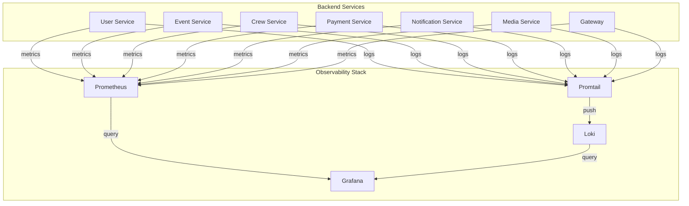

# Мониторинг и наблюдаемость

---
title: Monitoring & Observability
summary: Мониторинг метрик, логирование и observability stack для системы AquaStream
tags: [operations, monitoring, observability, prometheus, grafana, loki]
---

## Обзор

Система мониторинга и observability для отслеживания здоровья, производительности и проблем в AquaStream.

## Архитектура Observability



## Компоненты

### Prometheus

**Назначение**: Сбор и хранение метрик

**Конфигурация**:
- **Порт**: 9090 (dev only)
- **Контейнер**: `aquastream-prometheus`
- **Volume**: `prometheusdata`
- **Retention**: 15 дней
- **Scrape interval**: 15 секунд

**Scrape targets**:
```yaml
scrape_configs:
  - job_name: 'gateway'
    metrics_path: '/actuator/prometheus'
    static_configs:
      - targets: ['backend-gateway:8080']

  - job_name: 'user-service'
    metrics_path: '/actuator/prometheus'
    static_configs:
      - targets: ['backend-user:8101']

  # ... аналогично для event, crew, payment, notification, media
```

**Доступ**:
```bash
# Dev окружение
open http://localhost:9090
```

### Grafana

**Назначение**: Визуализация метрик и логов

**Конфигурация**:
- **Порт**: 3001 (dev only)
- **Контейнер**: `aquastream-grafana`
- **Volume**: `grafanadata`
- **Credentials**: `admin/admin` (dev), настраивается через `.env`

**Datasources** (автоматическая настройка):
- **Prometheus**: `http://prometheus:9090`
- **Loki**: `http://loki:3100`

**Provisioning**:
```
backend-infra/docker/compose/grafana/provisioning/
├── datasources/
│   └── prometheus.yml
└── dashboards/
    └── aquastream-overview.json
```

**Доступ**:
```bash
# Dev окружение
open http://localhost:3001
# Login: admin / admin
```

### Loki

**Назначение**: Централизованное хранилище логов

**Конфигурация**:
- **Порт**: 3100 (внутренний)
- **Контейнер**: `aquastream-loki`
- **Volume**: `lokidata`
- **Retention**: 7 дней

**Использование**:
- Хранение структурированных JSON логов
- Запросы через LogQL
- Интеграция с Grafana для визуализации

**Пример LogQL**:
```logql
# Все ошибки
{container_name=~"aquastream-backend-.*"} |= "ERROR"

# Ошибки в Event Service
{container_name="aquastream-backend-event"} |= "ERROR" | json

# Медленные запросы (>1s)
{container_name=~"aquastream-backend-.*"}
  | json
  | duration > 1000
```

### Promtail

**Назначение**: Сбор логов из Docker контейнеров

**Конфигурация**:
- **Контейнер**: `aquastream-promtail`
- **Volume**: `/var/run/docker.sock` (read-only)
- **Config**: `promtail-config.yml`

**Что собирает**:
- Логи всех backend сервисов через Docker API
- Автоматическое добавление labels (container_name, image, etc.)
- Parsing JSON логов

## Метрики

### Business Metrics

| Метрика | Тип | Описание |
|---------|-----|----------|
| `bookings_created_total` | Counter | Количество созданных бронирований |
| `payments_succeeded_total` | Counter | Успешные платежи |
| `payments_failed_total` | Counter | Неуспешные платежи |
| `booking_duration_seconds` | Histogram | Время создания бронирования |
| `waitlist_additions_total` | Counter | Добавления в waitlist |
| `users_registered_total` | Counter | Зарегистрированные пользователи |

### Technical Metrics

**HTTP Metrics**:
```
http_requests_total{method, status, service}
http_request_duration_seconds{method, status, service}
http_requests_active{method, service}
```

**JVM Metrics**:
```
jvm_memory_used_bytes{area="heap"|"nonheap"}
jvm_memory_max_bytes{area="heap"|"nonheap"}
jvm_threads_live
jvm_threads_daemon
jvm_gc_pause_seconds{action, cause}
```

**Database Metrics**:
```
database_connections_active
database_connections_idle
database_connections_max
hikaricp_connections_acquire_seconds
hikaricp_connections_usage_seconds
```

**Redis Metrics**:
```
redis_commands_total{command}
redis_commands_duration_seconds{command}
redis_connections_active
```

**Rate Limiting Metrics**:
```
ratelimit_requests_total{service, outcome="allowed"|"rejected"}
ratelimit_bucket_capacity{service}
```

### Prometheus Queries

**Примеры полезных запросов**:

```promql
# Request rate per service
rate(http_requests_total[5m])

# P95 latency
histogram_quantile(0.95,
  rate(http_request_duration_seconds_bucket[5m])
)

# Error rate
rate(http_requests_total{status=~"5.."}[5m])
  / rate(http_requests_total[5m])

# Memory usage %
(jvm_memory_used_bytes{area="heap"}
  / jvm_memory_max_bytes{area="heap"}) * 100

# Database connection pool utilization %
(database_connections_active
  / database_connections_max) * 100

# Top 5 slowest endpoints
topk(5,
  histogram_quantile(0.95,
    rate(http_request_duration_seconds_bucket[5m])
  )
)
```

## Dashboards

### Service Health Dashboard

**Компоненты**:
- Health status всех сервисов (UP/DOWN)
- Uptime %
- Request rate
- Error rate
- P50/P95/P99 latency
- Active connections

**Query examples**:
```promql
# Service up/down
up{job=~".*-service"}

# Uptime %
(time() - process_start_time_seconds{job="user-service"}) / 86400
```

### Business Metrics Dashboard

**Компоненты**:
- Бронирования (созданы, отменены, завершены)
- Платежи (успешные, неуспешные, сумма)
- Пользователи (регистрации, активные)
- События (созданы, опубликованы)

### Performance Dashboard

**Компоненты**:
- Request latency (heatmap)
- Throughput (requests/sec)
- Error rate over time
- Slow queries (database)
- JVM heap usage
- GC pause time

### Infrastructure Dashboard

**Компоненты**:
- CPU usage per container
- Memory usage per container
- Network I/O
- Disk I/O
- Database connections
- Redis memory

## Логирование

### Structured Logging

Все backend сервисы используют **JSON логи** через Logback:

```json
{
  "timestamp": "2025-10-01T12:00:00.123Z",
  "level": "INFO",
  "service": "backend-event",
  "correlationId": "abc-123-def-456",
  "userId": "user-789",
  "event": "BOOKING_CREATED",
  "message": "Booking successfully created",
  "duration": 287,
  "bookingId": "booking-1001",
  "eventId": "event-42"
}
```

**Ключевые поля**:
- `timestamp`: ISO 8601 с timezone
- `level`: TRACE, DEBUG, INFO, WARN, ERROR
- `service`: название сервиса
- `correlationId`: X-Correlation-ID для трейсинга
- `userId`: идентификатор пользователя
- `event`: бизнес-событие
- `message`: человекочитаемое сообщение

### Log Levels

**Development**:
- Root: DEBUG
- Backend services: DEBUG
- SQL queries: TRACE (с параметрами)
- Actuator: DEBUG

**Staging**:
- Root: INFO
- Backend services: INFO
- SQL queries: INFO (без параметров)

**Production**:
- Root: WARN
- Backend services: WARN
- Critical operations: INFO
- SQL queries: WARN (только ошибки)

### Key Events

События требующие логирования:

**INFO level**:
- `SERVICE_STARTED` - сервис запущен
- `BOOKING_CREATED` - создано бронирование
- `PAYMENT_SUCCEEDED` - успешный платеж
- `USER_REGISTERED` - регистрация пользователя
- `EVENT_PUBLISHED` - событие опубликовано

**WARN level**:
- `CAPACITY_NEAR_LIMIT` - capacity близко к лимиту (>80%)
- `RATE_LIMIT_APPROACHING` - приближение к rate limit
- `SLOW_QUERY` - медленный запрос БД (>1s)
- `EXTERNAL_API_SLOW` - медленный внешний API (>2s)

**ERROR level**:
- `PAYMENT_FAILED` - неуспешный платеж
- `EXTERNAL_API_ERROR` - ошибка внешнего API
- `DATABASE_ERROR` - ошибка БД
- `BOOKING_CONFLICT` - конфликт бронирования

### Log Rotation

**Docker logging driver**: `json-file`

```yaml
logging:
  driver: json-file
  options:
    max-size: "10m"   # Максимальный размер файла
    max-file: "5"     # Количество файлов
```

**Total per container**: 50MB (10MB × 5 files)

**Просмотр логов**:
```bash
# Все сервисы
make logs

# Конкретный сервис
docker logs aquastream-backend-event

# Streaming
docker logs -f aquastream-backend-event

# Последние N строк
docker logs --tail 100 aquastream-backend-event

# С временными метками
docker logs -t aquastream-backend-event

# JSON parsing
docker logs aquastream-backend-event | jq '.level, .message'
```

## Health Checks

### Spring Boot Actuator

**Endpoints**:
```bash
# Health status
curl http://localhost:8102/actuator/health

# Detailed health (dev only)
curl http://localhost:8102/actuator/health?includeDetails=true

# All metrics
curl http://localhost:8102/actuator/metrics

# Specific metric
curl http://localhost:8102/actuator/metrics/jvm.memory.used

# Prometheus format
curl http://localhost:8102/actuator/prometheus
```

**Health indicators**:
- `diskSpace` - доступное место на диске
- `db` - статус подключения к PostgreSQL
- `redis` - статус подключения к Redis
- `ping` - базовая проверка

### Docker Health Checks

Все контейнеры имеют health checks:

```bash
# Проверить статус
docker ps

# STATUS должен быть "healthy"
```

**Конфигурация** (example для backend service):
```yaml
healthcheck:
  test: ["CMD", "curl", "-f", "http://localhost:8102/actuator/health"]
  interval: 10s
  timeout: 5s
  retries: 10
  start_period: 60s
```

### Gateway Health Aggregation

Gateway агрегирует health всех сервисов:

```bash
curl http://localhost:8080/actuator/health
```

**Response**:
```json
{
  "status": "UP",
  "components": {
    "user-service": {"status": "UP"},
    "event-service": {"status": "UP"},
    "crew-service": {"status": "UP"},
    "payment-service": {"status": "UP"},
    "notification-service": {"status": "UP"},
    "media-service": {"status": "UP"}
  }
}
```

## Alerting

### Critical Alerts

**Service Down**:
```promql
up{job=~".*-service"} == 0
```
- **Threshold**: service down > 2 minutes
- **Action**: Immediate investigation

**High Error Rate**:
```promql
rate(http_requests_total{status=~"5.."}[5m])
  / rate(http_requests_total[5m]) > 0.05
```
- **Threshold**: > 5% errors
- **Action**: Check logs, investigate

**High Latency**:
```promql
histogram_quantile(0.95,
  rate(http_request_duration_seconds_bucket[5m])
) > 2
```
- **Threshold**: P95 > 2 seconds
- **Action**: Profile slow queries

**Database Connection Pool Exhausted**:
```promql
(database_connections_active / database_connections_max) > 0.9
```
- **Threshold**: > 90% utilization
- **Action**: Scale or investigate connection leaks

**Memory Pressure**:
```promql
(jvm_memory_used_bytes{area="heap"}
  / jvm_memory_max_bytes{area="heap"}) > 0.85
```
- **Threshold**: > 85% heap usage
- **Action**: Check for memory leaks, tune JVM

### Warning Alerts

**Approaching Rate Limit**:
```promql
rate(ratelimit_requests_total{outcome="rejected"}[5m]) > 10
```
- **Threshold**: > 10 rejections/sec
- **Action**: Review rate limit config

**Slow Queries**:
```promql
histogram_quantile(0.95,
  rate(hikaricp_connections_usage_seconds_bucket[5m])
) > 1
```
- **Threshold**: P95 > 1 second
- **Action**: Optimize queries, add indexes

**Disk Space Low**:
- **Threshold**: < 15% free
- **Action**: Clean up old logs, increase disk

## Production Monitoring

> ⚠️ **Important**: Observability stack (Prometheus, Grafana, Loki) включен только в **dev** профиле.

### Для Production

Рекомендуемые внешние решения:

**SaaS Monitoring**:
- **Datadog**: полный observability stack
- **New Relic**: APM + infrastructure
- **Grafana Cloud**: managed Prometheus + Loki
- **Sentry**: error tracking

**Self-Hosted**:
- **Prometheus + Grafana** (отдельный кластер)
- **ELK Stack** (Elasticsearch, Logstash, Kibana)
- **Jaeger/Zipkin** для distributed tracing

**Интеграция**:
```yaml
# application-prod.yml
management:
  metrics:
    export:
      prometheus:
        enabled: true
      datadog:
        enabled: true
        api-key: ${DATADOG_API_KEY}
```

## Команды

### Запуск Observability Stack

```bash
# Dev окружение (включает Prometheus, Grafana, Loki)
make up-dev

# Проверить статус
docker ps | grep -E "prometheus|grafana|loki"
```

### Доступ к UI

```bash
# Prometheus
open http://localhost:9090

# Grafana
open http://localhost:3001
# Credentials: admin/admin

# Logs в Grafana
# Navigate: Explore → Loki datasource
```

### Экспорт метрик

```bash
# Все метрики в Prometheus format
curl http://localhost:8102/actuator/prometheus > metrics.txt

# Конкретная метрика
curl http://localhost:8102/actuator/metrics/jvm.memory.used | jq
```

## Troubleshooting

### Prometheus не собирает метрики

```bash
# Проверить targets
open http://localhost:9090/targets

# Проверить connectivity
docker exec aquastream-prometheus curl -f http://backend-event:8102/actuator/prometheus

# Проверить конфигурацию
docker exec aquastream-prometheus cat /etc/prometheus/prometheus.yml
```

### Grafana не отображает данные

```bash
# Проверить datasources
open http://localhost:3001/datasources

# Проверить Prometheus connectivity
docker exec aquastream-grafana curl -f http://prometheus:9090/api/v1/query?query=up

# Проверить Loki connectivity
docker exec aquastream-grafana curl -f http://loki:3100/ready
```

### Логи не попадают в Loki

```bash
# Проверить Promtail статус
docker logs aquastream-promtail

# Проверить connectivity
docker exec aquastream-promtail curl -f http://loki:3100/ready

# Проверить конфигурацию
docker exec aquastream-promtail cat /etc/promtail/config.yml
```

## См. также

- [Infrastructure](infrastructure.md) - компоненты инфраструктуры
- [Troubleshooting](troubleshooting.md) - устранение неполадок
- [Deployment](deployment.md) - процесс развертывания
- [Architecture - Мониторинг и наблюдаемость](../architecture.md#мониторинг-и-наблюдаемость) - архитектурные решения