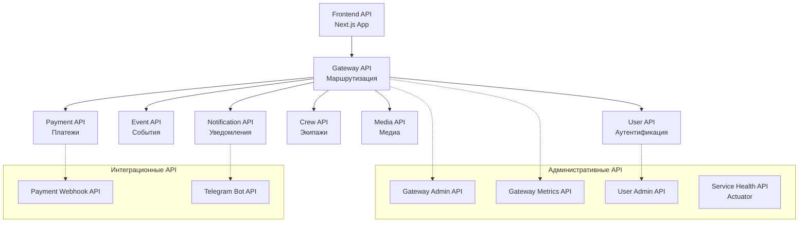

# Проектирование API

## Обзор API контрактов

Проект AquaStream использует **Design-First подход** с OpenAPI 3.0.3 спецификациями в папке `api-contracts/`.

### Архитектура API



## Категории API контрактов

### 🎯 Основные бизнес-API (7 контрактов)

| Контракт | Назначение | Порт | Ключевые функции |
|----------|------------|------|------------------|
| `backend-user-api.yaml` | Управление пользователями | 8101 | Регистрация, аутентификация, профили |
| `backend-event-api.yaml` | События и бронирования | 8102 | CRUD событий, бронирования, избранное |
| `backend-crew-api.yaml` | Управление экипажами | 8103 | Команды, участники, назначения |
| `backend-payment-api.yaml` | Платежи и транзакции | 8104 | Обработка платежей, интеграции |
| `backend-notification-api.yaml` | Система уведомлений | 8105 | Email, SMS, Push, Telegram |
| `backend-media-api.yaml` | Управление медиафайлами | 8106 | Загрузка, обработка, хранение |
| `frontend-api.yaml` | HTTP API фронтенда | 3000 | SSR страницы, API proxy |

### 🔧 Административные и мониторинговые API (3 контракта)

| Контракт | Назначение | Ключевые функции |
|----------|------------|------------------|
| `backend-gateway-admin-api.yaml` | Администрирование Gateway | Health checks, управление маршрутами |
| `backend-gateway-metrics-api.yaml` | Метрики производительности | Временные ряды, алерты, аналитика |
| `service-health-api.yaml` | Spring Boot Actuator | Liveness/Readiness probes, метрики JVM |

### 🔗 Интеграционные API (3 контракта)

| Контракт | Назначение | Поддерживаемые провайдеры |
|----------|------------|---------------------------|
| `payment-webhook-api.yaml` | Webhook платежных систем | Tinkoff, Sberbank, YooKassa |
| `telegram-bot-api.yaml` | Интеграция с Telegram | Bot API, уведомления, команды |
| `user-admin-api.yaml` | Административное управление | Модерация, роли, аналитика |

## Стандарты проектирования

### Именование

**Endpoints:**
```
/api/v1/{resource}         # Коллекция
/api/v1/{resource}/{id}    # Конкретный ресурс
/api/v1/admin/{resource}   # Административные операции
```

**HTTP методы:**
- `GET` - получение данных
- `POST` - создание ресурса
- `PUT` - полное обновление
- `PATCH` - частичное обновление
- `DELETE` - удаление

**Status codes:**
- `200` - успешная операция
- `201` - ресурс создан
- `204` - успешно, без содержимого
- `400` - некорректный запрос
- `401` - не авторизован
- `403` - доступ запрещен
- `404` - ресурс не найден
- `409` - конфликт
- `500` - внутренняя ошибка сервера

### Безопасность

**Аутентификация:**
```yaml
components:
  securitySchemes:
    bearerAuth:
      type: http
      scheme: bearer
      bearerFormat: JWT
```

**Авторизация по ролям:**
- `USER` - базовые операции
- `ORGANIZER` - создание событий
- `ADMIN` - административные функции
- `SUPER_ADMIN` - полный доступ

### Структура схем

**Базовые DTO:**
```yaml
components:
  schemas:
    # Стандартные поля
    BaseEntity:
      type: object
      properties:
        id:
          type: string
          format: uuid
        createdAt:
          type: string
          format: date-time
        updatedAt:
          type: string
          format: date-time

    # Ошибки
    ErrorResponse:
      type: object
      properties:
        error:
          type: string
        message:
          type: string
        timestamp:
          type: string
          format: date-time
      required:
        - error
        - message
        - timestamp

    # Пагинация
    PageableResponse:
      type: object
      properties:
        content:
          type: array
          items:
            type: object
        pagination:
          $ref: '#/components/schemas/Pagination'
```

## Workflow разработки

### 1. Design-First подход

```bash
# 1. Создать/изменить спецификацию
vi api-contracts/new-service-api.yaml

# 2. Сгенерировать документацию
make docs-api

# 3. Проверить результат
make docs-serve
# → http://localhost:8000/api/
```

### 2. Валидация

```bash
# Проверка синтаксиса OpenAPI
npx @stoplight/spectral-cli lint api-contracts/*.yaml

# Проверка ссылок в документации
make docs-check-links
```

### 3. Интеграция с кодом

**Spring Boot аннотации:**
```java
@RestController
@RequestMapping("/api/v1/users")
@OpenAPIDefinition(
    info = @Info(title = "User API", version = "1.0.0")
)
public class UserController {

    @Operation(summary = "Get user profile")
    @ApiResponse(responseCode = "200", description = "User profile")
    @GetMapping("/{id}")
    public UserProfile getUser(@PathVariable UUID id) {
        // implementation
    }
}
```

### 4. Тестирование API

**Contract Testing:**
```typescript
// Frontend mock с MSW
import { rest } from 'msw'

export const userHandlers = [
  rest.get('/api/v1/users/:id', (req, res, ctx) => {
    return res(ctx.json({
      id: req.params.id,
      email: 'user@example.com',
      displayName: 'Test User'
    }))
  })
]
```

## Мониторинг и метрики

### Health Checks

Все сервисы предоставляют стандартные health endpoints:

```yaml
/actuator/health          # Общее состояние
/actuator/health/liveness # Kubernetes liveness probe
/actuator/health/readiness # Kubernetes readiness probe
```

### Метрики

Gateway собирает агрегированные метрики:

```yaml
/api/v1/admin/metrics/series    # Временные ряды
/api/v1/admin/metrics/summary   # Сводная статистика
/api/v1/admin/metrics/alerts    # Активные алерты
```

## Лучшие практики

### 1. Совместимость

- Используйте семантическое версионирование
- Добавляйте новые поля как опциональные
- Не удаляйте существующие поля
- Версионируйте breaking changes

### 2. Производительность

- Используйте пагинацию для больших коллекций
- Поддерживайте фильтрацию и сортировку
- Минимизируйте размер ответов
- Кэшируйте статические данные

### 3. Безопасность

- Валидируйте все входные данные
- Используйте HTTPS в production
- Логируйте все административные операции
- Регулярно ротируйте секреты

### 4. Документация

- Добавляйте описания и примеры
- Документируйте все error codes
- Поддерживайте актуальность
- Используйте tags для группировки

## Ссылки

- [OpenAPI 3.0.3 Specification](https://spec.openapis.org/oas/v3.0.3)
- [Contributor Guide](../contributor-guide.md)
- [ADR-0003: API Autogen Strategy](../adr/adr-0003-api-redoc.md)