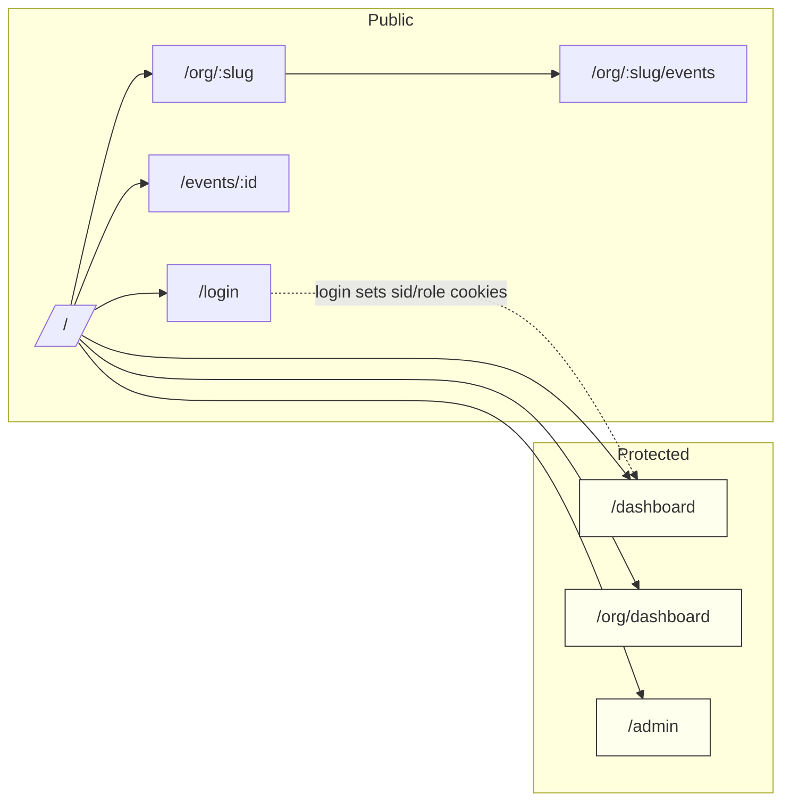
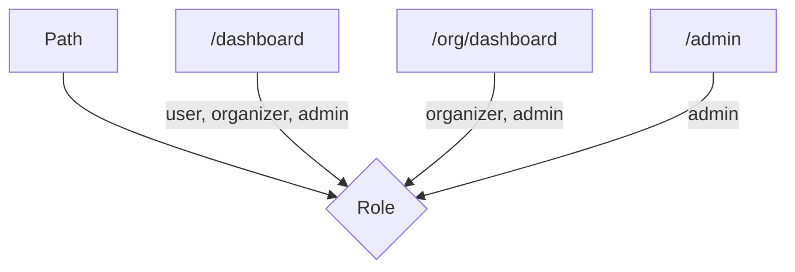

## Технический стек и стандарты
- **Node.js 22 LTS**, **pnpm**, Docker base `node:22-alpine`.
- **Next.js 15 (App Router, RSC/ISR, Route Handlers)**, **React 19**.
- **TypeScript** strict, **ESLint 9 (flat)**, **Prettier 3**.
- **Tailwind v4**, плагин `@tailwindcss/forms` по необходимости.
- **TanStack Query**, **react-hook-form** + **zod**, **lucide-react**, **msw** (dev).
- **Sentry** (prod only).

## Документация
- Бизнес‑спецификация: [`./docs/AquaStream_Business_Spec_v1.1.md`](./docs/AquaStream_Business_Spec_v1.1.md)
- Моки (MSW): [`./docs/mocks.md`](./docs/mocks.md)
- Платежи и вебхуки: [`./docs/payments.md`](./docs/payments.md)

## Запуск фронтенда локально
- Требования: Node.js 22 LTS, pnpm.

1) Установка зависимостей

```bash
pnpm install
```

2) Режим разработки (по умолчанию: http://localhost:3000)

```bash
pnpm dev
# опционально использовать порт 3100
# PORT=3100 pnpm dev
# режим с моками (MSW Node + браузер) на 3101
NEXT_PUBLIC_USE_MOCKS=true NEXT_PUBLIC_API_BASE_URL=http://localhost:3101 PORT=3101 pnpm dev
```

3) Продакшен‑сборка и запуск

```bash
pnpm build
pnpm exec tsc --noEmit 
pnpm start  # http://localhost:3000
```

4) Проверки качества

```bash
pnpm lint
pnpm typecheck
```

## E2E (Playwright)

1) Установка браузеров (один раз)

```bash
pnpm exec playwright install --with-deps
```

2) Запуск smoke‑тестов (автозапуск dev‑сервера на 3101)

```bash
pnpm exec playwright test
# опции: --headed, --project=chromium
# при необходимости можно переопределить базовый URL:
# PLAYWRIGHT_BASE_URL=http://localhost:3101 pnpm exec playwright test
```

## ENV

| Переменная | Область | Значение по умолчанию | Назначение |
|---|---|---|---|
| `NODE_ENV` | server | `development` | Режим окружения |
| `PORT` | server | `3000` | Порт dev/prod сервера Next.js |
| `NEXT_PUBLIC_USE_MOCKS` | client | `false` | Включение MSW (браузер/SSR) для разработки |
| `NEXT_PUBLIC_API_BASE_URL` | client/server | — | Базовый origin для SSR‑fetch и моков (напр., `http://localhost:3101`) |
| `PAYMENTS_PROVIDER` | server | `yookassa` | Моковый провайдер платежей (например, `yookassa|cloudpayments|stripe`) |
| `SENTRY_DSN` / `NEXT_PUBLIC_SENTRY_DSN` | server/client | — | DSN Sentry (используется только в prod) |
| `SENTRY_ENV` / `NEXT_PUBLIC_SENTRY_ENV` | server/client | `production` | Окружение для Sentry |

## Порты и профили

- Dev локально: `3000` (или переопределите `PORT`)
- Dev с моками: `3101` (`NEXT_PUBLIC_USE_MOCKS=true PORT=3101`)
- Docker dev‑профиль: `3100`
- Docker prod‑профиль: `3000`

## Диаграммы (Mermaid)

Маршрутизация и гарды:



RBAC (упрощённо):



## Запуск в Docker
Из корня репозитория:

5) Dev-профиль (моки включены, порт 3100)

```bash
docker compose -f infra/docker/compose/docker-compose.frontend.yml --profile dev up --build
# открыть http://localhost:3100
```

6) Prod-профиль (standalone, порт 3000)

```bash
docker compose -f infra/docker/compose/docker-compose.frontend.yml --profile prod up --build
# открыть http://localhost:3000
```

Остановка:

```bash
docker compose -f infra/docker/compose/docker-compose.frontend.yml --profile dev down
```

## Conventional Commits
- Типы: `feat`, `fix`, `docs`, `style`, `refactor`, `perf`, `test`, `build`, `ci`, `chore`, `revert`.
- Формат: `<type>(<scope>): <subject>` — пример: `feat(T02): добавить CI workflow`.