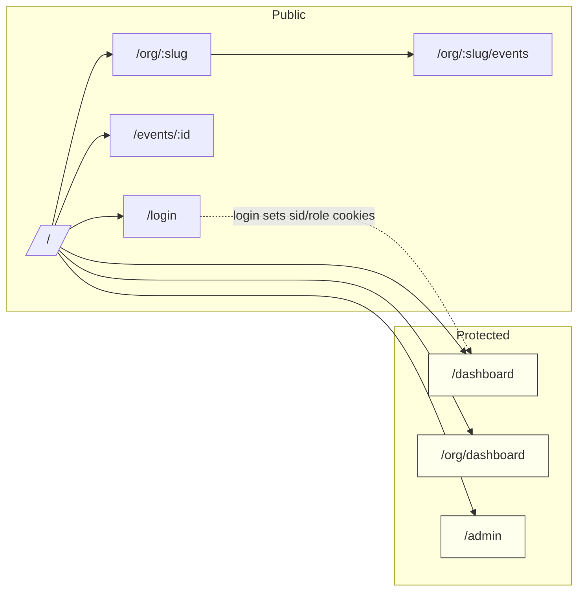
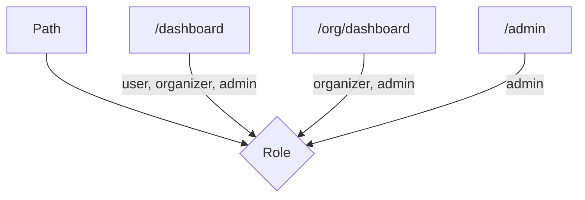

## AquaStream Frontend — DevEx README

Этот документ — быстрый и практичный гид по запуску, разработке и отладке фронтенда AquaStream.

### Содержание
- Быстрый старт
- Скрипты и задачи
- Окружение (ENV)
- Режимы запуска (локально, с моками, Docker)
- Качество кода (lint, types, форматирование)
- Тесты (Playwright)
- Отладка и советы
- Диаграммы и ссылки
- Conventional Commits

### Быстрый старт
1) Установите зависимости
```bash
pnpm install
```
2) Запустите дев‑сервер (по умолчанию http://localhost:3000)
```bash
pnpm dev
```
3) Разработка с моками (SSR+браузер), порт 3101
```bash
NEXT_PUBLIC_USE_MOCKS=true NEXT_PUBLIC_API_BASE_URL=http://localhost:3101 PORT=3101 pnpm dev
```

### Скрипты и задачи
```bash
# дев‑сервер / прод‑сборка / старт
pnpm dev
pnpm build
pnpm start

# качество
pnpm lint
pnpm typecheck

# e2e
pnpm exec playwright install --with-deps
pnpm exec playwright test
pnpm exec playwright test tests/e2e/waitlist.spec.ts
```

### Окружение (ENV)
| Переменная | Область | По умолчанию | Назначение |
|---|---|---|---|
| `NODE_ENV` | server | `development` | Режим окружения |
| `PORT` | server | `3000` | Порт Next.js |
| `NEXT_PUBLIC_APP_ENV` | client | `dev` | Метка окружения |
| `NEXT_PUBLIC_USE_MOCKS` | client | `false` | Включение MSW (SSR/браузер) |
| `NEXT_PUBLIC_API_BASE_URL` | client/server | — | Origin API для SSR и моков |
| `PAYMENTS_PROVIDER` | server | `yookassa` | Мок‑провайдер платежей |
| `PAYMENTS_PUBLIC_KEY` | client | — | Публичный ключ виджета |
| `PAYMENTS_SUCCESS_URL` | client/server | — | URL успеха оплаты |
| `PAYMENTS_CANCEL_URL` | client/server | — | URL отмены |
| `NEXT_PUBLIC_TELEGRAM_BOT_NAME` | client | — | Имя бота Телеграм |
| `SENTRY_DSN` / `NEXT_PUBLIC_SENTRY_DSN` | server/client | — | DSN (prod) |
| `SENTRY_ENV` / `NEXT_PUBLIC_SENTRY_ENV` | server/client | `production` | Окружение Sentry |

Подсказка: создайте `.env.local` на основе списка выше.

### Режимы запуска
- Обычный dev: `pnpm dev` → http://localhost:3000
- Dev с моками: `NEXT_PUBLIC_USE_MOCKS=true PORT=3101 pnpm dev` → http://localhost:3101
- Docker dev:
```bash
docker compose -f infra/docker/compose/docker-compose.frontend.yml --profile dev up --build
```
- Docker prod:
```bash
docker compose -f infra/docker/compose/docker-compose.frontend.yml --profile prod up --build
```

### Качество кода
- ESLint 9 (flat) и Prettier 3 уже настроены
- TypeScript strict включён
- UI: строго Tailwind v4 + shadcn/ui (без кастомного CSS)

```bash
pnpm lint && pnpm typecheck
```

### Тесты (Playwright)
- Установка браузеров (один раз): `pnpm exec playwright install --with-deps`
- Запуск всех тестов: `pnpm exec playwright test`
- Smoke тест waitlist: `pnpm exec playwright test tests/e2e/waitlist.spec.ts`
- В конфиге включён автозапуск дев‑сервера на 3101

### Отладка и советы
- SSR‑fetch использует абсолютный origin (см. `shared/http.ts` → `serverFetch`).
- Для моков включите `NEXT_PUBLIC_USE_MOCKS=true`; SSR‑моки стартуют через `instrumentation.ts`.
- Ошибки в проде отправляются в Sentry (client/server).

### Диаграммы
Маршрутизация и RBAC (Mermaid):





### Ссылки
- Бизнес‑спецификация: `./docs/AquaStream_Business_Spec_v1.1.md`
- Моки (MSW): `./docs/mocks.md`
- Платежи/вебхуки: `./docs/payments.md`

### Conventional Commits
- Типы: `feat`, `fix`, `docs`, `style`, `refactor`, `perf`, `test`, `build`, `ci`, `chore`, `revert`
- Формат: `<type>(<scope>): <subject>` (пример: `feat(T02): добавить CI workflow`)