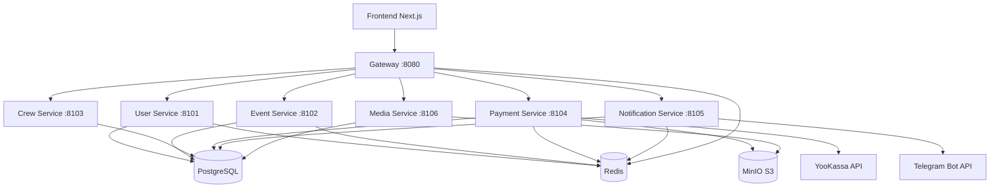

# AquaStream Backend - Developer Guide

Полная документация для разработчиков по настройке, запуску и работе с backend-сервисами AquaStream.

## 📋 Оглавление

- [Быстрый старт](#быстрый-старт)
- [Архитектура](#архитектура)
- [Настройка окружения](#настройка-окружения)
- [Запуск проекта](#запуск-проекта)
- [Переменные окружения](#переменные-окружения)
- [База данных](#база-данных)
- [Бэкапы и восстановление](#бэкапы-и-восстановление)
- [CI/CD процессы](#cicd-процессы)
- [Релизы](#релизы)
- [Мониторинг и отладка](#мониторинг-и-отладка)
- [Типичные ошибки](#типичные-ошибки)
- [FAQ](#faq)

## 🚀 Быстрый старт {#быстрый-старт}

### Требования
- **Java 21** (Eclipse Temurin или OpenJDK)
- **Docker** и **Docker Compose**
- **Git**
- **Make** (опционально, для удобства)

### Клонирование и первый запуск
```bash
# Клонируем репозиторий
git clone https://github.com/your-org/aquastream.git
cd aquastream

# Запускаем dev окружение
make up-dev

# Или без Make:
docker compose -f infra/docker/compose/docker-compose.yml --profile dev up -d

# Проверяем что все работает
make smoke
curl http://localhost:8080/actuator/health
```

### Порты сервисов (dev режим)
- **Gateway**: http://localhost:8080
- **User API**: http://localhost:8101
- **Event API**: http://localhost:8102
- **Crew API**: http://localhost:8103
- **Payment API**: http://localhost:8104
- **Notification API**: http://localhost:8105
- **Media API**: http://localhost:8106
- **PostgreSQL**: localhost:5432
- **Redis**: localhost:6379
- **MinIO**: localhost:9000 (UI: localhost:9001)

## 🏗️ Архитектура {#архитектура}

### Микросервисная архитектура



### Сервисы

| Сервис | Назначение | База схем | Внешние API |
|--------|------------|-----------|-------------|
| **Gateway** | Маршрутизация, CORS, Rate Limiting | - | - |
| **User** | Аутентификация, профили, роли | `user` | Telegram Bot |
| **Event** | События, листы ожидания | `event` | - |
| **Crew** | Команды, назначения | `crew` | - |
| **Payment** | Платежи, бронирования | `payment` | YooKassa |
| **Notification** | Уведомления | `notification` | Telegram Bot |
| **Media** | Файлы, изображения | `media` | MinIO S3 |

### Технологический стек
- **Backend**: Java 21, Spring Boot 3.x, Spring WebFlux (Gateway)
- **Database**: PostgreSQL 16 (одна БД, схемы на сервис)
- **Cache**: Redis 7
- **Storage**: MinIO (S3-compatible)
- **Migrations**: Liquibase
- **Monitoring**: Spring Boot Actuator
- **Error Handling**: RFC 7807 Problem Details
- **Rate Limiting**: Bucket4j (soft limits)
- **CI/CD**: GitHub Actions
- **Container**: Docker, Docker Compose

## ⚙️ Настройка окружения {#настройка-окружения}

### 1. Установка Java 21
```bash
# macOS (Homebrew)
brew install openjdk@21

# Ubuntu/Debian
sudo apt update
sudo apt install openjdk-21-jdk

# Windows (Chocolatey)
choco install openjdk21

# Проверка
java -version
javac -version
```

### 2. Установка Docker
```bash
# macOS (Homebrew)
brew install --cask docker

# Ubuntu/Debian
curl -fsSL https://get.docker.com -o get-docker.sh
sh get-docker.sh
sudo usermod -aG docker $USER

# Проверка
docker --version
docker-compose --version
```

### 3. Настройка переменных окружения
Создайте файл `.env` в корне проекта:

```bash
# .env файл (создайте в корне проекта)
cp .env.example .env
```

**Базовый .env для разработки:**
```bash
# PostgreSQL
POSTGRES_DB=aquastream
POSTGRES_USER=aquastream
POSTGRES_PASSWORD=postgres
POSTGRES_PORT=5432

# Redis
REDIS_PASSWORD=redis
REDIS_PORT=6379

# MinIO
MINIO_ROOT_USER=minio
MINIO_ROOT_PASSWORD=minio123
MINIO_PORT=9000
MINIO_CONSOLE_PORT=9001

# JWT
JWT_SECRET=your-super-secret-jwt-key-256-bits-long

# Telegram Bot (опционально для разработки)
TELEGRAM_BOT_TOKEN=your_bot_token_here

# YooKassa (опционально для разработки)
YOOKASSA_SHOP_ID=your_shop_id
YOOKASSA_SECRET_KEY=your_secret_key

# Spring Profiles
SPRING_PROFILES_ACTIVE=dev

# CORS
GATEWAY_CORS_ALLOWED_ORIGINS=http://localhost:3000
```

## 🚀 Запуск проекта {#запуск-проекта}

### Через Make (рекомендуется)
```bash
# Development окружение
make up-dev

# Staging окружение  
make up-stage

# Production окружение
make up-prod

# Остановка всех сервисов
make down

# Просмотр логов
make logs

# Статус сервисов
make ps

# Health check
make smoke
```

### Через Docker Compose напрямую {#docker-compose}
```bash
# Development
docker compose -f infra/docker/compose/docker-compose.yml --profile dev up -d

# Staging
docker compose -f infra/docker/compose/docker-compose.yml --profile stage up -d

# Production
docker compose -f infra/docker/compose/docker-compose.yml --profile prod up -d

# Остановка
docker compose -f infra/docker/compose/docker-compose.yml down -v

# Логи
docker compose -f infra/docker/compose/docker-compose.yml logs -f
```

### Локальная разработка (без Docker) {#local-dev}

#### 1. Запуск инфраструктуры
```bash
# Только инфраструктурные сервисы
docker compose -f infra/docker/compose/docker-compose.yml up postgres redis minio -d
```

#### 2. Запуск сервисов в IDE

**Для IntelliJ IDEA / Eclipse:**
1. Импортируйте проект как Gradle Multi-Module
2. Настройте конфигурации запуска для каждого *-api модуля
3. Укажите active profile: `dev`
4. Установите переменные окружения

**Пример конфигурации для User Service:**
- Main class: `org.aquastream.user.api.UserApiApplication`
- Active profiles: `dev`
- Environment variables: все из `.env` файла
- Program arguments: нет

#### 3. Gradle команды
```bash
# Компиляция всех модулей
./gradlew build

# Компиляция конкретного сервиса
./gradlew :backend-user:backend-user-api:build

# Запуск тестов
./gradlew test

# Запуск конкретного сервиса
./gradlew :backend-user:backend-user-api:bootRun

# Создание JAR файлов
./gradlew :backend-user:backend-user-api:bootJar
```

## 📝 Переменные окружения {#переменные-окружения}

### Категории переменных

#### PostgreSQL
```bash
POSTGRES_DB=aquastream          # Имя базы данных
POSTGRES_USER=aquastream        # Пользователь БД
POSTGRES_PASSWORD=postgres      # Пароль БД
POSTGRES_PORT=5432             # Порт БД
```

#### Redis
```bash
REDIS_PASSWORD=redis           # Пароль Redis
REDIS_PORT=6379               # Порт Redis
REDIS_HOST=redis              # Хост Redis (для Docker)
```

#### Security
```bash
JWT_SECRET=your-256-bit-secret # JWT подпись (обязательно 256+ бит)
```

#### External APIs
```bash
# Telegram Bot
TELEGRAM_BOT_TOKEN=bot123:ABC  # Токен Telegram бота
TELEGRAM_WEBHOOK_URL=https://  # Webhook URL для бота
TELEGRAM_WEBHOOK_SECRET=secret # Секрет для webhook

# YooKassa
YOOKASSA_SHOP_ID=123456       # ID магазина
YOOKASSA_SECRET_KEY=secret    # Секретный ключ
```

#### S3/MinIO
```bash
S3_ENDPOINT=http://minio:9000     # Endpoint S3
S3_ACCESS_KEY=minio              # Access Key
S3_SECRET_KEY=minio123           # Secret Key
MINIO_ROOT_USER=minio            # Root пользователь MinIO
MINIO_ROOT_PASSWORD=minio123     # Root пароль MinIO
```

#### Spring Configuration
```bash
SPRING_PROFILES_ACTIVE=dev    # Активный профиль: dev/stage/prod
```

#### CORS & Networking
```bash
GATEWAY_CORS_ALLOWED_ORIGINS=http://localhost:3000  # Разрешенные origins
```

### Профили окружения

#### Development (`dev`)
- H2 in-memory база для быстрой разработки
- Моки для внешних API включены
- Подробное логирование
- Все Actuator endpoint'ы доступны
- CORS разрешен для localhost

#### Staging (`stage`)
- PostgreSQL база данных
- Настоящие внешние API
- Ограниченное логирование
- Только основные Actuator endpoint'ы
- Базовая безопасность

#### Production (`prod`)
- PostgreSQL база данных
- Настоящие внешние API
- Минимальное логирование
- Только health check endpoint'ы
- Полная безопасность

## 🗄️ База данных {#база-данных}

### Схемы PostgreSQL
```sql
-- Схемы сервисов (создаются автоматически)
CREATE SCHEMA IF NOT EXISTS "user";
CREATE SCHEMA IF NOT EXISTS "event";  
CREATE SCHEMA IF NOT EXISTS "crew";
CREATE SCHEMA IF NOT EXISTS "payment";
CREATE SCHEMA IF NOT EXISTS "notification";
CREATE SCHEMA IF NOT EXISTS "media";
```

### Liquibase миграции

#### Структура миграций
```
backend-{service}/backend-{service}-db/src/main/resources/migration/liquibase/
├── master.xml              # Главный файл миграций
└── sql/
    ├── 0001_create_schema.sql    # Создание схемы
    ├── 0002_create_tables.sql    # Создание таблиц
    ├── 0003_indexes_constraints.sql  # Индексы и ограничения
    └── ...
```

#### Команды миграций
```bash
# Показать SQL, который будет выполнен (dry-run)
make liq-user-sql

# Выполнить миграции для user сервиса
make liq-user-update

# Для других сервисов аналогично:
./gradlew :backend-event:backend-event-api:liquibaseUpdateSQL
./gradlew :backend-event:backend-event-api:liquibaseUpdate
```

#### Создание новой миграции
```bash
# 1. Создайте новый SQL файл
touch backend-user/backend-user-db/src/main/resources/migration/liquibase/sql/0004_add_user_preferences.sql

# 2. Добавьте в master.xml:
<changeSet id="0004" author="developer">
    <sqlFile path="sql/0004_add_user_preferences.sql"/>
</changeSet>

# 3. Проверьте SQL
make liq-user-sql

# 4. Примените миграцию
make liq-user-update
```

### Подключение к БД
```bash
# Через Docker
docker exec -it aquastream-postgres psql -U aquastream -d aquastream

# Локально (если PostgreSQL установлен)
psql -h localhost -p 5432 -U aquastream -d aquastream

# Просмотр таблиц в схеме
\dt user.*
\dt event.*
```

## 💾 Бэкапы и восстановление {#бэкапы-и-восстановление}

### Автоматические бэкапы

#### Создание бэкапа
```bash
# Создать бэкап всех схем
make backup

# Или напрямую
bash infra/backup/backup.sh
```

**Что происходит при бэкапе:**
1. Создаются дампы для каждой схемы: `user`, `event`, `crew`, `payment`, `notification`, `media`
2. Файлы сохраняются в `infra/backup/artifacts/`
3. Формат файлов: `{schema}_{YYYYMMDD}.dump`
4. Еженедельные копии (воскресенье): `weekly_{schema}_{YYYY-WW}.dump`
5. Ежемесячные копии (1 число): `monthly_{schema}_{YYYY-MM}.dump`

#### Политика retention
- **Ежедневные**: 7 дней
- **Еженедельные**: 4 недели  
- **Ежемесячные**: 3 месяца

### Восстановление из бэкапа

#### Восстановление одной схемы
```bash
# Синтаксис
make restore SCHEMA=<schema> FILE=<path>

# Примеры
make restore SCHEMA=user FILE=infra/backup/artifacts/user_20250818.dump
make restore SCHEMA=event FILE=infra/backup/artifacts/weekly_event_2025-33.dump

# Или напрямую
bash infra/backup/restore.sh user infra/backup/artifacts/user_20250818.dump
```

#### Восстановление всех схем
```bash
# Если у вас полный дамп
make restore SCHEMA=all FILE=infra/backup/artifacts/full_backup.dump
```

#### Восстановление в другую БД
```bash
# Временно измените переменные в .env
POSTGRES_DB=aquastream_test
POSTGRES_USER=test_user
POSTGRES_PASSWORD=test_pass

# Затем восстановите
make restore SCHEMA=user FILE=infra/backup/artifacts/user_20250818.dump
```

### Ручное создание бэкапов

#### Полный дамп
```bash
docker run --rm \
  --network aquastream-net \
  -e PGPASSWORD="postgres" \
  -v "$(pwd)/infra/backup/artifacts:/backup" \
  postgres:16-alpine \
  pg_dump -Fc -h postgres -U aquastream -d aquastream -f /backup/full_$(date +%Y%m%d).dump
```

#### Дамп конкретной схемы
```bash
docker run --rm \
  --network aquastream-net \
  -e PGPASSWORD="postgres" \
  -v "$(pwd)/infra/backup/artifacts:/backup" \
  postgres:16-alpine \
  pg_dump -Fc -h postgres -U aquastream -d aquastream -n user -f /backup/user_manual_$(date +%Y%m%d).dump
```

#### Дамп только данных (без схемы)
```bash
docker run --rm \
  --network aquastream-net \
  -e PGPASSWORD="postgres" \
  -v "$(pwd)/infra/backup/artifacts:/backup" \
  postgres:16-alpine \
  pg_dump -Fc -a -h postgres -U aquastream -d aquastream -n user -f /backup/user_data_$(date +%Y%m%d).dump
```

## 🔄 CI/CD процессы {#cicd-процессы}

### GitHub Actions Workflows

#### 1. CI Matrix (`ci-matrix.yml`)
**Триггеры:** Push to main/develop, Pull Requests
```yaml
Strategy:
  - Backend CI (Java 21, Gradle)
  - Frontend CI (Node.js 18, pnpm)
  - Integration Tests
  - Security Scans
  - Dependency Checks
```

#### 2. Backend CI (`backend-ci.yml`)
**Триггеры:** Changes in `backend-*/**`, `common/**`
```bash
Steps:
1. Setup Java 21 + Node.js
2. Gradle build (all modules)
3. Unit tests
4. Upload artifacts
```

#### 3. Service CI (`ci-service.yml`)
**Reusable workflow для отдельных сервисов**
```bash
Parameters:
- service_name: backend-notification
- image_name: aquastream-backend-notification  
- dockerfile: infra/docker/images/Dockerfile.notification

Steps:
1. Gradle build + tests
2. Liquibase dry-run
3. Docker build + push
4. Tag images (vX.Y.Z or latest)
```

#### 4. Release (`release.yml`)
**Триггеры:** Git tags `v*`
```bash
Services:
- backend-gateway ✅
- backend-notification ✅
- backend-user (disabled)
- backend-event (disabled)
- backend-crew (disabled)
- backend-payment (disabled)
- backend-media (disabled)

Steps:
1. Build & test each service
2. Create Docker images
3. Push to GHCR
4. Create GitHub Release
```

#### 5. Deploy (`deploy.yml`)
**Триггеры:** Manual (workflow_dispatch)
```bash
Environments: staging, production
Steps:
1. Workflow lint
2. Docker buildx
3. Environment-specific deployment
```

### CI/CD конфигурация

#### Secrets (GitHub)
```bash
# Required secrets in repository settings
GITHUB_TOKEN              # Автоматически предоставляется
REGISTRY_USERNAME          # Опционально для custom registry
REGISTRY_TOKEN             # Опционально для custom registry

# Environment-specific secrets
POSTGRES_PASSWORD
REDIS_PASSWORD
TELEGRAM_BOT_TOKEN
YOOKASSA_SHOP_ID
YOOKASSA_SECRET_KEY
JWT_SECRET
```

#### Docker Registry
```bash
# GitHub Container Registry (GHCR)
Registry: ghcr.io
Images: 
  - ghcr.io/your-org/aquastream-backend-gateway:latest
  - ghcr.io/your-org/aquastream-backend-notification:latest
  - ghcr.io/your-org/aquastream-backend-notification:v1.0.1
```

### Запуск CI локально

#### Проверка билда
```bash
# Весь проект
./gradlew build

# Конкретный сервис
./gradlew :backend-notification:backend-notification-api:build

# С тестами
./gradlew clean build test
```

#### Проверка Docker образа
```bash
# Билд образа как в CI
./gradlew :backend-notification:backend-notification-api:bootJar

docker build \
  -f infra/docker/images/Dockerfile.notification \
  --build-arg JAR_FILE=backend-notification/backend-notification-api/build/libs/backend-notification-api-*.jar \
  -t aquastream-backend-notification:test .

# Запуск для тестирования
docker run --rm -p 8105:8105 \
  -e SPRING_PROFILES_ACTIVE=dev \
  aquastream-backend-notification:test
```

#### Act (запуск GitHub Actions локально)
```bash
# Установка act
brew install act

# Запуск workflow
act push -j backend-ci
```

## 🚀 Релизы {#релизы}

### Semantic Versioning (SemVer)

Проект следует [Semantic Versioning 2.0.0](https://semver.org/):

#### MAJOR.MINOR.PATCH
- **MAJOR** (X.0.0): Breaking changes, несовместимые изменения API
- **MINOR** (X.Y.0): Новая функциональность, обратно совместимая
- **PATCH** (X.Y.Z): Исправления багов, обратно совместимые

### Процесс релиза

#### 1. Подготовка релиза
```bash
# Убедитесь что main актуален
git checkout main
git pull origin main

# Проверьте что все тесты проходят
./gradlew clean build test

# Обновите CHANGELOG.md
vim CHANGELOG.md
```

#### 2. Создание релиза
```bash
# Создайте annotated tag
git tag -a v1.2.3 -m "Release v1.2.3

Added:
- Notification service
- Rate limiting

Fixed:
- Authentication issues
- Memory leaks"

# Отправьте tag (запустит автоматический релиз)
git push origin v1.2.3
```

#### 3. Автоматический процесс
GitHub Actions автоматически:
1. ✅ Соберет и протестирует все сервисы
2. ✅ Создаст Docker образы с тегами `v1.2.3` и `latest`
3. ✅ Загрузит образы в GHCR
4. ✅ Создаст GitHub Release с auto-generated notes

#### 4. Проверка релиза
```bash
# Проверьте статус workflow
https://github.com/your-org/aquastream/actions

# Проверьте созданный релиз
https://github.com/your-org/aquastream/releases

# Проверьте Docker образы
https://github.com/your-org/aquastream/pkgs/container/aquastream-backend-notification
```

### Hotfix процесс

#### Для критических исправлений:
```bash
# 1. Создайте hotfix ветку от тега
git checkout -b hotfix/v1.2.4 v1.2.3

# 2. Внесите минимальные изменения
git commit -m "fix: critical security vulnerability"

# 3. Создайте hotfix тег
git tag -a v1.2.4 -m "Hotfix v1.2.4 - Security patch"
git push origin v1.2.4

# 4. Merge обратно в main
git checkout main
git merge hotfix/v1.2.4
git push origin main
```

### Rollback процесс

#### Быстрый откат Docker образов
```bash
# В Kubernetes/Docker Compose
docker tag ghcr.io/your-org/aquastream-backend-notification:v1.2.2 \
           ghcr.io/your-org/aquastream-backend-notification:latest

# Перезапуск сервисов
make down && make up-prod
```

#### Откат базы данных
```bash
# Если есть бэкап перед релизом
make restore SCHEMA=all FILE=infra/backup/artifacts/pre_release_v1.2.3.dump
```

## 📊 Мониторинг и отладка {#мониторинг-и-отладка}

### Spring Boot Actuator

#### Health Checks
```bash
# Общее состояние
curl http://localhost:8105/actuator/health

# Liveness probe (Kubernetes)
curl http://localhost:8105/actuator/health/liveness

# Readiness probe (Kubernetes)  
curl http://localhost:8105/actuator/health/readiness

# Информация о сборке
curl http://localhost:8105/actuator/info
```

#### Metrics
```bash
# Список всех метрик
curl http://localhost:8105/actuator/metrics

# JVM memory
curl http://localhost:8105/actuator/metrics/jvm.memory.used

# HTTP requests
curl http://localhost:8105/actuator/metrics/http.server.requests

# Custom metrics (AquaStream)
curl http://localhost:8105/actuator/metrics/aquastream.notifications.sent
curl http://localhost:8105/actuator/metrics/aquastream.rate-limit.requests
```

### Логирование

#### Уровни логирования по профилям
```yaml
# Development
logging:
  level:
    org.aquastream: DEBUG
    org.springframework: INFO
    org.hibernate.SQL: DEBUG

# Staging  
logging:
  level:
    org.aquastream.notification: INFO
    org.springframework: WARN

# Production
logging:
  level:
    org.aquastream.notification: WARN
    org.springframework: ERROR
```

#### Просмотр логов
```bash
# Все сервисы
make logs

# Конкретный сервис
docker logs aquastream-backend-notification -f

# С фильтрацией
docker logs aquastream-backend-notification 2>&1 | grep ERROR

# Последние 100 строк
docker logs aquastream-backend-notification --tail 100
```

### Debugging

#### Remote Debug (IntelliJ IDEA)
```bash
# 1. Добавьте JVM опции в docker-compose.yml
environment:
  JAVA_TOOL_OPTIONS: >-
    -agentlib:jdwp=transport=dt_socket,server=y,suspend=n,address=*:5005
    
# 2. Откройте порт
ports:
  - "8105:8105"
  - "5005:5005"  # Debug port
  
# 3. В IDEA: Run > Edit Configurations > + > Remote JVM Debug
# Host: localhost, Port: 5005
```

#### Профилирование
```bash
# JVM memory dump
docker exec aquastream-backend-notification \
  jcmd 1 GC.run_finalization

# Thread dump  
docker exec aquastream-backend-notification \
  jcmd 1 Thread.print

# Heap dump
docker exec aquastream-backend-notification \
  jcmd 1 GC.class_histogram
```

### Performance Testing

#### Load Testing с Apache Bench
```bash
# Health endpoint
ab -n 1000 -c 10 http://localhost:8105/actuator/health

# API endpoint
ab -n 100 -c 5 -H "Accept: application/json" \
   http://localhost:8105/api/v1/notifications
```

#### Database Performance
```bash
# Подключение к БД
docker exec -it aquastream-postgres psql -U aquastream -d aquastream

# Медленные запросы
SELECT query, mean_exec_time, calls 
FROM pg_stat_statements 
ORDER BY mean_exec_time DESC LIMIT 10;

# Активные подключения
SELECT count(*) FROM pg_stat_activity;

# Размер таблиц
SELECT schemaname,tablename,pg_size_pretty(pg_total_relation_size(schemaname||'.'||tablename)) AS size
FROM pg_tables 
WHERE schemaname IN ('user','event','crew','payment','notification','media')
ORDER BY pg_total_relation_size(schemaname||'.'||tablename) DESC;
```

## ❗ Типичные ошибки {#типичные-ошибки}

### 1. Docker & Compose проблемы

#### Ошибка: "network aquastream-net not found"
```bash
# Решение
docker network create aquastream-net

# Или пересоздать compose
make down && make up-dev
```

#### Ошибка: "port already in use"
```bash
# Найти процесс
lsof -i :8105

# Убить процесс  
kill -9 <PID>

# Или изменить порт в .env
NOTIFICATION_PORT=8106
```

#### Ошибка: "container name already exists"
```bash
# Удалить контейнер
docker rm aquastream-backend-notification

# Или форсированно
docker rm -f aquastream-backend-notification
```

### 2. База данных

#### Ошибка: "connection refused" к PostgreSQL
```bash
# Проверить статус
docker ps | grep postgres

# Логи PostgreSQL
docker logs aquastream-postgres

# Проверить health
docker inspect aquastream-postgres | grep Health

# Решение: перезапуск
docker restart aquastream-postgres
```

#### Ошибка: "schema does not exist"
```bash
# Создать схему вручную
docker exec -it aquastream-postgres psql -U aquastream -d aquastream
CREATE SCHEMA IF NOT EXISTS "notification";

# Или запустить миграции
./gradlew :backend-notification:backend-notification-api:liquibaseUpdate
```

#### Ошибка: "too many connections"
```bash
# Текущие подключения
docker exec aquastream-postgres psql -U aquastream -d aquastream \
  -c "SELECT count(*) FROM pg_stat_activity;"

# Убить idle подключения
docker exec aquastream-postgres psql -U aquastream -d aquastream \
  -c "SELECT pg_terminate_backend(pid) FROM pg_stat_activity WHERE state = 'idle';"
```

### 3. Java & Gradle

#### Ошибка: "Java version mismatch"
```bash
# Проверить версию
java -version
./gradlew -v

# Установить правильную версию
export JAVA_HOME=/path/to/java21

# В IntelliJ: File > Project Structure > Project SDK
```

#### Ошибка: "Gradle daemon issues"
```bash
# Остановить daemon
./gradlew --stop

# Очистить cache
rm -rf ~/.gradle/caches/

# Пересобрать
./gradlew clean build
```

#### Ошибка: "OutOfMemoryError" при сборке
```bash
# Увеличить память для Gradle
export GRADLE_OPTS="-Xmx4g -XX:MaxMetaspaceSize=1g"

# Или в gradle.properties
org.gradle.jvmargs=-Xmx4g -XX:MaxMetaspaceSize=1g
```

### 4. Spring Boot проблемы

#### Ошибка: "Port 8105 already in use"
```bash
# Найти процесс
netstat -tulpn | grep 8105
lsof -i :8105

# Изменить порт в application.yml
server:
  port: 8106
```

#### Ошибка: "Bean creation failed"
```bash
# Проверить конфигурацию
export SPRING_PROFILES_ACTIVE=dev

# Проверить зависимости в build.gradle
# Логи Spring Boot startup:
java -jar -Ddebug=true app.jar
```

#### Ошибка: "Actuator endpoints not found"
```bash
# Проверить конфигурацию
management:
  endpoints:
    web:
      exposure:
        include: health,info,metrics

# Проверить dependency
implementation 'org.springframework.boot:spring-boot-starter-actuator'
```

### 5. Redis проблемы

#### Ошибка: "Redis connection refused"
```bash
# Проверить Redis
docker ps | grep redis
docker logs aquastream-redis

# Тест подключения
docker exec aquastream-redis redis-cli -a redis PING

# Проверить password в .env
REDIS_PASSWORD=redis
```

#### Ошибка: "Redis authentication failed"
```bash
# Проверить пароль
docker exec aquastream-redis redis-cli -a redis AUTH redis

# Или подключиться без пароля (если disabled)
docker exec aquastream-redis redis-cli PING
```

### 6. Liquibase проблемы

#### Ошибка: "Checksum validation failed"
```bash
# Очистить checksums
./gradlew liquibaseClearChecksums

# Или mark changeset as ran
./gradlew liquibaseChangelogSync
```

#### Ошибка: "Lock database"
```bash
# Освободить lock
docker exec aquastream-postgres psql -U aquastream -d aquastream \
  -c "UPDATE public.databasechangeloglock SET locked=false;"
```

### 7. CI/CD проблемы

#### Ошибка: "GitHub Actions timeout"
```bash
# Проверить workflow файлы
.github/workflows/*.yml

# Локальный запуск с act
act push -j backend-ci

# Проверить secrets
GitHub → Settings → Secrets and variables → Actions
```

#### Ошибка: "Docker push failed"
```bash
# Проверить GHCR permissions
GitHub → Settings → Actions → General → Workflow permissions

# Проверить token
echo $GITHUB_TOKEN | docker login ghcr.io -u username --password-stdin
```

## ❓ FAQ {#faq}

### Q: Как добавить новый сервис?

**A:** Следуйте существующей структуре:

```bash
# 1. Создайте модули
mkdir -p backend-myservice/{backend-myservice-api,backend-myservice-service,backend-myservice-db}

# 2. Скопируйте build.gradle от существующего сервиса
cp backend-notification/backend-notification-api/build.gradle backend-myservice/backend-myservice-api/

# 3. Создайте основные классы:
# - Application.java
# - Schema migrations  
# - Controller, Service, Repository

# 4. Добавьте в settings.gradle
include 'backend-myservice'
include 'backend-myservice:backend-myservice-api'
include 'backend-myservice:backend-myservice-service'  
include 'backend-myservice:backend-myservice-db'

# 5. Добавьте в docker-compose.yml
# 6. Обновите CI/CD workflows
```

### Q: Как настроить SSL/TLS?

**A:** Для production используйте reverse proxy:

```yaml
# nginx.conf
server {
    listen 443 ssl;
    server_name api.aquastream.ru;
    
    ssl_certificate /etc/ssl/certs/aquastream.crt;
    ssl_certificate_key /etc/ssl/private/aquastream.key;
    
    location / {
        proxy_pass http://localhost:8080;
        proxy_set_header Host $host;
        proxy_set_header X-Real-IP $remote_addr;
        proxy_set_header X-Forwarded-For $proxy_add_x_forwarded_for;
        proxy_set_header X-Forwarded-Proto $scheme;
    }
}
```

### Q: Как масштабировать сервисы?

**A:** Используйте Docker Compose scaling:

```bash
# Масштабирование
docker-compose up -d --scale backend-notification=3

# С load balancer (nginx/traefik)
# Или Kubernetes deployment с replicas
```

### Q: Как настроить мониторинг?

**A:** Рекомендуемый стек:

```yaml
# Prometheus + Grafana
monitoring:
  prometheus:
    image: prom/prometheus
    volumes:
      - ./prometheus.yml:/etc/prometheus/prometheus.yml
    ports:
      - "9090:9090"
      
  grafana:
    image: grafana/grafana
    ports:
      - "3000:3000"
    environment:
      GF_SECURITY_ADMIN_PASSWORD: admin
```

### Q: Как настроить аутентификацию для Actuator?

**A:** В application-prod.yml:

```yaml
management:
  security:
    enabled: true
  endpoint:
    health:
      show-details: never
      
spring:
  security:
    user:
      name: admin
      password: ${ACTUATOR_PASSWORD}
      roles: ACTUATOR
```

### Q: Как отладить проблемы с производительностью?

**A:** Пошаговый план:

```bash
# 1. Проверьте метрики
curl http://localhost:8105/actuator/metrics/jvm.memory.used
curl http://localhost:8105/actuator/metrics/http.server.requests

# 2. Профилирование
# Добавьте в docker-compose.yml:
JAVA_TOOL_OPTIONS: >-
  -XX:+FlightRecorder 
  -XX:StartFlightRecording=duration=60s,filename=profile.jfr

# 3. Анализируйте логи
docker logs aquastream-backend-notification | grep "took"

# 4. Проверьте DB queries
SELECT query, mean_exec_time FROM pg_stat_statements 
ORDER BY mean_exec_time DESC LIMIT 10;
```

### Q: Как обновить зависимости?

**A:** Безопасное обновление:

```bash
# 1. Проверьте текущие версии
./gradlew dependencyUpdates

# 2. Обновите в build.gradle
# 3. Тестируйте локально
./gradlew clean build test

# 4. Проверьте security vulnerabilities
./gradlew dependencyCheckAnalyze

# 5. Commit и push для CI проверки
```

### Q: Как настроить CORS для frontend?

**A:** В Gateway конфигурации:

```yaml
# application.yml
gateway:
  cors:
    allowed-origins: 
      - http://localhost:3000
      - https://aquastream.ru
    allowed-methods: [GET, POST, PUT, DELETE, OPTIONS]
    allowed-headers: [Authorization, Content-Type]
    allow-credentials: true
```

### Q: Как backup автоматизировать в production?

**A:** Используйте cron job:

```bash
# crontab -e
# Ежедневный бэкап в 2:00
0 2 * * * /path/to/aquastream/infra/backup/backup.sh >> /var/log/aquastream-backup.log 2>&1

# Еженедельная очистка старых бэкапов  
0 3 * * 0 find /path/to/aquastream/infra/backup/artifacts -name "*.dump" -mtime +30 -delete
```

---

## 📞 Поддержка

### Контакты
- **DevOps Team**: devops@aquastream.org
- **Backend Team**: backend@aquastream.org  
- **Security**: security@aquastream.org

### Полезные ссылки
- [GitHub Repository](https://github.com/your-org/aquastream)
- [Issue Tracker](https://github.com/your-org/aquastream/issues)
- [CI/CD Dashboard](https://github.com/your-org/aquastream/actions)
- [Release Notes](https://github.com/your-org/aquastream/releases)

### Документация
- [API Documentation](https://api.aquastream.ru/swagger-ui.html)
- [Architecture Decision Records](../../adr/index.md)
- [Changelog](changelog.md)
- [Release Process](RELEASES.md)

---

**Последнее обновление**: 18 августа 2025  
**Версия документации**: 1.0  
**Авторы**: AquaStream Development Team