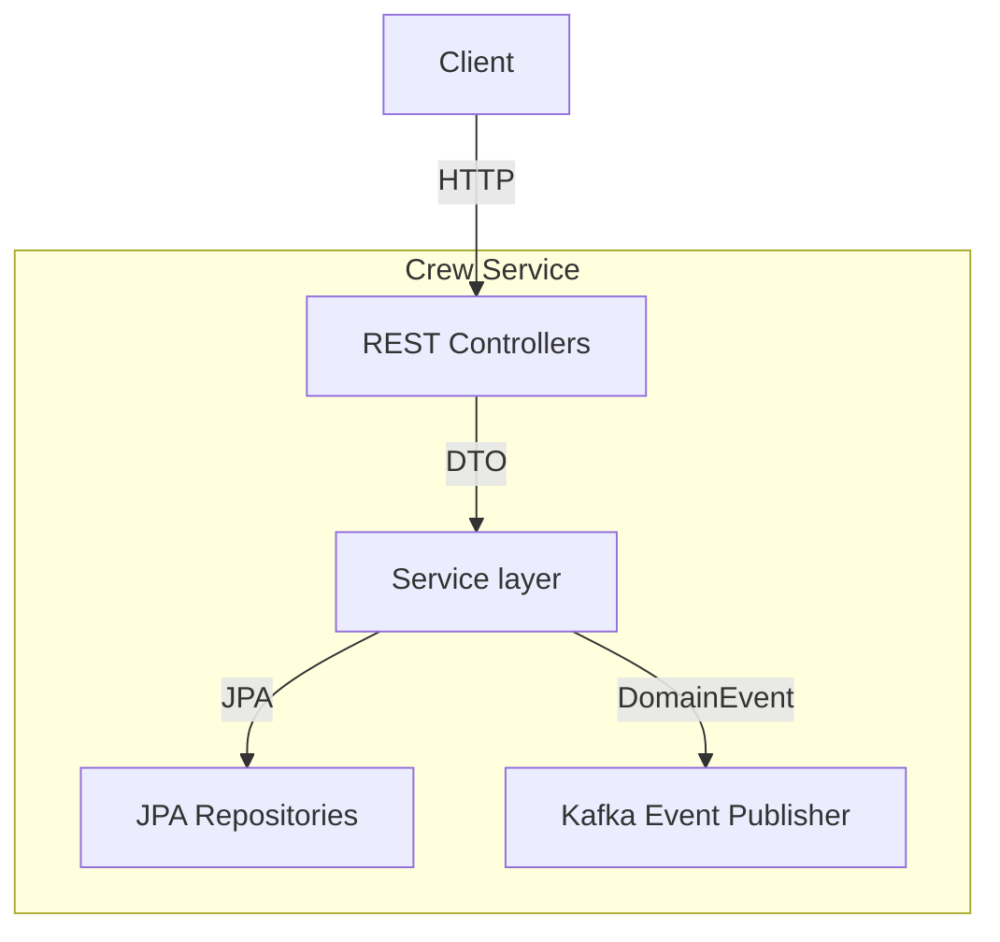
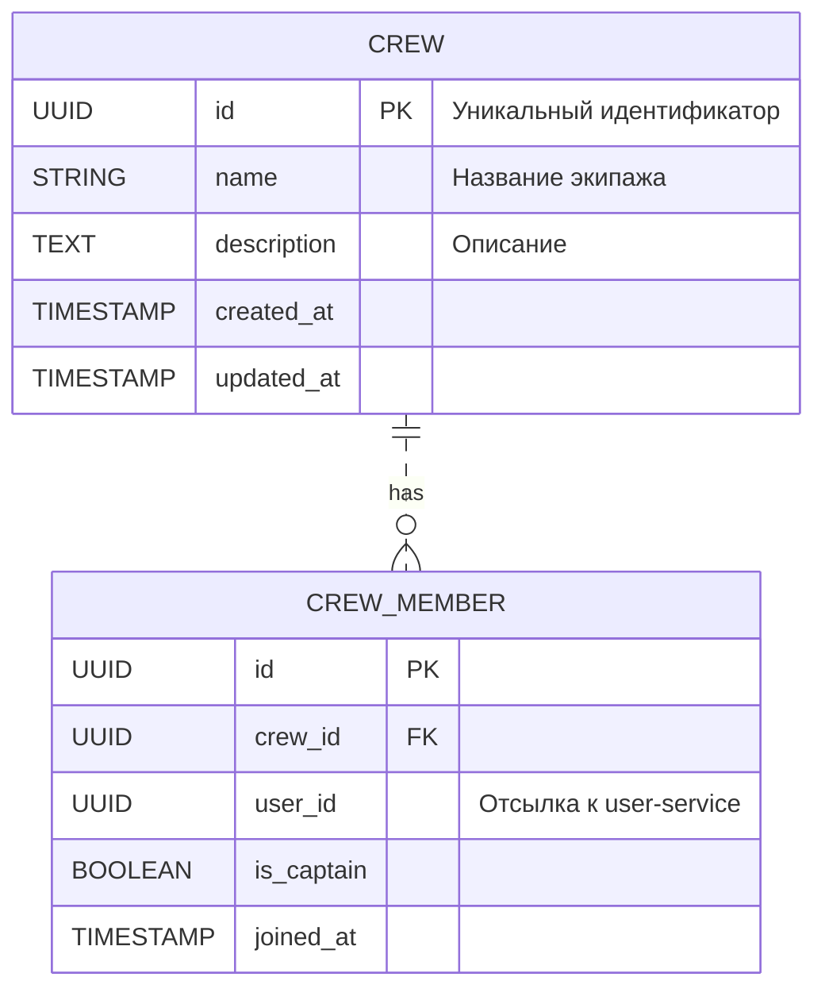

# Backend-Crew Service – Документация

> Версия: 0.1 (draft)

Микросервис **Backend-Crew** отвечает за управление экипажами (crew) и командами (team) в рамках платформы AquaStream.

*Статус разработки*: MVP, конечные точки API и бизнес-логика находятся в активной разработке.

---

## Назначение модуля

1. CRUD-операции над экипажами: создание, обновление, удаление, просмотр.
2. Управление составом команды: добавление/удаление участников, назначение капитана.
3. Предоставление REST API другим сервисам через API Gateway.
4. Публикация доменных событий (Kafka) для реакции других микросервисов (уведомления, планирование).
5. Хранение данных в PostgreSQL с использованием Spring Data JPA и миграций Liquibase.

---

## Подпроектная структура

| Подпроект | Описание |
|-----------|----------|
| `backend-crew-api`     | Публичные DTO, интерфейсы, mappers, которые импортируются другими сервисами.  |
| `backend-crew-db`      | DDL-миграции Liquibase, JPA-сущности, репозитории. |
| `backend-crew-service` | Spring Boot приложение с контроллерами, бизнес-логикой, топиками Kafka. |

Корень монорепы содержит скрипты и общий Gradle-кеш, что позволяет собирать все модули одной командой `./gradlew :backend-crew-service:bootRun`.

---

## Архитектура модуля



* Публичные DTO размещаются в `backend-crew-api` и переиспользуются контроллерами, продвигая *contract-first* подход.
* События домена публикуются в Kafka (топик `crew.events`), схема описывается в Avro-файле `CrewEvent.avsc` (будет добавлен).

---

## REST API (черновик)

| Метод | URL | Описание |
|-------|-----|----------|
| `GET` | `/api/v1/crews` | Список экипажей (пагинация) |
| `POST` | `/api/v1/crews` | Создать экипаж |
| `GET` | `/api/v1/crews/{id}` | Получить экипаж по ID |
| `PUT` | `/api/v1/crews/{id}` | Обновить экипаж |
| `DELETE` | `/api/v1/crews/{id}` | Удалить экипаж |
| `POST` | `/api/v1/crews/{id}/members` | Добавить участника |
| `DELETE` | `/api/v1/crews/{id}/members/{userId}` | Удалить участника |

Swagger UI будет доступен через API Gateway по адресу `/crew/swagger-ui.html`.

---

## Модель данных (ER-diagram, упрощённая)



---

## Конфигурация

### application.yml (по умолчанию)
```yaml
server:
  port: 8083
spring:
  application:
    name: crew-service
  datasource:
    url: jdbc:postgresql://localhost:5432/aquastream
    username: postgres
    password: postgres
  jpa:
    hibernate:
      ddl-auto: validate
    show-sql: false
```

Полная конфигурация и миграции хранятся в подпроекте `backend-crew-db`.

---

## События Kafka

| Событие | Описание | Топик |
|---------|----------|-------|
| `CrewCreated` | Создана новая команда | `crew.events` |
| `CrewMemberAdded` | Пользователь добавлен в экипаж | `crew.events` |
| `CrewMemberRemoved` | Пользователь удалён | `crew.events` |

Серилизация: JSON (будет заменено на Avro после согласования схемы).

---

## Тестирование

1. *Unit* – тесты сервисного слоя (`:backend-crew-service:test`).
2. *Integration* – Spring Boot Test + Testcontainers (PostgreSQL, Kafka).
3. Генерация отчёта покрытия Jacoco в CI.

---

## Разработка и запуск

```bash
# Сборка всех подпроектов
./gradlew :backend-crew-service:build

# Запуск локально
./gradlew :backend-crew-service:bootRun
```

Контейнеризацию см. `infra/docker/images/Dockerfile.backend-crew`.

---

## TODO
- [ ] Реализовать контроллеры и сервисный слой
- [ ] Настроить Avro-схемы для Kafka
- [ ] Добавить полноценные миграции Liquibase