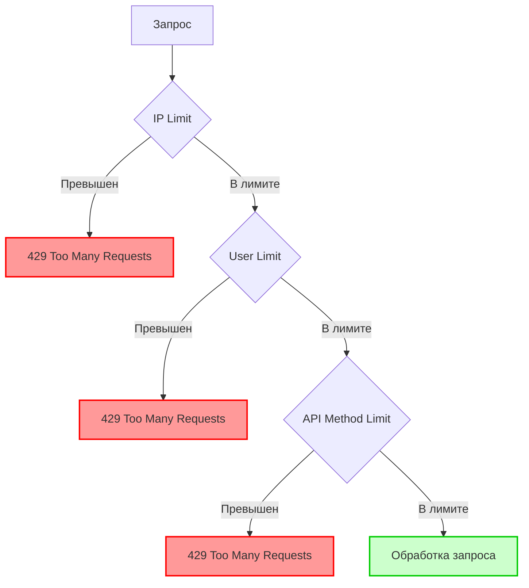
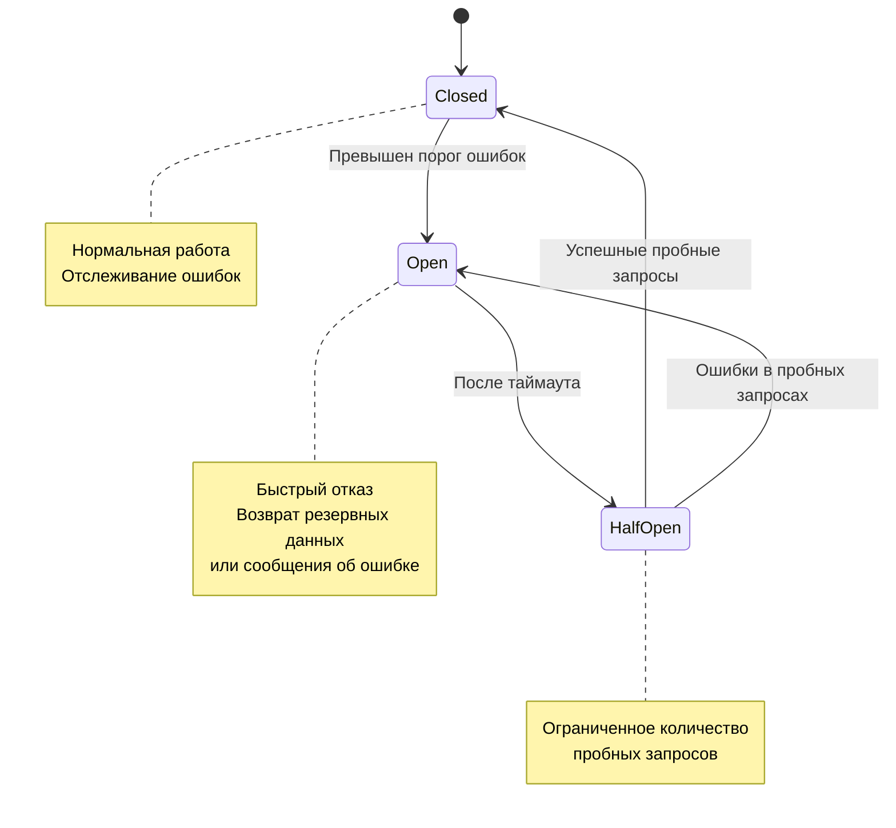
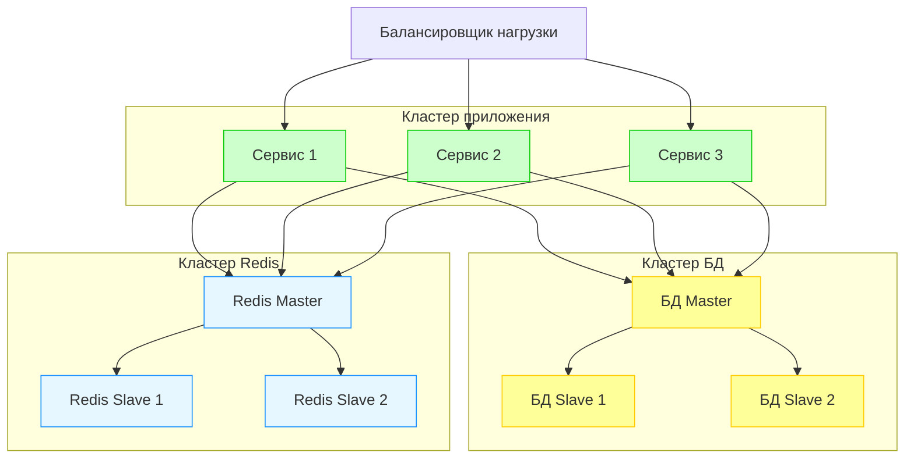

# Ограничения и производительность сервиса Backend-Event

Данный документ описывает лимиты, ограничения, рейт-лимиты и параметры производительности сервиса `backend-event`, направленные на обеспечение стабильной работы под нагрузкой и предотвращение перегрузки системы.

## 📑 Оглавление

1. [🔒 Лимиты и ограничения](#-лимиты-и-ограничения)
   - [Бизнес-лимиты](#бизнес-лимиты)
   - [Технические лимиты](#технические-лимиты)
   - [Лимиты валидации](#лимиты-валидации)
2. [⏱ Рейт-лимиты](#-рейт-лимиты)
   - [Типы ограничений](#типы-ограничений)
   - [Конфигурация по API-методам](#конфигурация-по-api-методам)
   - [Конфигурация по ролям](#конфигурация-по-ролям)
3. [⏰ Таймауты](#-таймауты)
   - [HTTP-запросы](#http-запросы)
   - [gRPC-запросы](#grpc-запросы)
   - [Операции с базой данных](#операции-с-базой-данных)
   - [Внешние интеграции](#внешние-интеграции)
4. [📊 Квоты и ограничения ресурсов](#-квоты-и-ограничения-ресурсов)
   - [Вычислительные ресурсы](#вычислительные-ресурсы)
   - [Ресурсы базы данных](#ресурсы-базы-данных)
   - [Масштабирование и отказоустойчивость](#масштабирование-и-отказоустойчивость)

## 🔒 Лимиты и ограничения

### Бизнес-лимиты

| Параметр | Значение | Описание | Обоснование |
|----------|---------|----------|------------|
| Максимальное количество участников события | 10,000 | Максимальная вместимость одного события | Для обеспечения корректной обработки бронирований и предотвращения чрезмерной нагрузки |
| Максимальное количество ценовых опций на событие | 10 | Ограничение на количество различных типов билетов | Для улучшения UX и упрощения управления |
| Максимальное количество изображений на событие | 20 | Ограничение на количество загруженных изображений | Для оптимизации хранения и загрузки страницы |
| Максимальное количество активных промокодов на событие | 50 | Лимит одновременно активных промокодов | Для упрощения администрирования и снижения нагрузки на проверку |
| Максимальное количество категорий для одного события | 5 | Максимальное количество категорий, к которым может относиться событие | Для обеспечения точности категоризации |
| Максимальное количество билетов в одном бронировании | 20 | Ограничение на количество билетов в одной транзакции | Для предотвращения массовых бронирований и скальпинга |
| Максимальное количество отзывов от одного пользователя | 1 | Ограничение количества отзывов на одно событие от одного пользователя | Для обеспечения честных оценок |
| Срок действия неоплаченного бронирования | 2 часа | Время, в течение которого бронирование находится в статусе PENDING_PAYMENT | Для предотвращения блокировки билетов на длительное время |

### Технические лимиты

| Параметр | Значение | Описание | Обоснование |
|----------|---------|----------|------------|
| Максимальный размер запроса | 10 MB | Лимит размера тела HTTP-запроса | Для предотвращения DoS-атак |
| Максимальный размер отдельного изображения | 5 MB | Ограничение на размер загружаемого изображения | Для оптимизации хранения и производительности |
| Максимальное количество одновременных соединений с БД | 50 | Лимит пула соединений с базой данных | Для предотвращения исчерпания ресурсов БД |
| Максимальное количество записей в выборке | 1,000 | Ограничение на количество записей при запросе списка | Для предотвращения исчерпания памяти и повышения производительности |
| Максимальный размер страницы при пагинации | 100 | Максимальное количество записей на одной странице | Для балансировки между производительностью и удобством использования |
| Максимальное количество одновременных запросов от одного IP | 100/мин | Защита от DoS-атак | Для обеспечения стабильности сервиса |
| Максимальное количество одновременных запросов к внешним API | 20 | Параллельные запросы к внешним сервисам | Для предотвращения блокировки внешними сервисами |
| Размер кэша Redis для часто запрашиваемых данных | 1 GB | Объем данных в кэше Redis | Для оптимального использования ресурсов |

### Лимиты валидации

| Поле | Минимум | Максимум | Ограничения | Описание |
|------|---------|---------|-------------|----------|
| Название события | 3 символа | 255 символов | Алфавитно-цифровые символы и знаки пунктуации | Обеспечивает информативность и ограничивает хранилище |
| Описание события | 10 символов | 5,000 символов | Без ограничений по символам | Предоставляет достаточно места для детального описания |
| Стоимость билета | 0 | 1,000,000 | Положительное число с двумя знаками после запятой | Предотвращает ввод отрицательных значений и гарантирует точность |
| Отзыв | 5 символов | 1,000 символов | Текст без HTML-тегов | Обеспечивает информативность отзыва и предотвращает XSS |
| Рейтинг | 1 | 5 | Целое число | Стандартная шкала оценки от 1 до 5 |
| Промокод | 3 символа | 20 символов | Только большие латинские буквы и цифры | Упрощает ввод пользователем и проверку |
| Срок действия промокода | Сейчас | +1 год | Дата не может быть в прошлом | Предотвращает создание устаревших промокодов |

## ⏱ Рейт-лимиты

Сервис `backend-event` использует многоуровневую систему рейт-лимитов для защиты от злоупотреблений и обеспечения равномерного доступа к ресурсам.

### Типы ограничений

В реализации используются следующие алгоритмы:
- **Fixed Window Counter**: для простых ограничений IP-адресов и неавторизованных пользователей
- **Sliding Window Log**: для API-методов и авторизованных пользователей (более точный контроль)
- **Token Bucket**: для особых случаев с допустимыми краткосрочными всплесками

Для реализации рейт-лимитов используется Redis с атомарными операциями и TTL для автоматического сброса счетчиков. В заголовках ответа предоставляется информация о текущем состоянии лимитов:
- `X-RateLimit-Limit`: максимально допустимое количество запросов
- `X-RateLimit-Remaining`: оставшееся количество запросов
- `X-RateLimit-Reset`: время сброса лимитов (в формате Unix timestamp)

### Конфигурация по API-методам

| Группа методов | Неавторизованный | Пользователь | Организатор | Администратор | Период |
|----------------|-------------------|--------------|-------------|---------------|--------|
| Запросы каталога событий | 60 | 120 | 200 | 300 | 1 минута |
| Детальная информация о событии | 30 | 60 | 100 | 200 | 1 минута |
| Бронирование билета | 5 | 15 | 30 | 50 | 1 минута |
| Создание/обновление события | – | – | 30 | 60 | 1 минута |
| Управление промокодами | – | – | 50 | 100 | 1 минута |
| Загрузка изображений | – | – | 30 | 60 | 1 минута |
| Отзывы и рейтинги | 10 | 30 | 60 | 100 | 1 минута |
| Управление избранным | – | 30 | 30 | 50 | 1 минута |
| Административные операции | – | – | – | 100 | 1 минута |

### Конфигурация по ролям

Помимо ограничений на уровне отдельных API-методов, применяются глобальные ограничения по пользовательским ролям:

| Роль | Запросов в минуту | Запросов в час | Запросов в сутки |
|------|-------------------|----------------|------------------|
| Неавторизованный пользователь | 100 | 1,000 | 10,000 |
| Авторизованный пользователь | 300 | 3,000 | 30,000 |
| Организатор | 600 | 6,000 | 60,000 |
| Администратор | 1,000 | 10,000 | 100,000 |
| Системный пользователь (API) | 3,000 | 30,000 | 300,000 |

В случае превышения лимита пользователю возвращается статус-код `429 Too Many Requests` с информацией о времени сброса лимита. Для избежания блокировки легитимных клиентов применяется постепенное замедление ответов перед полной блокировкой.

## ⏰ Таймауты

Таймауты настраиваются для обеспечения отказоустойчивости и предотвращения зависаний при недоступности зависимых сервисов.

### HTTP-запросы

| Тип операции | Таймаут подключения | Таймаут ответа | Таймаут чтения | Общий таймаут |
|--------------|---------------------|----------------|----------------|---------------|
| Запросы к API Gateway | 500 мс | 2 с | 5 с | 7.5 с |
| Запросы к внутренним сервисам | 300 мс | 1 с | 3 с | 4.3 с |
| Запросы к внешним платежным системам | 1 с | 5 с | 10 с | 16 с |
| Запросы к внешним API (карты, календари) | 1 с | 3 с | 5 с | 9 с |
| Запросы на загрузку файлов | 2 с | 10 с | 30 с | 42 с |

```mermaid
gantt
    title Таймауты HTTP-запросов
    dateFormat  s
    axisFormat %S с
    section API Gateway
    Подключение    :a1, 0, 0.5s
    Ожидание ответа    :a2, after a1, 2s
    Чтение    :a3, after a2, 5s
    
    section Внутренние сервисы
    Подключение    :b1, 0, 0.3s
    Ожидание ответа    :b2, after b1, 1s
    Чтение    :b3, after b2, 3s
    
    section Платежные системы
    Подключение    :c1, 0, 1s
    Ожидание ответа    :c2, after c1, 5s
    Чтение    :c3, after c2, 10s
    
    section Внешние API
    Подключение    :d1, 0, 1s
    Ожидание ответа    :d2, after d1, 3s
    Чтение    :d3, after d2, 5s
    
    section Загрузка файлов
    Подключение    :e1, 0, 2s
    Ожидание ответа    :e2, after e1, 10s
    Чтение    :e3, after e2, 30s
```

### gRPC-запросы

| Сервис | Таймаут (в мс) | Стратегия повторных попыток | Максимальное количество попыток |
|--------|---------------|-----------------------------|--------------------------------|
| backend-auth | 500 мс | Экспоненциальный откат | 3 |
| backend-user | 300 мс | Экспоненциальный откат | 3 |
| backend-crew | 1000 мс | Экспоненциальный откат | 2 |
| backend-payment | 2000 мс | Экспоненциальный откат | 3 |

При превышении таймаута gRPC-запроса применяется следующая стратегия:
1. Проверка наличия данных в локальном кэше
2. Возврат кэшированных данных с соответствующим флагом
3. Асинхронное обновление кэша после восстановления сервиса

### Операции с базой данных

| Тип операции | Таймаут | Стратегия при превышении |
|--------------|---------|--------------------------|
| Чтение (простые запросы) | 500 мс | Возврат ошибки или кэшированных данных |
| Чтение (сложные запросы) | 3 с | Возврат ошибки или частичных данных |
| Запись/Обновление | 1 с | Повтор, затем помещение в очередь |
| Транзакции | 5 с | Откат транзакции и сообщение об ошибке |
| Миграции схемы | 30 с | Откат миграции |

### Внешние интеграции

| Внешний сервис | Таймаут | Стратегия при недоступности |
|----------------|---------|----------------------------|
| Платежные шлюзы | 10 с | Переключение на альтернативный шлюз |
| Сервисы геокодирования | 5 с | Использование кэшированных координат |
| Сервисы хранения файлов | 15 с | Повтор, затем хранение в локальной очереди |
| Сервисы отправки email | 5 с | Постановка в асинхронную очередь |
| Сервисы SMS-уведомлений | 5 с | Постановка в асинхронную очередь |

При взаимодействии с внешними сервисами используется паттерн Circuit Breaker с тремя состояниями:
- **Closed**: нормальное выполнение операций
- **Open**: блокировка запросов после серии ошибок
- **Half-open**: пробное выполнение ограниченного числа запросов для проверки доступности

## 📊 Квоты и ограничения ресурсов

### Вычислительные ресурсы

| Окружение | Минимум | Оптимально | Максимум | Авто-масштабирование |
|-----------|---------|------------|----------|----------------------|
| Dev | 1 vCPU, 2 GB RAM | 2 vCPU, 4 GB RAM | 4 vCPU, 8 GB RAM | Нет |
| Staging | 2 vCPU, 4 GB RAM | 4 vCPU, 8 GB RAM | 8 vCPU, 16 GB RAM | Да |
| Production | 4 vCPU, 8 GB RAM | 8 vCPU, 16 GB RAM | 16 vCPU, 32 GB RAM | Да |

Правила автомасштабирования в Production:
- Горизонтальное масштабирование при CPU > 70% в течение 3 минут
- Горизонтальное масштабирование при памяти > 80% в течение 3 минут
- Максимум 10 реплик в нормальном режиме
- Возможность увеличения до 20 реплик при пиковой нагрузке (с явным разрешением)

### Ресурсы базы данных

| Параметр | Значение | Описание |
|----------|---------|----------|
| Максимальный размер пула соединений | 50 | Максимальное количество открытых соединений |
| Минимальный размер пула соединений | 10 | Минимальное количество поддерживаемых соединений |
| Максимальное время простоя соединения | 10 минут | Время, после которого неиспользуемое соединение закрывается |
| Максимальное время ожидания соединения | 5 секунд | Время ожидания доступного соединения |
| Максимальное количество попыток подключения | 3 | При сбое базы данных |

Для Redis:
- Максимальный объем данных: 2 GB
- Политика выселения: volatile-lru (выселение наименее используемых ключей с TTL)
- Максимальное количество соединений: 100

### Масштабирование и отказоустойчивость

Ресурсы для обеспечения отказоустойчивости:

| Компонент | Стратегия | Метрики и лимиты |
|-----------|-----------|------------------|
| Репликация базы данных | Master-Slave с автоматическим переключением | Задержка репликации не более 5 секунд |
| Резервное копирование | Ежедневное полное + инкрементальное каждые 6 часов | Хранение 7 дневных и 4 недельных бэкапов |
| Кластеризация Redis | Redis Sentinel с автоматическим переключением | Минимум 3 узла (1 мастер, 2 реплики) |
| Kafka брокеры | Минимум 3 брокера с репликацией | Фактор репликации: 3 |
| Нагрузочное балансирование | Round Robin с проверкой работоспособности | Проверка каждые 5 секунд |

Гарантии уровня обслуживания (SLA):
- Доступность: 99.95% в месяц
- Максимальное время простоя: 21.9 минут в месяц
- Максимальное время восстановления (RTO): 5 минут
- Максимально допустимая потеря данных (RPO): 1 минута

Процедуры экстренного реагирования:
- Автоматический откат деплоя при критических ошибках
- Автоматическое переключение на реплику при отказе мастера
- Система оповещения и эскалации инцидентов
- Документированные процедуры восстановления после сбоев 