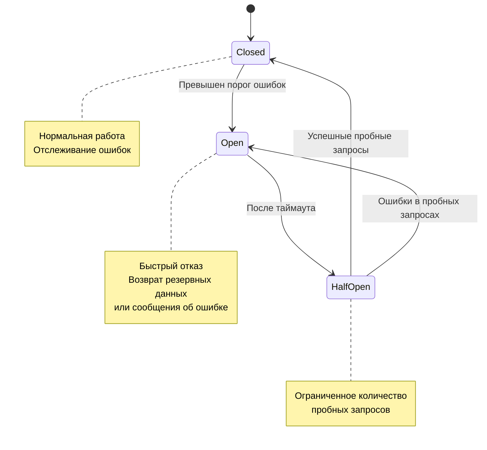

# Операционные аспекты Backend-Event

Данный документ описывает ключевые операционные аспекты микросервиса `backend-event`, включая стратегии развертывания, масштабирования, требования к инфраструктуре, обработку отказов и подходы к обновлению.

## 📑 Оглавление

1. [🚀 Развертывание и масштабирование](#-развертывание-и-масштабирование)
   - [Развертывание](#развертывание)
   - [Масштабирование](#масштабирование)
   - [Мониторинг под нагрузкой](#мониторинг-под-нагрузкой)
2. [💻 Системные требования](#-системные-требования)
   - [Ресурсы Kubernetes](#ресурсы-kubernetes)
   - [Минимальная конфигурация](#минимальная-конфигурация)
   - [Рекомендуемая конфигурация](#рекомендуемая-конфигурация)
   - [Требования к сетевой инфраструктуре](#требования-к-сетевой-инфраструктуре)
3. [🛡️ Стратегии обработки отказов](#️-стратегии-обработки-отказов)
   - [Типы отказов и реакция](#типы-отказов-и-реакция)
   - [Circuit Breaker](#circuit-breaker)
   - [Fallback-стратегии](#fallback-стратегии)
   - [Обработка деградаций внешних сервисов](#обработка-деградаций-внешних-сервисов)
4. [⚙️ Миграции и обновления](#️-миграции-и-обновления)
   - [Стратегия обновления микросервиса](#стратегия-обновления-микросервиса)
   - [Совместимость версий API](#совместимость-версий-api)
   - [Миграции базы данных](#миграции-базы-данных)
   - [Откат изменений](#откат-изменений)

## 🚀 Развертывание и масштабирование

### Развертывание

Микросервис `backend-event` развертывается в Kubernetes с использованием Helm-чартов, что обеспечивает стандартизированный подход и повторяемость развертывания в различных окружениях.

#### Helm-чарт

```yaml
# Пример values.yaml для Helm-чарта
replicaCount: 2

image:
  repository: aquastream/backend-event
  tag: "latest"
  pullPolicy: IfNotPresent

resources:
  limits:
    cpu: 1500m
    memory: 2Gi
  requests:
    cpu: 500m
    memory: 1Gi

autoscaling:
  enabled: true
  minReplicas: 2
  maxReplicas: 10
  targetCPUUtilizationPercentage: 70
  targetMemoryUtilizationPercentage: 80

livenessProbe:
  httpGet:
    path: /actuator/health/liveness
    port: 8080
  initialDelaySeconds: 60
  periodSeconds: 15

readinessProbe:
  httpGet:
    path: /actuator/health/readiness
    port: 8080
  initialDelaySeconds: 30
  periodSeconds: 10

env:
  - name: SPRING_PROFILES_ACTIVE
    value: "prod"
  - name: JAVA_OPTS
    value: "-XX:+UseZGC -XX:+ZGenerational -Xmx1536m"

secrets:
  - name: backend-event-secrets
    keys:
      - DB_PASSWORD
      - KAFKA_PASSWORD
      - REDIS_PASSWORD
```

#### Процесс непрерывной интеграции и доставки (CI/CD)

Для автоматизации процесса сборки и развертывания используется GitHub Actions:

1. **Сборка и тестирование:**
   - Запуск модульных и интеграционных тестов
   - Статический анализ кода с SonarQube
   - Сборка Docker-образа

2. **Развертывание в dev-окружение:**
   - Автоматическое развертывание при каждом коммите в ветку `develop`
   - Запуск автоматических end-to-end тестов

3. **Развертывание в staging-окружение:**
   - Ручное подтверждение после успешного развертывания в dev
   - Полный набор интеграционных тестов

4. **Развертывание в production:**
   - Ручное подтверждение после успешного тестирования на staging
   - Canary-релизы для критических изменений

### Масштабирование

Сервис `backend-event` поддерживает как горизонтальное, так и вертикальное масштабирование.

#### Горизонтальное масштабирование

Автоматическое горизонтальное масштабирование настроено через Horizontal Pod Autoscaler (HPA) в Kubernetes:

```yaml
apiVersion: autoscaling/v2
kind: HorizontalPodAutoscaler
metadata:
  name: backend-event-hpa
spec:
  scaleTargetRef:
    apiVersion: apps/v1
    kind: Deployment
    name: backend-event
  minReplicas: 2
  maxReplicas: 10
  metrics:
  - type: Resource
    resource:
      name: cpu
      target:
        type: Utilization
        averageUtilization: 70
  - type: Resource
    resource:
      name: memory
      target:
        type: Utilization
        averageUtilization: 80
  behavior:
    scaleUp:
      stabilizationWindowSeconds: 60
    scaleDown:
      stabilizationWindowSeconds: 300
```

#### Вертикальное масштабирование

Для базы данных PostgreSQL и других хранилищ может применяться вертикальное масштабирование. При этом учитывается:

- Увеличение ресурсов CPU/RAM при росте нагрузки
- Масштабирование хранилища (увеличение дискового пространства)
- Оптимизация конфигурации PostgreSQL для высоких нагрузок

### Мониторинг под нагрузкой

Для мониторинга сервиса в продакшен-окружении используются следующие инструменты:

1. **Prometheus + Grafana:**
   - Сбор метрик производительности
   - Специализированные дашборды для различных аспектов работы приложения
   - Настроенные алерты на критические отклонения

2. **Jaeger:**
   - Трассировка запросов между микросервисами
   - Анализ производительности отдельных операций
   - Определение узких мест в системе

3. **ELK Stack:**
   - Централизованный сбор и анализ логов
   - Визуализация ошибок и предупреждений

#### Критичные метрики для мониторинга

| Метрика | Описание | Пороговое значение | Действие при превышении |
|---------|----------|-------------------|-------------------------|
| CPU Usage | Использование CPU | >85% в течение 5 минут | Автоматическое масштабирование |
| Memory Usage | Использование RAM | >90% в течение 5 минут | Автоматическое масштабирование |
| Response Time | Время ответа API | >500ms для 95% запросов | Оповещение команды разработки |
| Error Rate | Частота ошибок 5xx | >1% запросов | Оповещение и возможный откат изменений |
| JVM Heap Usage | Использование кучи | >80% в течение 10 минут | Перезапуск подов |
| Database Connection Usage | Использование пула соединений | >85% | Увеличение размера пула |
| Kafka Lag | Отставание в обработке сообщений | >1000 сообщений или >1 минута | Масштабирование обработчиков |

## 💻 Системные требования

### Ресурсы Kubernetes

Для размещения микросервиса `backend-event` в Kubernetes необходимы следующие ресурсы:

#### Минимальная конфигурация

```yaml
# Минимальные ресурсы для одного пода
resources:
  requests:
    cpu: 500m
    memory: 1Gi
  limits:
    cpu: 1000m
    memory: 2Gi

# Требования к хранилищам
persistentVolumeClaim:
  - metadata:
      name: backend-event-postgresql
    spec:
      accessModes: ["ReadWriteOnce"]
      resources:
        requests:
          storage: 10Gi
  - metadata:
      name: backend-event-redis
    spec:
      accessModes: ["ReadWriteOnce"]
      resources:
        requests:
          storage: 5Gi
```

#### Рекомендуемая конфигурация

```yaml
# Рекомендуемые ресурсы для производственного окружения
resources:
  requests:
    cpu: 1000m
    memory: 2Gi
  limits:
    cpu: 2000m
    memory: 4Gi

# Требования к хранилищам
persistentVolumeClaim:
  - metadata:
      name: backend-event-postgresql
    spec:
      accessModes: ["ReadWriteOnce"]
      resources:
        requests:
          storage: 50Gi
      storageClassName: premium-ssd
  - metadata:
      name: backend-event-redis
    spec:
      accessModes: ["ReadWriteOnce"]
      resources:
        requests:
          storage: 20Gi
      storageClassName: premium-ssd
```

### Минимальная конфигурация

Для функционирования микросервиса требуется:

| Компонент | Минимальные требования | Рекомендуемые требования |
|-----------|------------------------|--------------------------|
| CPU | 2 vCPU | 4 vCPU |
| Память | 4 GB RAM | 8 GB RAM |
| Хранилище | 10 GB SSD | 50 GB SSD |
| Сетевой трафик | 100 Mbps | 1 Gbps |
| PostgreSQL | v14+ | v15+ с репликацией |
| Redis | v6+ | v7+ кластер с репликацией |
| Kafka | v3.0+ | v3.5+ кластер минимум из 3 брокеров |
| JVM | Java 21 | Java 21 с оптимизированными GC параметрами |

### Рекомендуемая конфигурация

Для оптимальной производительности в различных окружениях:

| Окружение | CPU | Память | Диск | Реплики | Дополнительные рекомендации |
|-----------|-----|--------|------|---------|----------------------------|
| Dev | 1 vCPU | 2 GB | 10 GB | 1 | Локальная разработка с Docker Compose |
| Staging | 2 vCPU | 4 GB | 20 GB | 2 | Полноценная копия продакшен-окружения |
| Production | 4 vCPU | 8 GB | 50 GB | 2-10 | Автомасштабирование, мониторинг, алерты |

### Требования к сетевой инфраструктуре

| Параметр | Значение | Описание |
|----------|----------|----------|
| Внутренние порты | 8080, 9090 | HTTP и gRPC соответственно |
| Внешние порты | 80/443 | Через Ingress/API Gateway |
| Внутрисетевые порты | 5432, 6379, 9092 | PostgreSQL, Redis, Kafka |
| Исходящие соединения | Unrestricted | Для внешних API и сервисов |
| Балансировка | Round Robin | Для равномерного распределения нагрузки |
| SSL/TLS | Required | Для всех внешних подключений |
| Network Policy | Restricted | Разрешены только необходимые соединения |

## 🛡️ Стратегии обработки отказов

### Типы отказов и реакция

| Тип отказа | Стратегия обработки | Автоматическое восстановление |
|------------|---------------------|------------------------------|
| Недоступность БД | Circuit Breaker, переход в режим только чтения | Да, через Connection Pool с retry |
| Отказ Kafka | Локальная буферизация сообщений | Да, с автоматической отправкой при восстановлении |
| Недоступность Redis | Фолбэк на локальный кэш с TTL | Да, с пробными подключениями |
| Ошибки внешних сервисов | Circuit Breaker с экспоненциальным backoff | Да, через retry с jitter |
| Исчерпание ресурсов | Throttling, сброс неприоритетных запросов | Частично, через HPA |
| Отказ отдельного пода | Перезапуск через Kubernetes liveness probe | Да, автоматически |
| Сетевые ошибки | Retry с таймаутами | Да, до определенного порога |

### Circuit Breaker

Микросервис использует паттерн Circuit Breaker для предотвращения каскадных отказов при проблемах с внешними зависимостями:

```java
// Пример конфигурации Circuit Breaker с Resilience4j
@Bean
public CircuitBreakerRegistry circuitBreakerRegistry() {
    CircuitBreakerConfig circuitBreakerConfig = CircuitBreakerConfig.custom()
        .failureRateThreshold(50)
        .slowCallRateThreshold(50)
        .slowCallDurationThreshold(Duration.ofSeconds(1))
        .permittedNumberOfCallsInHalfOpenState(10)
        .minimumNumberOfCalls(20)
        .slidingWindowType(CircuitBreakerConfig.SlidingWindowType.COUNT_BASED)
        .slidingWindowSize(100)
        .waitDurationInOpenState(Duration.ofSeconds(10))
        .automaticTransitionFromOpenToHalfOpenEnabled(true)
        .build();

    return CircuitBreakerRegistry.of(circuitBreakerConfig);
}
```

#### Состояния Circuit Breaker



### Fallback-стратегии

При недоступности зависимостей применяются следующие стратегии:

| Зависимость | Fallback-стратегия | Примечание |
|-------------|-------------------|------------|
| База данных | Чтение из кэша, режим только для чтения | Ограниченная функциональность |
| Kafka | Локальная очередь в памяти с персистентностью | Ограничение размера очереди |
| Redis | In-memory cache с ограниченным TTL | Увеличенное потребление памяти |
| Auth Service | Кэширование токенов с проверкой JWT | Без возможности отзыва токенов |
| External APIs | Заглушки с дефолтными данными | Отображение пользователю информации о проблеме |

### Обработка деградаций внешних сервисов

#### Деградация Auth Service

```java
@Slf4j
@Service
public class DegradedAuthenticationService implements AuthenticationService {
    private final CircuitBreaker circuitBreaker;
    private final RedisTemplate<String, JwtCachedData> redisTemplate;
    private final RealAuthenticationService realService;
    
    @Override
    public ValidationResult validateToken(String token) {
        return circuitBreaker.executeWithFallback(
            () -> realService.validateToken(token),
            throwable -> {
                log.warn("Auth service unavailable, falling back to cached validation", throwable);
                return fallbackValidation(token);
            }
        );
    }
    
    private ValidationResult fallbackValidation(String token) {
        // Local JWT validation + Redis cache check
        try {
            JwtCachedData cachedData = redisTemplate.opsForValue().get("token:" + token);
            if (cachedData != null && !isExpired(cachedData)) {
                return new ValidationResult(true, cachedData.getUserId(), cachedData.getRoles());
            }
            
            // Perform basic JWT validation without external service
            JwtData jwtData = JwtDecoder.decode(token);
            if (jwtData.isValid() && !jwtData.isExpired()) {
                return new ValidationResult(true, jwtData.getUserId(), jwtData.getRoles());
            }
        } catch (Exception e) {
            log.error("Error in fallback validation", e);
        }
        
        // For security, reject token if unable to validate
        return new ValidationResult(false, null, Collections.emptyList());
    }
}
```

#### Деградация Payment Service

```java
@Service
public class PaymentProcessingService {
    
    private final CircuitBreaker paymentCircuitBreaker;
    private final KafkaTemplate<String, PaymentMessage> kafkaTemplate;
    private final PaymentClient paymentClient;
    
    public PaymentResponse processPayment(PaymentRequest request) {
        return paymentCircuitBreaker.executeWithFallback(
            () -> paymentClient.processPayment(request),
            throwable -> {
                log.warn("Payment service unavailable, queueing for later processing", throwable);
                return queuePaymentForRetry(request);
            }
        );
    }
    
    private PaymentResponse queuePaymentForRetry(PaymentRequest request) {
        // Сохранение запроса в очередь для последующей обработки
        String paymentId = UUID.randomUUID().toString();
        PaymentMessage message = new PaymentMessage(paymentId, request, LocalDateTime.now());
        
        kafkaTemplate.send("payment-retry-queue", message);
        
        return PaymentResponse.builder()
            .status(PaymentStatus.PENDING)
            .paymentId(paymentId)
            .message("Payment service unavailable. Your payment will be processed later.")
            .build();
    }
}
```

## ⚙️ Миграции и обновления

### Стратегия обновления микросервиса

Для обновления микросервиса `backend-event` используется стратегия Rolling Update с предварительным созданием новой версии:

```yaml
# Пример настроек в Deployment
spec:
  replicas: 3
  strategy:
    type: RollingUpdate
    rollingUpdate:
      maxSurge: 1
      maxUnavailable: 1
```

#### Процесс обновления:

1. **Подготовка:**
   - Создание релизной ветки
   - Сборка и тестирование Docker-образа
   - Проверка совместимости с текущей версией API

2. **Пре-деплой:**
   - Проверка миграций БД
   - Выполнение smoke-тестов
   - Канарейский релиз (10% трафика)

3. **Полный деплой:**
   - Rolling update остальных инстансов
   - Постепенная миграция трафика
   - Мониторинг ошибок и метрик производительности

4. **Пост-деплой:**
   - Проверка системных метрик
   - Запуск полного набора интеграционных тестов
   - Финальная проверка работоспособности

### Совместимость версий API

Микросервис поддерживает обратную совместимость API:

- **REST API:** Сохранение поддержки предыдущих версий эндпоинтов с использованием версионирования в URI (например, `/api/v1/events`, `/api/v2/events`)
- **gRPC API:** Поддержка устаревших методов через аннотации [deprecated] и соблюдение принципов эволюции Protobuf

#### Пример обеспечения совместимости в gRPC API:

```protobuf
syntax = "proto3";

package org.aquastream.event.api;

service EventService {
  // Устаревший метод, сохраняется для обратной совместимости
  rpc GetEventV1(GetEventRequestV1) returns (EventResponseV1) {
    option deprecated = true;
  }
  
  // Новый метод с расширенной функциональностью
  rpc GetEvent(GetEventRequest) returns (EventResponse);
}

// Устаревшая версия запроса
message GetEventRequestV1 {
  string event_id = 1;
}

// Новая версия запроса с дополнительными полями
message GetEventRequest {
  string event_id = 1;
  bool include_details = 2;
  repeated string fields = 3;
}

// Устаревшая версия ответа
message EventResponseV1 {
  string id = 1;
  string title = 2;
  string description = 3;
  string start_date = 4;
  string location = 5;
}

// Новая версия ответа с дополнительными полями
message EventResponse {
  string id = 1;
  string title = 2;
  string description = 3;
  string start_date = 4;
  string location = 5;
  optional string end_date = 6;
  optional EventDetails details = 7;
}
```

### Миграции базы данных

Для управления миграциями базы данных используется Liquibase:

```yaml
# Пример changeSet в миграции Liquibase
databaseChangeLog:
  - changeSet:
      id: 1
      author: dev_team
      changes:
        - createTable:
            tableName: events
            columns:
              - column:
                  name: id
                  type: UUID
                  constraints:
                    primaryKey: true
                    nullable: false
              - column:
                  name: title
                  type: VARCHAR(255)
                  constraints:
                    nullable: false
              - column:
                  name: description
                  type: TEXT
              - column:
                  name: start_date
                  type: TIMESTAMP WITH TIME ZONE
                  constraints:
                    nullable: false
              - column:
                  name: end_date
                  type: TIMESTAMP WITH TIME ZONE
              - column:
                  name: location
                  type: VARCHAR(255)
              - column:
                  name: capacity
                  type: INT
              - column:
                  name: status
                  type: VARCHAR(50)
                  constraints:
                    nullable: false
              - column:
                  name: created_at
                  type: TIMESTAMP WITH TIME ZONE
                  defaultValueComputed: CURRENT_TIMESTAMP
                  constraints:
                    nullable: false
              - column:
                  name: updated_at
                  type: TIMESTAMP WITH TIME ZONE
                  defaultValueComputed: CURRENT_TIMESTAMP
                  constraints:
                    nullable: false
```

#### Стратегии миграции данных

1. **Аддитивные изменения** (добавление полей, таблиц)
   - Безопасное добавление новых полей и таблиц без нарушения работы приложения

2. **Модификация данных**
   - Поэтапное изменение с использованием временных колонок
   - Миграция данных через batch-процессы

3. **Изменение структуры**
   - Создание новых таблиц параллельно с существующими
   - Постепенная миграция данных
   - Переключение кода на новые структуры
   - Удаление старых структур после успешного перехода

4. **Критические изменения**
   - Выполнение в плановое окно обслуживания
   - Предварительное уведомление пользователей
   - Подготовка процедуры отката

#### Пример миграции с изменением структуры:

```sql
-- 1. Создание новой таблицы с обновленной структурой
CREATE TABLE events_new (
  id UUID PRIMARY KEY,
  title VARCHAR(255) NOT NULL,
  description TEXT,
  start_date TIMESTAMP WITH TIME ZONE NOT NULL,
  end_date TIMESTAMP WITH TIME ZONE,
  location_id UUID, -- Новая ссылка на таблицу локаций
  location_text VARCHAR(255), -- Временное поле для совместимости
  capacity INT,
  status VARCHAR(50) NOT NULL,
  created_at TIMESTAMP WITH TIME ZONE NOT NULL DEFAULT CURRENT_TIMESTAMP,
  updated_at TIMESTAMP WITH TIME ZONE NOT NULL DEFAULT CURRENT_TIMESTAMP
);

-- 2. Создание таблицы локаций
CREATE TABLE locations (
  id UUID PRIMARY KEY,
  name VARCHAR(255) NOT NULL,
  address VARCHAR(255),
  coordinates POINT,
  created_at TIMESTAMP WITH TIME ZONE NOT NULL DEFAULT CURRENT_TIMESTAMP,
  updated_at TIMESTAMP WITH TIME ZONE NOT NULL DEFAULT CURRENT_TIMESTAMP
);

-- 3. Миграция данных с извлечением локаций
INSERT INTO locations (id, name, address)
SELECT DISTINCT 
  gen_random_uuid() as id,
  location as name,
  location as address
FROM events;

-- 4. Перенос данных из старой таблицы в новую
INSERT INTO events_new (id, title, description, start_date, end_date, 
                         location_text, location_id, capacity, status, 
                         created_at, updated_at)
SELECT 
  e.id, 
  e.title, 
  e.description, 
  e.start_date, 
  e.end_date, 
  e.location as location_text,
  l.id as location_id,
  e.capacity, 
  e.status, 
  e.created_at, 
  e.updated_at
FROM events e
LEFT JOIN locations l ON e.location = l.name;

-- 5. После подтверждения миграции данных
ALTER TABLE events RENAME TO events_old;
ALTER TABLE events_new RENAME TO events;

-- 6. Создание индексов на новой таблице
CREATE INDEX idx_events_location_id ON events(location_id);
CREATE INDEX idx_events_start_date ON events(start_date);
CREATE INDEX idx_events_status ON events(status);

-- 7. Добавление внешнего ключа
ALTER TABLE events 
ADD CONSTRAINT fk_events_location 
FOREIGN KEY (location_id) REFERENCES locations(id);
```

### Откат изменений

Система поддерживает два типа отката изменений:

#### 1. Откат кода

При обнаружении критических проблем после деплоя:

```bash
# Пример команды для отката изменений через Helm
helm rollback backend-event 1
```

#### 2. Откат миграций базы данных

Каждая миграция содержит секцию `rollback`, которая определяет действия для отката изменений:

```yaml
# Пример секции rollback в миграции Liquibase
databaseChangeLog:
  - changeSet:
      id: 1
      author: dev_team
      changes:
        - createTable:
            # ... определение таблицы ...
      rollback:
        - dropTable:
            tableName: events
```

#### План восстановления при критических ошибках:

1. **Диагностика:**
   - Анализ логов и метрик для определения причины
   - Воспроизведение проблемы в тестовом окружении

2. **Коммуникация:**
   - Оповещение заинтересованных сторон
   - Обновление статуса сервиса в системе мониторинга

3. **Решение:**
   - Откат кода или откат миграций базы данных
   - В случае сложных изменений - применение экстренных фиксов

4. **Верификация:**
   - Тестирование после восстановления
   - Мониторинг метрик и логов

5. **Пост-анализ:**
   - Составление отчета о инциденте
   - Обновление процедур развертывания для предотвращения повторения ошибок 