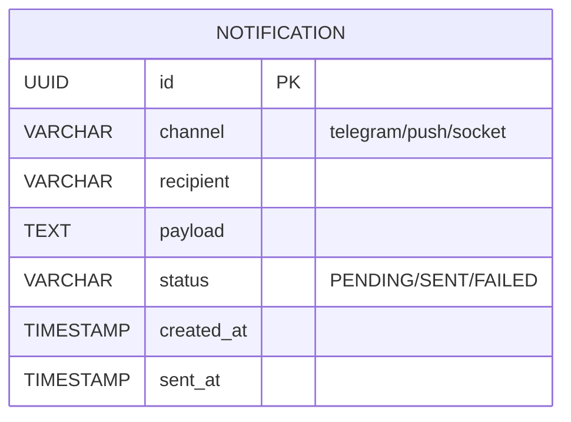

# Backend-Notification Service – Документация

> Версия: 0.1 (draft)

Микросервис **Backend-Notification** отвечает за доставку уведомлений пользователям AquaStream через различные каналы (telegram-bot, push, WebSocket).

*Текущий статус*: MVP – интеграция с Kafka и базовый Telegram-бот-отправитель.

---

## Назначение модуля

1. Подписка на доменные события в Kafka (`crew.events`, `planning.events`, `user.events`).
2. Формирование шаблонов уведомлений (Thymeleaf/Freemarker).
3. Отправка **Telegram-сообщений** через Bot API и push-уведомлений через Web Push API.
4. Резервирование сообщений и ретрай-механизм.
5. Экспонирование REST API для внутренних сервисов (on-demand уведомления).

---

## Структура подпроектов

| Подпроект | Описание |
|-----------|----------|
| `backend-notification-api`     | DTO событий и REST-контракт для on-demand уведомлений. |
| `backend-notification-db`      | Liquibase-миграции, таблицы `notification`, `notification_template`. |
| `backend-notification-service` | Spring Boot приложение, Kafka-listener, **Telegram Bot** и WebPush отправители. |

---

## Конфигурация Kafka

```yaml
spring:
  kafka:
    bootstrap-servers: localhost:9092
  consumer:
    group-id: notification-group
```

В Docker-окружении `bootstrap-servers` читается из переменной `KAFKA_BOOTSTRAP_SERVERS`.

### Топики

| Топик | Событие |
|-------|---------|
| `crew.events`      | `CrewCreated`, `CrewMemberAdded` |
| `planning.events`  | `PlanCreated`, `PlanStatusChanged` |
| `user.events`      | `UserRegistered` |

---

## Каналы доставки

| Канал  | Технология | Статус |
|--------|------------|--------|
| Telegram | Telegram Bot API | ✅ MVP |
| Push   | Web Push (VAPID)    | 🟡 В разработке |
| Socket | STOMP/WebSocket     | 🔲 Планируется |

---

## Таблица `notification`



---

## REST API (on-demand)

| Метод | URL | Описание |
|-------|-----|----------|
| `POST` | `/api/v1/notifications/telegram` | Отправить сообщение в Telegram пользователю |

Swagger UI: `/notification/swagger-ui.html` через Gateway.

---

## Тестирование

- Unit-тесты форматирования шаблонов.
- Integration-тест Kafka listener + Testcontainers.

---

## Запуск

```bash
./gradlew :backend-notification-service:bootRun
```

При запуске в Docker используйте `infra/docker/images/Dockerfile.backend-notification`.

---

## TODO
- [ ] Реализовать retry-механизм (Spring Retry).
- [ ] **Добавить Web Push отправитель.**
- [ ] Поддержка локализации шаблонов.
- [ ] **Настроить обработку Webhook от Telegram для bidirectional коммуникации.**

---

## Связь с общей документацией

- Архитектура: [`PROJECT_DOCUMENTATION.md`](../PROJECT_DOCUMENTATION.md)
- CI/CD: [`../ci-cd`](../ci-cd)

---

© AquaStream, 2024 