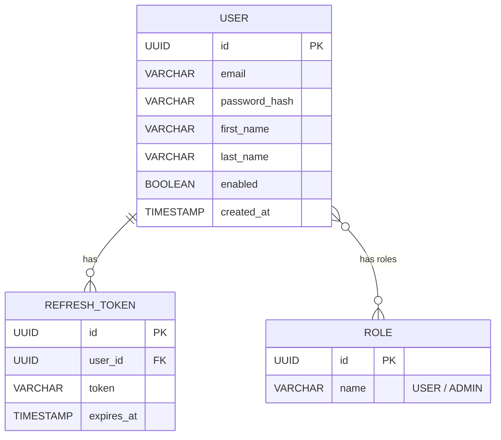

# Backend-User Service – Документация

> Версия: 0.1 (draft)

**Backend-User** – микросервис, отвечающий за управление пользователями, роли/права доступа и выдачу JWT-токенов для всей платформы AquaStream.

---

## Стек

* Spring Boot 3.2 + Spring Security 6
* JWT (HS256; планируется RS256 через JWKS)
* PostgreSQL + Liquibase
* Apache Kafka – событие регистрации пользователя
* Springdoc-openapi для Swagger UI

---

## Подпроектная структура

| Подпроект | Описание |
|-----------|----------|
| `backend-user-api`     | DTO (UserDto, AuthRequest, AuthResponse), exception-модели. |
| `backend-user-db`      | Liquibase-скрипты, JPA-сущности (`User`, `Role`, `RefreshToken`). |
| `backend-user-service` | Spring Boot приложение с REST контроллерами, сервисом авторизации, JWT-утилитами. |

---

## REST API (v1)

| Метод | URL | Описание |
|-------|-----|----------|
| `POST` | `/api/v1/auth/register` | Регистрация пользователя |
| `POST` | `/api/v1/auth/login`    | Аутентификация, выдача `accessToken` + `refreshToken` |
| `POST` | `/api/v1/auth/refresh`  | Обновление `accessToken` по `refreshToken` |
| `GET`  | `/api/v1/users/me`      | Получить данные текущего пользователя |
| `GET`  | `/api/v1/users/{id}`    | Получить пользователя по ID (ADMIN) |
| `PUT`  | `/api/v1/users/{id}`    | Обновить пользователя |
| `DELETE` | `/api/v1/users/{id}`  | Удалить пользователя |

Swagger UI: `/user/swagger-ui.html` (через Gateway).

---

## Модель данных



Пароли хранятся с использованием BCrypt10.

---

## Защищённые маршруты

JWT проверяется с помощью `OncePerRequestFilter`. Заголовок: `Authorization: Bearer <token>`.

Роли:
* `ROLE_USER` – доступ к собственным данным
* `ROLE_ADMIN` – управление пользователями

---

## Конфигурация (application.yml)

```yaml
jwt:
  secret: <HMAC-ключ>
  expiration-ms: 86400000 # 24h
spring:
  kafka.topics.user-registration: user-registration
```

При деплое рекомендуется использовать переменные окружения `JWT_SECRET`, `POSTGRES_*`, `KAFKA_BOOTSTRAP_SERVERS`.

---

## Kafka

При успешной регистрации в топик `user-registration` отправляется сообщение:

```json
{
  "userId": "<uuid>",
  "email": "user@example.com",
  "registeredAt": "2024-04-01T12:00:00Z"
}
```

Событие потребляется Notification Service для отправки приветственного письма.

---

## Тестирование

- Unit: `UserService`, `JwtUtils`.
- Integration: регистрация/логин с Testcontainers (PostgreSQL, Kafka, Keycloak-mock).
- Jacoco coverage публикуется в workflow `backend-ci.yml`.

---

## Запуск

```bash
./gradlew :backend-user-service:bootRun
```

Dockerfile: `infra/docker/images/Dockerfile.backend-user`.

---

## TODO
- [ ] Перейти на RS256 и JWKS endpoint.
- [ ] Добавить email-верификацию аккаунта.
- [ ] Реализовать управление ролями через API.

---

## Связь с общей документацией

- Общая архитектура: [`PROJECT_DOCUMENTATION.md`](../PROJECT_DOCUMENTATION.md)
- CI/CD: [`../ci-cd`](../ci-cd)
- Документация Gateway: [`backend-gateway`](../backend-gateway)

---

© AquaStream, 2024 