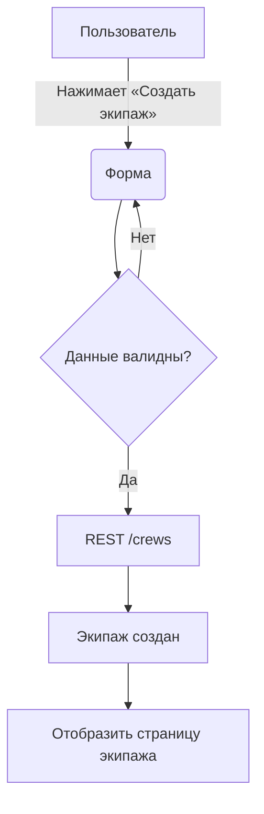

# Crew Service – Бизнес-архитектура

## 1. Ценность для пользователя
Пользователь может:
1. Создать экипаж и пригласить участников
2. Управлять составом (добавлять/удалять, назначать капитана)
3. Видеть статистику своей команды на странице профиля

## 2. Основные пользовательские истории
| ID | История | Приоритет |
|----|---------|-----------|
| CRW-1 | Как зарегистрированный пользователь я хочу создать экипаж, чтобы участвовать в сплаве | 🔴 |
| CRW-2 | Как капитан я хочу пригласить участника по email/Telegram username | 🟡 |
| CRW-3 | Как участник я хочу покинуть экипаж | 🟢 |

## 3. Поток создания экипажа (BPMN)

## 4. KPI и OKR
| KPI | Целевое значение |
|-----|------------------|
| Время создания экипажа | < 3 с |
| Кол-во активных экипажей на Q3 | 1000 |

## 5. Зависимости
- **User Service:** требуется пользовательская регистрация
- **Notification Service:** отправка уведомления участнику о приглашении

## 6. Ограничения
- Максимум 12 участников в экипаже
- Капитан – всегда один

## 7. Roadmap
1. MVP: CRUD экипажа
2. Инвайты через Telegram
3. Статистика побед/рейтинги 