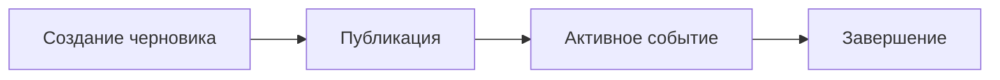

# Event Service – Бизнес-архитектура

## 1. Ценность для пользователя
- Позволяет планировать будущие сплавы, задавая маршрут, даты и команду.
- Позволяет публиковать событие, чтобы другие участники могли его увидеть.
- Фиксирует результат сплава (финиш) и сохраняет историю.

## 2. Основные пользовательские истории
| ID | История | Приоритет |
|----|---------|-----------|
| EVT-1 | Как капитан экипажа я хочу создать событие c маршрутом и датами | 🔴 |
| EVT-2 | Как капитан я хочу опубликовать событие, чтобы команда увидела его | 🔴 |
| EVT-3 | Как участник я хочу просмотреть список предстоящих событий | 🟡 |
| EVT-4 | Как капитан я хочу завершить событие после финиша | 🟢 |

## 3. Value Stream (упрощённо)

## 4. KPI
| KPI | Target |
|-----|--------|
| Время создания события | < 5 c |
| Событий в статусе DRAFT не более | 100 / user |

## 5. Зависимости
- Crew Service: требуется crew_id
- Notification Service: уведомление команды о публикации

## 6. Ограничения
- Событие связано ровно с одним экипажем
- Одновременно у экипажа может быть только 1 событие в статусе ACTIVE

## 7. Roadmap
1. MVP: создание и публикация
2. Финиш + результаты
3. Гео-трекинг в реальном времени (future) 