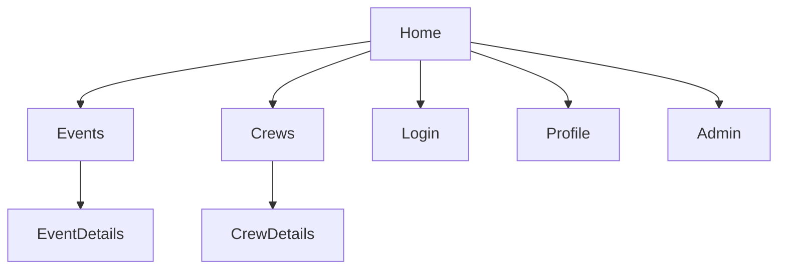

# Frontend – Бизнес-архитектура

## 1. Ценность
- Веб-интерфейс для всех функций платформы
- Мобильная адаптивность и PWA (roadmap)

## 2. Персоны и сценарии
| Persona | Цель | Основные сценарии |
|---------|------|-------------------|
| Капитан | Управлять экипажем, создавать событие | CRUD Crew, Create Event |
| Участник | Просматривать события, получать уведомления | View Events, Join Crew |
| Админ | Управление пользователями и контентом | User CRUD, Metrics |

## 3. Навигационная карта (sitemap)

## 4. KPI UI
| KPI | Target |
|-----|--------|
| TTI (Time to interactive) | < 3 s на 4G |
| Lighthouse PWA Score | > 90 |
| Ошибки JS | < 0.1 % session |

## 5. Roadmap
1. MVP SPA (готово)
2. PWA + офлайн кеш
3. Доступность WCAG AA 