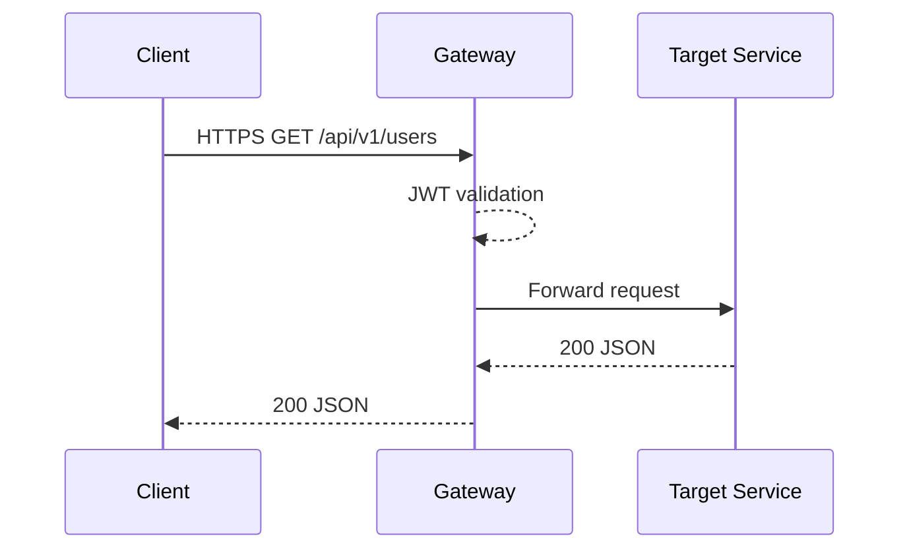

# Gateway Service – Бизнес-архитектура

## 1. Ценность
- Единая точка входа для клиентов
- Централизованная безопасность и мониторинг

## 2. Пользовательские истории
| ID | История | Приоритет |
| GW-1 | Как пользователь я обращаюсь к /api и хочу получить данные нужного сервиса | 🔴 |
| GW-2 | Как разработчик я хочу динамически добавлять маршруты без рестарта | 🟡 |

## 3. Поток запроса

## 4. KPI
| KPI | Target |
| Latency overhead | <20 ms |
| Availability | 99.9% |

## 5. Roadmap
1. Swagger aggregation
2. GRPC-web passthrough 