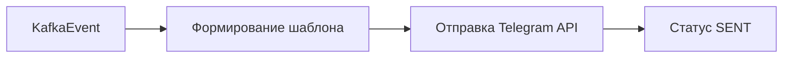

# Notification Service – Бизнес-архитектура

## 1. Ценность
- Мгновенное информирование команды о событиях (создание, обновление статуса, приглашения)
- Повышение вовлечённости через Telegram-уведомления

## 2. Пользовательские истории
| ID | История | Приоритет |
| NT-1 | Как участник я хочу получать уведомление в Telegram о приглашении в экипаж | 🔴 |
| NT-2 | Как капитан я хочу, чтобы команда получила уведомление о публикации события | 🔴 |
| NT-3 | Как пользователь я хочу настроить отключение push-уведомлений | 🟡 |

## 3. Value Stream

## 4. KPI
| KPI | Target |
| Успешная доставка | > 98 % |
| Средняя задержка | < 1 сек |

## 5. Roadmap
1. Telegram MVP (done)
2. Push WebPush
3. Настройка предпочтений уведомлений в UI 