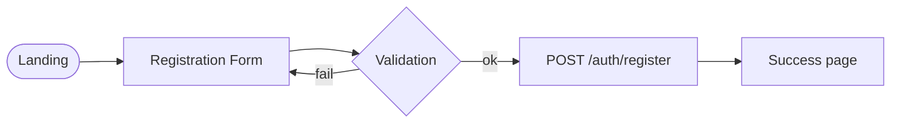

# User Service – Бизнес-архитектура

## 1. Ценность
- Регистрация и логин пользователей
- Централизованная аутентификация JWT для всех сервисов
- Управление ролями (USER / ADMIN)

## 2. Пользовательские истории
| ID | История | Приоритет |
|----|---------|-----------|
| USR-1 | Как новый пользователь я хочу зарегистрироваться, чтобы иметь доступ к платформе | 🔴 |
| USR-2 | Как пользователь я хочу войти в систему и получить токен | 🔴 |
| USR-3 | Как пользователь я хочу обновить свой профиль | 🟡 |
| USR-4 | Как администратор я хочу просматривать список пользователей | 🟢 |

## 3. Customer Journey (регистрация)

## 4. KPI
| KPI | Target |
|-----|--------|
| Conversion регистраций | > 70 % |
| Ошибки логина | < 1 % |

## 5. Roadmap
1. JWT HS256 → RS256 & JWKS
2. Email / Telegram verification
3. 2FA (TOTP) 