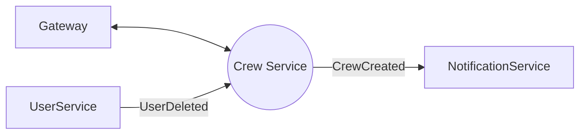
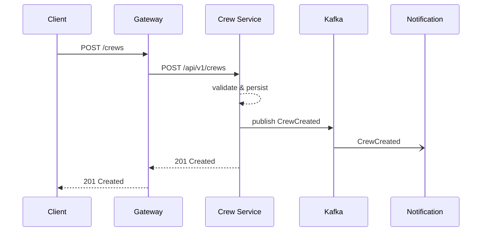

# Crew Service – Системный анализ

> Статус: draft

## 1. Область ответственности
Микросервис отвечает за жизненный цикл сущности *Crew* (экипаж/команда):
- CRUD операции
- Управление участниками
- Публикация доменных событий в Kafka

## 2. Границы контекста и взаимодействия
| Внешний контекст | Канал | Формат | Направление |
|------------------|-------|--------|-------------|
| API Gateway | HTTP/JSON | REST | ←→ |
| User Service | Kafka | JSON | ← (получает `UserDeleted`) |
| Notification Service | Kafka | JSON | → (отправляет `CrewCreated`) |

Диаграмма контекста:

## 3. Модель данных
См. ER-diagram в `backend-crew-db` (`crews`, `crew_member`).

## 4. Нефункциональные требования
| Атрибут | Значение |
|---------|----------|
| SLA (99th) | 200 мс на запрос |
| QPS | до 50 rps |
| Доступность | 99.5 % |
| Безопасность | JWT + роль `ROLE_USER` |
| Логи | JSON в Elk, traceId |

## 5. Потоки данных
Диаграмма последовательности создания экипажа:

## 6. Метрики и алерты
- `crews.count` – общее кол-во экипажей
- `crews.create.error_rate` – ошибки 5xx > 1 % за 5 мин ⇒ alert
- `kafka.producer.lag` < 100ms

## 7. TODO
- Уточнить контракт события `CrewMemberAdded`
- Перечислить политики ретрая при ошибках БД 