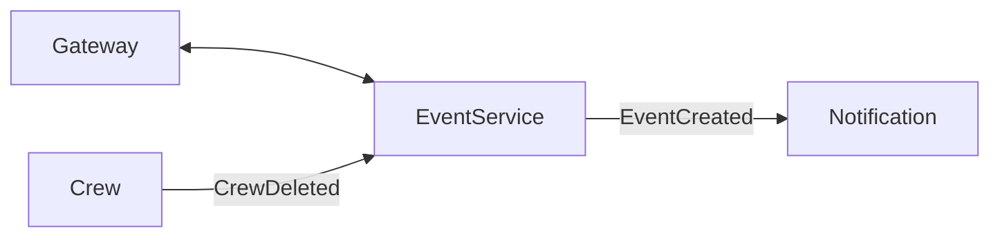
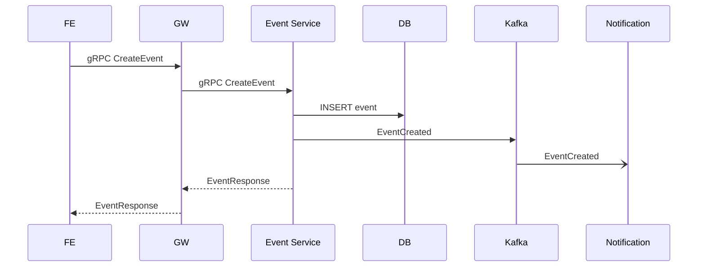

# Event Service – Системный анализ

> Статус: draft

## 1. Область ответственности
- CRUD события сплава (event)
- Расчёт маршрута, дат начала/окончания
- Изменение статуса события (DRAFT → PUBLISHED → FINISHED)
- Публикация событий `EventCreated`, `EventStatusChanged` в Kafka
- Высокопроизводительный gRPC API

## 2. Границы контекста и взаимодействия
| Контекст | Канал | Формат | Направление |
|----------|-------|--------|-------------|
| API Gateway | HTTP/gRPC-web | gRPC/JSON | ←→ |
| Crew Service | Kafka | JSON | ← `CrewDeleted` |
| Notification | Kafka | JSON | → `EventCreated` |
| Frontend | gRPC-web | JSON | ←→ |

## 3. Контракт gRPC
`event.proto` (ex-planning.proto) содержит методы `CreateEvent`, `ListEvents`, `UpdateStatus`.

## 4. Модель данных
Таблицы `event`, `waypoint`.

## 5. Нефункциональные требования
| Атрибут | Цель |
|---------|------|
| SLA(95th) | 150 мс |
| QPS | 30 rps |
| Доступность | 99.5 % |

## 6. Диаграмма последовательности создания события

## 7. Метрики и алерты
- `event.count`
- `event.status.changed`

## 8. TODO
- Pagination для `ListEvents`
- Переименование файлов proto и пакетов 