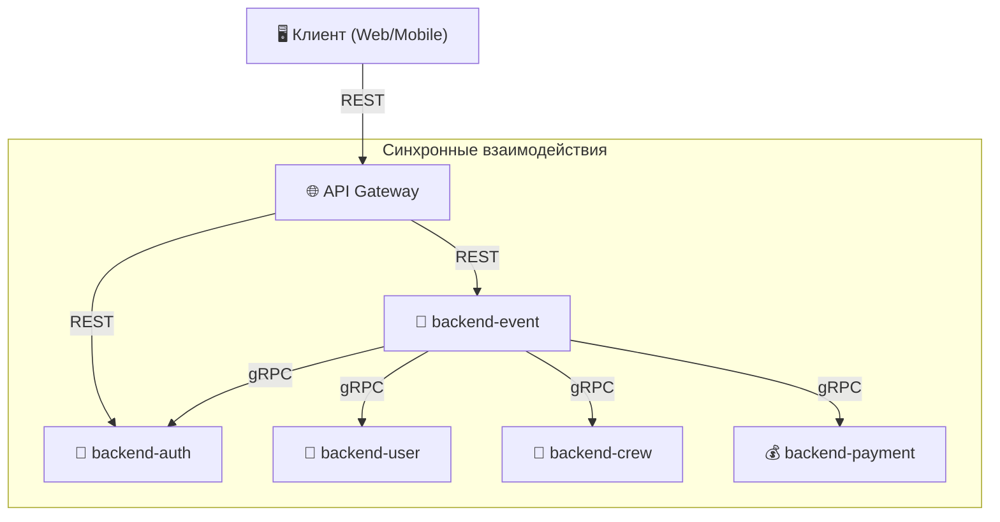
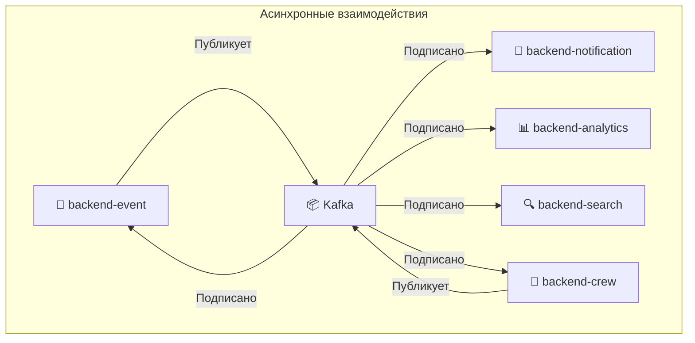
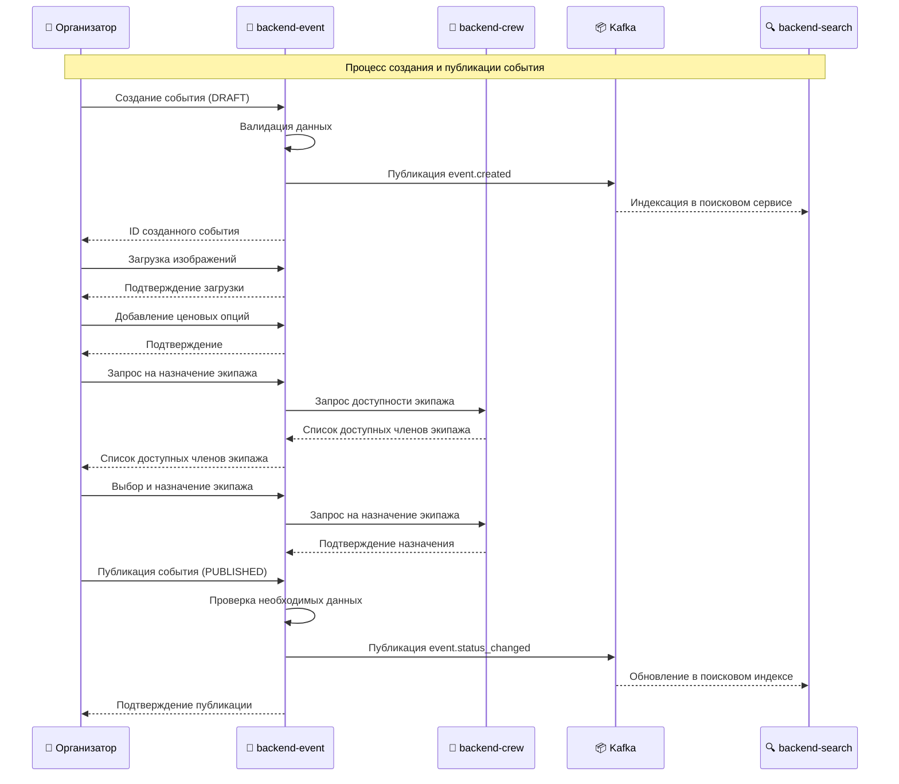
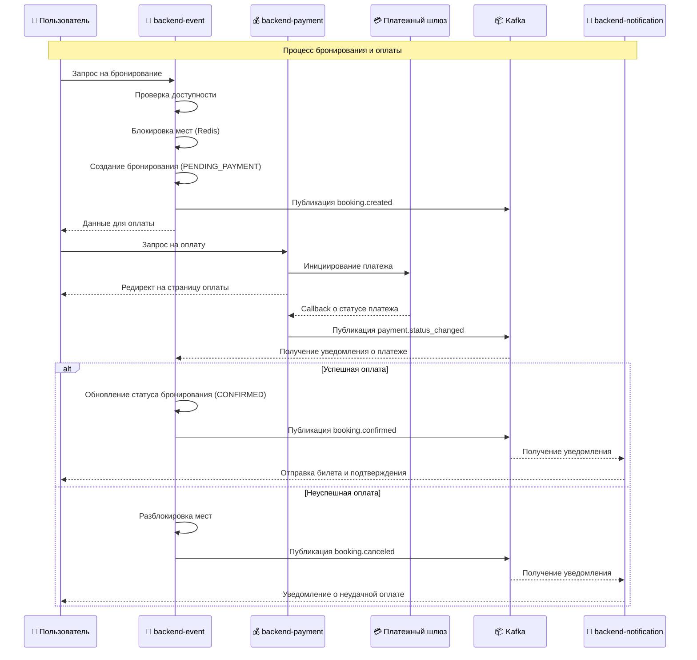
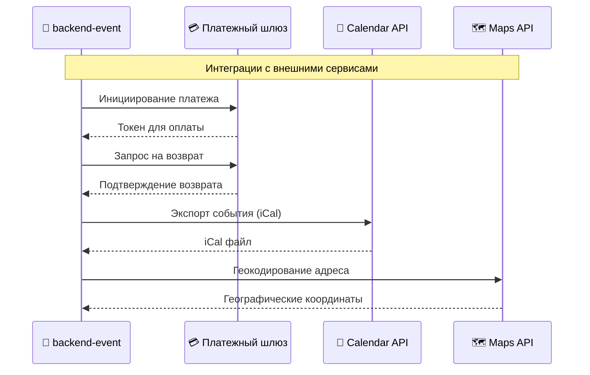

# API и интеграции сервиса Backend-Event

Данный документ описывает API, интеграции и сетевые взаимодействия сервиса `backend-event` с другими компонентами экосистемы Aquastream.

## 📑 Оглавление

1. [🔌 API Спецификация](#-api-спецификация)
   - [REST API](#rest-api)
   - [gRPC API](#grpc-api)
   - [Общие принципы](#общие-принципы)
2. [🌐 Сетевое взаимодействие и зависимости](#-сетевое-взаимодействие-и-зависимости)
   - [Синхронные взаимодействия](#синхронные-взаимодействия)
   - [Асинхронные взаимодействия](#асинхронные-взаимодействия)
   - [Защита API](#защита-api)
3. [📊 Схема потоков данных](#-схема-потоков-данных)
   - [Создание и управление событиями](#создание-и-управление-событиями)
   - [Процесс бронирования и оплаты](#процесс-бронирования-и-оплаты)
   - [Интеграция с внешними системами](#интеграция-с-внешними-системами)
4. [📋 Таблица зависимостей от других сервисов](#-таблица-зависимостей-от-других-сервисов)
   - [Внутренние зависимости](#внутренние-зависимости)
   - [Внешние зависимости](#внешние-зависимости)

## 🔌 API Спецификация

Сервис `backend-event` предоставляет два основных типа API:
- REST API для клиентских приложений и веб-интерфейса
- gRPC API для высокопроизводительного обмена данными между микросервисами

### REST API

#### События (Events)

| Метод | Эндпоинт | Описание | Требуемые права |
|-------|----------|----------|----------------|
| `GET` | `/api/v1/events` | Получение списка событий с фильтрацией | Публичный |
| `GET` | `/api/v1/events/{id}` | Получение детальной информации о событии | Публичный |
| `POST` | `/api/v1/events` | Создание нового события | Организатор |
| `PUT` | `/api/v1/events/{id}` | Обновление существующего события | Организатор, Администратор |
| `DELETE` | `/api/v1/events/{id}` | Отмена события (изменение статуса на CANCELED) | Организатор, Администратор |
| `POST` | `/api/v1/events/{id}/publish` | Публикация события (изменение статуса на PUBLISHED) | Организатор, Администратор |
| `GET` | `/api/v1/events/{id}/bookings` | Получение списка бронирований события | Организатор, Администратор |
| `POST` | `/api/v1/events/{id}/images` | Добавление изображения к событию | Организатор, Администратор |

#### Бронирования (Bookings)

| Метод | Эндпоинт | Описание | Требуемые права |
|-------|----------|----------|----------------|
| `GET` | `/api/v1/bookings` | Получение списка бронирований пользователя | Авторизованный пользователь |
| `GET` | `/api/v1/bookings/{id}` | Получение детальной информации о бронировании | Авторизованный пользователь, Организатор, Администратор |
| `POST` | `/api/v1/bookings` | Создание нового бронирования | Авторизованный пользователь |
| `DELETE` | `/api/v1/bookings/{id}` | Отмена бронирования | Авторизованный пользователь, Организатор, Администратор |
| `GET` | `/api/v1/bookings/{id}/ticket` | Получение билета в формате PDF | Авторизованный пользователь, Организатор, Администратор |

#### Платежи (Payments)

| Метод | Эндпоинт | Описание | Требуемые права |
|-------|----------|----------|----------------|
| `POST` | `/api/v1/payments/initialize` | Инициализация платежа | Авторизованный пользователь |
| `GET` | `/api/v1/payments/{id}` | Получение информации о платеже | Авторизованный пользователь, Организатор, Администратор |
| `POST` | `/api/v1/payments/webhook` | Обработка вебхуков от платежных шлюзов | Публичный (с валидацией) |
| `POST` | `/api/v1/payments/{id}/refund` | Запрос на возврат средств | Авторизованный пользователь, Организатор, Администратор |

#### Отзывы (Reviews)

| Метод | Эндпоинт | Описание | Требуемые права |
|-------|----------|----------|----------------|
| `GET` | `/api/v1/events/{id}/reviews` | Получение отзывов о событии | Публичный |
| `POST` | `/api/v1/events/{id}/reviews` | Создание отзыва о событии | Авторизованный пользователь (с проверкой участия) |
| `PUT` | `/api/v1/reviews/{id}` | Обновление отзыва | Автор отзыва |
| `POST` | `/api/v1/reviews/{id}/moderate` | Модерация отзыва | Администратор |
| `POST` | `/api/v1/reviews/{id}/respond` | Ответ организатора на отзыв | Организатор |

#### Избранное (Favorites)

| Метод | Эндпоинт | Описание | Требуемые права |
|-------|----------|----------|----------------|
| `GET` | `/api/v1/favorites` | Получение списка избранных событий | Авторизованный пользователь |
| `POST` | `/api/v1/events/{id}/favorite` | Добавление события в избранное | Авторизованный пользователь |
| `DELETE` | `/api/v1/events/{id}/favorite` | Удаление события из избранного | Авторизованный пользователь |

#### Категории (Categories)

| Метод | Эндпоинт | Описание | Требуемые права |
|-------|----------|----------|----------------|
| `GET` | `/api/v1/categories` | Получение всех категорий | Публичный |
| `POST` | `/api/v1/categories` | Создание новой категории | Администратор |
| `PUT` | `/api/v1/categories/{id}` | Обновление категории | Администратор |
| `DELETE` | `/api/v1/categories/{id}` | Удаление категории | Администратор |

#### Промокоды (Promo codes)

| Метод | Эндпоинт | Описание | Требуемые права |
|-------|----------|----------|----------------|
| `GET` | `/api/v1/events/{id}/promos` | Получение списка промокодов события | Организатор, Администратор |
| `POST` | `/api/v1/events/{id}/promos` | Создание нового промокода | Организатор, Администратор |
| `DELETE` | `/api/v1/promos/{id}` | Деактивация промокода | Организатор, Администратор |
| `POST` | `/api/v1/promos/validate` | Проверка валидности промокода | Авторизованный пользователь |

#### Ценовые опции (Price options)

| Метод | Эндпоинт | Описание | Требуемые права |
|-------|----------|----------|----------------|
| `GET` | `/api/v1/events/{id}/price-options` | Получение ценовых опций события | Публичный |
| `POST` | `/api/v1/events/{id}/price-options` | Создание новой ценовой опции | Организатор, Администратор |
| `PUT` | `/api/v1/price-options/{id}` | Обновление ценовой опции | Организатор, Администратор |
| `DELETE` | `/api/v1/price-options/{id}` | Удаление ценовой опции | Организатор, Администратор |

#### Экипаж (Crew)

| Метод | Эндпоинт | Описание | Требуемые права |
|-------|----------|----------|----------------|
| `GET` | `/api/v1/events/{id}/crew` | Получение списка экипажа события | Организатор, Администратор |
| `POST` | `/api/v1/events/{id}/crew` | Назначение члена экипажа | Организатор, Администратор |
| `DELETE` | `/api/v1/events/{id}/crew/{memberId}` | Удаление члена экипажа | Организатор, Администратор |

### gRPC API

Сервис `backend-event` предоставляет следующие gRPC сервисы для межсервисного взаимодействия:

```protobuf
syntax = "proto3";

package com.aquastream.event;

// Сервис управления событиями
service EventService {
  // Получение детальной информации о событии
  rpc GetEvent(GetEventRequest) returns (EventResponse);
  
  // Проверка доступности события для бронирования
  rpc CheckEventAvailability(CheckEventAvailabilityRequest) returns (EventAvailabilityResponse);
  
  // Обновление статуса события
  rpc UpdateEventStatus(UpdateEventStatusRequest) returns (EventResponse);
  
  // Получение списка событий с фильтрацией
  rpc ListEvents(ListEventsRequest) returns (ListEventsResponse);
}

// Сервис управления бронированиями
service BookingService {
  // Создание бронирования
  rpc CreateBooking(CreateBookingRequest) returns (BookingResponse);
  
  // Получение информации о бронировании
  rpc GetBooking(GetBookingRequest) returns (BookingResponse);
  
  // Обновление статуса бронирования
  rpc UpdateBookingStatus(UpdateBookingStatusRequest) returns (BookingResponse);
  
  // Отмена бронирования
  rpc CancelBooking(CancelBookingRequest) returns (BookingResponse);
  
  // Получение списка бронирований пользователя
  rpc ListUserBookings(ListUserBookingsRequest) returns (ListBookingsResponse);
  
  // Получение списка бронирований события
  rpc ListEventBookings(ListEventBookingsRequest) returns (ListBookingsResponse);
}

// Сервис управления платежами
service PaymentService {
  // Инициализация платежа
  rpc InitiatePayment(InitiatePaymentRequest) returns (PaymentResponse);
  
  // Обновление статуса платежа
  rpc UpdatePaymentStatus(UpdatePaymentStatusRequest) returns (PaymentResponse);
  
  // Получение информации о платеже
  rpc GetPayment(GetPaymentRequest) returns (PaymentResponse);
  
  // Инициирование возврата
  rpc InitiateRefund(InitiateRefundRequest) returns (RefundResponse);
}

// Остальные определения сообщений опущены для краткости
```

### Общие принципы

При разработке API сервиса `backend-event` следуются следующие принципы:

1. **Версионирование**:
   - Все конечные точки REST API имеют префикс `/api/v{version}/`, где `{version}` — номер версии API
   - Для gRPC используется версионирование схемы в package name

2. **Аутентификация**:
   - Использование JWT-токенов для аутентификации
   - Токены получаются от сервиса `backend-auth`
   - Каждый запрос включает заголовок `Authorization: Bearer {token}`

3. **Авторизация**:
   - Использование RBAC (Role-Based Access Control)
   - Проверка прав доступа на уровне ресурсов

4. **Обработка ошибок**:
   - Для REST API используются стандартные HTTP-коды состояния
   - Детальная информация об ошибке возвращается в теле ответа в формате JSON
   - Для gRPC используются стандартные gRPC status codes

5. **Пагинация**:
   - Все списочные эндпоинты поддерживают пагинацию
   - Параметры: `page` (номер страницы, начиная с 0) и `size` (размер страницы)
   - Возвращаются метаданные о пагинации: общее количество элементов, количество страниц

6. **Фильтрация и сортировка**:
   - Поддержка фильтрации через query-параметры
   - Сортировка через параметр `sort=field,direction` (например, `sort=startDate,desc`)

7. **CORS**:
   - Настроенная CORS-политика для веб-клиентов
   - Поддержка предварительных запросов OPTIONS

8. **Идемпотентность**:
   - POST-запросы могут быть идемпотентными при использовании идентификатора идемпотентности
   - Заголовок `Idempotency-Key` для предотвращения дублирования операций

## 🌐 Сетевое взаимодействие и зависимости

### Синхронные взаимодействия

Синхронные взаимодействия используются для операций, требующих немедленного ответа.



#### Ключевые синхронные взаимодействия:

1. **Аутентификация и авторизация**:
   - `backend-event` → `backend-auth`: Валидация JWT-токенов и проверка прав доступа
   - Метод: gRPC
   - Критичность: Высокая (с тайм-аутом и fallback-механизмом)

2. **Данные пользователей**:
   - `backend-event` → `backend-user`: Получение информации о пользователях
   - Метод: gRPC
   - Критичность: Средняя (с кэшированием данных пользователей)

3. **Управление экипажем**:
   - `backend-event` → `backend-crew`: Проверка доступности и назначение экипажа
   - Метод: gRPC
   - Критичность: Средняя

4. **Платежные операции**:
   - `backend-event` → `backend-payment`: Инициализация платежей и проверка статуса
   - Метод: gRPC
   - Критичность: Высокая (с механизмом идемпотентности)

### Асинхронные взаимодействия

Асинхронные взаимодействия используются для событийно-ориентированной коммуникации между сервисами.



#### События, публикуемые сервисом `backend-event` в Kafka:

| Событие | Топик | Описание | Потребители |
|---------|-------|----------|-------------|
| `event.created` | `events` | Создано новое событие | `backend-search`, `backend-analytics` |
| `event.updated` | `events` | Обновлена информация о событии | `backend-search`, `backend-analytics` |
| `event.status_changed` | `events` | Изменен статус события | `backend-notification`, `backend-analytics`, `backend-crew` |
| `booking.created` | `bookings` | Создано новое бронирование | `backend-notification`, `backend-analytics` |
| `booking.confirmed` | `bookings` | Подтверждено бронирование после оплаты | `backend-notification`, `backend-analytics` |
| `booking.canceled` | `bookings` | Отменено бронирование | `backend-notification`, `backend-analytics` |
| `payment.initiated` | `payments` | Инициирован новый платеж | `backend-analytics` |
| `payment.completed` | `payments` | Успешно завершен платеж | `backend-notification`, `backend-analytics` |
| `payment.failed` | `payments` | Платеж завершился с ошибкой | `backend-notification`, `backend-analytics` |
| `review.created` | `reviews` | Создан новый отзыв | `backend-notification`, `backend-analytics` |

#### События, на которые подписан сервис `backend-event`:

| Событие | Топик | Описание | Издатели |
|---------|-------|----------|----------|
| `crew.assigned` | `crew` | Назначен экипаж на событие | `backend-crew` |
| `crew.unavailable` | `crew` | Экипаж недоступен для события | `backend-crew` |
| `payment.status_changed` | `payments` | Изменен статус платежа | `backend-payment` |

### Защита API

1. **Rate Limiting**:
   - Ограничение количества запросов по IP-адресу
   - Ограничение запросов по пользователю
   - Увеличенные лимиты для привилегированных пользователей

2. **SSL/TLS**:
   - Все взаимодействия защищены SSL/TLS
   - Минимальная поддерживаемая версия: TLS 1.2

3. **API Keys**:
   - Для third-party интеграций используются API-ключи
   - API-ключи выдаются и отзываются администраторами платформы

4. **Circuit Breakers**:
   - Предотвращение каскадных сбоев при недоступности зависимых сервисов
   - Автоматическое возобновление соединения после восстановления

## 📊 Схема потоков данных

### Создание и управление событиями



### Процесс бронирования и оплаты



### Интеграция с внешними системами



## 📋 Таблица зависимостей от других сервисов

### Внутренние зависимости

| Сервис | Тип взаимодействия | Назначение | Критичность | Механизм отказоустойчивости |
|--------|-------------------|------------|------------|----------------------------|
| `backend-auth` | gRPC | Аутентификация и авторизация | Высокая | Circuit breaker, кэширование токенов, fallback к ограниченному доступу |
| `backend-user` | gRPC | Получение данных пользователей | Средняя | Кэширование данных пользователей, retry с экспоненциальной задержкой |
| `backend-crew` | gRPC, Kafka | Управление экипажем событий | Средняя | Асинхронное обновление, retry-механизм, временное хранение состояния |
| `backend-payment` | gRPC, Kafka | Обработка платежей | Высокая | Идемпотентность операций, сохранение состояния в локальной БД |
| `backend-notification` | Kafka | Отправка уведомлений | Низкая | Нет прямой зависимости, асинхронная коммуникация |
| `backend-analytics` | Kafka | Сбор аналитических данных | Низкая | Нет прямой зависимости, асинхронная коммуникация |
| `backend-search` | Kafka | Индексация событий для поиска | Низкая | Нет прямой зависимости, асинхронная коммуникация |

### Внешние зависимости

| Сервис | Тип взаимодействия | Назначение | Критичность | Механизм отказоустойчивости |
|--------|-------------------|------------|------------|----------------------------|
| Платежные шлюзы | REST, Webhooks | Обработка платежей | Высокая | Несколько провайдеров, fallback-стратегия, локальное кэширование состояния |
| Maps API | REST | Геокодирование и отображение карт | Низкая | Кэширование результатов, деградация функциональности |
| Storage Service | S3 API | Хранение изображений и документов | Средняя | Локальное кэширование, retry-механизм, очередь загрузки |
| Email Service | SMTP | Отправка билетов и уведомлений | Средняя | Очередь отправки, retry-механизм, резервные провайдеры |
| SMS Gateway | REST | Отправка SMS-уведомлений | Низкая | Деградация функциональности, резервные провайдеры |

### Диаграмма зависимостей

```mermaid
graph TD
    EventSvc["🎫 backend-event"]
    
    %% Внутренние зависимости
    AuthSvc["🔐 backend-auth"]
    UserSvc["👤 backend-user"]
    CrewSvc["👥 backend-crew"]
    PaymentSvc["💰 backend-payment"]
    NotifSvc["📱 backend-notification"]
    AnalyticsSvc["📊 backend-analytics"]
    SearchSvc["🔍 backend-search"]
    
    %% Внешние зависимости
    PayGW["💳 Платежные шлюзы"]
    MapsAPI["🗺️ Maps API"]
    Storage["📁 Storage Service"]
    EmailSvc["✉️ Email Service"]
    SMSGw["📨 SMS Gateway"]
    
    %% Синхронные зависимости (сплошные линии)
    EventSvc -->|gRPC| AuthSvc
    EventSvc -->|gRPC| UserSvc
    EventSvc -->|gRPC| CrewSvc
    EventSvc -->|gRPC| PaymentSvc
    EventSvc -->|REST| PayGW
    EventSvc -->|REST| MapsAPI
    EventSvc -->|S3 API| Storage
    
    %% Асинхронные зависимости (пунктирные линии)
    EventSvc -.->|Kafka| NotifSvc
    EventSvc -.->|Kafka| AnalyticsSvc
    EventSvc -.->|Kafka| SearchSvc
    CrewSvc -.->|Kafka| EventSvc
    PaymentSvc -.->|Kafka| EventSvc
    
    %% Неявные зависимости (через другие сервисы)
    NotifSvc -->|SMTP| EmailSvc
    NotifSvc -->|REST| SMSGw
    
    %% Группировка
    subgraph "Критические зависимости"
        AuthSvc
        PaymentSvc
        PayGW
    end
    
    subgraph "Важные зависимости"
        UserSvc
        CrewSvc
        Storage
        EmailSvc
    end
    
    subgraph "Некритические зависимости"
        NotifSvc
        AnalyticsSvc
        SearchSvc
        MapsAPI
        SMSGw
    end
    
    %% Стили
    classDef critical fill:#ff9999,stroke:#ff0000,stroke-width:2px;
    classDef important fill:#ffff99,stroke:#ffcc00,stroke-width:2px;
    classDef normal fill:#ccffcc,stroke:#00cc00,stroke-width:1px;
    
    class AuthSvc,PaymentSvc,PayGW critical;
    class UserSvc,CrewSvc,Storage,EmailSvc important;
    class NotifSvc,AnalyticsSvc,SearchSvc,MapsAPI,SMSGw normal;
``` 

