# Сервис `Backend-Event` — ядро экосистемы мероприятий Aquastream

`backend-event` — критически важный микросервис платформы Aquastream, обеспечивающий полный жизненный цикл событий от момента создания организатором до сбора отзывов после проведения. Сервис интегрируется с другими модулями экосистемы через высоконадежный обмен сообщениями Kafka и эффективные gRPC-вызовы, гарантируя отказоустойчивость, масштабируемость и безопасность платформы.

## 📑 Оглавление

1. [🎯 Цели и назначение](#-цели-и-назначение)
2. [🗂️ Функциональная спецификация](#️-функциональная-спецификация)
   - [🔑 Ключевые возможности и функциональность](#🔑-ключевые-возможности-и-функциональность)
   - [👥 Роли и модель доступа](#👥-роли-и-модель-доступа)
3. [🔄 Жизненный цикл события](#-жизненный-цикл-события)
   - [Детальное описание статусов событий](#-детальное-описание-статусов-событий)
   - [Связь жизненного цикла события и бронирований](#-связь-жизненного-цикла-события-и-бронирований)
   - [Управление переходами статусов](#-управление-переходами-статусов)
   - [Технические аспекты обработки статусов](#️-технические-аспекты-обработки-статусов)
4. [📦 Функциональные модули](#-функциональные-модули)
   - [Каталог и детали событий](#-каталог-и-детали-событий)
   - [Бронирование](#-бронирование)
   - [Жизненный цикл бронирования](#-жизненный-цикл-бронирования)
   - [Оплата и возвраты](#-оплата-и-возвраты)
   - [Платежи](#-платежи)
   - [Политика возврата](#-политика-возврата)
   - [Уведомления](#-уведомления)
   - [Экипаж](#-экипаж)
   - [Избранное](#️-избранное)
   - [Отзывы](#-отзывы)
   - [Категории событий](#-категории-событий)
   - [Администрирование](#-администрирование)
   - [Ценообразование](#-ценообразование)
   - [Кэширование и оптимизация](#-кэширование-и-оптимизация)
   - [Защита от конкурентных запросов](#-защита-от-конкурентных-запросов)
5. [📊 Модель данных (ERD)](#-модель-данных-erd)
   - [Основные сущности и атрибуты](#-основные-сущности-и-атрибуты)
   - [Связи между сущностями](#-связи-между-сущностями)
   - [Бизнес-правила и ограничения](#-бизнес-правила-и-ограничения)
6. [🧩 Архитектура компонентов](#-архитектура-компонентов)
7. [🌐 Сетевое взаимодействие и зависимости](#-сетевое-взаимодействие-и-зависимости)
   - [Таблица зависимостей от других сервисов](#таблица-зависимостей-от-других-сервисов)
   - [Схема потоков данных](#схема-потоков-данных)
8. [🎬 Сценарии использования](#-сценарии-использования)
   - [Бронирование без оплаты](#-сценарий-1-бронирование-без-оплаты)
   - [Бронирование и успешная оплата](#-сценарий-2-бронирование-и-успешная-оплата)
   - [Отмена события организатором](#-сценарий-3-отмена-события-организатором)
   - [Модерация отзыва](#-сценарий-4-модерация-отзыва)
   - [Добавление события в избранное](#️-сценарий-5-добавление-события-в-избранное)
   - [Use Case диаграмма](#-общая-диаграмма-вариантов-использования)
9. [🏗️ Развертывание и масштабирование](#️-развертывание-и-масштабирование)
10. [🛠️ API Спецификация](#️-api-спецификация)
    - [gRPC API](#-grpc-api)
    - [REST API (через API Gateway)](#-rest-api-через-api-gateway)
    - [Аутентификация и авторизация](#-аутентификация-и-авторизация)
11. [💻 Системные требования](#-системные-требования)
    - [Инфраструктура](#️-инфраструктура)
    - [Хранилища данных](#️-хранилища-данных)
    - [Безопасность](#️-безопасность)
    - [Миграции и обновления](#миграции-и-обновления)
    - [Производительность](#-производительность)
    - [Масштабирование](#-масштабирование)
12. [🔄 Стратегии обработки отказов и восстановления](#-стратегии-обработки-отказов-и-восстановления)
    - [Сценарии отказоустойчивости](#️-сценарии-отказоустойчивости)
    - [Стратегии восстановления данных](#-стратегии-восстановления-данных)
    - [План восстановления после сбоя](#-план-восстановления-после-сбоя)

## 🎯 Цели и назначение

Микросервис `backend-event` является центральным компонентом бизнес-логики Aquastream и предназначен для решения следующих ключевых задач:

- **Централизация и управление** всей информацией о мероприятиях на платформе
- **Автоматизация бизнес-процессов** связанных с организацией, бронированием и проведением событий
- **Обеспечение согласованности данных** между различными компонентами экосистемы
- **Высокая доступность и надежность** критически важных функций платформы
- **Гибкое масштабирование** для обработки пиковых нагрузок во время массовых событий

Документ описывает требования, архитектуру и спецификации для реализации сервиса в соответствии с бизнес-потребностями Aquastream и техническими стандартами разработки.

## 🗂️ Функциональная спецификация

> **Назначение документа:** детально описать ключевые пользовательские и технические сценарии сервиса для всех ролей платформы, определить требования к интеграциям, производительности и безопасности в контексте жизненного цикла событий Aquastream.

### 🔑 Ключевые возможности и функциональность

Сервис `backend-event` реализует **полный жизненный цикл событий** и обеспечивает следующие бизнес-процессы:
- **Управление событиями:** создание, редактирование, публикация, отмена мероприятий
- **Каталогизация:** категоризация, поиск и фильтрация событий различными способами
- **Бронирование билетов:** резервирование мест с защитой от ovеrselling и оптимистичными блокировками
- **Управление оплатами:** интеграция с платёжными системами, гибкая политика возвратов
- **Обратная связь:** сбор и модерация отзывов, рейтинговая система, улучшение качества
- **Уведомления:** своевременное информирование всех участников о важных изменениях
- **Аналитика:** сбор и анализ данных о посещаемости, популярности и экономической эффективности

### 👥 Роли и модель доступа

| Роль | Возможности | Ограничения |
|------|-------------|-------------|
| **Гость** | • Просмотр каталога событий<br>• Фильтрация и поиск по различным критериям<br>• Просмотр подробной информации о событиях<br>• Ознакомление с отзывами | • Нет доступа к бронированию<br>• Не может добавлять в избранное<br>• Ограниченный доступ к деталям |
| **Пользователь** | • Все возможности гостя<br>• Бронирование и оплата билетов<br>• Управление своими бронями (отмена, изменение)<br>• Добавление событий в избранное<br>• Оставление отзывов о посещенных событиях | • Ограничение одной брони на событие<br>• Возможность отзыва только после события<br>• Ограниченный период для отмены |
| **Организатор** | • Создание и управление собственными событиями<br>• Публикация и отмена своих мероприятий<br>• Управление ценами и промокодами<br>• Ответы на отзывы пользователей<br>• Назначение экипажа через интеграцию | • Доступ только к своим событиям<br>• Ограниченные возможности массовых операций<br>• Нет доступа к административным функциям |
| **Администратор** | • Полный доступ ко всем событиям и бронированиям<br>• Модерация отзывов и контента<br>• Аналитика и построение отчетов<br>• Массовые операции над событиями<br>• Управление нестандартными ситуациями | • Подчиняется системе аудита<br>• Логирование критичных операций<br>• Требуется двухфакторная аутентификация |

---

## 🔄 Жизненный цикл события
```mermaid
graph LR
    DRAFT("📝 DRAFT") -->|Опубликовать| PUBLISHED("📢 PUBLISHED")
    PUBLISHED -->|Отмена организатором| CANCELED("❌ CANCELED")
    DRAFT -->|Отмена организатором| CANCELED
    PUBLISHED -->|Завершение события<br>по расписанию| COMPLETED("✅ COMPLETED")
    COMPLETED -->|После сбора<br>отзывов| REVIEWED("⭐ REVIEWED")
    PUBLISHED -->|Небольшие<br>изменения| PUBLISHED
    PUBLISHED -->|Изменение даты/места| RESCHEDULED("🔄 RESCHEDULED")
    RESCHEDULED -->|Отмена при<br>необходимости| CANCELED
    RESCHEDULED -->|Проведение<br>в новую дату| COMPLETED
    RESCHEDULED -->|Дополнительные<br>изменения| RESCHEDULED
    RESCHEDULED -->|Восстановление<br>исходной даты| PUBLISHED
    
    classDef autoTransition fill:#d9f7be,stroke:#389e0d;
    classDef manualTransition fill:#f5f5f5,stroke:#595959;
    
    class "Завершение события<br>по расписанию" autoTransition;
    class "После сбора<br>отзывов" autoTransition;
    class "Опубликовать" manualTransition;
    class "Отмена организатором" manualTransition;
    class "Небольшие<br>изменения" manualTransition;
    class "Изменение даты/места" manualTransition;
    class "Отмена при<br>необходимости" manualTransition;
    class "Проведение<br>в новую дату" autoTransition;
    class "Дополнительные<br>изменения" manualTransition;
    class "Восстановление<br>исходной даты" manualTransition;
```

### 📋 Статусы в системе

#### Статусы событий
- **`DRAFT`** — черновик события
  - Создаётся организатором при инициализации события
  - Доступен только организатору и администраторам
  - Позволяет настроить все детали события перед публикацией
  - Не отображается в каталоге и недоступен для бронирования

- **`PUBLISHED`** — опубликовано и доступно для бронирования
  - Отображается в каталоге событий
  - Доступно для бронирования пользователями
  - Позволяет пользователям добавлять событие в избранное
  - Может иметь различные ценовые опции и промокоды
  - Поддерживает динамическое ценообразование
  - Поддерживает отложенную публикацию по расписанию

- **`RESCHEDULED`** — перенесено на другую дату/время
  - Все текущие бронирования сохраняются
  - Пользователи уведомляются о переносе события
  - Предусмотрена возможность отмены брони с полным возвратом средств
  - Требует подтверждения участия после изменения деталей

- **`CANCELED`** — отменено
  - Пользователи уведомлены через `backend-notification` (Kafka)
  - Автоматически инициируются возвраты средств согласно политике возврата
  - Событие помечается как отменённое в каталоге
  - Освобождаются назначенные ресурсы экипажа через `backend-crew`

- **`COMPLETED`** — событие успешно проведено
  - Доступен для просмотра в истории событий
  - Открывает возможность оставить отзыв пользователям
  - Позволяет организатору ответить на отзывы

- **`REVIEWED`** — событие завершено и оценено участниками
  - Содержит отзывы и рейтинг от участников
  - Отзывы могут быть модерированы администраторами
  - Влияет на рейтинг организатора
  - Используется для аналитики и улучшения будущих событий

#### Статусы бронирований
- **`PENDING_PAYMENT`** — ожидает оплаты
  - Места временно зарезервированы на ограниченное время (обычно 2 часа)
  - Автоматически переходит в `EXPIRED` если оплата не произведена вовремя
  - Может быть отменен пользователем без штрафов

- **`CONFIRMED`** — подтверждено после оплаты
  - Места окончательно закреплены за пользователем
  - Генерируется и отправляется билет пользователю
  - Организатор получает уведомление о новом участнике
  - Обновляется статистика события

- **`CANCELED`** — отменено
  - Может быть инициировано пользователем (с возвратом согласно политике)
  - Может быть результатом отмены события (с полным возвратом)
  - Места возвращаются в доступные
  - Пользователь и организатор получают уведомления

- **`EXPIRED`** — срок ожидания оплаты истек
  - Автоматически генерируется после истечения срока резервирования
  - Места автоматически возвращаются в доступные
  - Пользователь уведомляется о потере брони
  - Не требует дополнительных действий

#### Статусы платежей
- **`INITIATED`** — платеж инициирован, но не завершен
- **`COMPLETED`** — платеж успешно завершен
- **`FAILED`** — платеж не выполнен (ошибка при обработке)
- **`REFUNDED`** — произведен полный возврат средств
- **`PARTIAL_REFUND`** — произведен частичный возврат средств

#### Статусы отзывов
- **`PENDING`** — на модерации
- **`ACTIVE`** — одобрен и опубликован
- **`REJECTED`** — отклонен модератором

### 🔗 Связь статусов между сущностями
Статусы бронирований тесно связаны со статусами событий:
- Для событий в статусе **`PUBLISHED`** и **`RESCHEDULED`** разрешено создание новых бронирований
- При переходе события в статус **`CANCELED`** все активные бронирования автоматически отменяются
- После перехода события в статус **`COMPLETED`** бронирования фиксируются как завершённые

### 🔑 Управление переходами статусов
- Организатор может переводить событие из **`DRAFT`** в **`PUBLISHED`**
- Организатор и администратор могут отменить событие (**`CANCELED`**)
- Система автоматически переводит событие в **`COMPLETED`** после даты проведения
- Система переводит событие в **`REVIEWED`** после получения отзывов от участников
- Переход в **`RESCHEDULED`** доступен только для событий в статусе **`PUBLISHED`**

### ⚙️ Технические аспекты обработки статусов
- Для управления статусами используются транзакции в PostgreSQL
- Изменения статуса событий публикуются в Kafka для оповещения других сервисов
- Используется Redis для блокировок при изменении статуса
- Оптимистичные блокировки для предотвращения конфликтов при одновременном изменении

---

## 📦 Функциональные модули

### 🔍 Каталог и детали событий
- **Фильтрация**: По дате, категории, местоположению
- **Поддержка**: Карты, экспорт iCal/ICS
- **Функции**: Избранное, напоминания
- **Кэширование**: Популярные события
- **Отображение**: Цена, рейтинг, организатор, отзывы, экипаж
- **Экспорт**: Генерация PDF-билетов и экспорт информации в календари (iCal)

### 🎫 Бронирование
- **Ограничение**: Один пользователь — одна бронь
- **Статусы**: `PENDING_PAYMENT`, `CONFIRMED`, `CANCELED`, `EXPIRED`
- **Защита**: От overselling, оптимистичные блокировки
- **Резервирование**: Место до оплаты

### 📘 Жизненный цикл бронирования

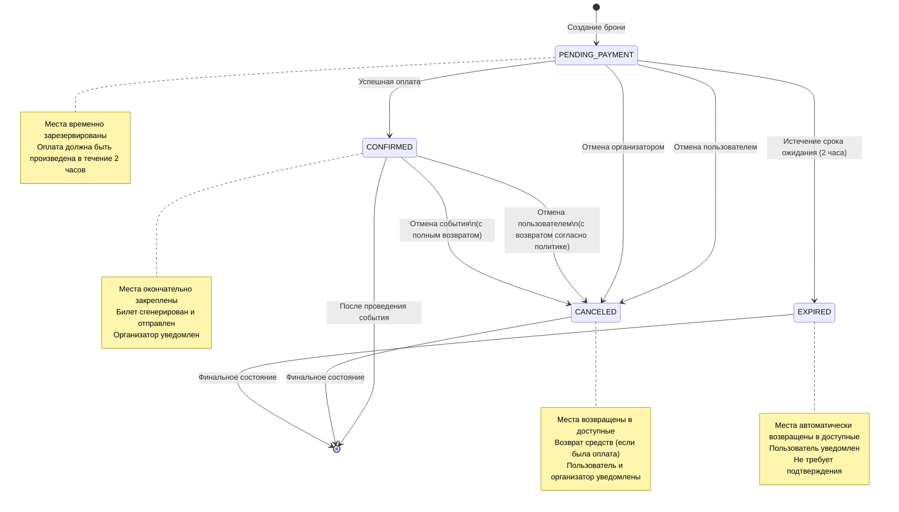

Переходы между статусами вызывают ряд системных событий:

1. **`PENDING_PAYMENT`** → **`CONFIRMED`**:
   - Генерация билета
   - Отправка подтверждения пользователю
   - Уведомление организатора о новом участнике
   - Обновление статистики события

2. **`PENDING_PAYMENT`** → **`EXPIRED`**:
   - Автоматическое освобождение зарезервированных мест
   - Уведомление пользователя об истечении срока резервирования
   - Обновление счетчиков доступных мест

3. **`CONFIRMED`** → **`CANCELED`**:
   - Обработка возврата (расчет суммы согласно политике возврата)
   - Инициация возврата средств
   - Освобождение мест
   - Уведомление пользователя и организатора

В отличие от статусов события, статусы бронирования не могут быть установлены произвольно - они следуют строгой последовательности, определяемой бизнес-правилами и системными процессами.

### 💳 Оплата и возвраты
- **Успешная оплата**: Генерация билета, статус **`CONFIRMED`**
- **Неуспешная оплата**: Повторная попытка
- **Просрочка**: Автоматическая отмена
- **Ручная отмена**: До оплаты пользователем
- **Отмена организатором**: Массовая отмена, возвраты

### 💰 Платежи
- **Статусы платежей**: `INITIATED`, `COMPLETED`, `FAILED`, `REFUNDED`, `PARTIAL_REFUND`
- **Обработка возвратов**: Автоматическая и ручная обработка через интеграцию с платежными шлюзами
- **Отслеживание**: Мониторинг статусов через gateway_reference
- **Интеграция платёжных шлюзов**: Поддержка различных систем через абстрактный интерфейс
- **Обработка callbacks**: Асинхронное получение и обработка уведомлений от платёжных систем
- **Безопасность**: Шифрование платёжных данных и соответствие стандартам PCI DSS

### 🔄 Политика возврата
- **До 7 дней**: 100% возврат
- **2–7 дней**: ~80% возврат
- **24–48 часов**: ~50% возврат
- **<24 часов**: Возврат не осуществляется (исключения возможны)
- **Отмена организатором**: Полный возврат вне зависимости от срока
- **Форс-мажор**: Индивидуальное рассмотрение с возможностью полного возврата
- **Гибкая настройка**: Возможность определения собственной политики для каждого события

### 📣 Уведомления
- **Отправка**: Через `backend-notification` (Kafka)
- **Типы**: Напоминания, изменения статуса, бронирования, оплаты, экипаж

### 👥 Экипаж
- **Назначение**: Через `backend-crew`
- **Управление**: Автоматическое и ручное
- **Обновление**: При изменении или отмене события
- **Уведомления**: Организатору при отмене/переносе

### ❤️ Избранное
- **Функции**: Добавление/удаление событий
- **Доступ**: Только для авторизованных пользователей
- **Хранение**: Персонально, не публично

### ⭐ Отзывы
- **Количество**: Один отзыв после события
- **Рейтинг**: 1–5, статус `PENDING` → `ACTIVE` → `REJECTED`
- **Модерация**: Ответы организатора
- **Сортировка**: По полезности

### 📂 Категории событий
- **Иерархия**: Родительско-дочерние связи
- **Выбор категории**: Из предопределённого списка
- **Интерфейс**: Удобный выбор при создании события
- **Фильтрация**: Используются в каталоге

### 🔧 Администрирование
- **Управление событиями**: Просмотр и редактирование всех событий для поддержания актуальности информации
- **Контроль бронирований и отзывов**: Мониторинг и управление для обеспечения качества сервиса
- **Отчётность**: Ведение журналов, создание отчётов и экспорт данных в формате CSV
- **Массовые операции**: Возможность массового переноса, отмены и рассылки

### 💲 Ценообразование
- **Категории**: VIP, ранняя цена, групповые и стандартные тарифы
- **Промокоды**: Поддержка фиксированных и процентных скидок с ограничениями
- **Динамическое ценообразование**: Корректировка цен в зависимости от спроса
- **Система лояльности**: Программы поощрения для постоянных клиентов

### 🚀 Кэширование и оптимизация
- **Кэширование каталога**: Хранение часто запрашиваемых событий в Redis с TTL
- **Кэширование статических данных**: Кэширование категорий, шаблонов уведомлений
- **Сжатие изображений**: Автоматическое сжатие загружаемых изображений событий
- **Ленивая загрузка**: Отложенная загрузка деталей события при просмотре каталога
- **Приоритизация запросов**: Выделение пула ресурсов для критичных операций
- **Фоновые задачи**: Выполнение тяжёлых операций (массовая рассылка, генерация отчётов) асинхронно
- **Многоуровневое кэширование**:
  - L1: Локальный in-memory кэш с малым TTL (30 сек) для сверхбыстрого доступа
  - L2: Распределённый Redis-кэш с более длительным TTL (5-15 мин)
  - L3: Постоянное хранилище (PostgreSQL)
- **Стратегии инвалидации кэша**:
  - Проактивная инвалидация при изменениях (cache-aside pattern)
  - Cascading invalidation для связанных объектов (при изменении события инвалидируются кэши бронирований)
  - Использование канала pub/sub в Redis для уведомления всех инстансов о необходимости инвалидации
- **Условное кэширование**: Разные TTL в зависимости от популярности события (популярные события кэшируются дольше)
- **Кэширование запросов**: Использование ETag и условных GET-запросов для снижения нагрузки

### 🔒 Защита от конкурентных запросов
- **Оптимистичные блокировки**: Использование версионирования для предотвращения перезаписи данных
- **Пессимистичные блокировки**: Использование Redis для блокировки критичных ресурсов
- **Распределенные блокировки**: Защита от race condition при резервировании билетов
- **Механизм идемпотентности**: Предотвращение дублирования операций при повторной отправке
- **Проверка временных меток**: Обнаружение устаревших запросов на изменение данных
- **Очереди запросов**: Упорядочивание конкурентных запросов на изменение одних и тех же ресурсов
- **Технические реализации блокировок в Redis**:
  - Использование команды `SET nx ex` с уникальным токеном владельца блокировки
  - Использование Redlock алгоритма для распределённых блокировок в кластере Redis
  - Автоматическое освобождение блокировок с помощью TTL для предотвращения deadlock
  - Lua-скрипты для атомарных проверок и обновлений
- **Примеры обработки race condition**:
  ```
  // Псевдокод для блокировки при бронировании билета
  String lockKey = "booking:event:" + eventId;
  String lockValue = UUID.randomUUID().toString();
  
  try {
    // Попытка получить блокировку
    boolean locked = redisTemplate.opsForValue().setIfAbsent(lockKey, lockValue, 30, TimeUnit.SECONDS);
    
    if (locked) {
      // Проверка доступности мест в БД
      int availableSeats = eventRepository.findAvailableSeatsById(eventId);
      
      if (availableSeats >= requestedSeats) {
        // Создание брони
        Booking booking = bookingRepository.save(new Booking(...));
        // Обновление доступных мест
        eventRepository.updateAvailableSeats(eventId, availableSeats - requestedSeats);
        return booking;
      } else {
        throw new NoAvailableSeatsException();
      }
    } else {
      throw new ConcurrentBookingException("Попробуйте еще раз через несколько секунд");
    }
  } finally {
    // Освобождение блокировки только если мы владельцы (с помощью Lua-скрипта)
    String script = "if redis.call('get', KEYS[1]) == ARGV[1] then return redis.call('del', KEYS[1]) else return 0 end";
    redisTemplate.execute(new DefaultRedisScript<>(script, Long.class), 
                          Collections.singletonList(lockKey), lockValue);
  }
  ```
- **Обработка конфликтов при конкурентном редактировании**:
  - Отслеживание версии при каждом обновлении (`UPDATE events SET ... WHERE id = ? AND version = ?`)
  - При конфликте - отображение предупреждения пользователю с вариантами разрешения конфликта
  - Стратегия "последний выигрывает" с информированием пользователя о перезаписи
  - Сохранение истории изменений в `AuditLog` для возможности восстановления

---

## 📊 Модель данных (ERD)

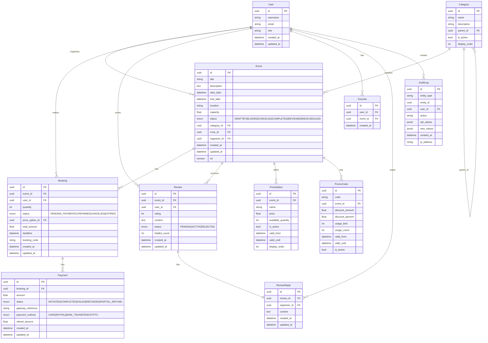

### 🔑 Основные сущности и атрибуты

#### User (Пользователь)
- **id**: Уникальный идентификатор пользователя (UUID)
- **username**: Имя пользователя для отображения
- **email**: Электронная почта (используется для авторизации)
- **role**: Роль пользователя (например, "Гость", "Пользователь", "Организатор", "Администратор")
- **created_at, updated_at**: Даты создания и последнего обновления

#### Event (Событие)
- **id**: Уникальный идентификатор события (UUID)
- **title**: Название события
- **description**: Подробное описание события
- **start_date, end_date**: Даты начала и окончания события
- **location**: Место проведения (адрес или координаты)
- **capacity**: Вместимость (максимальное количество участников)
- **status**: Статус события (см. раздел "Статусы событий")
- **category_id**: Ссылка на категорию события
- **crew_id**: Ссылка на назначенный экипаж
- **organizer_id**: Ссылка на организатора
- **created_at, updated_at**: Даты создания и последнего обновления
- **version**: Версия события для версионирования

#### Category (Категория)
- **id**: Уникальный идентификатор категории
- **name**: Название категории
- **description**: Описание категории
- **parent_id**: Ссылка на родительскую категорию (для иерархии)
- **is_active**: Флаг активности категории
- **display_order**: Порядок отображения в интерфейсе

#### Booking (Бронирование)
- **id**: Уникальный идентификатор бронирования
- **event_id**: Ссылка на событие
- **user_id**: Ссылка на пользователя, создавшего бронь
- **quantity**: Количество забронированных мест
- **status**: Статус бронирования (см. раздел "Статусы бронирований")
- **price_option_id**: Ссылка на выбранную опцию цены
- **total_amount**: Итоговая сумма бронирования
- **deadline**: Срок действия брони (для оплаты)
- **booking_code**: Уникальный код бронирования
- **created_at, updated_at**: Даты создания и обновления бронирования

#### PriceOption (Ценовая опция)
- **id**: Уникальный идентификатор ценовой опции
- **event_id**: Ссылка на событие
- **name**: Название опции (например, "VIP", "Стандарт")
- **price**: Стоимость за единицу
- **available_quantity**: Доступное количество билетов данной категории
- **is_active**: Флаг активности опции
- **valid_from, valid_until**: Период действия цены (для раннего бронирования)
- **display_order**: Порядок отображения в интерфейсе

#### Payment (Платёж)
- **id**: Уникальный идентификатор платежа
- **booking_id**: Ссылка на бронирование
- **amount**: Сумма платежа
- **status**: Статус платежа (см. раздел "Статусы платежей")
- **gateway_reference**: Ссылка на транзакцию платёжного шлюза
- **payment_method**: Метод оплаты (CARD, PAYPAL, BANK_TRANSFER, CRYPTO)
- **refund_amount**: Сумма возврата (если был)
- **created_at, updated_at**: Даты создания и обновления платежа

#### Review (Отзыв)
- **id**: Уникальный идентификатор отзыва
- **event_id**: Ссылка на событие
- **user_id**: Ссылка на автора отзыва
- **rating**: Оценка от 1 до 5
- **content**: Текст отзыва
- **status**: Статус отзыва (см. раздел "Статусы отзывов")
- **helpful_count**: Счётчик полезности отзыва
- **created_at, updated_at**: Даты создания и обновления отзыва

#### ReviewReply (Ответ на отзыв)
- **id**: Уникальный идентификатор ответа
- **review_id**: Ссылка на отзыв
- **organizer_id**: Ссылка на организатора, дающего ответ
- **content**: Текст ответа
- **created_at, updated_at**: Даты создания и обновления ответа

#### Favorite (Избранное)
- **id**: Уникальный идентификатор записи избранного
- **user_id**: Ссылка на пользователя
- **event_id**: Ссылка на событие в избранном
- **created_at**: Дата добавления в избранное

#### PromoCode (Промокод)
- **id**: Уникальный идентификатор промокода
- **code**: Код промокода (текстовый)
- **event_id**: Ссылка на событие
- **discount_amount**: Сумма скидки (фиксированная)
- **discount_percent**: Процент скидки
- **usage_limit**: Лимит использований
- **usage_count**: Счётчик использований
- **valid_from, valid_until**: Период действия промокода
- **is_active**: Флаг активности промокода

#### AuditLog (Журнал аудита)
- **id**: Уникальный идентификатор записи аудита
- **entity_type**: Тип изменяемой сущности (например, "Event", "Booking", "Review")
- **entity_id**: Идентификатор изменяемой сущности
- **user_id**: Идентификатор пользователя, совершившего изменение
- **action**: Действие, совершенное пользователем (например, "Created", "Updated", "Deleted")
- **old_values**: Старые значения сущности в формате JSONB
- **new_values**: Новые значения сущности в формате JSONB
- **created_at**: Дата и время совершения изменения
- **ip_address**: IP-адрес пользователя, совершившего изменение

### 🔗 Связи между сущностями

- **User-Event**: Пользователь может быть организатором множества событий
- **User-Booking**: Пользователь может иметь множество бронирований
- **User-Review**: Пользователь может оставлять множество отзывов
- **User-Favorite**: Пользователь может добавлять множество событий в избранное
- **User-ReviewReply**: Пользователь может оставлять ответы на отзывы
- **User-AuditLog**: Пользователь может создавать записи в журнале аудита
- **Event-Booking**: Событие может иметь множество бронирований
- **Event-Review**: Событие может иметь множество отзывов
- **Event-PriceOption**: Событие может иметь множество ценовых опций
- **Event-PromoCode**: Событие может иметь множество промокодов
- **Event-AuditLog**: Событие может иметь записи в журнале аудита
- **Category-Event**: Категория может содержать множество событий
- **Category-Category**: Категория может иметь родительскую категорию (для иерархии)
- **Booking-Payment**: Бронирование может иметь множество платежей
- **Review-ReviewReply**: Отзыв может иметь один ответ от организатора

### 📏 Бизнес-правила и ограничения

- Событие может быть создано только авторизованным пользователем с ролью Организатор
- Бронирование может быть создано только по опубликованному событию (статус **`PUBLISHED`**)
- Отзыв может быть оставлен только участником события после его завершения
- Промокод может применяться только к указанному событию в период его действия
- Пользователь может забронировать только одно место на событие (один раз)
- Организатор может видеть только свои события и их бронирования
- Администратор может видеть все события и их бронирования

---

## 🌐 Сетевое взаимодействие и зависимости
- **Протоколы**: gRPC для синхронных вызовов, Kafka для асинхронных событий
- **Безопасность**: TLS для всех внешних соединений
- **Аутентификация**: OAuth2, JWT через `backend-auth`
- **Мониторинг**: Prometheus, Grafana
- **Логирование**: ELK Stack

### 🔄 Интеграционная модель

Микросервис `backend-event` взаимодействует с другими сервисами экосистемы Aquastream через комбинацию синхронных (gRPC) и асинхронных (Kafka) вызовов:

#### Синхронные интеграции (gRPC)
- **`backend-auth`**: Аутентификация и авторизация пользователей
- **`backend-crew`**: Назначение и освобождение экипажа для событий
- **`backend-payment`**: Инициация платежей и обработка возвратов
- **`backend-user`**: Получение информации о пользователях
- **`backend-search`**: Индексация и поиск событий

#### Асинхронные интеграции (Kafka)
- **`backend-notification`**: Отправка уведомлений пользователям и организаторам
- **`backend-analytics`**: Сбор метрик и статистики по событиям и конверсиям
- **События домена**: Публикация доменных событий для других сервисов

### 📊 Таблица зависимостей от других сервисов
| Сервис             | Тип интеграции | Критичность | Влияние при недоступности                              | Резервный механизм                                                                 |
|--------------------|----------------|-------------|--------------------------------------------------------|------------------------------------------------------------------------------------|
| `backend-auth`       | gRPC           | Критичная   | Невозможность аутентификации и авторизации пользователей | Кэширование токенов в Redis с TTL, offline-режим проверки для токенов аутентификации |
| `backend-notification` | Kafka         | Высокая     | Отсутствие уведомлений о статусе бронирований и событий | Локальная очередь сообщений с отложенной отправкой                                 |
| `backend-crew`       | gRPC           | Средняя     | Невозможность назначения персонала на события           | Асинхронное назначение после восстановления доступности                            |
| `backend-payment`    | gRPC, Kafka    | Критичная   | Невозможность обработки платежей и возвратов            | Переход в режим "только просмотр" для платных операций, сохранение транзакций для последующей обработки |
| `backend-user`       | gRPC           | Высокая     | Невозможность получения информации о пользователях      | Кэширование базовой информации о пользователях в Redis                             |
| `backend-analytics`  | Kafka          | Низкая      | Отсутствие статистики по мероприятиям                   | Локальное накопление статистики с последующей синхронизацией                       |
| `backend-search`     | gRPC           | Средняя     | Ограниченные возможности поиска и фильтрации            | Базовый поиск по прямым запросам к БД                                              |

### 🔄 Схема потоков данных

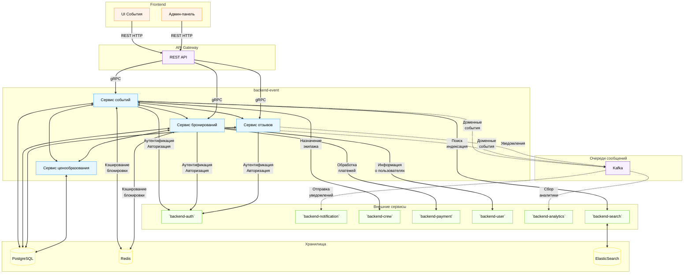

---

## 🎬 Сценарии использования

### 📋 Сценарий 1: Бронирование без оплаты
Пользователь бронирует билет, но не оплачивает его до истечения дедлайна. Бронь автоматически истекает, билеты возвращаются в продажу, пользователю отправляется уведомление.
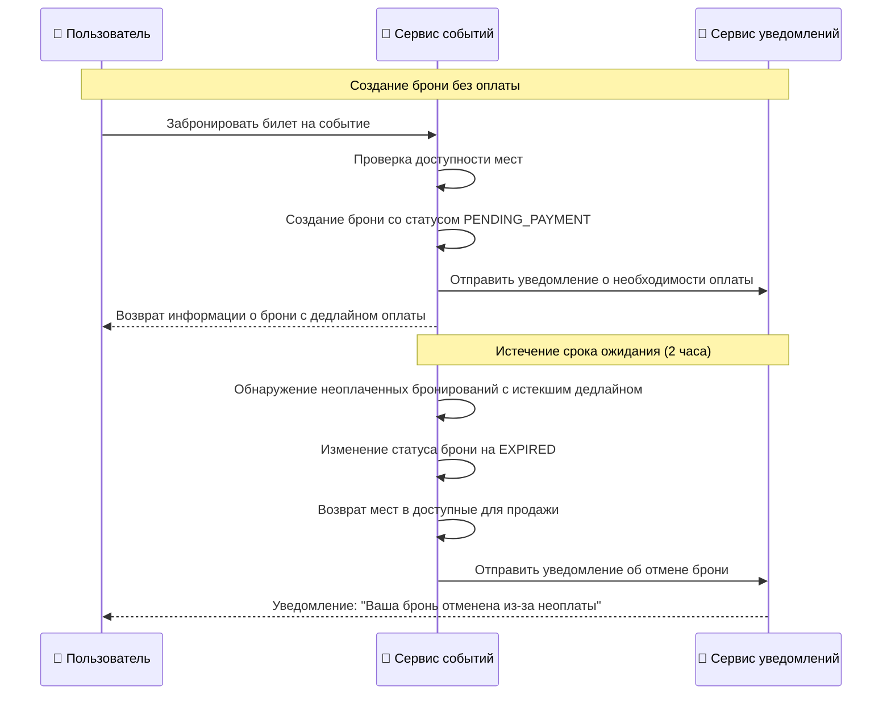

### 💳 Сценарий 2: Бронирование и успешная оплата
Пользователь бронирует билет с промокодом и успешно оплачивает его. Получает подтверждение и билет, организатор уведомляется.
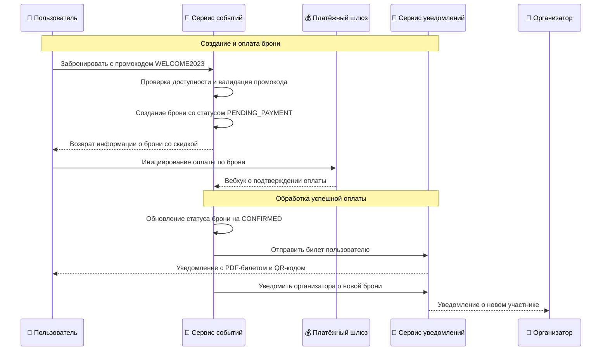

### ❌ Сценарий 3: Отмена события организатором
Организатор отменяет событие. Все бронирования отменяются, инициируются возвраты, участники уведомляются.
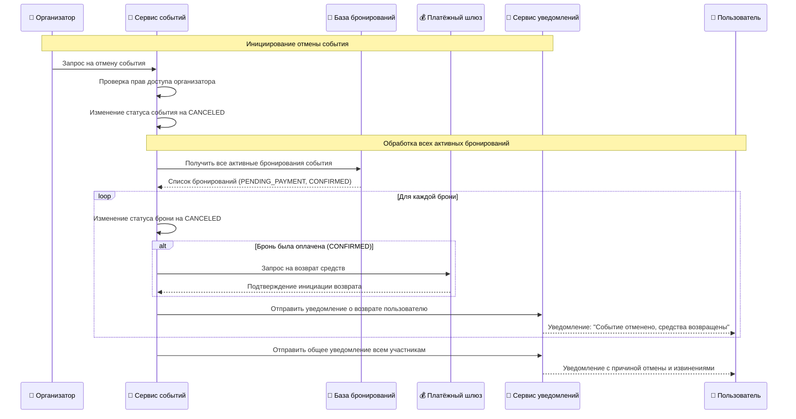

### ⭐ Сценарий 4: Модерация отзыва
Пользователь оставляет отзыв. Администратор модерирует и может отклонить отзыв при нарушении правил, пользователь получает уведомление.
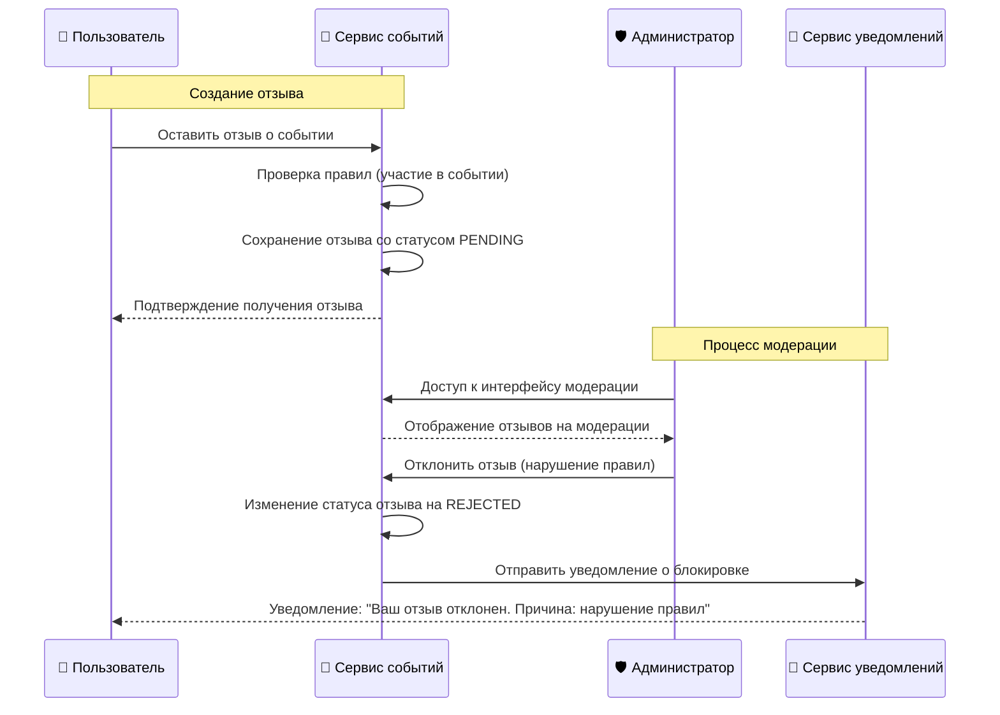

### ❤️ Сценарий 5: Добавление события в избранное
Пользователь добавляет событие в избранное и получает напоминания о приближении мероприятия.
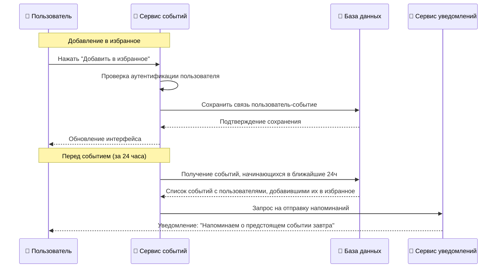

---

## 🛠️ API Спецификация

Сервис `backend-event` предоставляет программный интерфейс через gRPC для внутренних взаимодействий с другими микросервисами и REST API для внешних клиентов (веб, мобильные приложения) через API Gateway.

### 📊 Визуализация структуры API

```mermaid
graph LR
    %% Группировка по категориям API
    subgraph Events ["API управления событиями"]
        E1["/api/events"]
        E2["/api/events/{id}"]
        E3["/api/events/{id}/publish"]
        E4["/api/events/{id}/cancel"]
        E5["/api/events/{id}/crew"]
    end
    
    subgraph Bookings ["API бронирований"]
        B1["/api/bookings"]
        B2["/api/bookings/{id}"]
        B3["/api/bookings/{id}/cancel"]
    end
    
    subgraph Payments ["API платежей"]
        P1["/api/payments/initiate"]
        P2["/api/payments/confirm"]
        P3["/api/payments/{id}/refund"]
        P4["/api/payments/{id}"]
    end
    
    subgraph Favorites ["API избранного"]
        F1["/api/favorites"]
        F2["/api/favorites/{id}"]
    end
    
    subgraph Reviews ["API отзывов"]
        R1["/api/reviews"]
        R2["/api/reviews/{id}"]
        R3["/api/reviews/{id}/replies"]
        R4["/api/reviews/{id}/helpful"]
        R5["/api/reviews/{id}/moderate"]
    end
    
    subgraph Categories ["API категорий и промокодов"]
        C1["/api/categories"]
        C2["/api/promo-codes"]
        C3["/api/promo-codes/validate"]
    end
    
    %% Группировка по ролям
    subgraph Roles ["Роли и доступ"]
        PUBLIC["Публичный доступ"]
        USER["Пользователь"]
        ORGANIZER["Организатор"]
        ADMIN["Администратор"]
    end
    
    %% Связи между API и ролями (основные)
    PUBLIC --> E1
    PUBLIC --> E2
    PUBLIC --> R1
    PUBLIC --> R2
    PUBLIC --> C1
    
    USER --> B1
    USER --> B2
    USER --> B3
    USER --> P1
    USER --> F1
    USER --> F2
    USER --> R3
    USER --> R4
    USER --> C3
    
    ORGANIZER --> E2
    ORGANIZER --> E3
    ORGANIZER --> E4
    ORGANIZER --> E5
    ORGANIZER --> B1
    ORGANIZER --> P3
    ORGANIZER --> R3
    ORGANIZER --> C2
    
    ADMIN --> E1
    ADMIN --> E2
    ADMIN --> E3
    ADMIN --> E4
    ADMIN --> E5
    ADMIN --> R5
    ADMIN --> B1
    ADMIN --> B2
    ADMIN --> B3
    ADMIN --> P3
    
    %% Стили
    classDef events fill:#e6f7ff,stroke:#1890ff;
    classDef bookings fill:#f6ffed,stroke:#52c41a;
    classDef payments fill:#fff2e8,stroke:#fa8c16;
    classDef favorites fill:#fff1f0,stroke:#f5222d;
    classDef reviews fill:#f9f0ff,stroke:#722ed1;
    classDef categories fill:#fcffe6,stroke:#bae637;
    classDef roles fill:#f5f5f5,stroke:#595959;
    
    class E1,E2,E3,E4,E5 events;
    class B1,B2,B3 bookings;
    class P1,P2,P3,P4 payments;
    class F1,F2 favorites;
    class R1,R2,R3,R4,R5 reviews;
    class C1,C2,C3 categories;
    class PUBLIC,USER,ORGANIZER,ADMIN roles;
```

### 📡 gRPC API

gRPC сервис EventService определен в прото-описании и включает методы для управления всеми аспектами жизненного цикла событий:

```proto
service EventService {
    // Управление событиями
    rpc CreateEvent(CreateEventRequest) returns (EventResponse);
    rpc UpdateEvent(UpdateEventRequest) returns (EventResponse);
    rpc GetEvent(GetEventRequest) returns (EventResponse);
    rpc ListEvents(ListEventsRequest) returns (ListEventsResponse);
    rpc PublishEvent(PublishEventRequest) returns (EventResponse);
    rpc CancelEvent(CancelEventRequest) returns (EventResponse);
    rpc AssignCrew(AssignCrewRequest) returns (EventResponse);
    rpc GetEventCrew(GetEventCrewRequest) returns (EventCrewResponse);
    rpc UpdateEventCrew(UpdateEventCrewRequest) returns (EventCrewResponse);
    
    // Управление бронированиями
    rpc CreateBooking(CreateBookingRequest) returns (BookingResponse);
    rpc GetBooking(GetBookingRequest) returns (BookingResponse);
    rpc ListBookings(ListBookingsRequest) returns (ListBookingsResponse);
    rpc CancelBooking(CancelBookingRequest) returns (BookingResponse);
    
    // Управление платежами
    rpc InitiatePayment(InitiatePaymentRequest) returns (PaymentResponse);
    rpc ConfirmPayment(ConfirmPaymentRequest) returns (PaymentResponse);
    rpc RefundPayment(RefundPaymentRequest) returns (PaymentResponse);
    
    // Работа с избранным
    rpc AddFavorite(AddFavoriteRequest) returns (FavoriteResponse);
    rpc RemoveFavorite(RemoveFavoriteRequest) returns (google.protobuf.Empty);
    rpc ListFavorites(ListFavoritesRequest) returns (ListFavoritesResponse);
    
    // Работа с отзывами
    rpc CreateReview(CreateReviewRequest) returns (ReviewResponse);
    rpc UpdateReview(UpdateReviewRequest) returns (ReviewResponse);
    rpc ListReviews(ListReviewsRequest) returns (ListReviewsResponse);
    rpc ReplyToReview(ReplyToReviewRequest) returns (ReviewReplyResponse);
    
    // Управление ценовыми опциями
    rpc GetPriceOptions(GetPriceOptionsRequest) returns (PriceOptionsResponse);
    rpc CreatePriceOption(CreatePriceOptionRequest) returns (PriceOptionResponse);
    rpc UpdatePriceOption(UpdatePriceOptionRequest) returns (PriceOptionResponse);
    rpc DeletePriceOption(DeletePriceOptionRequest) returns (google.protobuf.Empty);
    
    // Управление билетами
    rpc GetTicket(GetTicketRequest) returns (TicketResponse);
    rpc ResendTicket(ResendTicketRequest) returns (ResendTicketResponse);
    
    // Аналитика и отчеты
    rpc GetEventStats(GetEventStatsRequest) returns (EventStatsResponse);
    rpc GetBookingStats(GetBookingStatsRequest) returns (BookingStatsResponse);
    rpc GetConversionStats(GetConversionStatsRequest) returns (ConversionStatsResponse);
}
```

### 🌐 REST API (через API Gateway)

REST API организован по ресурсам для удобства потребления внешними клиентами. API Gateway маршрутизирует запросы к соответствующим gRPC методам сервиса.

#### События (Events)

| Метод | Путь | Описание | Роль |
|-------|------|----------|------|
| GET | `/api/events` | Получение списка событий с фильтрацией | PUBLIC |
| GET | `/api/events/{id}` | Получение детальной информации о событии | PUBLIC |
| POST | `/api/events` | Создание нового события | ORGANIZER, ADMIN |
| PUT | `/api/events/{id}` | Обновление существующего события | ORGANIZER*, ADMIN |
| POST | `/api/events/{id}/publish` | Публикация события | ORGANIZER*, ADMIN |
| POST | `/api/events/{id}/cancel` | Отмена события | ORGANIZER*, ADMIN |
| POST | `/api/events/{id}/crew` | Назначение экипажа | ORGANIZER*, ADMIN |
| GET | `/api/events/{id}/crew` | Получение информации о назначенном экипаже | ORGANIZER*, ADMIN |
| PUT | `/api/events/{id}/crew` | Обновление состава экипажа | ORGANIZER*, ADMIN |
| GET | `/api/events/{id}/stats` | Получение статистики по конкретному событию | ORGANIZER*, ADMIN |

\* Организатор может управлять только своими событиями

#### Бронирования (Bookings)

| Метод | Путь | Описание | Роль |
|-------|------|----------|------|
| GET | `/api/bookings` | Получение списка бронирований | USER, ORGANIZER, ADMIN |
| GET | `/api/bookings/{id}` | Получение деталей бронирования | USER*, ORGANIZER**, ADMIN |
| POST | `/api/bookings` | Создание нового бронирования | USER, ADMIN |
| POST | `/api/bookings/{id}/cancel` | Отмена бронирования | USER*, ORGANIZER**, ADMIN |
| GET | `/api/bookings/{id}/ticket` | Получение билета в PDF формате | USER*, ORGANIZER**, ADMIN |
| GET | `/api/bookings/{id}/ticket/download` | Скачивание билета | USER*, ORGANIZER**, ADMIN |
| POST | `/api/bookings/{id}/ticket/resend` | Повторная отправка билета на email | USER*, ORGANIZER**, ADMIN |

\* Пользователь видит только свои бронирования  
\** Организатор видит бронирования своих событий

#### Платежи (Payments)

| Метод | Путь | Описание | Роль |
|-------|------|----------|------|
| POST | `/api/payments/initiate` | Инициация платежа | USER, ADMIN |
| POST | `/api/payments/confirm` | Подтверждение платежа | SYSTEM |
| POST | `/api/payments/{id}/refund` | Возврат средств | ORGANIZER*, ADMIN |
| GET | `/api/payments/{id}` | Получение информации о платеже | USER*, ORGANIZER**, ADMIN |

\* Пользователь видит только свои платежи  
\** Организатор видит платежи по своим событиям

#### Избранное (Favorites)

| Метод | Путь | Описание | Роль |
|-------|------|----------|------|
| GET | `/api/favorites` | Получение списка избранного | USER, ADMIN |
| POST | `/api/favorites` | Добавление события в избранное | USER, ADMIN |
| DELETE | `/api/favorites/{id}` | Удаление события из избранного | USER, ADMIN |

#### Отзывы (Reviews)

| Метод | Путь | Описание | Роль |
|-------|------|----------|------|
| GET | `/api/reviews` | Получение списка отзывов | PUBLIC |
| GET | `/api/reviews/{id}` | Получение деталей отзыва | PUBLIC |
| POST | `/api/reviews` | Создание нового отзыва | USER |
| PUT | `/api/reviews/{id}` | Редактирование отзыва | USER*, ADMIN |
| POST | `/api/reviews/{id}/replies` | Ответ на отзыв | ORGANIZER*, ADMIN |
| POST | `/api/reviews/{id}/helpful` | Пометить отзыв как полезный | USER |
| POST | `/api/reviews/{id}/moderate` | Модерация отзыва | ADMIN |

\* Пользователь может редактировать только свои отзывы  
\* Организатор может отвечать только на отзывы о своих событиях

#### Категории и промокоды

| Метод | Путь | Описание | Роль |
|-------|------|----------|------|
| GET | `/api/categories` | Получение списка категорий | PUBLIC |
| POST | `/api/promo-codes` | Создание промокода | ORGANIZER, ADMIN |
| POST | `/api/promo-codes/validate` | Проверка валидности промокода | USER |

#### Ценовые опции (Price Options)

| Метод | Путь | Описание | Роль |
|-------|------|----------|------|
| GET | `/api/events/{id}/price-options` | Получение списка ценовых опций события | PUBLIC |
| POST | `/api/events/{id}/price-options` | Создание новой ценовой опции | ORGANIZER*, ADMIN |
| PUT | `/api/events/{id}/price-options/{optionId}` | Обновление ценовой опции | ORGANIZER*, ADMIN |
| DELETE | `/api/events/{id}/price-options/{optionId}` | Удаление ценовой опции | ORGANIZER*, ADMIN |

\* Организатор может управлять только ценами своих событий

#### Статистика и аналитика

| Метод | Путь | Описание | Роль |
|-------|------|----------|------|
| GET | `/api/stats/events` | Получение агрегированной статистики по событиям | ADMIN |
| GET | `/api/stats/bookings` | Получение статистики по бронированиям | ADMIN |
| GET | `/api/stats/conversions` | Получение данных о конверсии просмотров в бронирования | ADMIN, ORGANIZER* |

\* Организатор видит статистику только по своим событиям

### 📋 Примеры запросов и ответов

#### Создание события (POST /api/events)
```json
// Запрос
{
  "title": "Мастер-класс по программированию",
  "description": "Интенсивный курс для начинающих разработчиков",
  "start_date": "2023-11-15T10:00:00Z",
  "end_date": "2023-11-15T15:00:00Z",
  "location": "Москва, ул. Пушкина, 1",
  "capacity": 50,
  "category_id": "9a1b2c3d-4e5f-6a7b-8c9d-0e1f2a3b4c5d",
  "price_options": [
    {
      "name": "Стандарт",
      "price": 1500,
      "available_quantity": 40
    },
    {
      "name": "VIP",
      "price": 3000,
      "available_quantity": 10
    }
  ]
}

// Ответ (201 Created)
{
  "id": "1a2b3c4d-5e6f-7a8b-9c0d-1e2f3a4b5c6d",
  "title": "Мастер-класс по программированию",
  "status": "DRAFT",
  "organizer_id": "5e6f7a8b-9c0d-1e2f-3a4b-5c6d7e8f9a0b",
  "created_at": "2023-10-05T14:23:11Z"
}
```

#### Публикация события (POST /api/events/{id}/publish)
```json
// Запрос
{
  "publication_date": "2023-10-06T00:00:00Z"  // Опционально, для отложенной публикации
}

// Ответ (200 OK)
{
  "id": "1a2b3c4d-5e6f-7a8b-9c0d-1e2f3a4b5c6d",
  "title": "Мастер-класс по программированию",
  "status": "PUBLISHED",
  "organizer_id": "5e6f7a8b-9c0d-1e2f-3a4b-5c6d7e8f9a0b",
  "updated_at": "2023-10-05T15:30:45Z",
  "publication_date": "2023-10-06T00:00:00Z"
}
```

#### Получение списка событий (GET /api/events)
```json
// Пример запроса с параметрами
// GET /api/events?category=workshop&start_date=2023-11-01&location=Москва

// Ответ (200 OK)
{
  "total_count": 24,
  "page": 1,
  "page_size": 10,
  "events": [
    {
      "id": "1a2b3c4d-5e6f-7a8b-9c0d-1e2f3a4b5c6d",
      "title": "Мастер-класс по программированию",
      "description": "Интенсивный курс для начинающих разработчиков",
      "start_date": "2023-11-15T10:00:00Z",
      "location": "Москва, ул. Пушкина, 1",
      "min_price": 1500,
      "rating": 4.8,
      "organizer": {
        "id": "5e6f7a8b-9c0d-1e2f-3a4b-5c6d7e8f9a0b",
        "name": "IT Education Center"
      }
    },
    // ... другие события
  ]
}
```

#### Бронирование (POST /api/bookings)
```json
// Запрос
{
  "event_id": "1a2b3c4d-5e6f-7a8b-9c0d-1e2f3a4b5c6d",
  "price_option_id": "2b3c4d5e-6f7a-8b9c-0d1e-2f3a4b5c6d7e",
  "quantity": 1,
  "promo_code": "WELCOME2023"
}

// Ответ (201 Created)
{
  "id": "3c4d5e6f-7a8b-9c0d-1e2f-3a4b5c6d7e8f",
  "event": {
    "id": "1a2b3c4d-5e6f-7a8b-9c0d-1e2f3a4b5c6d",
    "title": "Мастер-класс по программированию"
  },
  "status": "PENDING_PAYMENT",
  "total_amount": 1350,
  "deadline": "2023-10-05T16:23:11Z",
  "booking_code": "BKG12345678"
}
```

#### Инициация платежа (POST /api/payments/initiate)
```json
// Запрос
{
  "booking_id": "3c4d5e6f-7a8b-9c0d-1e2f-3a4b5c6d7e8f",
  "payment_method": "CARD",
  "return_url": "https://aquastream.com/payment/success",
  "cancel_url": "https://aquastream.com/payment/cancel"
}

// Ответ (200 OK)
{
  "payment_id": "4d5e6f7a-8b9c-0d1e-2f3a-4b5c6d7e8f9a",
  "redirect_url": "https://payment-provider.com/pay/12345",
  "amount": 1350,
  "currency": "RUB",
  "expires_at": "2023-10-05T16:23:11Z"
}
```

#### Ответ на отзыв (POST /api/reviews/{id}/replies)
```json
// Запрос
{
  "content": "Спасибо за ваш отзыв! Мы рады, что вам понравилось мероприятие. Будем ждать вас на следующих наших событиях."
}

// Ответ (201 Created)
{
  "id": "5e6f7a8b-9c0d-1e2f-3a4b-5c6d-7e8f-9a0b",
  "review_id": "4d5e6f7a-8b9c-0d1e-2f3a-4b5c6d7e8f9a",
  "organizer_id": "5e6f7a8b-9c0d-1e2f-3a4b-5c6d7e8f9a0b",
  "content": "Спасибо за ваш отзыв! Мы рады, что вам понравилось мероприятие. Будем ждать вас на следующих наших событиях.",
  "created_at": "2023-10-10T12:34:56Z"
}
```

#### Создание ценовой опции (POST /api/events/{id}/price-options)
```json
// Запрос
{
  "name": "Ранняя регистрация",
  "price": 1200,
  "available_quantity": 20,
  "valid_from": "2023-10-10T00:00:00Z",
  "valid_until": "2023-10-25T23:59:59Z",
  "is_active": true,
  "display_order": 1
}

// Ответ (201 Created)
{
  "id": "6f7a8b9c-0d1e-2f3a-4b5c-6d7e8f9a0b1c",
  "event_id": "1a2b3c4d-5e6f-7a8b-9c0d-1e2f3a4b5c6d",
  "name": "Ранняя регистрация",
  "price": 1200,
  "available_quantity": 20,
  "valid_from": "2023-10-10T00:00:00Z",
  "valid_until": "2023-10-25T23:59:59Z",
  "is_active": true,
  "display_order": 1,
  "created_at": "2023-10-05T16:45:22Z"
}
```

#### Назначение экипажа (POST /api/events/{id}/crew)
```json
// Запрос
{
  "crew_members": [
    {
      "user_id": "7a8b9c0d-1e2f-3a4b-5c6d-7e8f9a0b1c2d",
      "role": "PHOTOGRAPHER"
    },
    {
      "user_id": "8b9c0d1e-2f3a-4b5c-6d7e-8f9a0b1c2d3e",
      "role": "ASSISTANT"
    }
  ],
  "notes": "Фотограф должен прибыть за 30 минут до начала"
}

// Ответ (200 OK)
{
  "event_id": "1a2b3c4d-5e6f-7a8b-9c0d-1e2f3a4b5c6d",
  "crew_id": "9c0d1e2f-3a4b-5c6d-7e8f-9a0b1c2d3e4f",
  "crew_members": [
    {
      "id": "0d1e2f3a-4b5c-6d7e-8f9a-0b1c2d3e4f5a",
      "user_id": "7a8b9c0d-1e2f-3a4b-5c6d-7e8f9a0b1c2d",
      "name": "Андрей Петров",
      "role": "PHOTOGRAPHER",
      "status": "ASSIGNED"
    },
    {
      "id": "1e2f3a4b-5c6d-7e8f-9a0b-1c2d3e4f5a6b",
      "user_id": "8b9c0d1e-2f3a-4b5c-6d7e-8f9a0b1c2d3e",
      "name": "Мария Сидорова",
      "role": "ASSISTANT",
      "status": "ASSIGNED"
    }
  ],
  "notes": "Фотограф должен прибыть за 30 минут до начала",
  "updated_at": "2023-10-06T09:12:34Z"
}
```

#### Билет (GET /api/bookings/{id}/ticket)
```json
// Ответ
{
  "booking_id": "3c4d5e6f-7a8b-9c0d-1e2f-3a4b5c6d7e8f",
  "event": {
    "id": "1a2b3c4d-5e6f-7a8b-9c0d-1e2f3a4b5c6d",
    "title": "Мастер-класс по программированию",
    "start_date": "2023-11-15T10:00:00Z",
    "location": "Москва, ул. Пушкина, 1"
  },
  "user": {
    "id": "7e8f9a0b-1c2d-3e4f-5a6b-7c8d9e0f1a2b",
    "name": "Иван Петров"
  },
  "ticket_code": "EVT12345678",
  "qr_code_url": "https://api.aquastream.com/tickets/qr/EVT12345678",
  "price_option": "Стандарт",
  "issue_date": "2023-10-05T14:30:45Z",
  "download_url": "https://api.aquastream.com/bookings/3c4d5e6f-7a8b-9c0d-1e2f-3a4b5c6d7e8f/ticket/download"
}
```

#### Статистика события (GET /api/events/{id}/stats)
```json
// Ответ
{
  "event_id": "1a2b3c4d-5e6f-7a8b-9c0d-1e2f3a4b5c6d",
  "title": "Мастер-класс по программированию",
  "views_count": 1250,
  "favorites_count": 45,
  "bookings": {
    "total": 38,
    "confirmed": 32,
    "pending": 3,
    "canceled": 3
  },
  "revenue": {
    "total": 56000,
    "by_price_option": [
      {"name": "Стандарт", "count": 25, "revenue": 37500},
      {"name": "VIP", "count": 7, "revenue": 18500}
    ]
  },
  "conversion_rate": 3.04,
  "reviews": {
    "count": 12,
    "average_rating": 4.6
  }
}
```

### 🔐 Аутентификация и авторизация

- API Gateway валидирует JWT-токены для всех запросов, требующих аутентификации
- Токены содержат информацию о пользователе и его ролях
- Gateway выполняет базовую проверку прав перед маршрутизацией запроса
- Дополнительная детальная проверка прав выполняется микросервисом

### 📊 Обработка ошибок

Сервис возвращает стандартные HTTP-коды ошибок:
- 400 Bad Request - некорректные данные запроса
- 401 Unauthorized - отсутствует или недействительный токен
- 403 Forbidden - недостаточно прав для операции
- 404 Not Found - запрашиваемый ресурс не найден
- 409 Conflict - конфликт (например, нет доступных мест)
- 422 Unprocessable Entity - невозможно обработать корректный запрос
- 429 Too Many Requests - превышен лимит запросов
- 500 Internal Server Error - внутренняя ошибка сервиса

#### Формат ответа при ошибке

Все ошибки возвращаются в стандартизированном формате JSON:

```json
{
  "status": "error",
  "code": "EVENT_NOT_FOUND",
  "message": "Событие с указанным идентификатором не найдено",
  "details": {
    "event_id": "1a2b3c4d-5e6f-7a8b-9c0d-1e2f3a4b5c6d"
  },
  "timestamp": "2023-10-05T14:30:45Z",
  "trace_id": "abcdef123456"
}
```

#### Примеры типичных ошибок и их обработка

**400 Bad Request - Некорректные данные**
```json
{
  "status": "error",
  "code": "VALIDATION_ERROR",
  "message": "Предоставленные данные не прошли валидацию",
  "details": {
    "validation_errors": [
      {
        "field": "start_date",
        "message": "Дата начала события не может быть в прошлом"
      },
      {
        "field": "capacity",
        "message": "Вместимость должна быть положительным числом"
      }
    ]
  },
  "timestamp": "2023-10-05T14:30:45Z",
  "trace_id": "abcdef123456"
}
```

**401 Unauthorized - Проблема с аутентификацией**
```json
{
  "status": "error",
  "code": "AUTHENTICATION_REQUIRED",
  "message": "Для выполнения операции требуется аутентификация",
  "details": {},
  "timestamp": "2023-10-05T14:30:45Z",
  "trace_id": "abcdef123456"
}
```

**403 Forbidden - Недостаточно прав**
```json
{
  "status": "error",
  "code": "PERMISSION_DENIED",
  "message": "Недостаточно прав для выполнения операции",
  "details": {
    "required_role": "ORGANIZER",
    "resource_type": "event",
    "resource_id": "1a2b3c4d-5e6f-7a8b-9c0d-1e2f3a4b5c6d",
    "action": "update"
  },
  "timestamp": "2023-10-05T14:30:45Z",
  "trace_id": "abcdef123456"
}
```

**404 Not Found - Ресурс не найден**
```json
{
  "status": "error",
  "code": "RESOURCE_NOT_FOUND",
  "message": "Запрашиваемый ресурс не найден",
  "details": {
    "resource_type": "event",
    "resource_id": "1a2b3c4d-5e6f-7a8b-9c0d-1e2f3a4b5c6d"
  },
  "timestamp": "2023-10-05T14:30:45Z",
  "trace_id": "abcdef123456"
}
```

**409 Conflict - Конфликт при бронировании**
```json
{
  "status": "error",
  "code": "NO_AVAILABLE_SEATS",
  "message": "Нет доступных мест для выбранной ценовой опции",
  "details": {
    "event_id": "1a2b3c4d-5e6f-7a8b-9c0d-1e2f3a4b5c6d",
    "price_option_id": "2b3c4d5e-6f7a-8b9c-0d1e-2f3a4b5c6d7e",
    "requested_quantity": 2,
    "available_quantity": 1
  },
  "timestamp": "2023-10-05T14:30:45Z",
  "trace_id": "abcdef123456"
}
```

**422 Unprocessable Entity - Невозможно обработать запрос**
```json
{
  "status": "error",
  "code": "INVALID_BOOKING_STATE",
  "message": "Невозможно отменить бронирование в текущем статусе",
  "details": {
    "booking_id": "3c4d5e6f-7a8b-9c0d-1e2f-3a4b5c6d7e8f",
    "current_status": "EXPIRED",
    "allowed_statuses": ["PENDING_PAYMENT", "CONFIRMED"]
  },
  "timestamp": "2023-10-05T14:30:45Z",
  "trace_id": "abcdef123456"
}
```

**429 Too Many Requests - Превышен лимит запросов**
```json
{
  "status": "error",
  "code": "RATE_LIMIT_EXCEEDED",
  "message": "Превышен лимит запросов. Пожалуйста, повторите попытку позже",
  "details": {
    "rate_limit": "100 requests per minute",
    "retry_after": 30
  },
  "timestamp": "2023-10-05T14:30:45Z",
  "trace_id": "abcdef123456"
}
```

**500 Internal Server Error - Внутренняя ошибка сервера**
```json
{
  "status": "error",
  "code": "INTERNAL_SERVER_ERROR",
  "message": "Произошла внутренняя ошибка сервера",
  "details": {},
  "timestamp": "2023-10-05T14:30:45Z",
  "trace_id": "abcdef123456"
}
```

#### Рекомендации по обработке ошибок

1. **Клиентская обработка**:
   - Всегда проверяйте HTTP-код ответа для определения типа ошибки
   - Используйте поле `code` для программной обработки конкретных ошибок
   - Отображайте поле `message` для конечных пользователей
   - Используйте поле `details` для отображения дополнительной информации об ошибке

2. **Идемпотентность**:
   - При получении ошибок 5XX или тайм-аутов, безопасно повторите идемпотентные операции (GET, PUT, DELETE)
   - Для неидемпотентных операций (POST) используйте идентификаторы идемпотентности в заголовке `Idempotency-Key`

3. **Обратная связь пользователю**:
   - При ошибках валидации (400) четко указывайте, какие поля нужно исправить
   - При ошибках авторизации (401, 403) предлагайте пользователю авторизоваться или запросить доступ
   - При ошибках конфликта (409) предоставляйте альтернативные варианты действий

---

## 💻 Системные требования

### 🏗️ Инфраструктура
- **Kubernetes:** Отказоустойчивый кластер с автомасштабированием
- **Docker:** Контейнеризация всех компонентов
- **CI/CD:** GitLab CI с автоматическими деплоями через Helm
- **Мониторинг:** Prometheus, Grafana, Jaeger для трассировки
- **Бизнес-метрики:** Отслеживание конверсии, популярности событий и экономической эффективности
- **Система алертов:** Автоматические оповещения при отклонении от нормальных показателей

### 🗄️ Хранилища данных
- **PostgreSQL:** Основная БД с репликацией для высокой доступности
- **Redis:** Кэширование, блокировки, очереди задач
- **Kafka:** Асинхронный обмен событиями между сервисами
- **Elasticsearch:** Полнотекстовый поиск и логирование

### 🛡️ Безопасность
- **Шифрование:** TLS для всех внешних соединений
- **JWT:** Короткоживущие токены с возможностью отзыва
- **Rate Limiting:** Защита от DDoS и брутфорс-атак
- **Аудит:** Логирование всех изменений с сохранением авторства

### 🎯 Миграции и обновления
- **Версионирование схемы БД:** Использование Liquibase/Flyway для управления миграциями
- **Совместимость версий:** Обратная совместимость API при обновлениях
- **Стратегия развертывания:** Blue-Green deployment для минимизации простоев
- **Тестирование миграций:** Автоматические тесты для проверки корректности миграций
- **Откат изменений:** Процедуры отката миграций и возврата к предыдущей версии
- **Обновление с нулевым простоем:** Постепенное обновление подов для обеспечения непрерывной работы
- **Детальная стратегия миграций**:
  - **Инкрементальные изменения**: Все изменения схемы выполняются в виде маленьких атомарных блоков
  - **Проверка совместимости**: Проверки соответствия кода и схемы БД на этапе CI/CD
  - **Порядок обновления компонентов**: DB → Backend → Frontend для обеспечения совместимости
  - **Сценарии отката миграций**: Для каждой миграции предусмотрен скрипт отката
  - **Обновление секциями**: Обновление по 20% подов за раз с мониторингом состояния
- **Типы миграций и их обработка**:
  - **Аддитивные изменения** (добавление полей, таблиц): Простое добавление без простоя
  - **Модификация данных**: Выполнение в фоновом режиме с помощью временных таблиц и индексов
  - **Изменение структуры**: Выполнение в несколько этапов с временным дублированием данных
  - **Критические изменения**: Выполнение в окно обслуживания с предварительным уведомлением
- **Примеры сложных миграций**:
  - Переименование поля: добавление нового поля → дублирование данных → переключение кода → удаление старого поля
  - Разделение таблицы: создание новых таблиц → миграция данных → обновление кода → удаление старой таблицы
  - Объединение таблиц: создание временной таблицы → миграция из двух источников → переключение приложения

### 🎯 Производительность
- **Требования:**
  - Минимум 1000 запросов в секунду на чтение
  - Минимум 100 запросов в секунду на запись
  - Время отклика < 200 мс для 95% запросов
  - Доступность 99.9% (не более 43 минут простоя в месяц)

### 🔄 Масштабирование
- **Горизонтальное:** Автоматическое добавление инстансов сервиса
- **Вертикальное:** Увеличение ресурсов для баз данных
- **Географическое:** CDN для статических ресурсов

## 🔄 Стратегии обработки отказов и восстановления

### 📊 Схема стратегий обработки отказов

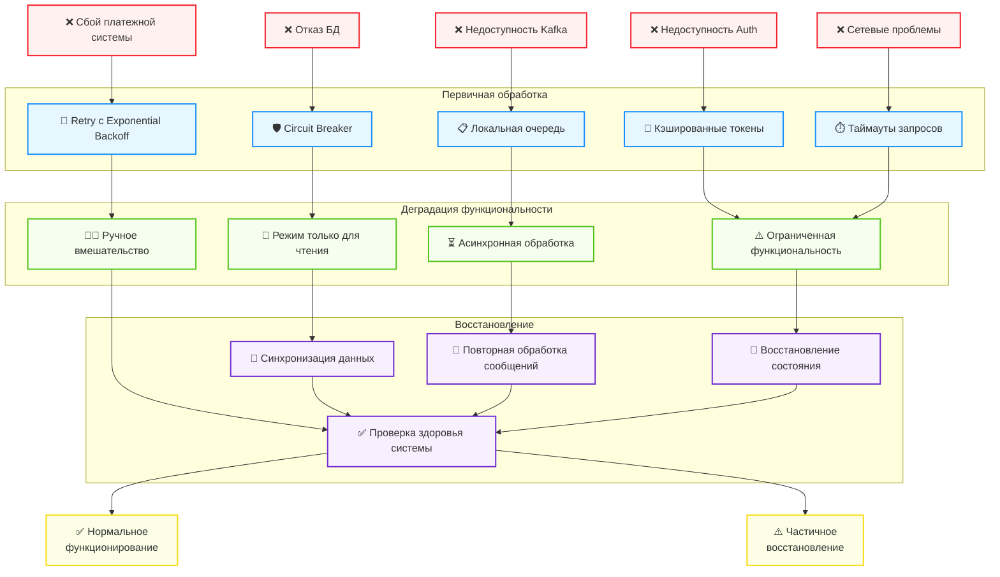

### 🛡️ Сценарии отказоустойчивости

#### 📊 Недоступность БД
- **Connection pooling** с настроенными timeout и retry
- **Circuit Breaker** для предотвращения каскадных отказов
- **Резервное кэширование** критичных данных в Redis для чтения в аварийном режиме
- **Логирование** неудачных операций для последующего восстановления

#### 📨 Недоступность Kafka
- **Буферизация** сообщений локально с последующей отправкой
- **Exponential backoff** при повторных попытках подключения
- **Локальная очередь** для сохранения событий до восстановления сервиса
- **Ручное восстановление** из логов при длительном простое

#### 👥 Недоступность `backend-crew`
- **Асинхронные запросы** с очередью ожидания
- **Деградация функциональности** — работа без назначения экипажа
- **Автоматическое уведомление** администратора после N неудачных попыток

#### 🔔 Недоступность `backend-notification`
- **Локальная очередь** уведомлений с персистентным хранением
- **Batch-отправка** при восстановлении сервиса
- **Администраторский интерфейс** для ручной отправки при необходимости

#### 🔑 Недоступность Keycloak
- **Кэширование токенов** в Redis с разумным TTL
- **Временный режим read-only** для неаутентифицированных пользователей
- **Блокировка критичных операций** до восстановления аутентификации

### 💾 Стратегии восстановления данных

#### 📦 Регулярные бэкапы
- **Полный бэкап** БД каждые 24 часа
- **Инкрементальный бэкап** каждые 6 часов
- **Логи транзакций** для point-in-time recovery

#### 🔄 Репликация
- **Асинхронная репликация** в standby БД
- **Автоматическое переключение** в случае отказа primary
- **Географическое распределение** для защиты от локальных сбоев

#### 📒 Журналирование
- **Audit log** всех изменений с возможностью replay операций
- **Версионирование** критичных данных для восстановления
- **Двойная запись** особо важных транзакций

### 🚑 План восстановления после сбоя

#### 🤖 Автоматическое восстановление
- **Health check** и self-healing в Kubernetes
- **Автоматический restart** подов при обнаружении проблем
- **Проверка консистентности** данных при старте сервиса

#### 👨‍💻 Полуавтоматическое восстановление
- **Оповещение DevOps-команды** при критических ошибках
- **Предустановленные скрипты** восстановления для типичных сценариев
- **Документированные чек-листы** для стандартных процедур

#### 🔧 Ручное восстановление
- **Подробные инструкции** для сложных сценариев
- **Процедуры восстановления** из резервных копий
- **Скрипты валидации** для проверки целостности данных после восстановления

### 📊 Общая диаграмма вариантов использования
```mermaid
graph TB
    %% Акторы
    Guest["👤 Гость"]
    User["👤 Пользователь"]
    Organizer["👔 Организатор"]
    Admin["🛡️ Администратор"]
    
    %% Use Cases для Гостя
    UC1["Просмотр каталога событий"]
    UC2["Поиск и фильтрация событий"]
    UC3["Просмотр информации о событии"]
    UC4["Чтение отзывов"]
    
    %% Use Cases для Пользователя
    UC5["Бронирование билетов"]
    UC6["Оплата билетов"]
    UC7["Отмена бронирования"]
    UC8["Добавление в избранное"]
    UC9["Оставление отзывов"]
    
    %% Use Cases для Организатора
    UC10["Создание событий"]
    UC11["Редактирование событий"]
    UC12["Публикация событий"]
    UC13["Отмена событий"]
    UC14["Управление ценами"]
    UC15["Ответы на отзывы"]
    UC16["Назначение экипажа"]
    
    %% Use Cases для Администратора
    UC17["Модерация отзывов"]
    UC18["Массовые операции"]
    UC19["Управление категориями"]
    UC20["Просмотр аналитики"]
    
    %% Связи Гостя
    Guest --> UC1
    Guest --> UC2
    Guest --> UC3
    Guest --> UC4
    
    %% Связи Пользователя (включая все возможности Гостя)
    User --> UC1
    User --> UC2
    User --> UC3
    User --> UC4
    User --> UC5
    User --> UC6
    User --> UC7
    User --> UC8
    User --> UC9
    
    %% Связи Организатора
    Organizer --> UC10
    Organizer --> UC11
    Organizer --> UC12
    Organizer --> UC13
    Organizer --> UC14
    Organizer --> UC15
    Organizer --> UC16
    Organizer --> UC20
    
    %% Связи Администратора
    Admin --> UC1
    Admin --> UC2
    Admin --> UC3
    Admin --> UC5
    Admin --> UC7
    Admin --> UC10
    Admin --> UC11
    Admin --> UC12
    Admin --> UC13
    Admin --> UC17
    Admin --> UC18
    Admin --> UC19
    Admin --> UC20
    
    %% Стили для элементов
    classDef actor fill:#f9f9f9,stroke:#333,stroke-width:2px;
    classDef usecase fill:#e6f7ff,stroke:#1890ff,stroke-width:1px;
    
    class Guest,User,Organizer,Admin actor;
    class UC1,UC2,UC3,UC4,UC5,UC6,UC7,UC8,UC9,UC10,UC11,UC12,UC13,UC14,UC15,UC16,UC17,UC18,UC19,UC20 usecase;
```

## 🧩 Архитектура компонентов

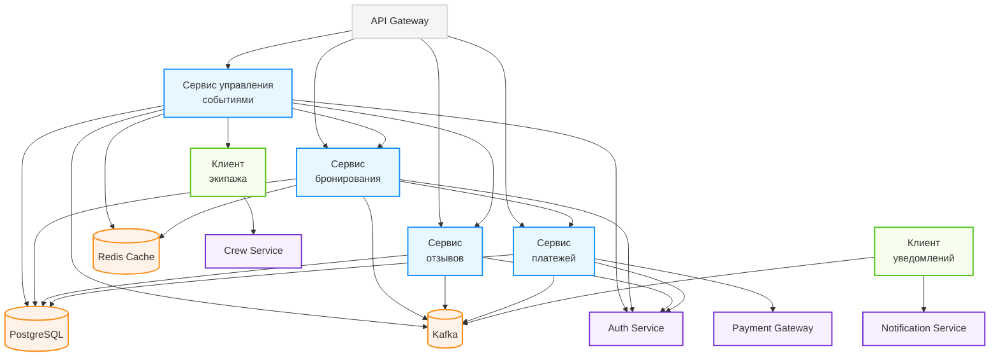

## 🏗️ Развертывание и масштабирование

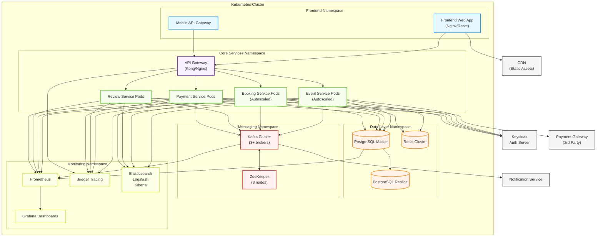

---

## 🚀 Руководство по локальной разработке

> **Назначение раздела:** предоставить разработчикам подробные инструкции для быстрого начала работы с микросервисом `backend-event`, настройки окружения, запуска и тестирования.

### 🛠️ Требования к окружению разработки

Для локальной разработки требуются:

- **JDK:** 21 (рекомендуется Eclipse Temurin / Oracle JDK 21)
- **Spring Boot:** 3.2+
- **Java:** 21 (с использованием preview-фич)
- **Gradle:** 8.5+
- **IDE:** IntelliJ IDEA (рекомендуется Ultimate, но Community Edition также подойдет) или Eclipse
- **Docker и Docker Compose:** Последняя стабильная версия
- **Git:** 2.40+
- **Дополнительные инструменты:**
  - Postman для тестирования API
  - DBeaver для работы с базой данных
  - grpcurl для тестирования gRPC-сервисов
  - Kafkacat/kcat для отладки сообщений Kafka

### 📂 Структура проекта

Проект построен по модульной архитектуре:

```
backend-event/                         # Корневой проект
├── gradle/                            # Конфигурация Gradle 
├── backend-event-api/                 # Модуль API определений
│   ├── src/
│   │   ├── main/
│   │   │   ├── java/
│   │   │   │   └── org/aquastream/event/api/
│   │   │   │       ├── dto/           # DTO объекты для API
│   │   │   │       ├── request/       # Объекты запросов
│   │   │   │       └── response/      # Объекты ответов
│   │   │   └── proto/                 # Определения gRPC сервисов (.proto)
│   │   └── test/
│   └── build.gradle.kts
│
├── backend-event-db/                  # Модуль доступа к данным
│   ├── src/
│   │   ├── main/
│   │   │   ├── java/
│   │   │   │   └── org/aquastream/event/db/
│   │   │   │       ├── entity/        # Сущности JPA/R2DBC
│   │   │   │       ├── repository/    # Репозитории
│   │   │   │       └── config/        # Конфигурация БД
│   │   │   └── resources/
│   │   │       └── db/changelog/      # Миграции Liquibase
│   │   └── test/
│   └── build.gradle.kts
│
├── backend-event-service/             # Основной модуль бизнес-логики
│   ├── src/
│   │   ├── main/
│   │   │   ├── java/
│   │   │   │   └── org/aquastream/event/
│   │   │   │       ├── config/        # Конфигурации
│   │   │   │       ├── controller/    # REST контроллеры
│   │   │   │       ├── grpc/          # gRPC имплементации
│   │   │   │       ├── domain/        # Доменные модели
│   │   │   │       ├── service/       # Сервисные слои
│   │   │   │       │   ├── command/   # Команды (CQRS)
│   │   │   │       │   └── query/     # Запросы (CQRS)
│   │   │   │       ├── mapper/        # Мапперы (Mapstruct)
│   │   │   │       ├── messaging/     # Обработка Kafka
│   │   │   │       ├── client/        # Клиенты внешних сервисов
│   │   │   │       ├── security/      # Безопасность и авторизация
│   │   │   │       ├── exception/     # Обработка исключений
│   │   │   │       └── util/          # Утилиты
│   │   │   └── resources/
│   │   │       ├── application.yml    # Основная конфигурация
│   │   │       └── application-dev.yml # Конфигурация разработки
│   │   └── test/
│   │       ├── java/                  # Тесты
│   │       └── resources/             # Тестовые ресурсы
│   └── build.gradle.kts
│
├── docker/                            # Docker конфигурации
│   ├── Dockerfile                     # Основной Dockerfile
│   └── docker-compose.yml             # Композиция для разработки
│
├── .github/                           # GitHub Actions конфигурации  
│   └── workflows/                     # CI/CD workflows
│       ├── build.yml                  # Workflow сборки и тестов
│       └── deploy.yml                 # Workflow развертывания
│
├── build.gradle.kts                   # Корневой файл сборки
├── settings.gradle.kts                # Настройки Gradle с подключением субмодулей
└── README.md                          # Общее описание проекта
```

### 🔄 Клонирование репозитория и начало работы

```bash
# Клонирование репозитория
git clone git@github.com:aquastream/backend-event.git
cd backend-event

# Сборка проекта без запуска тестов
./gradlew build -x test

# Проверка наличия ошибок в коде
./gradlew check

# Запуск только тестов
./gradlew test
```

### 🐳 Запуск с использованием Docker

Для локальной разработки предоставляется `docker-compose.yml`, который поднимает все необходимые зависимости:

```bash
# Запуск только зависимостей (Postgres, Redis, Kafka, Zookeeper)
docker-compose -f docker/docker-compose.yml up -d postgres redis kafka zookeeper

# Запуск всего стека, включая сам сервис
docker-compose -f docker/docker-compose.yml up -d
```

#### docker-compose.yml для локальной разработки:

```yaml
version: '3.8'

services:
  postgres:
    image: postgres:16-alpine
    ports:
      - "5432:5432"
    environment:
      POSTGRES_USER: event_service
      POSTGRES_PASSWORD: <EVENT_DB_PASSWORD>
      POSTGRES_DB: event_db
    volumes:
      - postgres-data:/var/lib/postgresql/data
    healthcheck:
      test: [ "CMD-SHELL", "pg_isready -U event_service -d event_db" ]
      interval: 10s
      timeout: 5s
      retries: 5

  redis:
    image: redis:7-alpine
    ports:
      - "6379:6379"
    volumes:
      - redis-data:/data
    healthcheck:
      test: [ "CMD", "redis-cli", "ping" ]
      interval: 5s
      timeout: 2s
      retries: 3

  zookeeper:
    image: confluentinc/cp-zookeeper:7.5.0
    ports:
      - "2181:2181"
    environment:
      ZOOKEEPER_CLIENT_PORT: 2181
      ZOOKEEPER_TICK_TIME: 2000
    healthcheck:
      test: [ "CMD-SHELL", "echo ruok | nc localhost 2181 | grep imok" ]
      interval: 10s
      timeout: 5s
      retries: 5

  kafka:
    image: confluentinc/cp-kafka:7.5.0
    ports:
      - "9092:9092"
    environment:
      KAFKA_BROKER_ID: 1
      KAFKA_ZOOKEEPER_CONNECT: zookeeper:2181
      KAFKA_ADVERTISED_LISTENERS: PLAINTEXT://kafka:29092,PLAINTEXT_HOST://localhost:9092
      KAFKA_LISTENER_SECURITY_PROTOCOL_MAP: PLAINTEXT:PLAINTEXT,PLAINTEXT_HOST:PLAINTEXT
      KAFKA_INTER_BROKER_LISTENER_NAME: PLAINTEXT
      KAFKA_OFFSETS_TOPIC_REPLICATION_FACTOR: 1
      KAFKA_AUTO_CREATE_TOPICS_ENABLE: "true"
    depends_on:
      - zookeeper
    healthcheck:
      test: [ "CMD-SHELL", "kafka-topics --bootstrap-server localhost:9092 --list" ]
      interval: 10s
      timeout: 5s
      retries: 3

  # Эмулятор внешних сервисов с использованием Wiremock
  wiremock:
    image: wiremock/wiremock:3.2.0
    ports:
      - "8888:8080"
    volumes:
      - ./wiremock:/home/wiremock
    command: --global-response-templating --verbose

  # Сам сервис backend-event
  backend-event:
    build:
      context: ../../..
      dockerfile: docker/Dockerfile
    ports:
      - "8080:8080"
      - "9090:9090" # gRPC порт
    environment:
      SPRING_PROFILES_ACTIVE: dev
      SPRING_DATASOURCE_URL: jdbc:postgresql://postgres:5432/event_db
      SPRING_DATASOURCE_USERNAME: event_service
      SPRING_DATASOURCE_PASSWORD: <EVENT_DB_PASSWORD>
      SPRING_REDIS_HOST: redis
      SPRING_REDIS_PORT: 6379
      SPRING_KAFKA_BOOTSTRAP_SERVERS: kafka:29092
      # Настройки внешних сервисов через Wiremock
      AUTH_SERVICE_URL: http://wiremock:8080/auth
      NOTIFICATION_SERVICE_URL: http://wiremock:8080/notification
      CREW_SERVICE_URL: http://wiremock:8080/crew
      PAYMENT_SERVICE_URL: http://wiremock:8080/payment
      USER_SERVICE_URL: http://wiremock:8080/user
    depends_on:
      - postgres
      - redis
      - kafka
      - wiremock
    healthcheck:
      test: [ "CMD", "curl", "-f", "http://localhost:8080/actuator/health" ]
      interval: 10s
      timeout: 5s
      retries: 3

volumes:
  postgres-data:
  redis-data:
```

#### Dockerfile для сервиса:

```dockerfile
FROM gradle:8.5-jdk21 AS build
WORKDIR /app
COPY . .
RUN gradle build -x test --no-daemon

FROM eclipse-temurin:21-jre-alpine
WORKDIR /app
COPY --from=build /app/backend-event-service/build/libs/*.jar app.jar
EXPOSE 8080 9090
ENTRYPOINT ["java", "--enable-preview", "-XX:+UseZGC", "-jar", "app.jar"]
```

### 💡 Запуск без Docker

Для запуска без Docker необходимо установить и настроить локально PostgreSQL, Redis и Kafka, или использовать Docker только для этих зависимостей.

```bash
# Запуск только зависимостей
docker-compose -f docker/docker-compose.yml up -d postgres redis kafka zookeeper

# Локальный запуск сервисного модуля в режиме разработки
./gradlew :backend-event-service:bootRun --args='--spring.profiles.active=dev'
```

### 🧰 Настройка IDE

#### IntelliJ IDEA

1. **Импорт проекта**:
   - Откройте IntelliJ IDEA
   - Выберите `File -> Open` и укажите путь к корневой директории проекта
   - Убедитесь, что проект импортируется как Gradle-проект
   - Дождитесь завершения индексации и загрузки зависимостей

2. **Плагины**:
   - Установите плагин Protocol Buffers для поддержки .proto файлов
   - Установите плагин MapStruct Support для работы с мапперами
   - Установите плагин SonarLint для автоматического анализа кода
   - Установите плагин Docker для управления контейнерами

3. **Настройка JDK**:
   - В `File -> Project Structure -> Project`, установите JDK 21
   - В `Settings -> Build, Execution, Deployment -> Compiler -> Java Compiler` 
     установите Target bytecode version: 21 и включите опцию "Use '--release' option for cross-compilation"

4. **Подключение к базе данных**:
   - Установите DBeaver (если еще не установлен)
   - Создайте новое соединение PostgreSQL
   - Укажите параметры: `localhost:5432/event_db`, пользователь: `event_service`, пароль: `<EVENT_DB_PASSWORD>`

5. **Запуск из IDE**:
   - Найдите класс `EventServiceApplication.java` в модуле backend-event-service
   - Нажмите правой кнопкой и выберите `Run EventServiceApplication`
   - В параметрах запуска добавьте `-Dspring.profiles.active=dev` в VM options

6. **Отладка**:
   - Установите точки останова в коде
   - Запустите приложение в режиме отладки через `Debug EventServiceApplication`

### 🧪 Локальное тестирование

#### Запуск тестов

```bash
# Запуск всех тестов
./gradlew test

# Запуск тестов отдельного модуля
./gradlew :backend-event-service:test

# Запуск конкретного теста
./gradlew :backend-event-service:test --tests "org.aquastream.event.service.EventServiceTest"

# Запуск тестов с конкретным тегом
./gradlew test -PincludeTags="integration"
```

#### Тестирование gRPC API

Для тестирования gRPC API рекомендуется использовать инструмент grpcurl:

```bash
# Пример вызова метода GetEvent с помощью grpcurl
grpcurl -plaintext -d '{"event_id": "1a2b3c4d-5e6f-7a8b-9c0d-1e2f3a4b5c6d"}' localhost:9090 org.aquastream.event.api.EventService/GetEvent
```

#### Тестирование REST API с Postman

Для тестирования REST API рекомендуется использовать Postman:

1. **Настройка Postman**:
   - Импортируйте коллекцию из `docs/postman/backend-event.postman_collection.json`
   - Настройте переменные окружения для разных сред (dev, staging, prod)
   - Сохраните авторизационный токен в переменных окружения для повторного использования

2. **Примеры запросов**:

```bash
# Получение списка событий
GET http://localhost:8080/api/events?category=workshop&start_date=2023-11-01
Header: Authorization: Bearer {{token}}
Header: Content-Type: application/json

# Создание нового события
POST http://localhost:8080/api/events
Header: Authorization: Bearer {{token}}
Header: Content-Type: application/json
Body: 
{
  "title": "Тестовое мероприятие",
  "description": "Описание тестового мероприятия",
  "start_date": "2023-12-15T10:00:00Z",
  "end_date": "2023-12-15T15:00:00Z",
  "location": "Тестовое местоположение",
  "capacity": 50,
  "category_id": "9a1b2c3d-4e5f-6a7b-8c9d-0e1f2a3b4c5d",
  "price_options": [
    {
      "name": "Стандарт",
      "price": 1500,
      "available_quantity": 40
    }
  ]
}
```

### 🔍 Мониторинг в процессе разработки

#### Просмотр логов приложения

```bash
# Просмотр логов сервиса в Docker
docker-compose -f docker/docker-compose.yml logs -f backend-event

# Просмотр логов зависимостей
docker-compose -f docker/docker-compose.yml logs -f postgres kafka
```

#### Мониторинг Kafka

```bash
# Просмотр списка топиков
docker-compose -f docker/docker-compose.yml exec kafka kafka-topics --bootstrap-server localhost:9092 --list

# Просмотр сообщений в топике
docker-compose -f docker/docker-compose.yml exec kafka kafka-console-consumer --bootstrap-server localhost:9092 --topic event_updates --from-beginning
```

#### Работа с базой данных через DBeaver

1. **Подключение к базе данных**:
   - Создайте новое соединение PostgreSQL в DBeaver
   - Используйте хост `localhost`, порт `5432`, база `event_db`
   - Логин: `event_service`, пароль: `<EVENT_DB_PASSWORD>`

2. **Полезные действия**:
   - SQL-скрипты можно сохранять в проекте в папке `scripts`
   - Для анализа производительности используйте "Execute plan" (Ctrl+Shift+E)
   - Для быстрого заполнения тестовыми данными используйте раздел "Data Generation"

#### Проверка состояния приложения

Сервис предоставляет Actuator эндпоинты для мониторинга:

```bash
# Проверка состояния приложения
curl http://localhost:8080/actuator/health

# Проверка информации о приложении
curl http://localhost:8080/actuator/info

# Проверка метрик
curl http://localhost:8080/actuator/metrics
```

### 🚨 Типичные проблемы и их решения

1. **Ошибка подключения к PostgreSQL**:
   - Проверьте, что контейнер запущен: `docker ps | grep postgres`
   - Проверьте логи: `docker-compose -f docker/docker-compose.yml logs postgres`
   - Убедитесь, что указаны правильные учетные данные в конфигурации

2. **Kafka не создает топики автоматически**:
   - Проверьте настройку `KAFKA_AUTO_CREATE_TOPICS_ENABLE: "true"`
   - Создайте топики вручную: `docker-compose exec kafka kafka-topics --create --bootstrap-server localhost:9092 --replication-factor 1 --partitions 1 --topic event_updates`

3. **Проблемы с подключением к внешним сервисам**:
   - Проверьте, что WireMock запущен и настроен: `curl http://localhost:8888/__admin/mappings`
   - Проверьте, что URL-ы в конфигурации указаны правильно

4. **Проблемы с gRPC**:
   - Убедитесь, что порт 9090 открыт и доступен
   - Проверьте, что сгенерированные gRPC классы актуальны: `./gradlew generateProto`

5. **Проблемы с Liquibase**:
   - Проверьте журнал изменений: `select * from databasechangelog;` в PostgreSQL
   - Убедитесь, что имена файлов в changelog уникальны и правильно отсортированы

### 🔗 Полезные ресурсы для разработчиков

- [Официальная документация Spring Boot](https://docs.spring.io/spring-boot/docs/current/reference/html/)
- [Документация по gRPC](https://grpc.io/docs/)
- [Документация по Kafka](https://kafka.apache.org/documentation/)
- [Документация по Redis](https://redis.io/documentation)
- [Документация по WireMock](http://wiremock.org/docs/)
- [Документация по Liquibase](https://docs.liquibase.com/home.html)
- [Java 21 Features Overview](https://www.oracle.com/java/technologies/javase/21-relnote-issues.html)

---

## 💻 Системные требования

### 🏗️ Инфраструктура
- **Kubernetes:** Отказоустойчивый кластер с автомасштабированием
- **Docker:** Контейнеризация всех компонентов
- **CI/CD:** GitHub Actions с автоматическими деплоями через Helm
- **Мониторинг:** Prometheus, Grafana, Jaeger для трассировки
- **Бизнес-метрики:** Отслеживание конверсии, популярности событий и экономической эффективности
- **Система алертов:** Автоматические оповещения при отклонении от нормальных показателей

### 🗄️ Хранилища данных
- **PostgreSQL:** Основная БД с репликацией для высокой доступности
- **Redis:** Кэширование, блокировки, очереди задач
- **Kafka:** Асинхронный обмен событиями между сервисами
- **Elasticsearch:** Полнотекстовый поиск и логирование

### 🛡️ Безопасность
- **Шифрование:** TLS для всех внешних соединений
- **JWT:** Короткоживущие токены с возможностью отзыва
- **Rate Limiting:** Защита от DDoS и брутфорс-атак
- **Аудит:** Логирование всех изменений с сохранением авторства

### 🎯 Миграции и обновления
- **Версионирование схемы БД:** Использование Liquibase для управления миграциями
- **Совместимость версий:** Обратная совместимость API при обновлениях
- **Стратегия развертывания:** Blue-Green deployment для минимизации простоев
- **Тестирование миграций:** Автоматические тесты для проверки корректности миграций
- **Откат изменений:** Процедуры отката миграций и возврата к предыдущей версии
- **Обновление с нулевым простоем:** Постепенное обновление подов для обеспечения непрерывной работы
- **Детальная стратегия миграций**:
  - **Инкрементальные изменения**: Все изменения схемы выполняются в виде маленьких атомарных блоков
  - **Проверка совместимости**: Проверки соответствия кода и схемы БД на этапе CI/CD
  - **Порядок обновления компонентов**: DB → Backend → Frontend для обеспечения совместимости
  - **Сценарии отката миграций**: Для каждой миграции предусмотрен скрипт отката
  - **Обновление секциями**: Обновление по 20% подов за раз с мониторингом состояния
- **Типы миграций и их обработка**:
  - **Аддитивные изменения** (добавление полей, таблиц): Простое добавление без простоя
  - **Модификация данных**: Выполнение в фоновом режиме с помощью временных таблиц и индексов
  - **Изменение структуры**: Выполнение в несколько этапов с временным дублированием данных
  - **Критические изменения**: Выполнение в окно обслуживания с предварительным уведомлением
- **Примеры сложных миграций**:
  - Переименование поля: добавление нового поля → дублирование данных → переключение кода → удаление старого поля
  - Разделение таблицы: создание новых таблиц → миграция данных → обновление кода → удаление старой таблицы
  - Объединение таблиц: создание временной таблицы → миграция из двух источников → переключение приложения

### 🎯 Производительность
- **Требования:**
  - Минимум 1000 запросов в секунду на чтение
  - Минимум 100 запросов в секунду на запись
  - Время отклика < 200 мс для 95% запросов
  - Доступность 99.9% (не более 43 минут простоя в месяц)

### 🔄 Масштабирование
- **Горизонтальное:** Автоматическое добавление инстансов сервиса
- **Вертикальное:** Увеличение ресурсов для баз данных
- **Географическое:** CDN для статических ресурсов

## 🔄 Стратегии обработки отказов и восстановления

### 📊 Схема стратегий обработки отказов


### 🛡️ Сценарии отказоустойчивости

#### 📊 Недоступность БД
- **Connection pooling** с настроенными timeout и retry
- **Circuit Breaker** для предотвращения каскадных отказов
- **Резервное кэширование** критичных данных в Redis для чтения в аварийном режиме
- **Логирование** неудачных операций для последующего восстановления

#### 📨 Недоступность Kafka
- **Буферизация** сообщений локально с последующей отправкой
- **Exponential backoff** при повторных попытках подключения
- **Локальная очередь** для сохранения событий до восстановления сервиса
- **Ручное восстановление** из логов при длительном простое

#### 👥 Недоступность `backend-crew`
- **Асинхронные запросы** с очередью ожидания
- **Деградация функциональности** — работа без назначения экипажа
- **Автоматическое уведомление** администратора после N неудачных попыток

#### 🔔 Недоступность `backend-notification`
- **Локальная очередь** уведомлений с персистентным хранением
- **Batch-отправка** при восстановлении сервиса
- **Администраторский интерфейс** для ручной отправки при необходимости

#### 🔑 Недоступность Keycloak
- **Кэширование токенов** в Redis с разумным TTL
- **Временный режим read-only** для неаутентифицированных пользователей
- **Блокировка критичных операций** до восстановления аутентификации

### 💾 Стратегии восстановления данных

#### 📦 Регулярные бэкапы
- **Полный бэкап** БД каждые 24 часа
- **Инкрементальный бэкап** каждые 6 часов
- **Логи транзакций** для point-in-time recovery

#### 🔄 Репликация
- **Асинхронная репликация** в standby БД
- **Автоматическое переключение** в случае отказа primary
- **Географическое распределение** для защиты от локальных сбоев

#### 📒 Журналирование
- **Audit log** всех изменений с возможностью replay операций
- **Версионирование** критичных данных для восстановления
- **Двойная запись** особо важных транзакций

### 🚑 План восстановления после сбоя

#### 🤖 Автоматическое восстановление
- **Health check** и self-healing в Kubernetes
- **Автоматический restart** подов при обнаружении проблем
- **Проверка консистентности** данных при старте сервиса

#### 👨‍💻 Полуавтоматическое восстановление
- **Оповещение DevOps-команды** при критических ошибках
- **Предустановленные скрипты** восстановления для типичных сценариев
- **Документированные чек-листы** для стандартных процедур

#### 🔧 Ручное восстановление
- **Подробные инструкции** для сложных сценариев
- **Процедуры восстановления** из резервных копий
- **Скрипты валидации** для проверки целостности данных после восстановления

### 📊 Общая диаграмма вариантов использования


### JSON-примеры сущностей

В этом разделе представлены JSON-примеры основных сущностей микросервиса `backend-event`. Эти примеры могут использоваться для тестирования, документирования API, а также как образцы для интеграции с другими сервисами.

#### Event (Событие)

```json
{
  "id": "1a2b3c4d-5e6f-7a8b-9c0d-1e2f3a4b5c6d",
  "title": "Мастер-класс по программированию на Java",
  "description": "Интенсивный курс для начинающих разработчиков, желающих освоить язык Java и основы объектно-ориентированного программирования. Будут рассмотрены базовые конструкции языка, работа с коллекциями и потоками, а также введение в создание веб-приложений.",
  "start_date": "2024-12-15T10:00:00Z",
  "end_date": "2024-12-15T18:00:00Z",
  "location": "Москва, ул. Программистов, 42",
  "capacity": 50,
  "status": "PUBLISHED",
  "category_id": "9a1b2c3d-4e5f-6a7b-8c9d-0e1f2a3b4c5d",
  "crew_id": "8b9c0d1e-2f3a-4b5c-6d7e-8f9a0b1c2d3e",
  "organizer_id": "7a8b9c0d-1e2f-3a4b-5c6d-7e8f9a0b1c2d",
  "price_options": [
    {
      "id": "b1c2d3e4-f5a6-7b8c-9d0e-1f2a3b4c5d6e",
      "name": "Стандарт",
      "price": 3500.00,
      "available_quantity": 40,
      "is_active": true,
      "valid_from": "2024-10-01T00:00:00Z",
      "valid_until": "2024-12-14T23:59:59Z"
    },
    {
      "id": "c2d3e4f5-a6b7-c8d9-e0f1-2a3b4c5d6e7f",
      "name": "VIP",
      "price": 7000.00,
      "available_quantity": 10,
      "is_active": true,
      "valid_from": "2024-10-01T00:00:00Z",
      "valid_until": "2024-12-14T23:59:59Z"
    }
  ],
  "created_at": "2024-09-01T14:23:11Z",
  "updated_at": "2024-09-15T09:45:30Z",
  "version": 3,
  "tags": ["программирование", "java", "мастер-класс", "обучение"],
  "image_url": "https://storage.aquastream.com/events/1a2b3c4d-5e6f-7a8b-9c0d-1e2f3a4b5c6d/main.jpg",
  "published_at": "2024-09-15T10:00:00Z",
  "average_rating": 4.7,
  "reviews_count": 12,
  "bookings_count": 28,
  "views_count": 1250
}
```

#### Booking (Бронирование)

```json
{
  "id": "d4e5f6a7-b8c9-d0e1-f2a3-b4c5d6e7f8a9",
  "event_id": "1a2b3c4d-5e6f-7a8b-9c0d-1e2f3a4b5c6d",
  "user_id": "e5f6a7b8-c9d0-e1f2-a3b4-c5d6e7f8a9b0",
  "quantity": 2,
  "status": "CONFIRMED",
  "price_option_id": "b1c2d3e4-f5a6-7b8c-9d0e-1f2a3b4c5d6e",
  "total_amount": 7000.00,
  "deadline": "2024-10-01T14:30:00Z",
  "booking_code": "BKG12345678",
  "promo_code_applied": "WELCOME2024",
  "discount_amount": 700.00,
  "original_amount": 7700.00,
  "created_at": "2024-09-30T12:45:22Z",
  "updated_at": "2024-09-30T13:15:45Z",
  "payment_status": "COMPLETED",
  "ticket_sent": true,
  "attendee_details": {
    "name": "Иван Петров",
    "email": "ivan.petrov@example.com",
    "phone": "+7(999)123-45-67",
    "additional_attendee": {
      "name": "Мария Петрова",
      "email": "maria.petrova@example.com"
    }
  },
  "notes": "Предпочитает место у окна",
  "checked_in": false
}
```

#### Payment (Платеж)

```json
{
  "id": "f7a8b9c0-d1e2-f3a4-b5c6-d7e8f9a0b1c2",
  "booking_id": "d4e5f6a7-b8c9-d0e1-f2a3-b4c5d6e7f8a9",
  "amount": 7000.00,
  "currency": "RUB",
  "status": "COMPLETED",
  "gateway_reference": "pay_12345678abcdefgh",
  "payment_method": "CARD",
  "payment_details": {
    "card_last4": "4242",
    "card_brand": "Visa",
    "card_expiry": "12/25",
    "cardholder_name": "IVAN PETROV"
  },
  "refund_amount": 0.00,
  "created_at": "2024-09-30T13:00:11Z",
  "updated_at": "2024-09-30T13:15:45Z",
  "transaction_id": "tx_abcdef123456",
  "receipt_url": "https://receipts.payment-gateway.com/rx_12345",
  "payment_confirmation": {
    "confirmation_code": "AUTH123456",
    "authorization_code": "789012",
    "processor_response": "Approved"
  },
  "ip_address": "192.168.1.1",
  "user_agent": "Mozilla/5.0 (Macintosh; Intel Mac OS X 10_15_7)",
  "billing_address": {
    "country": "RU",
    "city": "Москва",
    "postal_code": "123456",
    "address_line": "ул. Примерная, д. 1, кв. 123"
  }
}
```

#### Review (Отзыв)

```json
{
  "id": "a8b9c0d1-e2f3-a4b5-c6d7-e8f9a0b1c2d3",
  "event_id": "1a2b3c4d-5e6f-7a8b-9c0d-1e2f3a4b5c6d",
  "user_id": "e5f6a7b8-c9d0-e1f2-a3b4-c5d6e7f8a9b0",
  "rating": 5,
  "content": "Отличный мастер-класс! Преподаватель объяснял материал очень доступно, много практических заданий. Организация на высшем уровне, аудитория комфортная. Обязательно приду на следующие мероприятия этого организатора.",
  "status": "ACTIVE",
  "helpful_count": 8,
  "created_at": "2024-12-16T09:30:00Z",
  "updated_at": "2024-12-16T09:30:00Z",
  "tags": ["информативно", "хорошая организация", "рекомендую"],
  "media": [
    {
      "type": "image",
      "url": "https://storage.aquastream.com/reviews/a8b9c0d1-e2f3-a4b5-c6d7-e8f9a0b1c2d3/photo1.jpg"
    }
  ],
  "reply": {
    "id": "b9c0d1e2-f3a4-b5c6-d7e8-f9a0b1c2d3e4",
    "organizer_id": "7a8b9c0d-1e2f-3a4b-5c6d-7e8f9a0b1c2d",
    "content": "Спасибо за ваш отзыв! Мы рады, что вам понравилось наше мероприятие. Будем рады видеть вас на следующих мастер-классах нашей школы.",
    "created_at": "2024-12-16T14:20:15Z"
  },
  "user_details": {
    "username": "ivan.petrov",
    "avatar_url": "https://storage.aquastream.com/users/e5f6a7b8-c9d0-e1f2-a3b4-c5d6e7f8a9b0/avatar.jpg"
  }
}
```

#### PriceOption (Ценовая опция)

```json
{
  "id": "b1c2d3e4-f5a6-7b8c-9d0e-1f2a3b4c5d6e",
  "event_id": "1a2b3c4d-5e6f-7a8b-9c0d-1e2f3a4b5c6d",
  "name": "Стандарт",
  "description": "Включает участие в мастер-классе, раздаточные материалы и сертификат.",
  "price": 3500.00,
  "currency": "RUB",
  "available_quantity": 40,
  "reserved_quantity": 5,
  "sold_quantity": 25,
  "is_active": true,
  "valid_from": "2024-10-01T00:00:00Z",
  "valid_until": "2024-12-14T23:59:59Z",
  "display_order": 1,
  "features": [
    "Участие в мастер-классе",
    "Раздаточные материалы",
    "Сертификат участника"
  ],
  "original_price": 4000.00,
  "discount_percent": 12.5,
  "max_per_user": 3,
  "min_per_purchase": 1,
  "created_at": "2024-09-01T14:23:11Z",
  "updated_at": "2024-09-15T09:45:30Z"
}
```

#### PromoCode (Промокод)

```json
{
  "id": "c0d1e2f3-a4b5-c6d7-e8f9-a0b1c2d3e4f5",
  "code": "WELCOME2024",
  "event_id": "1a2b3c4d-5e6f-7a8b-9c0d-1e2f3a4b5c6d",
  "discount_amount": 700.00,
  "discount_percent": 10.0,
  "usage_limit": 100,
  "usage_count": 42,
  "valid_from": "2024-10-01T00:00:00Z",
  "valid_until": "2024-11-30T23:59:59Z",
  "is_active": true,
  "description": "Скидка 10% для новых пользователей",
  "applicable_price_options": [
    "b1c2d3e4-f5a6-7b8c-9d0e-1f2a3b4c5d6e",
    "c2d3e4f5-a6b7-c8d9-e0f1-2a3b4c5d6e7f"
  ],
  "min_purchase_amount": 2000.00,
  "max_discount_amount": 1000.00,
  "user_restriction": "NEW_USERS",
  "created_at": "2024-09-01T15:30:00Z",
  "updated_at": "2024-09-01T15:30:00Z",
  "created_by": "7a8b9c0d-1e2f-3a4b-5c6d-7e8f9a0b1c2d"
}
```

#### Favorite (Избранное)

```json
{
  "id": "d1e2f3a4-b5c6-d7e8-f9a0-b1c2d3e4f5a6",
  "user_id": "e5f6a7b8-c9d0-e1f2-a3b4-c5d6e7f8a9b0",
  "event_id": "1a2b3c4d-5e6f-7a8b-9c0d-1e2f3a4b5c6d",
  "created_at": "2024-09-25T18:42:15Z",
  "reminder_enabled": true,
  "reminder_time": "1D",
  "notes": "Интересное событие, нужно обязательно посетить"
}
```

### Структура тестовых данных

Тестовые данные организованы по сценариям использования и предназначены для различных видов тестирования: модульного, интеграционного и нагрузочного. Все тестовые данные хранятся в репозитории проекта в директории `/backend-event/src/test/resources/testdata/`.

#### Тестовые наборы для различных сценариев

Структура тестовых наборов соответствует основным бизнес-сценариям:

##### 1. Базовый набор сущностей (`base`)

Содержит все основные сущности с минимально необходимыми полями для прохождения валидации.

```
testdata/
└── base/
    ├── events.json        # Базовые события
    ├── bookings.json      # Базовые бронирования
    ├── payments.json      # Базовые платежи
    ├── reviews.json       # Базовые отзывы
    ├── priceoptions.json  # Базовые ценовые опции
    └── promocodes.json    # Базовые промокоды
```

##### 2. Жизненный цикл событий (`lifecycle`)

Набор данных для тестирования переходов между статусами в жизненном цикле события.

```
testdata/
└── lifecycle/
    ├── draft_events.json         # События в статусе DRAFT
    ├── published_events.json     # События в статусе PUBLISHED
    ├── canceled_events.json      # События в статусе CANCELED
    ├── completed_events.json     # События в статусе COMPLETED
    ├── reviewed_events.json      # События в статусе REVIEWED
    ├── rescheduled_events.json   # События в статусе RESCHEDULED
    └── transition_test_data.json # Данные для проверки переходов
```

##### 3. Бронирование и платежи (`booking_payment`)

Данные для тестирования процессов бронирования и оплаты.

```
testdata/
└── booking_payment/
    ├── pending_bookings.json     # Бронирования в статусе PENDING_PAYMENT
    ├── confirmed_bookings.json   # Бронирования в статусе CONFIRMED
    ├── canceled_bookings.json    # Бронирования в статусе CANCELED
    ├── expired_bookings.json     # Бронирования в статусе EXPIRED
    ├── successful_payments.json  # Успешные платежи
    ├── failed_payments.json      # Неуспешные платежи
    ├── refunded_payments.json    # Возвраты платежей
    └── booking_scenarios.json    # Комплексные сценарии бронирования
```

##### 4. Отзывы и рейтинги (`reviews`)

Тестовые данные для системы отзывов.

```
testdata/
└── reviews/
    ├── pending_reviews.json      # Отзывы на модерации
    ├── active_reviews.json       # Опубликованные отзывы
    ├── rejected_reviews.json     # Отклоненные отзывы
    ├── review_replies.json       # Ответы на отзывы
    └── review_scenarios.json     # Сценарии модерации отзывов
```

##### 5. Интеграционные тесты (`integration`)

Данные для тестирования взаимодействия с другими сервисами.

```
testdata/
└── integration/
    ├── auth_service/             # Данные для интеграции с Auth Service
    ├── notification_service/     # Данные для интеграции с Notification Service
    ├── payment_service/          # Данные для интеграции с Payment Service
    ├── crew_service/             # Данные для интеграции с Crew Service
    └── user_service/             # Данные для интеграции с User Service
```

##### 6. Нагрузочное тестирование (`load`)

Наборы данных для проведения нагрузочных тестов.

```
testdata/
└── load/
    ├── events_10k.json           # 10,000 событий
    ├── bookings_100k.json        # 100,000 бронирований
    ├── users_50k.json            # 50,000 пользователей
    └── scenarios/                # Сценарии нагрузочного тестирования
```

#### Генерация тестовых данных

Для автоматизации создания тестовых данных в проекте используются генераторы на основе предопределенных шаблонов и правил. Это обеспечивает консистентность данных и упрощает поддержку тестов.

##### Инструменты генерации

1. **DataFactory** — утилита для программной генерации тестовых сущностей
   ```java
   public class EventDataFactory {
       public static Event createDefaultEvent() {
           return Event.builder()
                   .id(UUID.randomUUID())
                   .title("Test Event " + RandomStringUtils.randomAlphanumeric(5))
                   .description("Test description")
                   .startDate(LocalDateTime.now().plusDays(30))
                   .endDate(LocalDateTime.now().plusDays(30).plusHours(3))
                   .location("Test Location")
                   .capacity(100)
                   .status(EventStatus.DRAFT)
                   .organizerId(UUID.randomUUID())
                   .createdAt(LocalDateTime.now())
                   .updatedAt(LocalDateTime.now())
                   .version(1)
                   .build();
       }
       
       public static Event createPublishedEvent() {
           Event event = createDefaultEvent();
           event.setStatus(EventStatus.PUBLISHED);
           event.setPublishedAt(LocalDateTime.now());
           return event;
       }
       
       // Другие фабричные методы
   }
   ```

2. **TestDataGenerator** — скрипт для массовой генерации JSON-файлов с тестовыми данными
   ```java
   public class TestDataGenerator {
       public static void main(String[] args) {
           // Генерация 1000 событий в разных статусах
           List<Event> events = IntStream.range(0, 1000)
                   .mapToObj(i -> {
                       EventStatus status = getRandomStatus();
                       switch(status) {
                           case DRAFT: return EventDataFactory.createDefaultEvent();
                           case PUBLISHED: return EventDataFactory.createPublishedEvent();
                           // Другие статусы
                           default: return EventDataFactory.createDefaultEvent();
                       }
                   })
                   .collect(Collectors.toList());
           
           // Сохранение в JSON
           ObjectMapper mapper = new ObjectMapper();
           mapper.writeValue(new File("src/test/resources/testdata/load/events_1k.json"), events);
       }
       
       private static EventStatus getRandomStatus() {
           EventStatus[] statuses = EventStatus.values();
           return statuses[new Random().nextInt(statuses.length)];
       }
   }
   ```

3. **SQL-скрипты** — для инициализации тестовой базы данных
   ```sql
   -- Пример SQL-скрипта для создания тестовых событий
   INSERT INTO events (id, title, description, start_date, end_date, location, capacity, status, category_id, organizer_id, created_at, updated_at, version)
   VALUES 
   ('1a2b3c4d-5e6f-7a8b-9c0d-1e2f3a4b5c6d', 'Test Event 1', 'Description 1', '2024-12-15 10:00:00', '2024-12-15 13:00:00', 'Location 1', 100, 'PUBLISHED', '9a1b2c3d-4e5f-6a7b-8c9d-0e1f2a3b4c5d', '7a8b9c0d-1e2f-3a4b-5c6d-7e8f9a0b1c2d', '2024-09-01 14:23:11', '2024-09-15 09:45:30', 1),
   ('2b3c4d5e-6f7a-8b9c-0d1e-2f3a4b5c6d7e', 'Test Event 2', 'Description 2', '2024-12-20 11:00:00', '2024-12-20 15:00:00', 'Location 2', 50, 'DRAFT', '9a1b2c3d-4e5f-6a7b-8c9d-0e1f2a3b4c5d', '7a8b9c0d-1e2f-3a4b-5c6d-7e8f9a0b1c2d', '2024-09-02 10:15:00', '2024-09-02 10:15:00', 1);
   ```

##### Использование тестовых данных

Примеры использования тестовых данных в модульных и интеграционных тестах:

```java
@Test
public void testEventCreation() {
    // Загрузка тестовых данных из JSON
    Event testEvent = objectMapper.readValue(
        new ClassPathResource("testdata/base/events.json").getInputStream(),
        new TypeReference<List<Event>>() {}
    ).get(0);
    
    // Использование в тесте
    Event savedEvent = eventRepository.save(testEvent);
    assertEquals(testEvent.getTitle(), savedEvent.getTitle());
    // Другие проверки
}

@Test
public void testBookingWorkflow() {
    // Загрузка тестового сценария
    BookingScenario scenario = objectMapper.readValue(
        new ClassPathResource("testdata/booking_payment/booking_scenarios.json").getInputStream(),
        new TypeReference<List<BookingScenario>>() {}
    ).get(0);
    
    // Настройка тестового окружения
    mockEventRepository(scenario.getEvent());
    mockPriceOptionRepository(scenario.getPriceOptions());
    
    // Выполнение теста
    BookingResponse response = bookingService.createBooking(scenario.getBookingRequest());
    
    // Проверка результатов
    assertEquals(BookingStatus.PENDING_PAYMENT, response.getStatus());
    // Другие проверки
}
```

### Настройка WireMock

[WireMock](http://wiremock.org/) используется для эмуляции внешних зависимостей микросервиса `backend-event` во время разработки и тестирования. Это позволяет симулировать различные ответы от внешних сервисов, включая успешные ответы, ошибки и сценарии с таймаутами.

#### Установка и конфигурирование

##### Локальная установка через Docker

Самый простой способ запустить WireMock — использовать Docker-образ:

```bash
# Запуск WireMock на порту 8888
docker run -it --rm -p 8888:8080 -v $PWD/wiremock:/home/wiremock wiremock/wiremock:3.2.0 --verbose --global-response-templating
```

##### Настройка в Docker Compose

WireMock уже включен в конфигурацию `docker-compose.yml` для локальной разработки:

```yaml
wiremock:
  image: wiremock/wiremock:3.2.0
  ports:
    - "8888:8080"
  volumes:
    - ./wiremock:/home/wiremock
  command: --global-response-templating --verbose
```

##### Структура директории WireMock

Директория `wiremock` должна содержать следующую структуру:

```
wiremock/
├── mappings/                     # JSON-файлы с описанием стабов
│   ├── auth_service/             # Стабы для Auth Service
│   │   ├── validate_token_success.json
│   │   ├── validate_token_expired.json
│   │   └── get_user_info.json
│   ├── notification_service/     # Стабы для Notification Service
│   │   ├── send_notification_success.json
│   │   ├── send_notification_error.json
│   │   └── bulk_notification.json
│   ├── payment_service/          # Стабы для Payment Service
│   │   ├── initiate_payment.json
│   │   ├── confirm_payment.json
│   │   └── refund_payment.json
│   ├── crew_service/             # Стабы для Crew Service
│   │   ├── assign_crew.json
│   │   ├── release_crew.json
│   │   └── check_availability.json
│   └── user_service/             # Стабы для User Service
│       ├── get_user.json
│       └── search_users.json
└── __files/                      # Статические файлы для ответов (большие JSON)
    ├── auth_service/             # Файлы для Auth Service
    ├── notification_service/     # Файлы для Notification Service
    └── ...                       # Другие сервисы
```

##### Конфигурация в Spring Boot

Для использования WireMock в тестах необходимо добавить зависимость в `build.gradle` или `pom.xml`:

```gradle
testImplementation 'org.springframework.cloud:spring-cloud-starter-contract-stub-runner'
testImplementation 'com.github.tomakehurst:wiremock-jre8:3.0.0'
```

Настройка для тестов:

```java
@SpringBootTest
@AutoConfigureWireMock(port = 0) // Использует случайный порт
public class ExternalServiceIntegrationTest {
    
    @Autowired
    private WireMockServer wireMockServer;
    
    @BeforeEach
    public void setup() {
        // Настройка стабов для теста
        wireMockServer.stubFor(
            WireMock.post(WireMock.urlEqualTo("/auth/validate"))
                .willReturn(WireMock.aResponse()
                    .withStatus(200)
                    .withHeader("Content-Type", "application/json")
                    .withBody("{\"valid\": true, \"user_id\": \"e5f6a7b8-c9d0-e1f2-a3b4-c5d6e7f8a9b0\", \"roles\": [\"USER\"]}")
                )
        );
    }
    
    // Тесты...
}
```

#### Примеры стабов для внешних сервисов

##### Auth Service (Аутентификация и авторизация)

```json
{
  "request": {
    "method": "POST",
    "url": "/auth/validate",
    "headers": {
      "Content-Type": {
        "equalTo": "application/json"
      }
    },
    "bodyPatterns": [
      {
        "matchesJsonPath": "$.token"
      }
    ]
  },
  "response": {
    "status": 200,
    "headers": {
      "Content-Type": "application/json"
    },
    "jsonBody": {
      "valid": true,
      "user_id": "e5f6a7b8-c9d0-e1f2-a3b4-c5d6e7f8a9b0",
      "username": "ivan.petrov",
      "email": "ivan.petrov@example.com",
      "roles": ["USER"],
      "expires_at": "{{now offset='1 hours' format='yyyy-MM-dd''T''HH:mm:ss.SSSZ'}}"
    }
  }
}
```

##### Notification Service (Отправка уведомлений)

```json
{
  "request": {
    "method": "POST",
    "url": "/notification/send",
    "headers": {
      "Content-Type": {
        "equalTo": "application/json"
      }
    },
    "bodyPatterns": [
      {
        "matchesJsonPath": "$.recipient_id"
      },
      {
        "matchesJsonPath": "$.notification_type"
      }
    ]
  },
  "response": {
    "status": 202,
    "headers": {
      "Content-Type": "application/json"
    },
    "jsonBody": {
      "notification_id": "{{randomValue length=36 type='UUID'}}",
      "status": "ACCEPTED",
      "message": "Notification queued for delivery"
    },
    "fixedDelayMilliseconds": 100
  }
}
```

##### Payment Service (Обработка платежей)

```json
{
  "request": {
    "method": "POST",
    "url": "/payment/process",
    "headers": {
      "Content-Type": {
        "equalTo": "application/json"
      }
    },
    "bodyPatterns": [
      {
        "matchesJsonPath": "$.amount"
      },
      {
        "matchesJsonPath": "$.payment_method"
      }
    ]
  },
  "response": {
    "status": 200,
    "headers": {
      "Content-Type": "application/json"
    },
    "jsonBody": {
      "transaction_id": "tx_{{randomValue length=10 type='ALPHANUMERIC'}}",
      "status": "COMPLETED",
      "gateway_reference": "pay_{{randomValue length=16 type='ALPHANUMERIC'}}",
      "processor_response": "Approved",
      "created_at": "{{now format='yyyy-MM-dd''T''HH:mm:ss.SSSZ'}}",
      "card_details": {
        "last4": "4242",
        "brand": "Visa",
        "expiry_month": 12,
        "expiry_year": 25
      }
    }
  }
}
```

##### Crew Service (Управление экипажем)

```json
{
  "request": {
    "method": "POST",
    "url": "/crew/assign",
    "headers": {
      "Content-Type": {
        "equalTo": "application/json"
      }
    },
    "bodyPatterns": [
      {
        "matchesJsonPath": "$.event_id"
      },
      {
        "matchesJsonPath": "$.crew_members"
      }
    ]
  },
  "response": {
    "status": 200,
    "headers": {
      "Content-Type": "application/json"
    },
    "jsonBody": {
      "crew_id": "{{randomValue length=36 type='UUID'}}",
      "event_id": "{{jsonPath request.body '$.event_id'}}",
      "status": "ASSIGNED",
      "crew_members": [
        {
          "id": "{{randomValue length=36 type='UUID'}}",
          "user_id": "{{jsonPath request.body '$.crew_members[0].user_id'}}",
          "name": "Андрей Петров",
          "role": "{{jsonPath request.body '$.crew_members[0].role'}}",
          "status": "ASSIGNED"
        },
        {
          "id": "{{randomValue length=36 type='UUID'}}",
          "user_id": "{{jsonPath request.body '$.crew_members[1].user_id'}}",
          "name": "Мария Сидорова",
          "role": "{{jsonPath request.body '$.crew_members[1].role'}}",
          "status": "ASSIGNED"
        }
      ],
      "created_at": "{{now format='yyyy-MM-dd''T''HH:mm:ss.SSSZ'}}"
    }
  }
}
```

##### User Service (Информация о пользователях)

```json
{
  "request": {
    "method": "GET",
    "urlPathPattern": "/users/([a-f0-9-]+)",
    "headers": {
      "Accept": {
        "equalTo": "application/json"
      }
    }
  },
  "response": {
    "status": 200,
    "headers": {
      "Content-Type": "application/json"
    },
    "jsonBody": {
      "id": "{{request.pathSegments.[1]}}",
      "username": "user{{randomInt lower=1000 upper=9999}}",
      "email": "user{{randomInt lower=1000 upper=9999}}@example.com",
      "full_name": "{{#assign 'names'}}John,Jane,Robert,Emily,Michael,Sarah,David,Lisa{{/assign}}{{pickRandom names separator=','}}",
      "created_at": "{{now offset='-1 years' format='yyyy-MM-dd''T''HH:mm:ss.SSSZ'}}",
      "status": "ACTIVE",
      "roles": ["USER"]
    }
  }
}
```

#### Код для настройки WireMock в тестах

##### Настройка для модульных тестов

```java
import com.github.tomakehurst.wiremock.WireMockServer;
import com.github.tomakehurst.wiremock.client.WireMock;
import org.junit.jupiter.api.AfterEach;
import org.junit.jupiter.api.BeforeEach;
import org.junit.jupiter.api.Test;

public class PaymentServiceClientTest {

    private WireMockServer wireMockServer;
    private PaymentServiceClient paymentServiceClient;

    @BeforeEach
    void setup() {
        // Запуск WireMock на случайном порту
        wireMockServer = new WireMockServer();
        wireMockServer.start();
        
        // Настройка клиента на использование WireMock
        paymentServiceClient = new PaymentServiceClient("http://localhost:" + wireMockServer.port());
        
        // Базовая настройка стабов
        setupStubs();
    }

    @AfterEach
    void tearDown() {
        wireMockServer.stop();
    }

    private void setupStubs() {
        // Успешная обработка платежа
        wireMockServer.stubFor(
            WireMock.post(WireMock.urlEqualTo("/payment/process"))
                .withHeader("Content-Type", WireMock.equalTo("application/json"))
                .withRequestBody(WireMock.matchingJsonPath("$.amount", WireMock.matching("^[0-9]+(\\.[0-9]{1,2})?$")))
                .willReturn(WireMock.aResponse()
                    .withStatus(200)
                    .withHeader("Content-Type", "application/json")
                    .withBody("{\"transaction_id\": \"tx_12345\", \"status\": \"COMPLETED\"}")
                )
        );
        
        // Недостаточно средств
        wireMockServer.stubFor(
            WireMock.post(WireMock.urlEqualTo("/payment/process"))
                .withHeader("Content-Type", WireMock.equalTo("application/json"))
                .withRequestBody(WireMock.matchingJsonPath("$.amount", WireMock.equalTo("10000.00")))
                .willReturn(WireMock.aResponse()
                    .withStatus(400)
                    .withHeader("Content-Type", "application/json")
                    .withBody("{\"error\": \"INSUFFICIENT_FUNDS\", \"message\": \"Insufficient funds on card\"}")
                )
        );
        
        // Таймаут сервиса
        wireMockServer.stubFor(
            WireMock.post(WireMock.urlEqualTo("/payment/process"))
                .withHeader("Content-Type", WireMock.equalTo("application/json"))
                .withRequestBody(WireMock.matchingJsonPath("$.amount", WireMock.equalTo("9999.99")))
                .willReturn(WireMock.aResponse()
                    .withFixedDelay(5000) // 5 секунд задержки
                    .withStatus(503)
                    .withHeader("Content-Type", "application/json")
                    .withBody("{\"error\": \"SERVICE_UNAVAILABLE\", \"message\": \"Payment service temporarily unavailable\"}")
                )
        );
    }

    @Test
    void testSuccessfulPayment() {
        // Тестирование успешного платежа
        PaymentRequest request = new PaymentRequest("1234", 100.00, "CARD");
        PaymentResponse response = paymentServiceClient.processPayment(request);
        
        assertEquals("COMPLETED", response.getStatus());
        assertEquals("tx_12345", response.getTransactionId());
    }
    
    @Test
    void testInsufficientFunds() {
        // Тестирование случая с недостаточными средствами
        PaymentRequest request = new PaymentRequest("1234", 10000.00, "CARD");
        
        PaymentException exception = assertThrows(PaymentException.class, () -> {
            paymentServiceClient.processPayment(request);
        });
        
        assertEquals("INSUFFICIENT_FUNDS", exception.getErrorCode());
    }
    
    @Test
    void testServiceTimeout() {
        // Тестирование таймаута
        PaymentRequest request = new PaymentRequest("1234", 9999.99, "CARD");
        
        ServiceUnavailableException exception = assertThrows(ServiceUnavailableException.class, () -> {
            paymentServiceClient.processPayment(request);
        });
        
        assertEquals("SERVICE_UNAVAILABLE", exception.getErrorCode());
    }
}
```

##### Настройка для Spring Boot интеграционных тестов

```java
import org.springframework.boot.test.context.SpringBootTest;
import org.springframework.cloud.contract.wiremock.AutoConfigureWireMock;
import org.springframework.test.context.ActiveProfiles;
import org.springframework.test.context.TestPropertySource;

@SpringBootTest(webEnvironment = SpringBootTest.WebEnvironment.RANDOM_PORT)
@AutoConfigureWireMock(port = 0) // Случайный порт
@ActiveProfiles("test")
@TestPropertySource(properties = {
    "payment.service.url=http://localhost:${wiremock.server.port}",
    "auth.service.url=http://localhost:${wiremock.server.port}",
    "notification.service.url=http://localhost:${wiremock.server.port}",
    "crew.service.url=http://localhost:${wiremock.server.port}",
    "user.service.url=http://localhost:${wiremock.server.port}"
})
public class EventServiceIntegrationTest {

    @Autowired
    private EventService eventService;
    
    @Autowired
    private WireMockServer wireMockServer;
    
    @BeforeEach
    void setup() {
        // Стаб для Auth Service
        stubForAuthService();
        
        // Стаб для Notification Service
        stubForNotificationService();
        
        // Стаб для Payment Service
        stubForPaymentService();
        
        // Остальные стабы...
    }
    
    private void stubForAuthService() {
        wireMockServer.stubFor(
            WireMock.post(WireMock.urlEqualTo("/auth/validate"))
                .willReturn(WireMock.aResponse()
                    .withStatus(200)
                    .withHeader("Content-Type", "application/json")
                    .withBody("{\"valid\": true, \"user_id\": \"e5f6a7b8-c9d0-e1f2-a3b4-c5d6e7f8a9b0\", \"roles\": [\"USER\"]}")
                )
        );
    }
    
    // Методы для настройки других стабов...
    
    @Test
    void testCreateAndPublishEvent() {
        // Интеграционный тест с использованием WireMock для всех внешних сервисов
        // ...
    }
}
```

### Библиотека готовых моков

Библиотека готовых моков содержит стандартные ответы от всех внешних сервисов, с которыми взаимодействует `backend-event`. Эти моки используются для локальной разработки, тестирования и CI/CD пайплайнов.

#### JSON-ответы зависимых сервисов

Ниже представлены примеры ответов от каждого зависимого сервиса для различных сценариев.

##### Auth Service (Сервис аутентификации)

###### Успешная валидация токена (POST /auth/validate)

```json
{
  "valid": true,
  "user_id": "e5f6a7b8-c9d0-e1f2-a3b4-c5d6e7f8a9b0",
  "username": "ivan.petrov",
  "email": "ivan.petrov@example.com",
  "roles": ["USER"],
  "permissions": ["events:read", "bookings:create", "bookings:read"],
  "expires_at": "2024-12-31T23:59:59.999Z"
}
```

###### Недействительный токен (POST /auth/validate)

```json
{
  "valid": false,
  "error": "TOKEN_EXPIRED",
  "message": "Authentication token has expired",
  "timestamp": "2024-01-15T12:34:56.789Z"
}
```

###### Информация о пользователе (GET /auth/users/{id})

```json
{
  "id": "e5f6a7b8-c9d0-e1f2-a3b4-c5d6e7f8a9b0",
  "username": "ivan.petrov",
  "email": "ivan.petrov@example.com",
  "full_name": "Иван Петров",
  "phone": "+7(999)123-45-67",
  "roles": ["USER"],
  "created_at": "2023-01-15T10:30:00Z",
  "status": "ACTIVE",
  "profile_picture": "https://storage.aquastream.com/users/e5f6a7b8-c9d0-e1f2-a3b4-c5d6e7f8a9b0/avatar.jpg",
  "preferences": {
    "language": "ru",
    "notification_settings": {
      "email": true,
      "sms": true,
      "push": true
    }
  }
}
```

##### Notification Service (Сервис уведомлений)

###### Успешная отправка уведомления (POST /notification/send)

```json
{
  "notification_id": "f1e2d3c4-b5a6-7890-1234-567890abcdef",
  "status": "ACCEPTED",
  "message": "Notification queued for delivery",
  "queued_at": "2024-01-15T12:34:56.789Z",
  "estimated_delivery": "2024-01-15T12:35:00.000Z"
}
```

###### Массовая отправка уведомлений (POST /notification/bulk)

```json
{
  "batch_id": "a1b2c3d4-e5f6-7890-abcd-ef1234567890",
  "status": "PROCESSING",
  "total_notifications": 250,
  "accepted_count": 250,
  "rejected_count": 0,
  "message": "Bulk notification job started",
  "started_at": "2024-01-15T12:34:56.789Z"
}
```

###### Ошибка отправки уведомления (POST /notification/send)

```json
{
  "error": "INVALID_RECIPIENT",
  "message": "Recipient ID not found or inactive",
  "details": {
    "recipient_id": "invalid-user-id",
    "notification_type": "EVENT_REMINDER"
  },
  "timestamp": "2024-01-15T12:34:56.789Z"
}
```

##### Payment Service (Платежный сервис)

###### Успешная инициация платежа (POST /payment/initiate)

```json
{
  "payment_id": "pay_a1b2c3d4e5f6",
  "status": "INITIATED",
  "amount": 3500.00,
  "currency": "RUB",
  "redirect_url": "https://payment-provider.com/pay/a1b2c3d4e5f6",
  "expires_at": "2024-01-15T13:34:56.789Z",
  "reference": "booking_d4e5f6a7-b8c9-d0e1-f2a3-b4c5d6e7f8a9",
  "created_at": "2024-01-15T12:34:56.789Z"
}
```

###### Подтверждение платежа (POST /payment/confirm)

```json
{
  "payment_id": "pay_a1b2c3d4e5f6",
  "transaction_id": "tx_12345678",
  "status": "COMPLETED",
  "amount": 3500.00,
  "currency": "RUB",
  "fee": 87.50,
  "net_amount": 3412.50,
  "payment_method": {
    "type": "CARD",
    "last4": "4242",
    "brand": "Visa",
    "expiry_month": 12,
    "expiry_year": 25
  },
  "reference": "booking_d4e5f6a7-b8c9-d0e1-f2a3-b4c5d6e7f8a9",
  "completed_at": "2024-01-15T12:40:23.456Z"
}
```

###### Возврат платежа (POST /payment/refund)

```json
{
  "refund_id": "ref_z9y8x7w6v5u4",
  "original_payment_id": "pay_a1b2c3d4e5f6",
  "status": "COMPLETED",
  "amount": 3500.00,
  "currency": "RUB",
  "reason": "EVENT_CANCELED",
  "reference": "booking_d4e5f6a7-b8c9-d0e1-f2a3-b4c5d6e7f8a9",
  "created_at": "2024-01-16T09:12:34.567Z",
  "completed_at": "2024-01-16T09:15:45.678Z",
  "estimated_arrival": "2024-01-18T00:00:00.000Z"
}
```

##### Crew Service (Сервис экипажа)

###### Назначение экипажа (POST /crew/assign)

```json
{
  "crew_id": "8b9c0d1e-2f3a-4b5c-6d7e-8f9a0b1c2d3e",
  "event_id": "1a2b3c4d-5e6f-7a8b-9c0d-1e2f3a4b5c6d",
  "status": "ASSIGNED",
  "crew_members": [
    {
      "id": "c1d2e3f4-a5b6-c7d8-e9f0-a1b2c3d4e5f6",
      "user_id": "7a8b9c0d-1e2f-3a4b-5c6d-7e8f9a0b1c2d",
      "name": "Андрей Петров",
      "role": "PHOTOGRAPHER",
      "status": "ASSIGNED",
      "contact": {
        "email": "andrey.petrov@example.com",
        "phone": "+7(999)111-22-33"
      }
    },
    {
      "id": "d2e3f4a5-b6c7-d8e9-f0a1-b2c3d4e5f6a7",
      "user_id": "8b9c0d1e-2f3a-4b5c-6d7e-8f9a0b1c2d3e",
      "name": "Мария Сидорова",
      "role": "ASSISTANT",
      "status": "ASSIGNED",
      "contact": {
        "email": "maria.sidorova@example.com",
        "phone": "+7(999)222-33-44"
      }
    }
  ],
  "notes": "Фотограф должен прибыть за 30 минут до начала",
  "created_at": "2024-01-15T14:30:00Z",
  "updated_at": "2024-01-15T14:30:00Z"
}
```

###### Освобождение экипажа (POST /crew/release)

```json
{
  "crew_id": "8b9c0d1e-2f3a-4b5c-6d7e-8f9a0b1c2d3e",
  "event_id": "1a2b3c4d-5e6f-7a8b-9c0d-1e2f3a4b5c6d",
  "status": "RELEASED",
  "reason": "EVENT_CANCELED",
  "released_at": "2024-01-20T09:15:30Z",
  "notification_sent": true
}
```

###### Проверка доступности экипажа (GET /crew/availability)

```json
{
  "event_date": "2024-12-15",
  "available_roles": [
    {
      "role": "PHOTOGRAPHER",
      "available_count": 5,
      "min_required": 1
    },
    {
      "role": "ASSISTANT",
      "available_count": 8,
      "min_required": 1
    },
    {
      "role": "SECURITY",
      "available_count": 3,
      "min_required": 2
    }
  ],
  "suggested_crew": [
    {
      "user_id": "7a8b9c0d-1e2f-3a4b-5c6d-7e8f9a0b1c2d",
      "name": "Андрей Петров",
      "role": "PHOTOGRAPHER",
      "rating": 4.9,
      "experience": "EXPERT"
    },
    {
      "user_id": "8b9c0d1e-2f3a-4b5c-6d7e-8f9a0b1c2d3e",
      "name": "Мария Сидорова",
      "role": "ASSISTANT",
      "rating": 4.7,
      "experience": "INTERMEDIATE"
    }
  ],
  "status": "AVAILABLE"
}
```

##### User Service (Сервис пользователей)

###### Получение данных пользователя (GET /users/{id})

```json
{
  "id": "e5f6a7b8-c9d0-e1f2-a3b4-c5d6e7f8a9b0",
  "username": "ivan.petrov",
  "email": "ivan.petrov@example.com",
  "full_name": "Иван Петров",
  "phone": "+7(999)123-45-67",
  "avatar_url": "https://storage.aquastream.com/users/e5f6a7b8-c9d0-e1f2-a3b4-c5d6e7f8a9b0/avatar.jpg",
  "status": "ACTIVE",
  "created_at": "2023-01-15T10:30:00Z",
  "updated_at": "2024-01-10T15:45:22Z",
  "last_login_at": "2024-01-15T08:30:15Z",
  "preferences": {
    "language": "ru",
    "timezone": "Europe/Moscow",
    "marketing_emails": true
  },
  "statistics": {
    "events_attended": 12,
    "events_organized": 0,
    "reviews_count": 8,
    "average_rating_given": 4.3
  }
}
```

###### Поиск пользователей (GET /users/search)

```json
{
  "total": 25,
  "page": 1,
  "page_size": 10,
  "users": [
    {
      "id": "e5f6a7b8-c9d0-e1f2-a3b4-c5d6e7f8a9b0",
      "username": "ivan.petrov",
      "email": "ivan.petrov@example.com",
      "full_name": "Иван Петров",
      "avatar_url": "https://storage.aquastream.com/users/e5f6a7b8-c9d0-e1f2-a3b4-c5d6e7f8a9b0/avatar_thumb.jpg",
      "status": "ACTIVE"
    },
    {
      "id": "f6a7b8c9-d0e1-f2a3-b4c5-d6e7f8a9b0c1",
      "username": "petr.ivanov",
      "email": "petr.ivanov@example.com",
      "full_name": "Петр Иванов",
      "avatar_url": "https://storage.aquastream.com/users/f6a7b8c9-d0e1-f2a3-b4c5-d6e7f8a9b0c1/avatar_thumb.jpg",
      "status": "ACTIVE"
    }
    // ... другие пользователи
  ]
}
```

#### Инструкции по добавлению новых моков

##### Структура директорий для моков

Все моки должны храниться в директории `/backend-event/src/test/resources/wiremock` со следующей структурой:

```
wiremock/
├── mappings/                     # JSON-файлы с описанием стабов
│   ├── auth_service/             # Стабы для Auth Service
│   │   ├── validate_token_success.json
│   │   ├── validate_token_expired.json
│   │   └── get_user_info.json
│   ├── notification_service/     # Стабы для Notification Service
│   │   ├── send_notification_success.json
│   │   ├── send_notification_error.json
│   │   └── bulk_notification.json
│   ├── payment_service/          # Стабы для Payment Service
│   │   ├── initiate_payment.json
│   │   ├── confirm_payment.json
│   │   └── refund_payment.json
│   ├── crew_service/             # Стабы для Crew Service
│   │   ├── assign_crew.json
│   │   ├── release_crew.json
│   │   └── check_availability.json
│   └── user_service/             # Стабы для User Service
│       ├── get_user.json
│       └── search_users.json
└── __files/                      # Статические файлы для ответов (большие JSON)
    ├── auth_service/             # Файлы для Auth Service
    ├── notification_service/     # Файлы для Notification Service
    └── ...                       # Другие сервисы
```

##### Правила именования файлов

Для обеспечения понятной и поддерживаемой структуры моков следуйте этим правилам именования:

1. Используйте формат: `{operation}_{scenario}.json`
   - `operation` — основная операция (например, validate_token, send_notification)
   - `scenario` — сценарий ответа (например, success, error_invalid_token)

2. Примеры правильных имен:
   - `validate_token_success.json`
   - `initiate_payment_card_declined.json`
   - `assign_crew_no_availability.json`

##### Процесс добавления нового мока

1. **Определите сценарий**
   - Какой сервис моделируете?
   - Какой эндпоинт?
   - Какой сценарий ответа (успех/ошибка)?

2. **Создайте JSON-файл мока**
   - Создайте файл в соответствующей директории с правильным именем
   - Используйте шаблон структуры WireMock:

```json
{
  "request": {
    "method": "POST", // или GET, PUT, DELETE
    "url": "/endpoint/path", // или urlPattern, urlPathPattern
    "headers": {
      "Content-Type": {
        "equalTo": "application/json"
      }
    }
  }
}
```

## 📊 Лимиты и ограничения

> **Назначение раздела:** определить технические и бизнес-ограничения для `backend-event`, обеспечить прогнозируемую производительность и защиту от злоупотреблений ресурсами сервиса.

### 🚫 Максимальный размер запросов и ответов

Для обеспечения стабильной работы сервиса и предотвращения DoS-атак установлены следующие ограничения на размер запросов:

| Тип данных | Максимальный размер | Примечание |
|------------|---------------------|------------|
| JSON-запрос | 1 МБ | Для всех типов запросов |
| Описание события | 20 000 символов | Включая HTML-форматирование |
| Загружаемые файлы изображений | 10 МБ | Для каждого изображения |
| Отзыв пользователя | 5 000 символов | Простой текст |
| Список участников | 1 000 записей | В одном запросе |
| API-ответ | 5 МБ | Максимальный размер ответа |

Превышение ограничений приводит к ошибке `413 Request Entity Too Large` с соответствующим сообщением.

### 📋 Ограничения списков и пагинации

Для эффективной обработки и предотвращения перегрузки системы при получении больших списков данных:

| Параметр | Значение по умолчанию | Максимум | Минимум |
|----------|----------------------|----------|---------|
| Размер страницы (page_size) | 20 | 100 | 1 |
| Количество событий в каталоге | 20 | 50 | 1 |
| Количество отзывов на странице | 10 | 50 | 1 |
| Количество бронирований в списке | 20 | 100 | 1 |
| Глубина истории платежей | 30 дней | 365 дней | 1 день |
| Количество ценовых опций на событие | - | 10 | 1 |

Примечание: попытка запросить больше максимального количества элементов автоматически обрезается до допустимого максимума без генерации ошибки.

### ⏱️ Рейт-лимиты API

Для защиты от злоупотреблений и обеспечения равномерного доступа к ресурсам сервиса установлены следующие лимиты по количеству запросов:

#### Таблица рейт-лимитов по эндпоинтам

| Эндпоинт | Аноним | Пользователь | Организатор | Админ | Период |
|----------|--------|--------------|-------------|-------|--------|
| `GET /api/events` | 60 | 120 | 240 | Без лимита | 1 минута |
| `GET /api/events/{id}` | 30 | 60 | 120 | Без лимита | 1 минута |
| `POST /api/events` | Запрещено | Запрещено | 30 | 60 | 1 минута |
| `PUT /api/events/{id}` | Запрещено | Запрещено | 60 | 120 | 1 минута |
| `POST /api/bookings` | Запрещено | 10 | 20 | 30 | 1 минута |
| `POST /api/reviews` | Запрещено | 5 | 20 | 30 | 1 минута |
| `POST /api/payments/initiate` | Запрещено | 5 | 10 | 20 | 1 минута |
| Все прочие неуказанные эндпоинты | 30 | 60 | 90 | 120 | 1 минута |

#### Обработка превышения лимитов

В случае превышения лимита запросов сервис возвращает ошибку `429 Too Many Requests` со следующими заголовками:

```
Retry-After: 60
X-RateLimit-Limit: <limit>
X-RateLimit-Remaining: 0
X-RateLimit-Reset: <unix-timestamp>
```

Пример тела ответа при превышении лимита:

```json
{
  "status": "error",
  "code": "RATE_LIMIT_EXCEEDED",
  "message": "Превышен лимит запросов. Пожалуйста, повторите попытку через 60 секунд",
  "details": {
    "retry_after_seconds": 60,
    "limit": "<limit>",
    "reset_time": "<timestamp в формате ISO>"
  },
  "timestamp": "2024-01-15T12:34:56.789Z",
  "trace_id": "abcdef123456"
}
```

#### Рекомендации по обработке 429 ошибок

Клиентские приложения должны корректно обрабатывать 429 ошибки, реализуя:
1. **Экспоненциальный бэкофф**: увеличение интервалов между повторными запросами
2. **Уважение Retry-After заголовка**: ожидание указанного количества секунд
3. **Кэширование** часто запрашиваемых данных на стороне клиента
4. **Объединение запросов**: сокращение количества обращений к API
5. **Отображение пользователю**: информирование о временной недоступности с обратным отсчетом

### ⏰ Таймауты и лимиты соединений

#### Таймауты для внешних сервисов

| Сервис | Стандартный таймаут | Максимальный таймаут | Circuit Breaker |
|--------|---------------------|----------------------|-----------------|
| Auth Service | 1 секунда | 3 секунды | 50% / 10 запросов |
| Payment Service | 3 секунды | 10 секунд | 30% / 20 запросов |
| Notification Service | 2 секунды | 5 секунд | 40% / 15 запросов |
| Crew Service | 2 секунды | 5 секунд | 40% / 15 запросов |
| User Service | 1 секунда | 3 секунды | 50% / 10 запросов |
| Внешние платежные шлюзы | 5 секунд | 15 секунд | 20% / 20 запросов |

#### Конфигурация соединений с БД

| Параметр | Значение | Описание |
|----------|----------|----------|
| Начальный размер пула | 10 | Количество соединений при старте |
| Минимальный размер пула | 5 | Минимальное количество соединений |
| Максимальный размер пула | 50 | Максимальное количество соединений |
| Максимальное время ожидания соединения | 10 секунд | Время ожидания доступного соединения |
| Время проверки простоя | 300 секунд | Интервал проверки неиспользуемых соединений |
| Максимальное время жизни соединения | 1800 секунд | Максимальное время жизни соединения |
| Проверка соединения перед использованием | Включено | Валидация соединения перед использованием |

#### Рекомендации по настройке connection pool

```yaml
# Пример конфигурации HikariCP для production
spring:
  datasource:
    hikari:
      maximum-pool-size: 50
      minimum-idle: 5
      idle-timeout: 300000
      max-lifetime: 1800000
      connection-timeout: 10000
      validation-timeout: 5000
      connection-test-query: "SELECT 1"
      register-mbeans: true
```

Для высоконагруженных сценариев рекомендуется:
1. Увеличить `maximum-pool-size` с учетом ограничений сервера БД (обычно не более 2-4 соединений на ядро CPU)
2. Настроить соответствующие лимиты соединений в PostgreSQL (`max_connections`)
3. Внедрить мониторинг пула соединений через JMX и Prometheus
4. Использовать алгоритм Read/Write Splitting для больших нагрузок чтения

### 💾 Ограничения хранилища и памяти

#### Рекомендуемые настройки JVM

| Параметр | Рекомендуемое значение | Описание |
|----------|------------------------|----------|
| Начальная куча (Xms) | 1 ГБ | Начальный размер кучи |
| Максимальная куча (Xmx) | 4 ГБ | Максимальный размер кучи |
| Метапространство | 256 МБ | Метапространство для классов |
| Сборщик мусора | G1GC | Сборщик мусора G1 |
| Размер директных буферов | 128 МБ | Для нативных операций ввода-вывода |

Пример запуска с оптимальными настройками:
```bash
java -Xms1g -Xmx4g -XX:MetaspaceSize=256m -XX:MaxMetaspaceSize=256m -XX:+UseG1GC -XX:MaxDirectMemorySize=128m -jar backend-event.jar
```

#### Ограничения по размеру файлов и изображений

| Тип файла | Максимальный размер | Допустимые форматы | Автоматическая обработка |
|-----------|---------------------|-------------------|--------------------------|
| Изображения событий | 10 МБ | JPEG, PNG, WebP | Ресайз до 2000x1500 px |
| Аватары пользователей | 5 МБ | JPEG, PNG | Ресайз до 400x400 px |
| Файлы билетов (PDF) | 2 МБ | PDF | Нет |
| Сертификаты/логотипы | 1 МБ | SVG, PNG | Нет |

Для изображений событий создаются и кэшируются следующие варианты:
- Оригинал (с ограничением размера)
- Средний размер (800x600 px)
- Миниатюра (300x225 px)
- Превью (150x100 px)

#### Квоты хранилища для категорий пользователей

| Тип пользователя | Квота на изображения | Ограничение на количество событий | Ограничение на количество ценовых опций |
|------------------|----------------------|-----------------------------------|----------------------------------------|
| Базовый организатор | 100 МБ | 10 активных событий | 3 на событие |
| Премиум организатор | 1 ГБ | 100 активных событий | 10 на событие |
| Корпоративный организатор | 10 ГБ | Без ограничений | Без ограничений |
| Администратор | Без ограничений | Без ограничений | Без ограничений |

Примечание: все ограничения контролируются на уровне бизнес-логики сервиса и могут быть скорректированы администраторами платформы для отдельных пользователей.