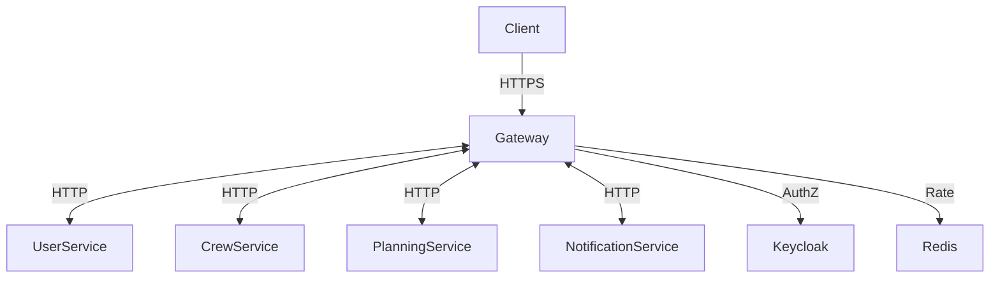
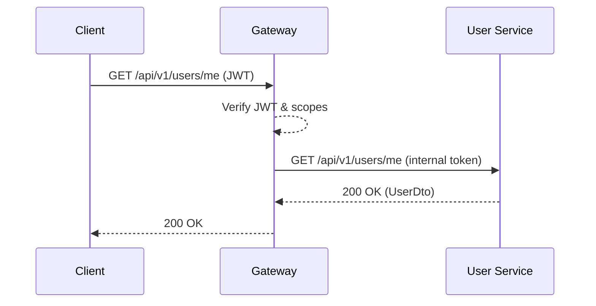

# Gateway Service – Системный анализ

> Статус: draft

## 1. Область ответственности
API Gateway обеспечивает:
- Единую точку входа HTTP/HTTPS
- Маршрутизацию запросов к микросервисам
- Аутентификацию и авторизацию на основе JWT (RS256)
- CORS, Rate Limiting, Logging, Circuit Breaker
- Агрегацию и проксирование Swagger / OpenAPI

## 2. Границы контекста и взаимодействия
| Контекст | Канал | Формат | Направление |
|----------|-------|--------|-------------|
| Клиент (Web) | HTTPS | JSON | ←→ |
| Backend Services | HTTP | JSON / gRPC-Transcoding | ←→ |
| Redis | TCP | RESP | ← (RateLimiter) |
| Keycloak / IdP | HTTPS | JWT / JWKS | ← (public key) |

Контекстная диаграмма:

## 3. Конфигурация маршрутов
Маршруты хранятся в таблице `gateway_routes` (Liquibase). Используется `RouteDefinitionLocator` при старте и hot-reload при изменениях.

Параметры маршрута:
- `route_id` – уникальный id
- `uri` – целевой URL сервиса
- `predicates` – JSON, например `["Path=/api/v1/users/**"]`
- `filters` – JSON `["StripPrefix=1","JwtAuthentication"]`

## 4. Нефункциональные требования
| Атрибут | Цель |
|---------|------|
| Латентность | < 20 мс overhead |
| QPS | 500 rps в пике |
| Доступность | 99.9 % |
| Безопасность | HTTPS TLS1.3, JWT RS256, OWASP Top-10 защита |
| Observability | Actuator + Prometheus + Grafana |

## 5. Диаграмма последовательности – запрос защищённого ресурса

## 6. Метрики и алерты
- `gateway.requests.total` по маршрутам
- `gateway.latency.p95` > 100 мс ⇒ alert
- `gateway.5xx.rate` > 1 % ⇒ alert
- Redis RateLimiter ошибок > 0 ⇒ alert

## 7. TODO
- Сгенерировать Swagger Aggregator `/api-docs`
- Поддержка GRPC-web ➜ HTTP/2 Upgrade 