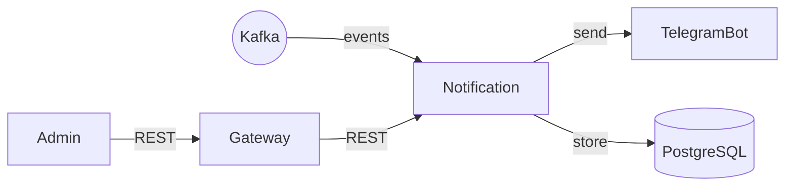
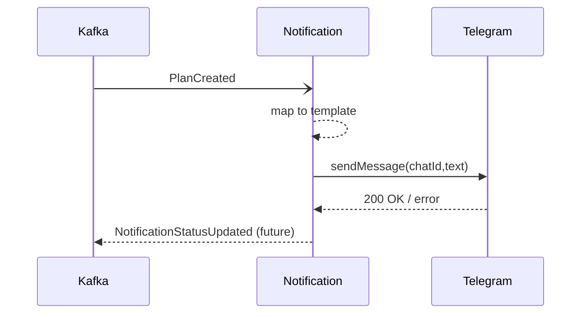

# Notification Service – Системный анализ

> Статус: draft

## 1. Область ответственности
- Подписка на доменные события в Kafka и генерация пользовательских уведомлений.
- Отправка сообщений в Telegram через Bot API.
- Push-уведомления (roadmap) и WebSocket-сообщения.
- REST API для on-demand уведомлений администраторами.

## 2. Границы контекста
| Контекст | Канал | Формат | Направление |
|----------|-------|--------|-------------|
| Kafka bus | Kafka | JSON | ← события `CrewCreated`, `PlanCreated`, `UserRegistered` |
| Telegram Bot API | HTTPS | JSON | → сообщения |
| Gateway | HTTP | JSON | ←→ REST `/notifications/*` |
| PostgreSQL | JDBC | SQL | ←→ хранение истории |

Диаграмма контекста:

## 3. Модель данных
Таблица `notification` содержит статус отправки (`PENDING/SENT/FAILED`). Индекс по `status`, ротация партиций раз в 30 дней.

## 4. Нефункциональные требования
| Атрибут | Значение |
|---------|----------|
| Время доставki | < 1 c от события до Telegram |
| QPS | 20 rps отправок |
| Доступность | 99.5 % |
| надёжность | повторная отправка 3 раза с backoff |

## 5. Последовательность публикации уведомления

## 6. Метрики
- `notification.sent.total`
- `notification.failed.rate` >5% ⇒ alert
- `telegram.api.latency.p95`

## 7. TODO
- Реализовать push-уведомления Web Push
- Хранить chatId↔userId связку в User Service 