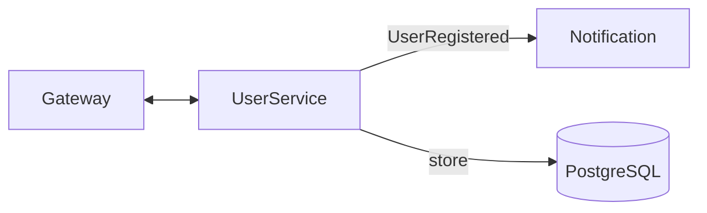
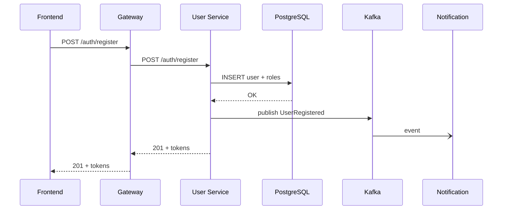

# User Service – Системный анализ

> Статус: draft

## 1. Область ответственности
- Регистрация и управление пользователями
- Аутентификация (JWT HS256 → RS256 roadmap)
- Управление ролями и правами доступа
- Публикация события `UserRegistered` в Kafka
- Хранение refresh-токенов и выдача access/refresh

## 2. Границы контекста
| Контекст | Канал | Формат | Направление |
|----------|-------|--------|-------------|
| Gateway | HTTP | JSON | ←→ REST `/auth/*`, `/users/*` |
| Notification | Kafka | JSON | → `UserRegistered` |
| PostgreSQL | JDBC | SQL | ←→ данные пользователей |
| Keycloak (roadmap) | HTTPS | OIDC | ←→ Federation |

Диаграмма контекста:

## 3. API
Основные endpoints:
- `POST /api/v1/auth/register`
- `POST /api/v1/auth/login`
- `POST /api/v1/auth/refresh`
- `GET /api/v1/users/{id}` (ADMIN)

## 4. Модель данных
Таблицы `user`, `role`, `user_role`, `refresh_token` (см. миграции). Пароли – BCrypt10.

## 5. Нефункциональные требования
| Атрибут | Значение |
|---------|----------|
| SLA login | < 100 ms |
| QPS | 100 rps |
| Доступность | 99.9 % |
| Безопасность | OWASP ASVS L2 |

## 6. Последовательность регистрации

## 7. Метрики
- `auth.login.success` / `auth.login.failure`
- `jwt.validation.fail`
- `user.count`

## 8. TODO
- Перейти на JWT RS256 + JWKS
- Добавить 2FA (TOTP) 